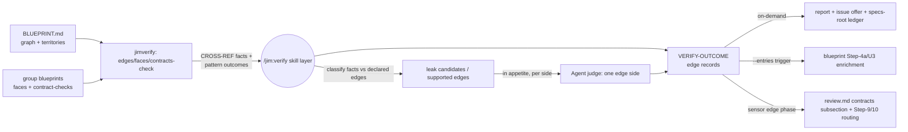

# Contract-graph verification — Plan

## Overview

Extend the verification engine with a contract mode: three new deterministic
`jimverify.sh` verbs (`faces` / `edges` / `contracts-check`) supply
facts-not-verdicts for the cross-group floor, the skill layer classifies and
judges per edge side under the existing appetite/fan-out knobs, and the
blueprint/review surfaces consume outcomes through additive VERIFY-OUTCOME
edge records — no new config keys, no new scripts, no new agents.

## Design Decisions

### 1. Deterministic decomposition — three verbs, facts over verdicts

- **Chosen:** `faces` (parse Provides/Requires + `contract-checks` block →
  TSV), `edges` (parse the persisted `## Contract Graph` table → TSV), and
  `contracts-check` (the composite floor: cross-territory reference **facts**
  plus face-declared pattern **outcomes**), all in `jimverify.sh`.
- **Why:** Mirrors the shipped `parse`/`territory`/`check` decomposition and
  the Bash-vs-Prompt rule; keeps each verb belt-testable. Critically, the
  cross-reference scan emits `CROSS-REF` *facts* on the `check_conformance`
  model (script emits the set logic, skill owns attribution) — resolving the
  research Peer-Feedback item: AC #14's fail-closed rule protects the
  deterministic *fact*, while leak/holds *classification* stays with the
  skill/judge layer, so textual false positives never become authoritative
  verdicts. Face-declared pattern checks (`provider-ref`/`consumer-ref`) are
  precise by construction and DO emit outcomes, `check_pattern`-style.
- **Rejected:** One monolithic `contracts` verb — untestable seams; and
  autonomous violated-verdicts from the cross-ref scan — noise would bind
  under fail-closed precedence (research Peer Feedback).

### 2. Invocation surface — one new mode, edge phases inside existing adapters

- **Chosen:** `--contracts [group]` on `/jim:verify` (bare = whole graph;
  group operand = edges touching that group — spec AC #1), composing with
  `--appetite`. A caller-scoped variant `--contracts <group> --entries
  <file>` (one entry-slug per line, slug-gated) serves the boundary-change
  trigger: VERIFY-OUTCOME block returned, issue offer suppressed, the
  scoped-adapter suppression rule reused. The review sensor and `--since`
  grounding get an **edge phase inside the existing scoped adapters** — when
  the map's graph names the group as provider and the change plausibly
  touches provides-side code, edge records join the same block. No new
  invocation sites; `Skill(jim:verify)` grants already exist in blueprint and
  review frontmatter (verified — no `allowed-tools` changes anywhere).
- **Why:** Minimal grammar, maximal reuse of the 036 adapter/suppression/
  hand-off machinery; spec AC #10's "no new gating knob" falls out.
- **Rejected:** A dedicated `--contracts-sensor` adapter — a second protocol
  for the same hand-off; and blueprint-side edge checking — rebuilds engine
  mechanics outside the engine (the option-A surface the spec already
  rejected).

### 3. `contract-checks` block — the face check-data grammar

- **Chosen:** An optional fenced ```contract-checks``` block in the group
  blueprint (sibling of `verify-checks`), keyed by the Provides entry's
  backticked surface name slugified (`^[a-z0-9][a-z0-9-]*$`). Keys, all
  optional per entry: `criticality=critical|high|medium|low`,
  `provider-ref=<ERE>` (locates the surface in provider code),
  `consumer-ref=<ERE>` (identifies consumer usage), `scope=<relpath>`
  (narrows the search base). Parsed with the key-aware `parse_params`;
  authored by the blueprint surface going forward; absent block → every edge
  judge-falls-back (spec AC #6, the 035 AC #10 legacy rule).
- **Why:** Mirrors `verify-checks` exactly — grammar, safety gates, template
  reach-back — so authoring guidance, parsing, and tests all have shipped
  precedent. One declaration read by both consumers (engine appetite +
  Step-4a grading) satisfies AC #8's one-concept rule.
- **Rejected:** Inline annotations on the Provides bullets — collides with
  prose/`|`-free readability and has no keyed-block precedent; a separate
  sidecar file — a second artifact to drift.

### 4. VERIFY-OUTCOME edge records — additive keys, location-only

- **Chosen:** Edge records join the existing block as a second record type
  (see Interface Contracts): `edge=`, `entry=`, `side=`, `class=` keys added;
  `outcome`/`channel`/`reason`/`evidence` semantics unchanged; evidence stays
  location-only with excerpts in keyed `<untrusted-content>` blocks; the
  Finding-9 provenance clause covers edge records verbatim.
- **Why:** Security Finding 2's exfiltration guard (a crafted pattern cannot
  pull matched content through the record channel) plus zero disruption to
  the 036 consumers — invariant records parse exactly as before.
- **Rejected:** A separate CONTRACT-OUTCOME block — two provenance
  disciplines to keep aligned.

### 5. Per-side spend resolution — existing knobs only

- **Chosen:** An edge's criticality = its Provides entry's declared value,
  else `high`. A side's appetite = `verify_appetite_<that side's group>`
  else global else `low`; judge fan-out shares the one `verify_fanout_cap`
  per run, highest criticality first, capped remainder named.
- **Why:** `jimconf.sh`'s dynamic-suffix arm already resolves any group's
  override — spec AC #7's "no new knobs" is literal. Consumer-side checks
  billing to the consumer's appetite matches the "spend hard on auth" intent.
- **Rejected:** A contract-specific appetite key — 036's no-new-knobs
  doctrine; provider-appetite-governs-everything — breaks per-group intent.

### 6. Fail-closed across the declaration/code seam

- **Chosen:** Within a run: a deterministic pattern-check `violated` is never
  overridden by a judge; a judge may add violations for facts/edges the floor
  couldn't decide. Across layers: when the declaration-level reconcile and a
  code-grounded outcome disagree on the same edge, the non-holding outcome
  prevails and the disagreement is presented (both sides shown, developer
  adjudicates) — never silently resolved optimistic. `CROSS-REF` facts are
  candidates (DD 1): unclassified facts route to judge (in-appetite) or are
  reported as unexamined candidates (below appetite / over cap) — never
  dropped, never auto-violated.
- **Why:** Spec AC #14 + the 036 AC #15 lineage, with the fact/verdict split
  keeping false positives out of the authoritative channel.
- **Rejected:** Treating cross-ref facts as floor verdicts — see DD 1.

### 7. Durability — specs-root events, `commit-verify` reuse

- **Chosen:** On-demand and trigger-scoped contract runs record
  `verify started|finished tier=project op=contracts` with counters
  (`edges= holds= violated= failed= skipped= leaks= breaking= dead=`, zeros
  included) on the **specs-root** ledger and self-commit via
  `commit-verify <specs-root>` — which works unchanged (it stages
  `ledger.md` in whatever dir it is given). Scoped adapters append
  `edges_checked=`/`edge_violations=` to their existing `verify finished`
  event on the group blueprint ledger. Unattended trigger runs are thereby
  attributable (security Finding 3), judge outcomes included.
- **Why:** The 034 reconcile precedent (project-tier events at specs root);
  zero `jimledger.sh` changes (research-verified).
- **Rejected:** A new `commit-contracts` verb — nothing to add; per-group
  event scatter for whole-graph runs — one run, one record.

### 8. Trigger integrity — graph basis always named

- **Chosen:** The boundary-change trigger's affected-edge set comes solely
  from the persisted pre-write `## Contract Graph`; the enrichment line
  always names its basis — `blast radius: … — graph as of <Last reconciled>`,
  `none recorded`, or `no graph section — run /jim:blueprint --reconcile` —
  and an absent/stale graph degrades to the declaration-level line, never a
  fabricated edge set (security Finding 3; the 034 freshness-stamp
  convention). The trigger is **consume-first**: handed-over VERIFY-OUTCOME
  edge records ground the entries they cover, and a fresh `--entries` run
  covers only the remainder — one engine opinion per edge per change (spec
  AC #12; security Finding 5). The same enrichment applies at the
  **map-tier** grading moment: a partition downgrade names its dependent
  edges, and a dropped/weakened provider's edges get consumer-side checks
  through the same scoped trigger (security Finding 6).
- **Why:** Fail-open must be visible; "do not re-derive" is the shipped
  doctrine.
- **Rejected:** Re-deriving edges at the trigger — contradicts
  reconcile-methodology's explicit rule.

### 9. Sensor scope — affected edges only

- **Chosen:** The sensor's edge phase scopes its floor scan and judge
  selection to the affected edges' consumer territories (edges whose
  provides entry the change plausibly touches — provider-ref scope ∩ changed
  files, else judge-triage); whole-graph scanning stays exclusive to
  on-demand `--contracts` (security Finding 4; spec AC #4's grain split).
- **Why:** Keeps per-review cost proportional to the change — the 036
  amplification lesson.
- **Rejected:** Whole-graph floor per review — taxes every review with the
  cost the graph exists to target.

### 10. Ratchet classification — one rule, one site

- **Chosen:** Step 4a's shared classification rule gains: introducing a
  provides-entry criticality declaration below the default, or lowering an
  existing one, classifies **weakening** (prompts under `auto_blueprint`,
  blast radius attached); raising or removing toward the default is
  additive. Single-sourced in blueprint SKILL.md Step 4a (both write paths
  already point there).
- **Why:** Spec AC #8's ratchet (security Finding 1) at the one
  classification site — no per-path restatement.
- **Rejected:** Grading in the engine — the engine reads criticality, it
  never grades writes (reader/checker identity).

### 11. Judge reuse — generalize, don't mint

- **Chosen:** Extend `agents/judge.md` to accept "one invariant — or one
  side of one contract edge" (input: entry + guarantee text in a delimited
  block, the side, that side's territory scope). Tools unchanged
  (`Read`/`Glob`/`Grep`).
- **Why:** The input contract is structurally identical; stays under the
  ~800-token agent budget (research Recommendation 5).
- **Rejected:** A sibling `edge-judge` agent — duplicate capability boundary
  to maintain.

### 12. Documentation routing — budgets respected

- **Chosen:** New `skills/verify/references/contracts-methodology.md` carries
  the contract mode's methodology (edge semantics, classification, report
  shape, dead-surface set logic); `SKILL.md` gains only routing + skeleton
  (257 → ~330 est.). Blueprint-side detail lands in `fork-grounding.md` (edge
  clause), `check-authoring.md` (contract-checks section + ratchet), and
  `reconcile-methodology.md` (engine-enriched blast-radius line);
  `blueprint/SKILL.md` gains ≤ ~15 lines (455 → ~470, under budget — if an
  edit overruns, extract further into the references first).
- **Why:** The 500-line ceiling is a locked constraint; 036 set the
  extraction precedent.
- **Rejected:** Inlining methodology into verify SKILL.md — repeats the
  budget crisis 036 just fixed for blueprint.

## Constitution Check

**ARCHITECTURE.md status:** Present — constraints noted below.

| Constraint from ARCHITECTURE.md | Honored? | Notes |
| :--- | :--- | :--- |
| Bash-vs-Prompt rule (deterministic → script, judgment → prompt) | Yes | DD 1: facts/patterns in `jimverify.sh`; classification/judging in the skill |
| One-level subagent nesting; `/jim:verify` runs inline | Yes | DD 2: edge phases ride the inline skill; judges remain the only spawn |
| Never execute config/blueprint content; registry is the only tooling bridge | Yes | New verbs only grep; face params are inert data behind `-e`/`--` guards; registry untouched |
| `allowed-tools` names exact script paths | Yes | No frontmatter changes needed — all grants already present (DD 2) |
| SKILL.md ≤ 500 lines; agent body ≤ ~800 tokens | Yes | DD 12 routing; DD 11 keeps judge.md tight |
| Single validation boundaries (`valid-relpath`, slug charsets, `is_valid_id`) | Yes | Entry keys slug-gated; path params via `safe_path_param`; no new validators |
| Sentinel logic-flow vocabulary; sigil discipline | Yes | Skill edits follow SET/IF/ENDIF and fenced-bash conventions |
| Path-scoped commits only (`--` guard, never `git add -A`) | Yes | DD 7 reuses `commit-verify` verbatim |
| Untrusted-content discipline + secret redaction | Yes | DD 4 location-only records; excerpts delimited + redacted (spec AC #17) |

## File Manifest

| Component | File Path | Action | Notes |
| :--- | :--- | :--- | :--- |
| Verify core | `skills/verify/scripts/jimverify.sh` | Update | `faces` / `edges` / `contracts-check` verbs + helpers |
| Verify tests | `tests/jimverify.sh` | Update | Cases for all three verbs incl. negative fixtures |
| Verify skill | `skills/verify/SKILL.md` | Update | `--contracts`/`--entries` routing; contract mode skeleton; scoped-adapter edge phase; edge records |
| Contract methodology | `skills/verify/references/contracts-methodology.md` | Create | Edge semantics, classification, report shape, dead-surface logic |
| Judge agent | `agents/judge.md` | Update | Edge-side generalization (DD 11) |
| Blueprint template | `skills/blueprint/assets/blueprint-template.md` | Update | `contract-checks` block stanza |
| Check authoring | `skills/blueprint/references/check-authoring.md` | Update | contract-checks grammar, criticality + ratchet guidance |
| Blueprint skill | `skills/blueprint/SKILL.md` | Update | Step-4a ratchet + declared-criticality read + trigger invocation (lean) |
| Map methodology | `skills/blueprint/references/map-methodology.md` | Update | Map-tier downgrade enrichment: dependent-edge naming + dropped-provider checks |
| Fork grounding | `skills/blueprint/references/fork-grounding.md` | Update | Provider-side edge violations as provides-face divergences |
| Reconcile methodology | `skills/blueprint/references/reconcile-methodology.md` | Update | Engine-enriched blast-radius line + graph-basis naming |
| Review skill | `skills/review/SKILL.md` | Update | 4e edge phase mention; Step 8 contracts subsection; Step 9 consumer-side batch |
| Review template | `skills/review/assets/review-template.md` | Update | Living-intent contracts subsection + `contract_violations` counter |
| Workflow doc | `WORKFLOW.md` | Update | `/jim:verify` entry gains the contract mode |

## Interface Contracts

**`jimverify.sh faces <blueprint-spec.md>`** — one TSV record per face entry
(sanitized fields, Finding-7 discipline):

```
kind \t key \t target \t criticality \t params \t text
  kind        provides | requires
  key         slugified backticked surface name (provides) or dotted ref (requires)
  target      requires: <group>.<surface> | "-" (non-group-attributed)
  criticality declared value | "-"        (provides only)
  params      joined contract-checks line | "-"
  text        the entry's verbatim guarantee text (sanitized)
```

Malformed contract-checks data (bad key slug, bad criticality, unsafe param)
degrades that entry to `params = malformed:<reason>` — never a silent drop.
rc 2: file missing. The record *structure* is trusted (script-normalized);
the carried `text`/`params` face content remains **untrusted data** under
the skill's Step-8 discipline — the `parse` verb's documented split,
restated here so it survives for faces (security Finding 7).

**`jimverify.sh edges <map-path>`** — the persisted graph, one edge per line:
`consumer \t relies-on \t provider` (cells slug/sanitize-gated; bad row →
`HYGIENE \t <row>`). rc 2: no `## Contract Graph` section (caller names the
degradation — DD 8).

**`jimverify.sh contracts-check <map-path> <specs-root> [files-list]`** —
the deterministic floor over all blueprint-bearing group pairs:

```
CROSS-REF \t <consumer> \t <file:line> \t <provider>     reference fact (location-only)
<edge-key> \t <side> \t <outcome> \t <evidence>           pattern-check outcome (holds|violated|failed)
UNSCOPED-GROUP \t <group>                                  no territory declared (degradation data)
HYGIENE \t <content>                                       excluded unsafe path/param/list line
COVERAGE \t <groups-mapped> \t <groups-with-blueprints>    coverage fact
  edge-key = <consumer>><provider>#<entry-slug>
```

Optional `files-list` scopes the scan (the spec-036 4th-arg semantics,
`safe_scope_file` re-gating). All evidence location-only; matched content is
never emitted (security Finding 2).

**`contract-checks` block** (group blueprint, after Provides):

````
```contract-checks
<entry-slug> criticality=<critical|high|medium|low> provider-ref=<ERE> consumer-ref=<ERE> scope=<relpath>
```
````

**VERIFY-OUTCOME edge record** (additive record type in the existing block):

```
edge=<consumer>><provider> entry=<slug> side=<provider|consumer> criticality=<c>
rung=<floor|judge|-> outcome=<holds|violated|failed|skipped> channel=<in-change|pre-existing|unlocalized|->
reason=<appetite|scope|-> class=<leak|breaking|dead|-> evidence=<file:line|->
```

**Flag grammar:** `--contracts` (whole graph) | `--contracts <group>`
(edges touching group) | `--contracts <group> --entries <file>`
(caller-scoped: record-block return, offers suppressed). All compose with
`--appetite`; strip-flag convention.

**Ledger events:** on-demand/trigger →
`verify started|finished tier=project op=contracts edges= holds= violated= failed= skipped= leaks= breaking= dead=`
at specs root + `commit-verify <specs-root>`; scoped adapters → existing
group-ledger `verify finished` event + `edges_checked= edge_violations=`.

## Data Flow



## Task Breakdown

1. [x] `jimverify.sh` `faces` verb: parse Provides/Requires bullets +
   `contract-checks` block per the Interface Contract (slug-gated keys,
   `parse_params` reuse, sanitized emission, malformed-degrade); the header
   comment restates the trusted-channel / untrusted-text split (the `parse`
   precedent — security Finding 7). Add `tests/jimverify.sh` cases first
   (well-formed, legacy no-block, malformed key/criticality, tab-bearing
   text).
   **Verify:** `bash tests/jimverify.sh`

2. [x] `jimverify.sh` `edges` verb: parse `## Contract Graph` per the
   Interface Contract (slug-gated cells, HYGIENE rows, rc 2 absent-section).
   Tests first (graph present, absent, nothing-to-reconcile note, crafted
   cell).
   **Verify:** `bash tests/jimverify.sh`

3. [x] `jimverify.sh` `contracts-check` verb: cross-territory `CROSS-REF`
   facts, `provider-ref`/`consumer-ref` pattern outcomes (per-side scoping,
   `safe_path_param` on every path-bearing value, `-e`/`--` guards),
   `UNSCOPED-GROUP`/`COVERAGE`/`HYGIENE` records, optional files-list. Tests
   first, incl. security negatives (absolute path, `..`, leading dash,
   tab-bearing param, C-quoted list line) and a location-only assertion (no
   matched content in any record).
   **Verify:** `bash tests/jimverify.sh`

4. [x] Authoring reach-back: `blueprint-template.md` gains the
   `contract-checks` stanza; `check-authoring.md` gains the grammar section,
   criticality-declaration guidance, and the one-way ratchet note (spec
   AC #8). Depends on task 1's grammar.
   **Verify:** `grep -q 'contract-checks' skills/blueprint/assets/blueprint-template.md && grep -q 'contract-checks' skills/blueprint/references/check-authoring.md`

5. [x] Verify skill contract mode: create
   `references/contracts-methodology.md` (edge semantics, fact
   classification incl. the faces untrusted-text restatement — security
   Finding 7, per-side appetite resolution, fail-closed rules incl.
   reconcile-disagreement presentation, dead-surface set logic — whole-graph
   only, partial-coverage degradation, framed as judge-confirmed candidates
   with a "verify then trim" remedy — security Finding 8, report shape,
   counters); extend
   `SKILL.md` with `--contracts`/`--entries` routing, the mode skeleton,
   VERIFY-OUTCOME edge records, and specs-root ledger/commit choreography.
   Depends on tasks 1–3.
   **Verify:** `grep -q -- '--contracts' skills/verify/SKILL.md && test -f skills/verify/references/contracts-methodology.md && awk 'END{exit NR>500?1:0}' skills/verify/SKILL.md`

6. [x] `agents/judge.md`: generalize to "one invariant — or one side of one
   contract edge" (edge input shape; tools unchanged).
   **Verify:** `grep -q 'contract edge' agents/judge.md`

7. [x] Scoped-adapter edge phase in `skills/verify/SKILL.md` (§ Scoped
   adapters): provider-condition (graph names group as provider),
   change-selection of affected edges (DD 9), edge records joining the
   block, `edges_checked=`/`edge_violations=` on the finished event.
   Depends on task 5.
   **Verify:** `grep -q 'edge_violations' skills/verify/SKILL.md`

8. [x] Review surface: `SKILL.md` Step 4e names the edge phase
   (existence-conditioned on the graph), Step 8 renders the Living-intent
   **Contracts** subsection + `contract_violations` counter (template
   updated), Step 9 batches consumer-side/pre-existing edge violations.
   Depends on task 7.
   **Verify:** `grep -q 'contract_violations' skills/review/assets/review-template.md && grep -qi 'contracts' skills/review/SKILL.md`

9. [x] Blueprint integration: Step 4a reads declared criticality + the
   ratchet classification (DD 10); the weakening prompt/U3 grounds itself
   **consume-first** — handed-over edge records cover their entries, and the
   `--contracts <group> --entries <file>` trigger runs only for uncovered
   entries (spec AC #12; security Finding 5) — naming its graph basis
   (DD 8); the **map-tier** downgrade prompt names dependent edges from the
   persisted graph and runs a dropped/weakened provider's consumer-side
   checks through the same scoped trigger, detail in `map-methodology.md`
   § Update flow (security Finding 6); `fork-grounding.md` gains the
   provider-side-edge clause (fix the code / fold the face);
   `reconcile-methodology.md` § Blast radius gains the engine-evidence line
   variant. Keep `SKILL.md` deltas lean (DD 12). Depends on tasks 4–5.
   **Verify:** `grep -q 'ratchet' skills/blueprint/SKILL.md && grep -q -- '--entries' skills/blueprint/SKILL.md && grep -qi 'edge' skills/blueprint/references/fork-grounding.md && grep -qi 'dependent edge' skills/blueprint/references/map-methodology.md && awk 'END{exit NR>500?1:0}' skills/blueprint/SKILL.md`

10. [x] `WORKFLOW.md`: `/jim:verify` entry gains the contract mode (two
    grains, triggers, no new knobs).
    **Verify:** `grep -q -- '--contracts' WORKFLOW.md`

11. [x] Full suite green + budgets: run everything; confirm both touched
    SKILL.md budgets and the agent body stayed within limits.
    **Verify:** `bash skills/meta-test/scripts/run.sh`

## Requirements Coverage Summary

| Spec Acceptance Criterion | Addressed In Task(s) |
| :--- | :--- |
| 1. On-demand contract mode, two grains, <2-groups degrade | 5 |
| 2. Per-side checks, one outcome bucket each | 3, 5 |
| 3. 034 class language + code/declaration provenance; reconcile untouched | 5 |
| 4. Dead-surface whole-graph only, partial-coverage degrade | 5 |
| 5. Cross-reference floor from territory alone, valid-relpath, named degradation | 3 |
| 6. Judge fallback everywhere; inert face check data; legacy unchanged | 1, 4, 5, 6 |
| 7. Existing appetite/cap, edge criticality default high, named skips | 5 |
| 8. One criticality concept + one-way ratchet | 4, 9 |
| 9. Boundary-change trigger, graph basis named, unattended full grounding | 5, 9 |
| 10. Sensor extension, existence-conditioned, affected edges only | 7, 8 |
| 11. Routing by side, exhaustive, trusted-input channels | 7, 8, 9 |
| 12. No double-run; VERIFY-OUTCOME hand-off + provenance | 7, 9 |
| 13. Declared-data degradation, coverage reported | 3, 5 |
| 14. Fail-closed across layers, disagreement surfaced | 5 (DD 1, 6) |
| 15. Report/issues/durable counters/self-commit; no verdict artifact | 5 |
| 16. review.md contracts subsection; verdict untouched | 8 |
| 17. Untrusted discipline + redaction end-to-end | 3, 5, 6, 8, 9 |

Security findings discharged: Finding 2 → tasks 3, 5 (param gates,
location-only records, negative fixtures); Finding 3 → DD 7/8, tasks 5, 9;
Finding 4 → DD 9, task 7; Finding 5 → DD 8, task 9 (consume-first);
Finding 6 → DD 8, task 9 (map-tier enrichment); Finding 7 → tasks 1, 5;
Finding 8 → task 5. Research Peer Feedback (AC #14 interpretation) →
DD 1, DD 6.

## Out of Scope

- `ARCHITECTURE.md` refresh — handled by the `/jim:build` completion gate via
  `/jim:arch` (pipeline-owned, not a deferral).
- The adversarial swarm, retirement direction (issue #22 Spec C), plan-time
  blast-radius advisory (issue #39), Relations-column derivation (issue #40),
  multi-group blueprint updates — all excluded by the spec.
- Reconcile-pass changes — the declaration-level pass is untouched by design.
- Real-world multi-group shakedown — runs on the developer's other projects
  post-build (spec Insight 6); CI coverage is fixture-only by necessity
  (single-group host repo).

## Open Questions

- [x] ~Where does entry-key stability come from?~ → The slugified backticked
  surface name; `check-authoring.md` guidance tells authors to keep Provides
  surface names slug-friendly and stable across regens (task 4).
- [x] ~Does the trigger run under generate-mode differential writes?~ → Yes —
  Step 4a is the shared grading site for all differential writes; the trigger
  rides the grading moment, not the adapter (DD 10, task 9).
- [x] ~~Dual-lens security findings 5–8~~ → All folded 2026-07-05:
  consume-first trigger + map-tier enrichment (DD 8, task 9), faces
  untrusted-text restatement (tasks 1, 5), dead-surface candidate framing
  (task 5).
- None blocking.
