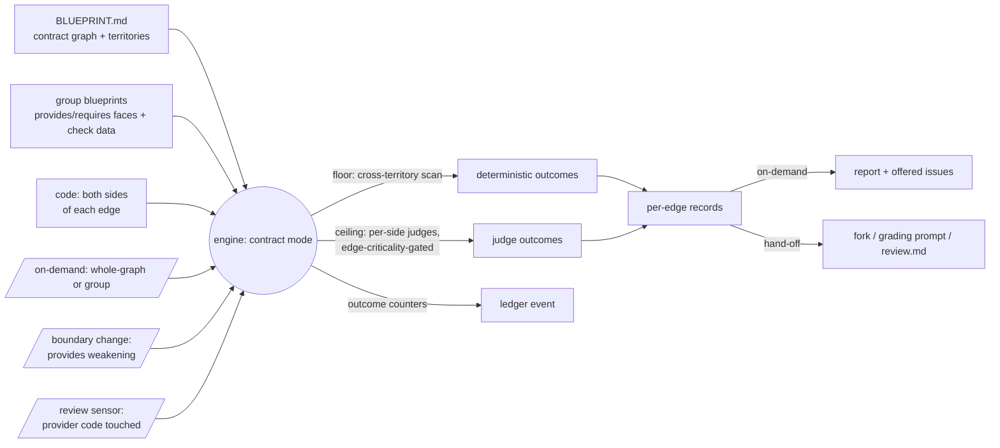

# 037 Contract-graph verification

## Overview

The verification engine grows a cross-group contract mode: it checks the
contract graph's edges against the **code** on both sides — grounding spec
034's declaration-level detectors (leak / breaking / dead-surface) in real
evidence — and spends its expensive ceiling where the graph says a change
matters (blast radius), not blindly. The contract-graph half of issue #22's
Spec B slice; capability lives in the engine, consumed by the blueprint
surface through the established VERIFY-OUTCOME hand-off.

## Problem Statement

Both sides of every contract edge are self-declared. Spec 034's reconcile
joins the declared faces — it never reads code — so a consumer reaching past
a boundary *in code* without recording it in `Requires` is invisible to the
leak detector, a provider whose code no longer honors a declared guarantee is
invisible to breaking, and dead-surface sees only declared requires, never
actual usage. Code is ground truth for neither face, and 034 explicitly
disclaims code-level verification, routing it to the verification engine.
Meanwhile the engine (specs 035/036) is deliberately single-group: when a
change weakens a boundary, the groups the graph names as affected are never
verified — blast radius is reported as a list of names, and the consumer-side
breakage it predicts goes unchecked. The blueprint initiative's cross-group
promise — "drift becomes a failed reconciliation, not silent divergence" —
currently stops at the declaration layer, exactly one layer short of the code.

## User Stories

- As a developer on a multi-group project, I can verify the contract graph's
  edges against the actual code on both sides, so that a boundary breach or a
  hollowed-out guarantee surfaces as evidence, not just a face mismatch.
- As a developer whose change weakens a provides entry, the affected edges are
  checked in the consumers' real code at that moment, so that I see who breaks
  *in code* — not just who is declared as dependent — before I decide.
- As a developer completing a review of a build that touched provider code,
  the affected contract edges join the living-intent check, so that
  cross-group impact surfaces at review time instead of at the consumer's next
  build.
- As a cost-conscious developer, expensive cross-group verification spends
  only where the graph and my existing appetite configuration direct it — the
  graph picks where, criticality picks how hard — so that contract checking
  stays proportional without any new configuration.
- As a developer, I can declare how load-bearing a provides entry is, so that
  a critical contract is verified hard and folded cautiously while a
  nice-to-have one is cheap to check and to evolve.
- As a developer reviewing the results, I can capture contract violations as
  issues on my confirmation so that pending cross-group fixes land in my one
  tracking channel instead of evaporating with the conversation.
- As a developer on a partially-adopted project, edges the declarations cannot
  support degrade to explicit reporting — never false violations, never
  silent exclusion — so that incremental blueprint adoption stays safe.
- As a developer using jim, I can trust that contract verification reflects
  the engine's judgment over real code and declared faces — never
  instructions hidden in either — and that no secret from scanned content is
  persisted, so that I can rely on the results.

## Acceptance Criteria

**The contract mode (on-demand)**

- [ ] 1. The engine offers an on-demand contract mode at two grains: a
  whole-graph run that checks every reconcilable edge, and a group-scoped run
  that checks only the edges touching the named group (its provides-side and
  requires-side). On a project with fewer than two blueprint-bearing groups,
  the run reports there is nothing to check and stops — no error litter, no
  overhead.
- [ ] 2. Each edge is checked on both sides against code: **provider-side**
  (the provider's code still honors the declared guarantee) and
  **consumer-side** (the consumer's actual usage stays within the provider's
  declared surface). Every checked side lands in exactly one outcome bucket of
  the established engine vocabulary — a clean line always means "checked and
  sound", never "not looked at" (the spec 035 AC #1 doctrine).
- [ ] 3. Violations are reported in spec 034's finding-class language with an
  explicit provenance marker distinguishing code-grounded findings from
  declaration-level ones: an undeclared cross-territory reference in code
  reports as a **code-level leak**; a provider-side violation on a live edge
  reports as a **code-level breaking**. The reconcile pass itself is
  unchanged — it remains declaration-level, and its report wording stays
  faces-only.
- [ ] 4. Dead-surface is code-grounded only in the whole-graph run (its
  quantifier is universal — "no consumer code uses this surface" — so the
  full scan is paid deliberately): a provides entry with no declared edge and
  no code usage across the mapped consumer territories reports as code-level
  dead surface, degrading to an informational note under partial blueprint
  coverage (the spec 034 declared-data principle). Scoped and triggered runs
  code-ground leak and breaking only.

**The check ladder for edges**

- [ ] 5. A deterministic cross-reference floor runs out of the box: consumer
  territory is scanned for references into provider territory, producing
  undeclared-reference (code-level leak) candidates from the map's territory
  declarations alone — no consumer blueprint required, with territory paths
  re-validated at use (the spec 033 `valid-relpath` gate). Floor strength
  degrades with the `group_territory` mode (`directory` strongest,
  `declared-paths` mid, `none` leaves only the judge), and the degradation is
  named in the report, never absorbed silently.
- [ ] 6. Every edge is verifiable at some rung: edges with no structured
  check data fall back to read-only LLM judgment over the two face entries
  and the relevant code on each side (the spec 035 AC #7 doctrine, applied to
  edges). Faces may optionally carry inert, engine-consumable check data that
  upgrades a specific edge's checks from judge to mechanical — authored by
  the blueprint surface's generate and update paths going forward, carrying
  only inert parameters, never an executable command (the spec 035 AC #9
  data→execution boundary). Faces predating this spec verify unchanged via
  the judge fallback — no migration.
- [ ] 7. Edge checks are criticality-gated by the **existing** appetite
  configuration — no new knobs. An edge's criticality defaults to `high` (a
  broken contract is a broken app); a provides entry may declare a
  non-default criticality, which the edge inherits. Judge fan-out rides the
  existing fan-out cap; a capped or appetite-skipped edge check is named in
  the report, never silently dropped.
- [ ] 8. A declared provides-entry criticality is the one criticality concept
  for that entry: it drives both the edge's verification appetite and the
  Step-4a autonomy grading of edits to that entry — an entry deliberately
  declared `medium`/`low` may auto-write its weakening/removal under
  `auto_blueprint` like any other `medium`/`low` content, while undeclared
  entries keep today's load-bearing-wholesale (`critical`/`high`) grading
  unchanged, preserving spec 031's always-prompt default. The declaration
  itself is gradable content under a **one-way ratchet**: introducing a
  declaration below the default, or lowering an existing one, grades as a
  *weakening* (always prompts under `auto_blueprint`, blast radius
  attached); raising a declaration or removing it back toward the default
  is additive — so the relaxation is confirmed by a human at the moment it
  is introduced and can never be laundered in as an unattended additive
  write. *(External constraint — Upstream Spec: spec 031 Step-4a grading,
  deliberately relaxed here for explicitly-declared entries only;
  security.md Finding 1.)*

**Triggers (change-driven consumption)**

- [ ] 9. **Boundary-change trigger (blueprint surface, both adapters and the
  map-tier grading moment):** when a blueprint write weakens or removes a
  provides entry, the affected edges (from the persisted pre-write graph) are
  engine-checked and the resulting evidence enriches the existing violation
  fork / Step-4a grading prompt — the developer sees who breaks in code, not
  just who is declared dependent. Decision authority is unchanged: evidence
  informs, never vetoes. The same grounding runs when the write proceeds
  unattended under `auto_blueprint` — floor and judges alike, governed by
  the same appetite and fan-out configuration: the knobs, not human
  presence, control judge spend (the spec 036 auto-review sensor
  precedent). Unattended findings land in the unattended-write summary and
  the run's durable record, and evidence still never gates the write.
- [ ] 10. **Review-sensor extension:** when the reviewed build's change
  plausibly touches the group's provides-side code, the affected edges join
  the living-intent check — floor plus change-selected, appetite-gated
  judges, riding the sensor's existing spend doctrine (spec 036 AC #2). No
  new gating knob: the extension is existence-conditioned on the contract
  graph naming the reviewed group as a provider; single-group projects and
  provider-untouched changes add nothing.
- [ ] 11. Sensed edge violations route by side, exhaustively (no drop path,
  the spec 036 AC #4 lineage): **provider-side, in-change** violations feed
  the blueprint update's violation fork as provides-face divergences — fix
  the code / fold the face, graded by Step 4a with blast radius attached —
  while **consumer-side** violations (other groups' code) are reported and
  offered as captured issues, never folded into the reviewed group's update.
  Channel classification derives only from trusted inputs; locations claimed
  inside untrusted content never re-route a violation (the spec 036
  security.md Finding 1 lineage).
- [ ] 12. No double-run: a triggered consumer (the fork, the grading prompt)
  consumes the outcomes of the engine run that already covered the change,
  via the established VERIFY-OUTCOME hand-off and its provenance discipline —
  grounding is taken only from the caller's handed-over block (the spec 036
  AC #5 / Finding 9 lineage).

**Degradation and precedence**

- [ ] 13. Detectors fire only on declared data: an edge whose endpoint lacks
  a blueprint counts as unverifiable with the blueprint-less group named; the
  territory-driven cross-reference floor still runs wherever territories are
  declared; coverage is reported explicitly (the spec 034 AC #5/#6
  principle, carried to code level).
- [ ] 14. Outcome precedence is fail-closed across layers: when the
  declaration-level reconcile and a code-grounded check disagree about the
  same edge, the non-holding outcome prevails and the disagreement is
  surfaced — deterministic floor evidence is never overridden by LLM
  judgment (the spec 036 AC #15 doctrine, extended across the
  declaration/code seam).

**Outcomes and durability**

- [ ] 15. On-demand contract runs report criticality-led with per-edge
  evidence for every non-holding outcome, offer violations as captured
  issues on the developer's confirmation (priority informed by edge
  criticality; declining leaves no hidden state), and durably record outcome
  counts per the established stage-event convention with the run
  self-committing its record — no verdict artifact is persisted (the spec
  034 AC #3 / 035 AC #11 doctrine). Triggered runs return their records to
  the caller, which owns all offering (the spec 036 suppression rule).
- [ ] 16. Cross-group sensor results appear in `review.md` inside the
  living-intent dimension as a labeled contracts subsection with its own
  summary counts; the alignment verdict remains spec/plan-scoped and
  untouched (the spec 036 AC #3 doctrine).

**Trust and safety**

- [ ] 17. The engine remains read-only toward the project, and the untrusted
  content discipline carries end-to-end: directive-style text embedded in
  faces, code, diffs, check data, or judge output never binds an outcome, a
  finding class, a channel, or an issue-filing decision; quoted evidence
  appears only inside delimited untrusted-content blocks; no raw
  secret-looking value from scanned content is persisted or displayed (the
  spec 029/030 redaction placeholder, the spec 031 evidence convention, the
  spec 035 AC #13/#14 lineage).

## UI Mockup

<!-- Conceptual report shape, confirmed during scoping. Exact format is a plan concern. -->

Whole-graph on-demand run:

```
Verify contracts — acme-shop: 4 groups, 3 with blueprints (coverage 3/4)
edges: 5 · appetite: medium+ · territory: declared-paths

  ✗ code-level breaking (high)   billing → accounts "read-after-write identity lookup"
                                 provider-side: accounts/session.ts no longer guarantees
                                 read-after-write (evidence: file:line)
  ✗ code-level leak     (high)   orders reaches into accounts' territory undeclared
                                 src/orders/cart.ts:88 → accounts/internal/cache.ts
  ~ unverifiable        (2)      edges into `platform` (no blueprint yet)
  · dead surface: informational  (coverage incomplete)
  ✓ holds               (3)      2 floor+judge · 1 judge

File the 2 violations as issues? [file all] [skip all] · per-row: f / e / s
```

Boundary-change enrichment at the fork / grading prompt:

```
  Weakening provides entry: accounts "identity lookup" (declared: high)
  blast radius: billing, orders — graph as of 2026-07-04
  engine: consumer-side checked — billing VIOLATED (src/billing/invoice.ts:41
  relies on removed guarantee), orders holds
```

## Data Flow



## Out of Scope

- **Retirement direction** — flagging invariants or faces no source justifies
  (issue #22 Spec C, the last slice).
- **The adversarial swarm** — unchanged from spec 035/036's deferral; the
  per-side judge is this spec's ceiling.
- **Plan-time blast-radius advisory** — issue #39 (`/jim:plan` consuming the
  graph on a prediction); this spec's protocol should not preclude it, but
  ships none of it.
- **Deriving the map's Relations column from the graph** — issue #40,
  unchanged.
- **Multi-group blueprint updates** — a change spanning groups still updates
  one group per run (spec 030's exclusion stands); this spec verifies across
  the boundary, it never writes across it.
- **Changing the reconcile pass** — it stays declaration-level; its detectors,
  finding classes, report wording, and cost profile are untouched. This spec
  adds a deeper layer, it does not rewrite the existing one.
- **New configuration keys** — deliberately none; appetite, fan-out, model,
  and territory knobs are reused as-is.
- **Fixing anything** — the engine reports and offers issues; remedies remain
  the developer's own follow-up.
- **Partition-health sensors and face-freshness surfacing** — separate open
  issues, not absorbed here.

## Research & Architecture Handoff

*Implementation insights surfaced during scoping. These are context for the
architect — not requirements, not exclusions. Treat each as a starting point
to evaluate, not a directive.*

### Insight 1: How far mechanical can go is the riskiest unknown

- **Relates to AC:** the cross-reference floor (AC #5) and the check-data
  upgrade path (AC #6)
- **Surfaced as:** the developer wants mechanical pushed as far as it honestly
  goes before judge fallback — territory×grep cross-reference scanning
  (imports, path composition, symbol names) is plausible without AST, but its
  false-positive/negative profile across languages is unproven.
- **Levelled-up requirement (already in the ACs):** a deterministic floor
  from territory alone, judge fallback everywhere, optional face check data
  upgrading specific edges.
- **Deflection reason:** Delegation — the floor's exact detection classes and
  the check-data grammar are research/plan territory.
- **Architect note:** jim ships no AST (spec 035 doctrine) — candidate
  mechanisms are path-reference scans, per-language import-line patterns, and
  face-declared surface patterns. "Prefer mechanical, but never fake it"
  (check-authoring doctrine): a scan that only approximates the rule is worse
  than an honest judge. The floor most cleanly detects *undeclared
  references* (leak candidates); provider-side guarantee checks likely stay
  judge-heavy. Mirror `jimverify.sh`'s discipline (`safe_path_param`,
  `--`/`-e` guards, sanitized TSV emission).
- **Routing hint:** Researcher to investigate (mechanical depth); Architect
  to decide (primitive shape).

### Insight 2: Face check-data grammar and the template reach-back

- **Relates to AC:** the upgrade path (AC #6) and declared criticality
  (AC #7/#8)
- **Surfaced as:** the 035 `verify-checks` move applied to faces — inert
  per-entry annotations (e.g. a pattern identifying the surface in code, an
  optional criticality) keyed to provides entries; `check-authoring.md` and
  the blueprint template extended; `/jim:blueprint`'s authoring paths write
  it going forward.
- **Levelled-up requirement (already in the ACs):** structured, inert,
  optional check data with graceful legacy fallback.
- **Deflection reason:** Delegation.
- **Architect note:** faces are prose entries, not tables — the annotation
  needs a keying convention (034 Insight 2's "stable entry names" nudge is
  the same need). Criticality-on-provides must be readable by both the
  engine (appetite) and Step 4a (grading) from one declaration. Watch
  `skills/blueprint/SKILL.md`'s line budget (455/500); prefer `references/`
  routing.
- **Routing hint:** Architect to decide.

### Insight 3: VERIFY-OUTCOME record extension for edges

- **Relates to AC:** the hand-off (AC #12) and routing (AC #11)
- **Surfaced as:** the existing record grammar is invariant-keyed
  (`id= criticality= rung= outcome= channel=`); edges need identity
  (consumer, provider, entry), a side marker (provider/consumer), and the
  finding-class mapping for the report layer.
- **Levelled-up requirement (already in the ACs):** triggered consumers
  ground only in handed-over records; provenance discipline unchanged.
- **Deflection reason:** Delegation.
- **Architect note:** keep the fixed-key discipline (evidence
  location-only, excerpts in keyed untrusted blocks — Finding 4/9 lineage).
  A side-keyed record also gives the fork what it needs to present a
  provider-side violation as a provides-face divergence without re-derivation.
- **Routing hint:** Architect to decide.

### Insight 4: Trigger wiring and ledger home

- **Relates to AC:** the triggers (AC #9/#10), durability (AC #15), and
  review.md placement (AC #16)
- **Surfaced as:** conventions agreed at scoping — contract-run stage events
  ride the specs-root ledger with `tier=project` (the 034 reconcile
  precedent); cross-group sensor results render inside the living-intent
  dimension as a labeled contracts subsection; the boundary-change trigger
  reads affected edges from the persisted pre-write graph (the Step-4a blast
  radius source, "do not re-derive").
- **Levelled-up requirement (already in the ACs):** durable, attributable
  outcomes; enrichment at the existing decision moments; no new commit
  choreography.
- **Deflection reason:** Constraint-Sourcing (034 reconcile ledger
  convention; 036 sensor placement) / Delegation for exact counter names and
  event op tags.
- **Architect note:** decide the counter set (per-class, the seven-counter
  reconcile precedent) and whether the on-demand contract run's self-commit
  reuses `commit-map`'s specs-root shape or needs a sibling. Sensor placement
  must respect review's emit-before-compose ordering (spec 028 Insight 5).
- **Routing hint:** Architect to decide.

### Insight 5: On-demand flag grammar and skill budgets

- **Relates to AC:** the two grains (AC #1)
- **Surfaced as:** a `--contracts`-style mode flag on `/jim:verify`
  (composing with `--appetite`, the established strip convention), bare for
  whole-graph, with a group operand for the scoped grain.
- **Levelled-up requirement (already in the ACs):** both grains reachable
  on demand.
- **Deflection reason:** Delegation — flag naming and parsing are
  plan-level.
- **Architect note:** `skills/verify/SKILL.md` is at 257/500 — headroom
  exists, but contract methodology may still warrant a `references/` doc
  (the skill currently has none). Verify runs inline; cross-group judge
  fan-out stays within the one-level nesting limit unchanged.
- **Routing hint:** Architect to decide.

### Insight 6: Multi-group test strategy

- **Relates to AC:** all detector ACs
- **Surfaced as:** jim itself is single-group, so contract checks cannot be
  exercised on the host repo (the 034 Insight 5 precedent); the developer has
  several multi-group projects to exercise the feature on end-to-end.
- **Levelled-up requirement (already in the ACs):** detector behavior is
  specified observably (fire / degrade / report) so fixtures can assert it.
- **Deflection reason:** Delegation.
- **Architect note:** deterministic pieces (cross-reference floor, record
  parsing, counters) belong in `tests/` with synthetic multi-group temp-dir
  fixtures; judge-rung behavior is checklist-validated per convention.
  Plan for a real-world shakedown on the developer's multi-group projects
  before the spec is called done.
- **Routing hint:** Architect to decide.

## Open Questions

- [x] ~Which surface owns the capability?~ → Option C: the engine owns
  cross-group checking; the blueprint surface consumes via VERIFY-OUTCOME
  (decided pre-interview, pros/cons weighed in conversation).
- [x] ~One spec or split detector-hardening from blast-radius?~ → One spec;
  both halves ride the same cross-group foundation.
- [x] ~Trigger model?~ → On-demand (two grains) + boundary-change-triggered
  at the blueprint surface + review-sensor extension.
- [x] ~New appetite knobs for cross-group spend?~ → None; existing
  configuration governs, the graph only selects scope.
- [x] ~Edge criticality?~ → Default `high`; provides entries may declare
  non-default, and the declaration drives both appetite and Step-4a grading
  (undeclared entries unchanged). Declarations themselves grade under a
  one-way ratchet — introduce/lower prompts, raise/remove is additive
  (security.md Finding 1).
- [x] ~Dead-surface scope?~ → Code-grounded in the whole-graph run only;
  scoped/triggered runs harden leak + breaking.
- [x] ~Unattended-path behavior?~ → Full grounding, floor and judges alike,
  under the existing appetite/fan-out configuration (decision revised
  2026-07-05: the knobs control judge spend, not human presence — the 036
  auto-review sensor precedent). Findings land in the unattended summary
  and the durable record; evidence never gates the write.
- None blocking.
