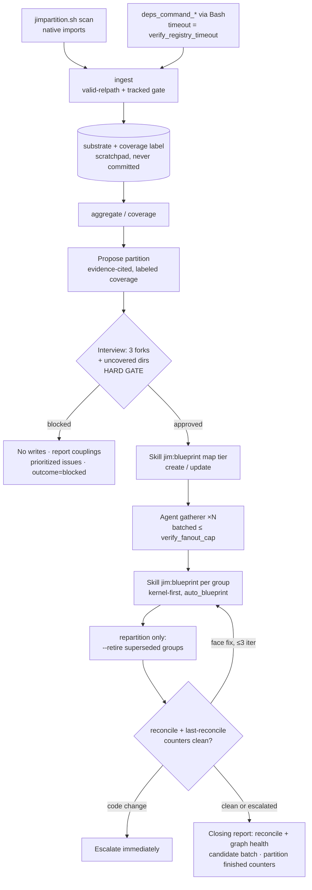

# Partition migration skill — Plan

## Overview

A new `/jim:partition` skill (inline; auto-detected greenfield/repartition
modes plus direct-named territory-target runs) moves a project onto the
blueprint partition doctrine: a deterministic extraction substrate
(`jimpartition.sh` + an operator-owned `deps_command_<name>` registry)
grounds an LLM-proposed partition, a hard human gate approves it, and all
materialization delegates to the existing blueprint surface, closing with
the 039 reconcile + graph-health loop.

## Design Decisions

### 1. Skill verb name: `/jim:partition`

- **Chosen:** `skills/partition/` — settles the spec's open question, per
  the developer's call at plan review. The direct-named territory-target
  tokens (DD 2) dissolve the objection that sank this noun earlier in
  drafting: with `path`/`directory` naming a destination rung, no
  invocation reads as "change the partition" in the one mode that must
  never change it. No existing skill, agent, or script claims a
  `partition` surface (the research claim-check sweep).
- **Why:** `partition` names exactly what the skill operates on;
  `migrate` was judged too vague and can suggest code/data migration,
  which this skill never performs.
- **Rejected:** `/jim:migrate` — the spec's original lean; too vague.
  `/jim:partition upgrade` (movement-verb variant) — misreads as "upgrade
  the partition" for the mode that never changes it. Metaphor tokens
  (`harden`, `tighten`, `ratchet`) — each imports a value or mechanism
  connotation the ladder does not carry (hardening reads as security,
  where more is monotonically better; the ladder is a strictness dial,
  not a goodness dial). `/jim:onboard` — collides with the blueprint
  skill's own day-one map-creation flow, which remains that surface
  (spec Out of Scope).

### 2. Four tokens: two auto-detected partition modes, two territory targets

- **Chosen:** Empty argument → detect: `jimfile.sh get blueprint` returns
  `NOT_FOUND` → `greenfield`, else `repartition`; literal `greenfield` /
  `repartition` override detection. Literal **`path`** or **`directory`**
  selects a territory-target run (DD 13), naming the destination rung
  directly — `path` maps to the `declared-paths` config value (the CLI
  token is shortened; the `group_territory` closed set from spec 033 is
  unchanged), `directory` maps to `directory`. `none` is never a token —
  no run targets no-binding; weakening is a graded map edit through the
  blueprint surface. The active mode is named in the run's opening output
  (AC #1).
- **Why:** With exactly three rungs on a linear ladder — one of which is
  never a destination — naming the target beats any movement verb: the
  invocation documents where you are going, the skill reports the gap,
  and no upgrade/harden-style connotation rides along.
- **Rejected:** `--mode <m>` flag syntax — heavier than jim's positional
  convention for a closed token set. A movement-verb token (`upgrade`) —
  see DD 1. The full `declared-paths` token — needless typing for an
  unambiguous two-token choice.

### 3. Extraction substrate: operator registry + native import scan, one edge contract

- **Chosen:** A new dynamic config family **`deps_command_<name>`**
  (mirrors `verify_command_<name>`: slug-validated suffix before any TOML
  lookup, no static default, unset = unconfigured). Each configured command
  is executed by the *model* via the Bash tool (normal permission prompt,
  the registry pattern) and must emit the **edge-line contract** (Interface
  Contracts). The zero-config fallback is `jimpartition.sh scan` — a native
  import scan modeling exactly **one channel (imports)** for **Go, Python,
  JS/TS, Rust, and Elixir**, emitting the same contract plus
  channel-coverage facts. The
  proposal's coverage label derives **only from what actually ran** (the
  scan's `CHANNEL`/`UNMODELED` facts + which `deps_command_<name>` keys
  executed), never from tool claims; unmodeled channels (events, DI,
  service registry, reflection) and unmodeled languages are named at the
  gate, and the interview asks the developer which channels the codebase
  actually uses (AC #2/#3). This resolves the spec's open question on
  minimum native coverage: imports per supported language, honestly
  labeled — the label + interview is the honesty mechanism, not a promise
  of channel completeness. The registry's authoring UX — assisted
  scaffolding, so first contact never demands hand-written adapters — is
  DD 15.
- **Why:** Imports are the only coupling channel with mature generic
  tooling (research § Prior Art); POSIX grep cannot honestly model event
  topics or DI, and a shallow multi-channel pretense is exactly the falsely
  sparse graph the spec warns against.
- **Rejected:** Overloading `verify_command_*` — different semantics (graph
  emission vs check execution; research rec 1). A jim-native multi-channel
  extractor — no honest POSIX implementation exists. A second
  `deps_pattern_<channel>` family — an operator who can write the
  pattern can wrap it in a command emitting edges; one family is leaner.
  `extract_command_<name>` as the key name — names the consuming phase,
  not the output; the registry is a project-wide capability (dependency
  edges) that future consumers (partition-drift sensors, verify) may
  read, so the key names the capability (developer-directed at plan
  review). "Extraction" stays as process prose — the standard term,
  object-disambiguated at every use.

### 4. New deterministic core: `skills/partition/scripts/jimpartition.sh`

- **Chosen:** Four verbs — `scan` (native import extraction), `ingest`
  (validate/normalize one extractor's raw output), `aggregate` (file edges
  × proposed territories → group-edge counts + straddle facts, DD 14),
  `coverage` (tracked files under no proposed territory,
  dirname-aggregated). Standard preamble
  (`set -uo pipefail; export LC_ALL=C`), sanitized TSV output, tests in
  `tests/jimpartition.sh`.
- **Why:** Bash-vs-Prompt rule — set math, regex scanning, validation, and
  dedup are deterministic. Ownership stays clean: verify owns *checking
  declared state*, partition owns *proposing from code* (research rec 2).
  Extraction runs **once**; gatherers and the proposal iterate over the
  substrate without re-grepping (dry-run lesson).
- **Rejected:** Reusing `jimverify.sh health`/`territory` against a draft
  map file — couples proposal-time math to the persisted-map parser and its
  `## Contract Graph` section requirement. Extending `jimverify.sh` with
  proposal verbs — wrong owner.

### 5. Ingestion is the path trust boundary (security Finding 3)

- **Chosen:** All extractor output — native scan and operator commands
  alike — flows through `ingest` before any use. Each edge endpoint must
  pass `jimfile.sh valid-relpath` **and** resolve within the tracked-file
  set (a tracked file, or a directory containing tracked files — Go edges
  are package dirs). Failures emit counted `HYGIENE` records — reportable
  hygiene, never silently used or dropped. `aggregate` and `coverage`
  accept only ingested substrate and validate their territories-file lines
  the same way. The substrate lives in the session scratchpad — a working
  file, never committed (AC #16: no standing artifact).
- **Why:** An adversarial repo or misbehaving extractor emitting absolute
  or `..` paths must not scope scanning outside the repo or corrupt
  coverage math — validation at ingestion is the single choke point.
- **Rejected:** Validating lazily at use sites — multiplies the boundary
  and invites a missed site.

### 6. Bounded execution (security Finding 4)

- **Chosen:** Extractor commands run under the Bash tool timeout =
  `verify_registry_timeout` (reused). Gatherer fan-out proceeds in batches
  of ≤ `verify_fanout_cap` until **all** candidate groups are covered — the
  cap bounds *concurrency*, never *coverage*. A timed-out or failed
  extractor degrades the run with a named reason (its channel drops out of
  the coverage label as "configured but failed", never silently).
- **Why:** Both knobs already carry exactly this semantics for operator
  tooling and read-only fan-outs; a new `extract_timeout` knob would be
  config surface without new meaning. Truncating gatherer coverage would
  silently un-ground faces — the one thing AC #8 forbids.
- **Rejected:** New `extract_*` bounding knobs — leaner to reuse; the skill
  documents the reuse.

### 7. Content-free ledger events (security Finding 6)

- **Chosen:** `partition started` / `partition finished` on the
  **specs-root** ledger with `tier=project` (the 033/034/037 precedent).
  `finished`
  carries closed-enum `mode=` / `outcome=` plus five integer counters
  (`groups=`/`edges=`/`gaps=`/`misalignments=`/`filed=`) — never a path,
  name, or content value. Every counter is script- or emitter-derived
  (`jimpartition.sh` counts, `new.sh` results), never lifted from scanned
  text. No `jimledger.sh` change: `cmd_event` is phase-generic, and
  nothing extracts partition-stage metrics yet (no consumer → no
  extraction validation to build now).
- **Why:** The ledger is jim's trusted content-free metrics channel (spec
  026 Finding 7); uncovered directory names and coupling details belong in
  the run's report, not the ledger.
- **Rejected:** Adding `partition` to the `metrics` stage allowlist —
  that channel serves per-spec review metrics; these events are
  project-tier.

### 8. Materialization delegates to the blueprint surface (AC #6/#7)

- **Chosen:** Map: `Skill(jim:blueprint)` project tier — M2 **create** in
  greenfield, M2 **update** in repartition — with the approved partition
  handed over as context (the mint-new-handoff precedent). Blueprint's own
  gates stay intact: creation always prompts with the full draft; update
  downgrades prompt per-item. The migration's partition gate approves the
  *partition*; blueprint's prompt confirms the *write* — a second, cheap
  confirmation by design, not a redundancy to engineer away. Group
  blueprints: per-group `Skill(jim:blueprint) <group>` generate,
  **kernel-first** (dependency-depth order from the aggregated graph, so
  each group's Requires points at already-blueprinted providers), governed
  by the `auto_blueprint` convention (AC #6) — at the gate the migration
  states the knob's effect ("with `auto_blueprint` unset, each of the N
  blueprint writes will prompt; set it `\"true\"` for unattended
  generation"). The blocked outcome (AC #11) never invokes the surface.
- **Why:** AC #7 verbatim; every grading, ledger, and commit convention
  rides for free; a fresh generate has nothing to downgrade, so unattended
  writes are safe under the existing Step-4a rule.
- **Rejected:** Migration writing maps/blueprints directly — forbidden by
  AC #7. A migration-owned scaffold-then-blueprint-fills split — two
  writers for one artifact class blurs the single-surface authority.

### 9. Retirement: a new `--retire <group>` arm on the blueprint surface (AC #19)

- **Chosen:** `/jim:blueprint --retire <group>` — marks a superseded
  group's `000-blueprint` retired: frontmatter `status: retired` plus a
  banner pointing at the map ("superseded by the project context map,
  <date>"). Always prompts (it is a wholesale removal), records
  `blueprint finished op=retire` on the group's ledger, commits via the
  existing `commit-blueprint <dir> update`. Mechanical exclusion from
  reconcile/graph comes free — the reconcile enumerates groups from the
  *map*, and retired groups are absent from the new map — so retirement is
  the human-facing single-authority marker (AC #19's "exactly one partition
  authority").
- **Why:** AC #7 + #19 require the write through the blueprint surface;
  the arm is small (routing row + compact section).
- **Line-budget risk:** blueprint SKILL.md is at 477/500; the arm costs
  ~14 lines + 1 checklist line. If the build cannot fit it, tighten
  existing prose — never bypass the surface or park detail in the wrong
  reference doc.
- **Rejected:** Migration editing the old blueprint directly (violates
  AC #7); `commit-blueprint` gaining a third `retire` mode token (a
  jimledger.sh change + tests for a commit-subject nicety — `update` is
  honest enough).

### 10. Reconcile-to-clean loop: differential regenerate + reconcile, ≤ 3 iterations (AC #8/#9)

- **Chosen:** After generation, run `Skill(jim:blueprint)` `--reconcile`;
  read the eleven counters back via `jimledger.sh last-reconcile
  <specs-root>` (the trusted, whitelisted channel spec 039 built). While
  `undeclared`/`unresolved`/`stale` > 0: classify each finding —
  **face-fixable** → differentially re-run generate for the affected
  groups (the graph evidence is in conversation context; `auto_blueprint`
  grades the edits) and re-reconcile; **needs a code change** → escalate
  immediately with the finding, consuming no iteration. After 3 iterations
  with nonzero counters, escalate with the residual findings. Graph health
  (AC #10) reads from the same `last-reconcile` counters plus the
  reconcile's rendered health block, and the closing report presents it
  **alongside** the reconcile outcome — never conflated ("faces reconcile
  clean" is not "partition is good").
- **Why:** The counters are the done-signal the dry-run validated; the
  trusted read-back means the loop never parses report prose.
- **Rejected:** Blueprint update-mode adapters for face fixes
  (`--from-review`/`--since` need a git-diff lineage that does not exist
  mid-migration); unbounded looping (spec fixes the bound at 3).

### 11. Per-group evidence: new read-only `agents/gatherer.md`

- **Chosen:** A fourth read-only subagent (the
  issue-analyst/investigator/judge precedent): `tools: [Read, Glob,
  Grep]`, dispatched only by `/jim:partition`, one candidate group per
  dispatch. The prompt carries the group's proposed territory and its
  slice of the ingested substrate; it returns surface candidates,
  cross-group dependency evidence (`file:line` locations grounded in the
  substrate, not re-grepped from scratch), candidate invariants **each
  marked held/violated with evidence**, and misalignments. Returned
  content is untrusted (delimited blocks, secrets redacted to
  `secret-looking value at path:line`).
- **Why:** ~12 groups of whole-territory reading in the main thread blows
  context; the read-only capability boundary means a prompt injection in
  scanned code cannot mutate anything. Nesting stays legal: the gatherer
  fan-out completes **before** any `Skill(jim:blueprint)` invocation, and
  blueprint generate spawns no subagents — partition (inline) → gatherer is
  the only Agent edge (research Peer Feedback).
- **Rejected:** Reusing `investigator` (its contract says "dispatched only
  by `/jim:review`" — precedent is one dispatching skill per read-only
  agent); no subagent at all (context blow-up).

### 12. AC #12 enforcement: gatherer marking + mechanical floor backstop

- **Chosen:** A wanted-but-violated boundary rule never becomes a
  blueprint row: the gatherer's held/violated marking filters candidates
  before the generate handoff, and each violated one is offered as a
  tracked issue instead (present-tense doctrine). The marking fails closed
  (sec Finding 9): "held" requires cited `file:line` evidence, and an
  unevidenced, uncertain, or contested candidate routes to the issue
  offer, never to a blueprint row. Backstop: after
  generation, run the deterministic floor only — `jimverify.sh parse` +
  `check` per group — so any recorded `pattern`/`structure` invariant the
  code violates is caught mechanically; judge-rung invariants rely on the
  gatherer's LLM marking, and the closing report names that split
  honestly.
- **Why:** The floor is script-cheap and catches exactly the class a
  mis-marked mechanical invariant would slip through; a full
  `/jim:verify` per group would spend the judge ceiling ×12 for what the
  reconcile loop + floor already cover.
- **Rejected:** Full per-group `/jim:verify` runs (judge spend without
  proportionate signal at migration time).

### 13. Territory-target runs (`path` | `directory`): readiness, then a two-owner handshake (AC #15)

- **Chosen:** The token names the **destination rung**; the run assesses
  the full gap between the current `group_territory` and that target.
  Adjacency needs no enforcement — a gap assessment covers however many
  rungs lie between (a `none → directory` invocation simply has both
  rungs' conditions to satisfy). Target == current → report "already
  there", stop. Target *below* current → refuse and point at the map
  surface (weakening is a graded map edit; the run stays one-way).
  **Readiness facts, per target:** `path` from `none` runs the shared
  extract phase and proposes per-group territory lists from the substrate
  (coverage gaps + straddles presented as at the partition gate);
  `directory` additionally needs the per-group single-subtree check (does
  `jimverify.sh territory` output collapse to one root dir — from `none`,
  are the *proposed* territories single dirs), conformance strays
  (`jimverify.sh check` set difference), and open `partition`-labeled
  blocker issues from the collection's index. Clean = all four zero:
  strays, straddles, multi-subtree groups (directory target), open
  blockers. **Not clean → `outcome=readiness-only`:** report framed
  "resolve these N issues first", newly discovered blockers offered
  through the candidate batch, nothing written, `gaps=N`. **Clean →
  config first, then the map:** (1) on gate confirmation the skill sets
  `group_territory` in jimconf.toml to the invocation's named target —
  jim's first config write, pinned narrowly (sec Finding 8 resolution):
  only this one key, only to a value from the closed token set the
  *developer typed* in the invocation, only after the explicit gate, as a
  visible Edit (creating jimconf.toml with that single line if absent). A
  value from scanned content, config, or LLM judgment never qualifies —
  the developer-typed argument is the trusted channel that lets the write
  exist at all. Re-read the knob after the edit, so the map write happens
  under the new mode's shape rules. (2) Territory declarations then
  update through the blueprint map surface (M2 update) — reshaped entries
  grade per Step 4a, so merges/drops prompt per-item, correct extra
  protection.
  Close `outcome=upgraded`, `groups=` the rewritten groups, `edges=0`
  (the substrate is assessment input, never materialized output). Never a
  code move — the gap *was* the blocker list.
- **Why:** AC #15 verbatim ("invoked to upgrade the territory mode" — the
  named target is the invocation; the movement is still strictly upward);
  the filed refactor issues *are* the path to directory mode (handoff
  § 3.6), so the label is the natural join key; the config write's
  authorization is the developer-typed invocation token plus the explicit
  gate (sec Finding 8, resolved variant b at plan review), and the
  narrow-write rule keeps the precedent from generalizing.
- **Rejected:** A separate territory skill (same doctrine, same
  surfaces — one verb, four tokens). A two-owner handshake (developer
  hand-edits the TOML, skill verifies) — ceremony without added
  protection once the written value comes from the developer's own
  invocation argument. Next-rung-only semantics — subsumed by the
  target-gap assessment, and a named destination makes "which rung"
  explicit.

### 14. Straddle detection rides the aggregate join (AC #20)

- **Chosen:** `aggregate` also emits `STRADDLE` facts: a territory-assigned
  unit consumed by **≥ 2 distinct foreign groups** (edges into it from
  groups other than its owner), attributed to its owner group. Presented at
  the gate alongside the uncovered-dirs list; the *interpretation* —
  platform-by-design (expected, high fan-in is what platform groups are
  for) vs misassignment vs refactor issue — is LLM judgment in the propose
  phase, guided by a methodology lens. Facts, not verdicts.
- **Why:** It is a different projection of the join `aggregate` already
  computes; listing a straddling file under one group is itself a lie the
  gate should see (handoff § 3.7). Detection is in scope; new
  blueprint-annotation semantics for straddles are **not** — a straddle
  never becomes a blueprint row, only gate evidence or an offered issue.
- **Rejected:** A ≥ 1 foreign-consumer threshold — a single cross-group
  edge is a normal `GEDGE`, not a straddle. Deferring to a future sensor —
  proposal time is when territory assignment is still fluid.

### 15. Assisted extractor scaffolding: the registry's authoring UX (AC #21)

- **Chosen:** The first run always completes on the native scan with the
  honest label — extractor wiring is an **iteration step, never a
  prerequisite** — and the coverage label carries the remedy: when it
  names a material gap (an unmodeled dominant language, or
  interview-surfaced channels like events/DI), the skill offers to
  scaffold. On acceptance, jim inspects the project, selects a tool (the
  research tier list), writes the adapter script into the *user's repo*
  (a normal reviewable, versioned file, e.g.
  `scripts/jim-extract-events.sh`), validates its output by running it
  through `ingest` (the hygiene counts are the contract validator), and
  **prints the exact `deps_command_<name> = "…"` line for the
  developer to paste** — never writes it. The paste is deliberate: a
  model-composed command string never qualifies under the Finding-8
  narrow config-write rule, and operator config remains the sole
  activation channel (AC #18) — the security ceremony reduced to its
  minimum gesture, not bypassed.
- **Why:** The likely first contact is an existing project trying jim;
  "author an adapter against a line contract, then edit TOML" is three
  expert steps at the worst possible moment. Scaffolding moves the
  expert steps to jim while activation stays with the operator. The
  registry itself is untouched — it remains the durable, reproducible
  record of what extraction runs, which re-runs and territory-target
  runs re-execute without re-derivation.
- **Rejected:** Dropping the registry for LLM ad-hoc extraction — a
  non-repeatable substrate. Shipping built-in adapters
  (`builtin:jdeps`-style presets) — a maintenance tarpit for tools jim
  cannot test, plus new config indirection; scaffolding generates
  against the actual tool version in the user's environment and
  validates live. Auto-writing the config line — model-composed value,
  forbidden by the narrow config-write rule.

## Constitution Check

**ARCHITECTURE.md status:** Present — constraints noted below.

| Constraint from ARCHITECTURE.md | Honored? | Notes |
| :--- | :--- | :--- |
| Bash-vs-Prompt rule | Yes | Extraction/validation/set-math in `jimpartition.sh`; partition judgment, interview, invariant authoring in the skill (DD 4) |
| Never-execute-config-content; registry trust boundary | Yes | `deps_command_<name>` slug-validated before lookup; commands run by the model via Bash (permission prompt); scripts never execute config-derived strings; scanned tool names stay inert (AC #18) |
| SKILL.md ≤ 500 lines; methodology in `references/` | Yes | `partition-methodology.md` carries interview/honesty/loop detail; blueprint SKILL.md 477 + ~15 ≤ 500 (DD 9 risk noted) |
| One-level subagent nesting | Yes | Gatherer fan-out completes before any inline `Skill(jim:blueprint)` call; blueprint generate spawns no subagents (DD 11) |
| Path-scoped ledger commits; no broad git | Yes | All commits ride existing arms (`commit-map`, `commit-blueprint`); the partition skill commits nothing new |
| Candidate-batch contract (§ 7a, single emitter) | Yes | All issues through `new.sh` with body-file discipline; § 7a's "seven surfacing skills" line becomes eight (Task 10) |
| No-standing-verdict doctrine | Yes | No migration-report artifact; durable trace = artifacts + issues + counters (AC #16) |
| Freeze-history (numbered specs never move) | Yes | No mode touches numbered spec dirs (AC #14) |
| `allowed-tools` narrowing (exact script paths, namespaced Skill tokens) | Yes | Manifest lists every clause (Task 8); registry commands deliberately undeclared → normal Bash prompt |
| Bash conventions (`set -uo pipefail`, POSIX-only, no source/eval of user data) | Yes | `jimpartition.sh` + tests follow `testlib.sh` conventions |
| Untrusted-content discipline; secret redaction | Yes | Substrate/evidence/gatherer output in delimited blocks; secrets redacted before any persisted artifact (AC #17) |
| Blueprint surface is the sole map/blueprint author | Yes | DD 8/9 — including retirement |

## File Manifest

| Component | File Path | Action | Notes |
| :--- | :--- | :--- | :--- |
| Config resolver | `skills/conf/scripts/jimconf.sh` | Update | `deps_command_<name>` dynamic family: extend the dynamic-suffix arm in `resolve()`, generalize `is_verify_dynamic_family` → `is_dynamic_family` (update the one `cmd_get` call site), header note |
| Config tests | `tests/jimconf.sh` | Update | Family cases: configured resolves, unset → empty, non-slug suffix inert, bare `deps_command` unknown |
| Example config | `jimconf.toml.example` | Update | `deps_command_<name>` block beside the verify registry |
| Migration core | `skills/partition/scripts/jimpartition.sh` | Create | Verbs `scan` / `ingest` / `aggregate` / `coverage` per Interface Contracts |
| Migration core tests | `tests/jimpartition.sh` | Create | Scaffold via `/jim:meta-test scaffold jimpartition`; cases per task |
| Migration skill | `skills/partition/SKILL.md` | Create | Modes, phases, gates, delegation, loop, ledger events, candidate batch |
| Migration methodology | `skills/partition/references/partition-methodology.md` | Create | Interview forks, coverage-label honesty rules, evidence format, blocked-outcome criteria, loop protocol, upgrade readiness |
| Evidence gatherer | `agents/gatherer.md` | Create | Read-only `[Read, Glob, Grep]`; dispatched only by `/jim:partition` |
| Blueprint skill | `skills/blueprint/SKILL.md` | Update | `--retire <group>` routing row + section + checklist line; stay ≤ 500 |
| Issue skill | `skills/issue/SKILL.md` | Update | § 7a: "seven surfacing skills" → eight, adding `/jim:partition` |
| Workflow doc | `WORKFLOW.md` | Update | `/jim:partition` command-reference entry |

## Interface Contracts

```text
# ── jimpartition.sh CLI (all output TAB-separated, fields sanitized) ──────────
jimpartition.sh scan
  # Native import scan over `git ls-files` in the CWD repo. Channels: imports
  # only. Languages: Go (go.mod module-prefix resolution → package dirs),
  # Python (dotted module → tracked a/b.py | a/b/__init__.py), JS/TS
  # (relative specifiers only, extension + /index.* resolution), Rust
  # (`use crate::` + top-level `mod` decls within a crate; cross-crate
  # `use <member>::` via workspace Cargo.toml package names, hyphen↔underscore
  # normalized → the member's src dir; self/super relative forms unmodeled),
  # Elixir (defmodule→file map built over tracked .ex/.exs, references
  # resolved from alias/import/use/require lines incl. the `alias Foo.{Bar,
  # Baz}` brace form; bare qualified calls unmodeled — too noisy).
  # Manifest-derived tokens are charset-gated and matched fixed-string,
  # never regex-interpolated (sec Finding 7).
  → EDGE\t<from-relpath>\t<to-relpath>\timports
  → CHANNEL\timports\t<lang>\t<files-scanned>        # per modeled language
  → UNMODELED\t<lang-or-ext>\t<file-count>           # tracked source not modeled
  rc 0 ok · rc 2 not a git work tree

jimpartition.sh ingest <raw-file> <channel>
  # Validate one extractor's raw edge lines. <channel> must be slug-valid.
  # Endpoint gate: valid-relpath AND tracked (a tracked file, or a directory
  # containing tracked files). Duplicates deduped.
  → EDGE\t<from>\t<to>\t<channel>
  → HYGIENE\t<reason>\t<count>       # malformed-line | unsafe-path | untracked
  rc 0 ok (HYGIENE may be > 0) · rc 2 unreadable file / invalid channel slug

jimpartition.sh aggregate <edges-file> <territories-file>
  # File-level EDGEs × proposed territories → group-level edges.
  # Slash-anchored prefix match (039 coverage semantics). Intra-group dropped.
  → GEDGE\t<from-group>\t<to-group>\t<count>
  → STRADDLE\t<path>\t<owner-group>\t<foreign-group-count>   # ≥2 foreign consumers (DD 14)
  → UNASSIGNED\t<dir>\t<count>       # edge endpoints under no proposed territory
  rc 0 · rc 2 malformed input file

jimpartition.sh coverage <territories-file>
  # Tracked files under no proposed territory, dirname-aggregated (039 rule).
  → UNCOVERED\t<dir>\t<count>
  → TOTAL\t<n>
  rc 0 · rc 2 not a git work tree / malformed territories file

# ── territories-file (caller-written; every line validated on read) ─────────
GROUP\t<group-slug>\t<repo-relative-path>            # one line per declared path

# ── deps_command_<name> output contract (operator command, model-run) ────
<from-relpath>\t<to-relpath>[\t<channel>]            # one edge per line → fed to ingest
# Config: deps_command_<name> = "<command>"; suffix slug-validated; unset ⇒
# unconfigured ⇒ native fallback. Timeout: verify_registry_timeout.

# ── ledger events (specs-root; counters only — security Finding 6) ──────────
partition started  tier=project mode=<greenfield|repartition|path|directory>
partition finished tier=project mode=<...>
                   outcome=<materialized|blocked|upgraded|readiness-only>
                   groups=<int> edges=<int> gaps=<int> misalignments=<int> filed=<int>
# mode carries the invocation token (path ⇔ config value declared-paths).
# groups/edges = materialized state (blocked ⇒ 0; territory runs ⇒ groups
# rewritten, edges 0 — the substrate is assessment input, not output);
# gaps = uncovered dirs at gate (territory runs: open blockers at close);
# misalignments = surfaced; filed = issues actually written.

# ── blueprint surface addition ───────────────────────────────────────────────
/jim:blueprint --retire <group>
  # Always prompts. Frontmatter `status: retired` + superseded-by banner
  # naming the map. Records `blueprint finished op=retire` on the group
  # ledger; commits via commit-blueprint <dir> update.

# ── gatherer contract (Agent prompt → return) ────────────────────────────────
# In:  group name, proposed territory paths, the group's substrate slice
#      (EDGE lines touching it), the coverage-label text.
# Out: surface candidates; cross-group deps (file:line, substrate-grounded);
#      candidate invariants each marked held|violated — "held" requires
#      cited file:line evidence; unevidenced/uncertain → issue path, never
#      a blueprint row (fail closed, sec Finding 9); misalignments.
#      All returned text is untrusted data.
```

## Data Flow



## Task Breakdown

1. [x] `deps_command_<name>` dynamic family in `jimconf.sh`: generalize
   `is_verify_dynamic_family` → `is_dynamic_family` (three globs; update the
   `cmd_get` call site), add the `deps_command_*` suffix-strip arm to the
   dynamic case in `resolve()`, header comment. Tests: configured value
   resolves; unset resolves empty; non-slug suffix (`deps_command_A.B`)
   resolves empty with no TOML read; bare `deps_command` stays unknown-key.
   **Verify:** `bash tests/jimconf.sh`

2. [x] Scaffold `tests/jimpartition.sh` (`bash skills/meta-test/scripts/metatest.sh
   scaffold jimpartition`) and implement `jimpartition.sh coverage` (+ usage +
   preamble): territories-file parse with per-line validation, tracked-file
   set-difference, dirname aggregation, `TOTAL`; rc 2 on no-git/malformed.
   **Verify:** `bash tests/jimpartition.sh`

3. [x] `jimpartition.sh ingest`: channel-slug gate, per-line parse,
   valid-relpath + tracked-endpoint gate (file or dir-with-tracked-files),
   dedup, `HYGIENE` reason counts. Hostile-path cases: absolute, `..`,
   tab/control bytes in fields, untracked endpoint, empty/garbage lines,
   invalid channel (security Finding 3).
   **Verify:** `bash tests/jimpartition.sh`

4. [x] `jimpartition.sh scan`: Go (go.mod module-prefix → package-dir edges),
   Python (dotted-module resolution), JS/TS (relative specifiers +
   extension/index resolution), Rust (`use crate::` + `mod` decls;
   cross-crate via workspace Cargo.toml package names with hyphen↔underscore
   normalization), Elixir (defmodule→file map; alias/import/use/require
   incl. brace form); `CHANNEL` facts per language actually scanned,
   `UNMODELED` facts for tracked source outside the modeled set; rc 2
   outside git. Manifest-token gating (sec Finding 7): charset-gate every
   manifest-derived token (go.mod `module`, Cargo.toml `name`, `defmodule`
   names) before it participates in matching; match fixed-string
   (`awk -v` + `index()`), never raw regex interpolation; a non-conforming
   manifest degrades that file/crate/module to `UNMODELED`/`HYGIENE`,
   named in the coverage label. Fixtures per language (Rust: a two-member
   workspace; Elixir: a brace-form alias) + a mixed repo + an
   unmodeled-only repo + metacharacter-bearing go.mod and Cargo.toml.
   **Verify:** `bash tests/jimpartition.sh`

5. [x] `jimpartition.sh aggregate`: EDGE × territories join (slash-anchored
   prefix), intra-group drop, `GEDGE` counts, `STRADDLE` facts (≥ 2
   distinct foreign consumer groups, owner-group attribution; a 1-foreign-
   consumer unit emits none — DD 14), `UNASSIGNED` aggregation;
   deterministic output order; malformed-input rc 2.
   **Verify:** `bash tests/jimpartition.sh`

6. [x] Blueprint `--retire <group>` arm: routing-table row, compact section
   (prompt-always, frontmatter + banner edit, `op=retire` finished event,
   `commit-blueprint update`), one validation-checklist line. Budget-check
   the file.
   **Verify:** `awk 'END{exit NR>500}' skills/blueprint/SKILL.md && grep -q -- '--retire' skills/blueprint/SKILL.md`

7. [x] `agents/gatherer.md`: read-only persona per the judge/investigator
   template — one group per dispatch, substrate-grounded evidence contract
   (DD 11), untrusted-content + redaction rules, fail-closed held/violated
   marking (sec Finding 9), "dispatched only by /jim:partition".
   **Verify:** `grep -q 'tools: \[Read, Glob, Grep\]' agents/gatherer.md`

8. [x] `skills/partition/SKILL.md`: frontmatter (`allowed-tools` naming every
   script path + `Skill(jim:blueprint)` + `Agent(gatherer)`; registry
   commands deliberately undeclared), argument routing (DD 2), extract
   phase (registry + native + ingest + labels, timeout; degraded-first
   framing and the scaffold offer — DD 15), propose phase
   (aggregate/coverage, evidence-cited proposal, uncovered-dirs + straddle
   presentation), interview + hard gate (three forks, `declared-paths`
   default, `auto_blueprint` effect statement), materialize/generate/retire
   delegation (DD 8/9), reconcile loop + health + floor backstop
   (DD 10/12), blocked outcome, territory-target runs (DD 13), ledger
   events (DD 7), end-of-run candidate batch (§ 7a restatement + pointer,
   `partition` label), validation checklist. ≤ 500 lines.
   **Verify:** `awk 'END{exit NR>500}' skills/partition/SKILL.md && grep -q 'partition finished' skills/partition/SKILL.md`

9. [x] `skills/partition/references/partition-methodology.md`: interview method
   for the three forks (with the platform-heavy-partition guidance),
   coverage-label honesty rules ("derived from what ran"), proposal
   evidence format (edge counts + representative references per group),
   straddle interpretation lens (platform-by-design vs misassignment vs
   refactor issue — DD 14), the extractor-scaffold protocol (tool
   selection from the research tier list, adapter authored into the
   user's repo, ingest-validation, print-never-write the config line —
   DD 15), blocked-outcome criteria (grounded in health
   measurements + judgment), reconcile-loop protocol incl.
   immediate-escalation rule, upgrade readiness rules (the four clean
   conditions + the narrow single-key config write — DD 13), scrub
   reminder. ToC if > 300 lines.
   **Verify:** `test -f skills/partition/references/partition-methodology.md`

10. [x] Docs seams: `WORKFLOW.md` command-reference entry for
    `/jim:partition`; `skills/issue/SKILL.md` § 7a seven → eight surfacing
    skills (adding `/jim:partition`); `jimconf.toml.example`
    `deps_command_<name>` block beside the verify registry.
    **Verify:** `grep -q 'jim:partition' WORKFLOW.md && grep -q 'jim:partition' skills/issue/SKILL.md && grep -q 'deps_command' jimconf.toml.example`

11. [x] Full-suite gate: aggregate runner green, and the
    model-executes-registry boundary holds mechanically — `jimpartition.sh`
    never references the `deps_command` family (only `jimconf.sh`
    resolves it; only the model executes it).
    **Verify:** `bash skills/meta-test/scripts/run.sh && ! grep -q deps_command skills/partition/scripts/jimpartition.sh`

## Requirements Coverage Summary

| Spec Acceptance Criterion | Addressed In Task(s) |
| :--- | :--- |
| #1 Mode auto-detect + override + named in opening | 8 (DD 2) |
| #2 Proposal grounded in code-derived graph; labeled coverage; per-group evidence citations | 4, 5, 8, 9 (DD 3) |
| #3 Zero-config degraded graph, labeled, never blocks or lies | 4, 8, 9 (DD 3) |
| #4 Uncovered dirs presented before the gate | 2, 8 |
| #5 Interview covers three forks; `declared-paths` default | 8, 9 |
| #6 Nothing written before approval; post-approval generation under `auto_blueprint` | 8 (DD 8) |
| #7 All writes through the blueprint surface | 6, 8 (DD 8/9) |
| #8 Faces agree with graph; reconcile counters to zero or escalate | 8 (DD 10/11) |
| #9 Loop escalates after 3; code-change findings escalate immediately | 8, 9 (DD 10) |
| #10 Health presented alongside reconcile outcome | 8 (DD 10; consumes spec 039) |
| #11 Blocked-on-refactors terminal state: no writes, prioritized issues | 8, 9 (DD 8) |
| #12 No violated invariant recorded; offered as issue instead | 7, 8 (DD 12) |
| #13 Every misalignment through the candidate batch | 8, 10 |
| #14 Freeze-history: numbered specs untouched | 8 (no task touches spec dirs; checklist line) |
| #15 Territory-target runs: readiness, N-issues framing, confirm-gated map update, no code moves | 8, 9 (DD 13) |
| #16 Durable record = artifacts + issues + counter events; no report artifact | 8 (DD 7) |
| #17 Content as data; secret redaction before persistence | 3, 7, 8, 9 (DD 5/11) |
| #18 Tooling activated only from operator config | 1, 8 (DD 3; registry pattern) |
| #19 Repartition retires superseded blueprints through the surface | 6, 8 (DD 9) |
| #20 Straddle facts at the map gate; never recorded in a map or blueprint | 5, 8, 9 (DD 14) |
| #21 Extractor scaffolding offered on a material coverage gap; operator-only activation | 8, 9 (DD 15) |

## Out of Scope

- **Native scan for further languages** (Java, Ruby, …) — operator
  `deps_command_<name>` wiring covers them today (jdeps per research);
  expanding the native set further is a deferred follow-on.
- **Blueprint-annotation semantics for straddles** — a straddle is gate
  evidence or an offered issue, never a blueprint row (DD 14); recording
  "this unit serves multiple groups" in a blueprint would strain the
  present-tense contract and is not attempted.
- **Graph-health metric computation** — consumed from spec 039's reconcile
  layer, not built here (spec Out of Scope).
- **Code moves, spec renumbering, a migration-report artifact, batch
  migration** — excluded by the spec itself.
- **`ARCHITECTURE.md` refresh** — performed by the `/jim:build` completion
  gate via `/jim:arch`; pipeline-owned, not a deferral.

## Open Questions

- [x] ~Skill verb name?~ → `/jim:partition`, with direct-named
      territory-target tokens `path`|`directory` replacing a movement-verb
      mode (settled at plan review, superseding the spec's `/jim:migrate`
      lean; DD 1/2).
- [x] ~Minimum native-extractor coupling-channel coverage?~ → Imports only,
      for Go/Python/JS-TS plus Rust and Elixir (the latter two added at
      plan review by developer direction), with honesty carried by the
      derived coverage label + interview; deeper channels are
      operator-wired or explicitly unmodeled (DD 3).
- [x] ~Straddle detector in scope?~ → Yes (developer-directed at plan
      review): `STRADDLE` facts from the aggregate join, gate-presented,
      interpretation by methodology lens; no blueprint semantics (DD 14).
- [x] ~Extractor bounding knobs?~ → Reuse `verify_registry_timeout` /
      `verify_fanout_cap` (DD 6).
