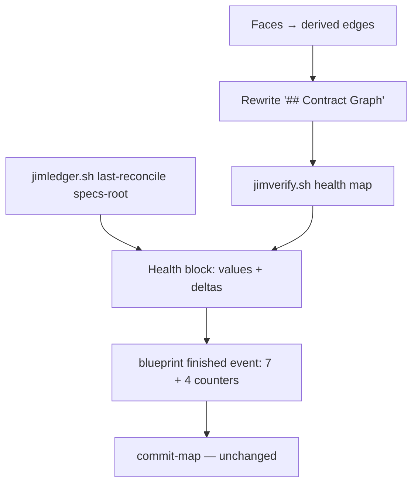

# Graph-health metrics in the reconcile pass — Plan

## Overview

Add a deterministic `health` verb to `jimverify.sh` that measures the
just-persisted `## Contract Graph` (plus territory coverage), a
`last-reconcile` verb to `jimledger.sh` for the prior-event delta, and wire
both into the reconcile section of the blueprint skill — which renders a
capped, sanitized health block and emits four additional int-or-`na`
counters on the existing reconcile ledger event.

## Design Decisions

### 1. Metric computation home

- **Chosen:** a new `health <map-path>` verb in
  `skills/verify/scripts/jimverify.sh`.
- **Why:** jimverify already owns the graph and territory parsing
  (`edges`, `territory`, conformance set-difference), follows the
  facts-not-verdicts doctrine, and has the test fixtures; the
  Bash-vs-Prompt rule puts counting/graph-walking in script.
- **Rejected:** `jimledger.sh` (owns event querying, not map parsing); a
  new script (proliferation + composition overhead for one verb).

### 2. Cycle metric semantics

- **Chosen:** `cycles` = number of cycle *clusters*: Kahn-peel zero-degree
  nodes iteratively; the remaining cyclic core's weakly-connected
  components are the clusters. Emit per-group membership facts so the
  report can name them.
- **Why:** matches the spec mockup's semantics (`billing ⇄ orders` = 1),
  is O(V+E), deterministic, and POSIX-awk implementable; research offered
  both this and plain nodes-on-cycles — clusters read better as a trend
  unit.
- **Rejected:** Tarjan SCC count — heavier to implement in awk for no
  added report value at group scale; elementary-cycle enumeration —
  combinatorial, unstable as a trend metric.

### 3. Prior-event lookup

- **Chosen:** a `last-reconcile <specs-dir>` verb in `jimledger.sh`: last
  `blueprint`/`finished` line whose kv carries `op=reconcile`; prints
  **only the documented counter keys** (whitelist — unknown kv content is
  dropped, never printed; security Finding 4), each validated (int, or
  `na` where documented); rc 0 found+valid, rc 1 none, rc 2 malformed.
- **Why:** the `updates-since` filtering pattern already exists; script-
  side validation implements the spec's malformed-prior degradation
  (AC #2) mechanically — the skill maps rc 1 → baseline, rc 2 → baseline
  plus a named degradation line. Prior events predating this spec simply
  lack health keys — validation checks only present keys, so deltas render
  for whatever the prior carried (backward compatible).
- **Rejected:** a generalized event-query verb — speculative surface, no
  second consumer yet; skill-side parsing of ledger.md — puts untrusted
  hand-editable content in the prompt path without a deterministic gate.

### 4. Counter encoding (extends the spec-034 contract)

- **Chosen:** four additive keys on the same finished event — `groups=`,
  `cycles=`, `fanin=` (max provider in-degree), `uncovered=` — non-negative
  integers, with `na` permitted where measurement is impossible: `uncovered`
  under a territory-less map, and all four on the nothing-to-reconcile
  short-circuit. Density is not recorded — the report derives it from
  `edges=`/`groups=`.
- **Why:** keeps the 034 "always emitted, shape-validated" pattern with one
  documented carve-out (`int-or-na`); `na` can never read as a
  measurement, satisfying ACs #7–8; no floats on the ledger. Values are
  script-emitted only — the skill copies the health verb's sanitized
  integers verbatim and never interpolates graph text (security Finding 3).
- **Rejected:** separate health event (splits the trend query, two lines
  per run); omitting keys when not computable (silent absence is
  indistinguishable from an older event).

### 5. Coverage source set and rendering bounds

- **Chosen:** in-script: uncovered = `git ls-files` output minus files
  prefix-matched by *any* group's Territory paths (the conformance
  mechanics, union across groups), aggregated to top-level directories
  with counts, control-chars stripped and cells length-capped (the `edges`
  `san()` treatment). Territory-less map (no `**Territory:**` line in any
  group) or git unavailable → `UNCOVERED na` with an `UNCOVERED_NA_REASON`
  fact (`no-territories` / `no-git`) rendered in the report, so
  not-applicable never conflates with measurement failure (security
  Finding 5, the 035 vocabulary doctrine). In-skill: render at most 5
  directories plus `+N more`; the event always carries the exact count.
- **Why:** the none-mode signal is derivable from map data alone — no
  config read, deterministic (AC #7, #9); aggregation + cap addresses
  security Finding 1 (untrusted filenames, alarm fatigue) while the count
  stays exact.
- **Rejected:** per-file listing in the report (unbounded, noisy); reading
  `group_territory` from config (map may disagree with config; the map is
  the authority being measured).

### 6. Flow ordering in the reconcile

- **Chosen:** step 2 rewrites `## Contract Graph` (unchanged) → new step
  2a runs `health` against the just-written map file and `last-reconcile`
  against the specs root, then renders the health block → step 3 emits the
  extended counters. Short-circuit path: health keys ride as `na`, the
  nothing-to-reconcile note covers health, no health verb run.
- **Why:** measuring the persisted section keeps a single source of truth
  and determinism (research ordering risk; AC #9); the event emission
  point and commit choreography stay exactly where they are (AC #10).
- **Rejected:** measuring the conversation-held edge list — diverges from
  persisted truth, unreproducible.

## Constitution Check

**ARCHITECTURE.md status:** Present — constraints noted below.

| Constraint from ARCHITECTURE.md | Honored? | Notes |
| :--- | :--- | :--- |
| Bash-vs-Prompt split (deterministic facts in scripts, judgment in skills) | Yes | Metrics + prior-event validation in script verbs; rendering/framing in the skill |
| SKILL.md line budget < 500 (blueprint at 464) | Yes | Reconcile § gains ~8 lines (step 2a + counter list); methodology doc carries the detail |
| Ledger is a trusted, content-free metrics channel (spec 026) | Yes | Event gains numeric/`na` counters only; names stay in the report (DD 4, 5) |
| No standing verdict artifacts (spec 034) | Yes | Health lives in report + event; nothing persisted to BLUEPRINT.md |
| Derived-graph rewrite exempt from Step-4a grading | Yes | Unchanged; health adds no map content |
| Bash conventions (`set -uo pipefail`, POSIX-only, no third-party deps) | Yes | awk-based verbs in existing scripts |
| Never-execute-config-content | Yes (n/a) | No commands executed; no config read at all (DD 5) |

## File Manifest

| Component | File Path | Action | Notes |
| :--- | :--- | :--- | :--- |
| Health verb | `skills/verify/scripts/jimverify.sh` | Update | `cmd_health` + dispatch + usage line |
| Prior-event verb | `skills/review/scripts/jimledger.sh` | Update | `last-reconcile` + dispatch + usage line |
| Reconcile wiring | `skills/blueprint/SKILL.md` | Update | Step 2a + extended counter list in step 3 (§ Reconcile, lines 411–432) |
| Counter contract + report format | `skills/blueprint/references/reconcile-methodology.md` | Update | § Outcome counters extension (int-or-na carve-out, emitted-not-lifted rule); new § Graph health (block format, delta wording, caps, degradation naming) |
| Health verb tests | `tests/jimverify.sh` | Update | Cases per task 1–2 |
| Prior-event verb tests | `tests/jimledger.sh` | Update | Cases per task 3 |

## Interface Contracts

```text
jimverify.sh health <map-path>
  stdout (TAB-separated facts; all cells san()-sanitized):
    GROUPS <n>                 count of '### <group>' sections in the map
    EDGES <n>                  rows parsed from '## Contract Graph'
    CYCLES <n>                 cycle clusters (DD 2); 0 when acyclic
    CYCLE <i> <group>          one line per on-cycle group, cluster index i
    FANIN <n>                  max provider in-degree (0 when no edges)
    FANIN_GROUP <group>        every group at the max (ties → all, sorted)
    UNCOVERED <n|na>           na: not measurable — see the reason fact
    UNCOVERED_NA_REASON <r>    only when na: no-territories | no-git;
                               rendered in the report (Finding 5)
    UNCOVERED_DIR <dir> <n>    top-level dir aggregation; only when UNCOVERED > 0
  rc: 0 ok · 2 map unreadable or no '## Contract Graph' section

jimledger.sh last-reconcile <specs-dir>
  stdout on rc 0:
    line 1: <iso timestamp of the event>
    then:   one 'key=value' per line — documented counter keys ONLY
            (edges/leaks/breaking/dead/unresolved/undeclared/stale/
            groups/cycles/fanin/uncovered); anything else in the kv is
            dropped, never printed (Finding 4)
  validation: every documented key present must be a non-negative
    integer; 'na' additionally allowed for groups/cycles/fanin/uncovered;
    a documented key carrying any other value → rc 2.
  rc: 0 found+valid · 1 no prior reconcile event · 2 malformed prior
```

Skill-side rendering contract (methodology § Graph health): density =
`edges/groups` to one decimal, rendered only (never recorded); delta
`(was N ↑/↓)` per *documented* counter key present in the prior (Finding
4); rc 1 → baseline; rc 2 → baseline + "prior event malformed — baseline
rendering" line; ≤5 `UNCOVERED_DIR` rows rendered + `+N more`;
measurement-only wording.

## Data Flow



## Task Breakdown

1. [x] `jimverify.sh health` — graph metrics: GROUPS/EDGES/CYCLES/CYCLE/
   FANIN/FANIN_GROUP per the contract (Kahn peel + WCC clustering, DD 2),
   rc 2 without a graph section. Tests: acyclic → CYCLES 0; mutual pair →
   1 cluster/2 members; two disjoint cycles → 2 clusters; shared-node
   tangle → 1; fan-in ties list all groups sorted; empty-graph note case;
   sanitized cells.
   **Verify:** `bash skills/meta-test/scripts/metatest.sh run jimverify`

2. [x] `jimverify.sh health` — coverage: UNCOVERED/UNCOVERED_DIR via
   git-ls-files minus territory-union prefix match, top-level aggregation,
   `na` + `UNCOVERED_NA_REASON` when no Territory lines or git unavailable
   (DD 5). Tests use a git fixture (conformance-test pattern): covered
   tree → 0; stray file → count + dir row; territory-less map → na +
   reason `no-territories`; non-git dir → na + reason `no-git`. Depends
   on task 1.
   **Verify:** `bash skills/meta-test/scripts/metatest.sh run jimverify`

3. [x] `jimledger.sh last-reconcile` per the contract (DD 3). Tests: no
   reconcile event → rc 1; latest of several wins; pre-039 seven-counter
   event → rc 0 (health keys absent); junk value on a documented key →
   rc 2; unknown key in kv → dropped from output (whitelist, Finding 4);
   `na` accepted on the four health keys only.
   **Verify:** `bash skills/meta-test/scripts/metatest.sh run jimledger`

4. [x] Wire the reconcile: `skills/blueprint/SKILL.md` § Reconcile — add
   step 2a (run `health` on the just-rewritten map, `last-reconcile` on
   the specs root, render the block per methodology) and extend step 3's
   instruction to all eleven counters with `na` on the short-circuit path
   (DD 4, 6). Depends on tasks 1–3.
   **Verify:** `grep -q 'uncovered=' skills/blueprint/SKILL.md && [ "$(wc -l < skills/blueprint/SKILL.md)" -le 500 ] && echo pass`

5. [x] Document the contract: `reconcile-methodology.md` — extend
   § Outcome counters (four new keys, int-or-na carve-out, values are
   script-emitted and never lifted from content) and add § Graph health
   (block format incl. derived density, delta/baseline/malformed-prior
   wording, the ≤5 + "+N more" uncovered cap stated as the documented
   rendering rule — AC #6's "names the uncovered directories" is satisfied
   by the capped named list plus the exact event count (finding M1) —
   the `na` reason rendering, measurement-only wording, short-circuit
   behavior). Depends on task 4 for consistency.
   **Verify:** `grep -q '## Graph health' skills/blueprint/references/reconcile-methodology.md && grep -q 'int-or-na' skills/blueprint/references/reconcile-methodology.md && echo pass`

6. [x] Full suite green.
   **Verify:** `bash skills/meta-test/scripts/metatest.sh run`

## Requirements Coverage Summary

| Spec Acceptance Criterion | Addressed In Task(s) |
| :--- | :--- |
| #1 four measurements computed each reconcile | 1, 2, 4 |
| #2 health block with delta; baseline; malformed prior degrades, named | 3, 4, 5 |
| #3 measurement-only wording, no verdicts | 5 |
| #4 counters ride the reconcile event; contract updated in same change | 4, 5 |
| #5 events content-free (numbers only; names in report) | 1–4 (sanitized int/`na` emission), 5 |
| #6 coverage = tracked paths in no territory; dirs in report, count on event | 2, 4, 5 |
| #7 not-computable coverage explicit, never zero | 2, 5 |
| #8 short-circuit alongside nothing-to-reconcile, no fake zeros | 4, 5 |
| #9 deterministic measurements | 1, 2 (script-computed; repeatability asserted in tests) |
| #10 reconcile otherwise unchanged; health never vetoes | 4 (additive step; step 3/commit text untouched), 6 |

No `[NEEDS CLARIFICATION]` items.

## Out of Scope

- Thresholds, warnings, or gating on health values (issue #22 slice B2)
  and any interpretation/split-merge proposals (issue #42).
- Straddle detection (behind spec 038's extractor fork).
- Backfilling health onto historical ledger events; pre-039 events render
  delta-less for absent keys by design (DD 3).
- `/jim:verify` surface changes — the `health` verb ships in `jimverify.sh`
  but only the reconcile calls it; verify-side consumption is #22-B2.
- `ARCHITECTURE.md` refresh — pipeline-owned by the `/jim:build`
  completion gate via `/jim:arch`; not a deferral.

## Open Questions

- [x] ~Cycle metric definition?~ → Cycle clusters via Kahn peel + WCC
      (DD 2), matching the spec mockup's semantics.
- [x] ~Where do the security plan-findings land?~ → Finding 1 → DD 5 +
      tasks 2/5 (sanitize, aggregate, cap); Finding 3 → DD 4 + tasks 1–3
      (script-emitted, validated values only).
