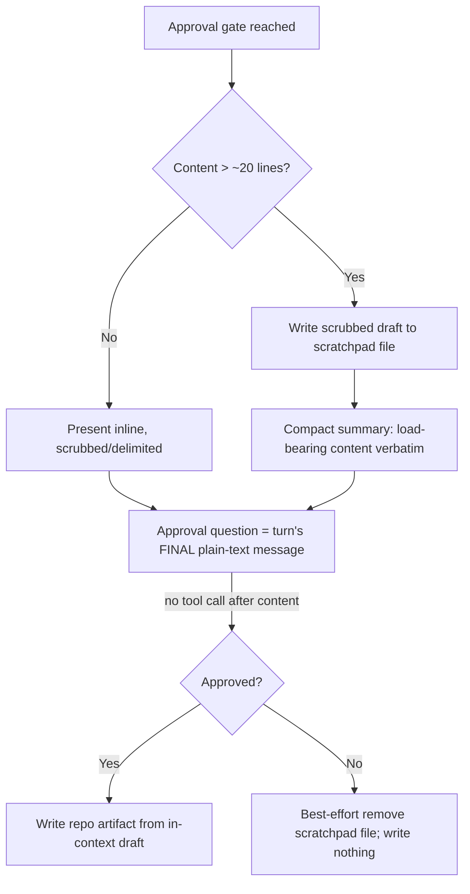

# Blueprint-surface approval-gate presentation — Plan

## Overview

Define the gate-presentation rule once in a new `skills/blueprint/references/gate-presentation.md`,
reference it by path from every long-content approval gate on the blueprint
surface (inline, to respect the 500-line SKILL cap), extend the
meta-skill/meta-agent checklists, and guard the whole thing with a
`tests/gatepresentation.sh` reference-presence test.

## Design Decisions

### 1. Rule home — standalone reference doc

- **Chosen:** A new `skills/blueprint/references/gate-presentation.md` holding the full rule.
- **Why:** Matches the `references/` progressive-disclosure pattern; cleanly citable by path from SKILL bodies *and* sibling reference docs (fork-grounding, reconcile, map-methodology) and from partition; keeps SKILL bodies within the ≤500-line cap. Blueprint is the natural owner — partition materializes every write through the blueprint surface.
- **Rejected:** A `§`-section inside `skills/blueprint/SKILL.md` (awkward to cite from sibling reference files; grows an already-498-line file). Inlining the rule at each site (violates AC 1's single-definition; guarantees drift).

### 2. Reference-by-pointer, mirroring § 7a

- **Chosen:** Each gate site carries a bare pointer citing the canonical **reference token** — the literal repo-relative path string `skills/blueprint/references/gate-presentation.md` — exactly as skills cite `skills/issue/SKILL.md` § 7a. The agent consults the doc on demand when it reaches a gate.
- **Why:** Single source of truth (AC 1); the fixed token gives the regression test a stable string to grep; the pattern is already proven in-tree (§ 7a).
- **Rejected:** Restating the rule's essence inline at each site — would re-introduce the drift AC 1 forbids.

### 3. Inline pointers in blueprint SKILL.md (line-cap safety)

- **Chosen:** In `skills/blueprint/SKILL.md`, append the pointer **inline** to each existing gate instruction — **zero net new lines** — so the file stays at 498 (cap is ≤500). No new standalone lines, no rewrapping of the edited lines.
- **Why:** `skills/blueprint/SKILL.md` is at 498/500. Any new line risks the cap the meta-skill checklist enforces. Inline appends add the token and the per-gate reference without adding lines.
- **Rejected:** A top-of-Process "read before any gate" line + per-gate lines (would push toward/over 500). Reference docs and partition have ample headroom, so they take normal pointer clauses.

### 4. Reviewable-file location — session scratchpad

- **Chosen:** The reviewable file is a **session-scratchpad working file** (like partition's territories-file), never a repo artifact; on decline it is removed best-effort.
- **Why:** Session-scoped, not world-readable (sec Finding 1); reuses an established convention; keeps the repo-side "write nothing before approval" discipline literally true (a scratchpad file is not a repo artifact/ledger/commit), so decline needs no repo cleanup — only a best-effort unlink (sec Finding 3, AC 4). The scratchpad file is **session-ephemeral**, so a failed best-effort unlink still leaves no orphan in the repo or beyond the session — the rule doc's `## On decline` states this reconciliation explicitly, so the plan's "best-effort" and spec AC 4's "no orphan survives" do not read as contradictory (sec Finding 5).
- **Rejected:** Writing the target path in place pre-approval — a cleaner "reviewable file" for blueprint generates, but forces the decline path to delete a repo file and reopens the empty-commit risk; marginal UX gain for real complexity.

### 5. Threshold — "more than ~20 lines", judged not machine-counted

- **Chosen:** The rule's two tiers: a **general rule** that applies at *every* gate (final plain-text message; no tool call chained after presented content in the same turn; nothing past ~20 lines in an AskUserQuestion preview), and a **long-content rule** (the reviewable-file + verbatim-summary mechanics) that fires when the content exceeds ~20 lines.
- **Why:** ~20 traces to the observed AskUserQuestion preview truncation; a judged threshold avoids false precision (the agent cannot reliably count) and spares short gates (a 3-line retirement banner) the file overhead while still forbidding the mid-turn-render trap everywhere.
- **Rejected:** A hard mechanical line count (agent can't enforce it; over-precise). Always-file regardless of length (needless overhead on short gates).

### 6. Regression check — a reference-presence bash test

- **Chosen:** A new `tests/gatepresentation.sh` (auto-discovered by `run.sh`'s `tests/*.sh` glob) modeled on `case_jimfile_is_valid_id_triplicate_identical`: one case asserts the reference token meets the expected **per-file count** (`blueprint/SKILL.md` ≥ 6, every other checked-set file ≥ 1 — sec Finding 4) in each enumerated gate-site file; one case asserts `gate-presentation.md` exists and carries its required section headings.
- **Why:** Matches the in-tree cross-file textual-invariant precedent; catches drift mechanically. It is a **mechanical textual-invariant test** (does the reference string appear), *not* prompt-semantic validation — the "is the rule authored well" judgment stays with the meta-skill/meta-agent checklist item (research Peer Feedback 1).
- **Rejected:** Checklist-only (the developer chose a grep test). A semantic linter (overkill; against jim's testing doctrine).

## Constitution Check

**ARCHITECTURE.md status:** Present — constraints noted below.

| Constraint from ARCHITECTURE.md | Honored? | Notes |
| :--- | :--- | :--- |
| § 7a shared-contract-by-reference (define once, pointer per site) | Yes | `gate-presentation.md` is the single definition; sites carry pointers only (DD1/DD2). |
| `references/` progressive disclosure; reading a reference needs no `allowed-tools` grant | Yes | Pointers are plain-prose path citations; the agent `Read`s the doc on demand. No permission change. |
| Permission Conventions — `allowed-tools` mirrors every script call site | Yes | No new `!`-injection or fenced-bash call site is added; pointers are prose. `allowed-tools` is unchanged in every edited skill. |
| SKILL.md ≤ 500 lines (meta-skill checklist) | Yes | `blueprint/SKILL.md` stays 498 via inline pointers (DD3); partition/meta-skill/meta-agent have headroom. |
| Bash-vs-Prompt Decision Rule | Yes | Presentation *doctrine* → prompt/reference doc; deterministic *reference-presence* check → bash test (DD6). |
| Substitution Conventions (three sigils) | Yes | Pointers are plain markdown inline-code paths — no `!`-injection, `<lower>`, or `{lower}`. |

## File Manifest

| Component | File Path | Action | Notes |
| :--- | :--- | :--- | :--- |
| Canonical rule | `skills/blueprint/references/gate-presentation.md` | Create | The single definition (general rule + long-content rule + decline + data-safety), per Interface Contract. |
| Blueprint gates | `skills/blueprint/SKILL.md` | Update | Inline pointer at Step 5 (:140), Step 4a downgrade prompts (:124-131), U2a (:274), U4 (:314), M2 map (:378-380), Retire step 2 (:456). Zero net new lines. |
| Violation fork | `skills/blueprint/references/fork-grounding.md` | Update | Pointer at the U3a fork presentation (:119-154). |
| Reconcile findings | `skills/blueprint/references/reconcile-methodology.md` | Update | Pointer at the findings-presentation instruction (:119-136). |
| Map draft | `skills/blueprint/references/map-methodology.md` | Update | Pointer at creation step 4 "Present the full map draft" (:64). |
| Partition gate | `skills/partition/SKILL.md` | Update | Pointer at Step 3 proposal (:113-119) and Step 4 hard gate (:121-139). |
| Meta-skill checklist | `skills/meta-skill/SKILL.md` | Update | New Validation Checklist item (§ 4, near :98). |
| Meta-agent checklist | `skills/meta-agent/SKILL.md` | Update | New Validation Checklist item (§ 4, :105-131). |
| Regression test | `tests/gatepresentation.sh` | Create | Reference-presence + doc-structure cases (DD6). |

## Interface Contracts

**Reference token (exact literal — the grep test and every pointer use this string):**

```
skills/blueprint/references/gate-presentation.md
```

**Pointer clause (consistent phrasing appended at each gate site):**

```
present per the gate-presentation rule (`skills/blueprint/references/gate-presentation.md`)
```

**Checked-file set (the regression test's input — each file MUST contain the reference token at least the expected number of times; sec Finding 4):**

```
skills/blueprint/SKILL.md                              >= 6   # one inline pointer per gate
skills/blueprint/references/fork-grounding.md          >= 1
skills/blueprint/references/reconcile-methodology.md   >= 1
skills/blueprint/references/map-methodology.md         >= 1
skills/partition/SKILL.md                              >= 1   # covers 2 gate sites; build may use 1 or 2 pointers
skills/meta-skill/SKILL.md                             >= 1
skills/meta-agent/SKILL.md                             >= 1
```

**`gate-presentation.md` required structure (headings the doc-structure test asserts):**

```
# Gate-presentation rule
## Every gate            # final plain-text message; no tool call after presented content in the same turn; no >~20-line AskUserQuestion preview
## When content exceeds ~20 lines   # (1) reviewable file in session scratchpad + path, secret-scrubbed, untrusted evidence kept delimited; (2) compact summary reproducing load-bearing content verbatim (Invariants table; map downgrade list), scrubbed/delimited; (3) the approval question as the final plain-text message
## On decline            # remove the scratchpad working file best-effort; the repo "write nothing before approval" discipline is unchanged; the scratchpad file is session-ephemeral, so best-effort removal still satisfies spec AC 4's "no orphan survives" (sec Finding 5)
## Data safety           # keep the approved draft in context; guard any file-sourced write with a non-empty (`test -s`) check before ledger/commit
```

## Data Flow



## Task Breakdown

1. [ ] **Reproduce** — confirm the defect: no gate site references any gate-presentation rule today.
   **Verify:** `! grep -rl "gate-presentation" skills/blueprint/SKILL.md skills/blueprint/references/ skills/partition/SKILL.md skills/meta-skill/SKILL.md skills/meta-agent/SKILL.md` (exits 0 — zero matches, so the rule is absent everywhere).

2. [ ] **Fix — create the canonical rule.** Create `skills/blueprint/references/gate-presentation.md` per the Interface Contract structure (all four `##` sections; general + long-content tiers; scrub + delimiting; decline; data-safety).
   **Verify:** `test -f skills/blueprint/references/gate-presentation.md && grep -qc "## Every gate" skills/blueprint/references/gate-presentation.md && grep -q "## When content exceeds" skills/blueprint/references/gate-presentation.md && grep -q "## On decline" skills/blueprint/references/gate-presentation.md && grep -q "## Data safety" skills/blueprint/references/gate-presentation.md`

3. [ ] **Fix — blueprint SKILL gates.** Append the pointer clause inline at the six blueprint gate sites (Step 5, Step 4a, U2a, U4, M2 map, Retire). Zero net new lines.
   **Verify:** `test "$(grep -c 'gate-presentation.md' skills/blueprint/SKILL.md)" -ge 6 && test "$(wc -l < skills/blueprint/SKILL.md)" -le 500`

4. [ ] **Fix — reference-doc gates.** Append the pointer at the U3a fork (`fork-grounding.md`), the reconcile findings (`reconcile-methodology.md`), and the map draft (`map-methodology.md`).
   **Verify:** `for f in fork-grounding reconcile-methodology map-methodology; do grep -q "gate-presentation.md" "skills/blueprint/references/$f.md" || { echo "MISSING $f"; exit 1; }; done`

5. [ ] **Fix — partition gate.** Append the pointer at the partition proposal (Step 3) and hard gate (Step 4).
   **Verify:** `grep -q "gate-presentation.md" skills/partition/SKILL.md`

6. [ ] **Fix — meta checklists.** Add a gate-presentation Validation Checklist item to `skills/meta-skill/SKILL.md` and `skills/meta-agent/SKILL.md` (a skill/agent with a content-presenting approval gate references the canonical rule).
   **Verify:** `grep -q "gate-presentation.md" skills/meta-skill/SKILL.md && grep -q "gate-presentation.md" skills/meta-agent/SKILL.md`

7. [ ] **Regression — the reference-presence test.** Create `tests/gatepresentation.sh` (source `testlib.sh` via the `BASH_SOURCE`-relative path; `case_gatepresentation_*` functions): one case asserts the reference token meets the expected per-file count (`blueprint/SKILL.md` ≥ 6, every other checked-set file ≥ 1 — sec Finding 4, so a single dropped gate pointer fails the suite), one asserts `gate-presentation.md` exists with its four required headings.
   **Verify:** `bash tests/gatepresentation.sh` (all cases pass) — then confirm auto-discovery: `bash skills/meta-test/scripts/run.sh gatepresentation`

8. [ ] **Regression — full suite green.** Confirm no existing test regressed.
   **Verify:** `bash skills/meta-test/scripts/run.sh`

## Requirements Coverage Summary

| Spec Acceptance Criterion | Addressed In Task(s) |
| :--- | :--- |
| AC 1 — rule defined once in a shared doc, referenced by path | 2, 3–6 |
| AC 2 — the four required elements + threshold | 2 |
| AC 3 — coverage: every long-content gate references the rule | 3, 4, 5 |
| AC 4 — decline leaves nothing written | 2 (On decline), 4 (DD4 scratchpad) |
| AC 5 — no data-loss path (empty/truncated) | 2 (Data safety) |
| AC 5 (sec Finding 1) — reviewable file secret-scrubbed, session/repo-scoped | 2 (long-content rule) |
| AC 5 (sec Finding 2) — untrusted evidence delimited in file + summary | 2 (long-content rule) |
| AC 6 — build-gate check on the reference | 7 |
| AC 7 — meta-skill/meta-agent checklist item | 6 |
| AC 8 — regression test covers the reported scenario | 1, 7 |

## Out of Scope

- Non-blueprint-surface gates (spec/plan/review/build/debug/research/sec, the § 7a issue-edit inline flow). Deferred and already filed: issue `20260707-extend-the-gate-presentation-rule-beyond-the-blueprint-surface`.
- **`ARCHITECTURE.md` → Plugin Conventions entry** for the new doctrine. Not a code deferral and not an issue — it is documentation maintenance owned by `/jim:arch`, run as a **post-build** step (per convention `ARCHITECTURE.md` is edited only via that skill). Recorded here so it is not lost.
- sec Finding 3's mechanism detail (best-effort cleanup) is *in scope* — folded into the `## On decline` section of the rule (task 2), not deferred.

## Open Questions

- [x] ~~Reviewable-file location~~ → session scratchpad (DD4).
- [x] ~~Threshold wording~~ → "more than ~20 lines", judged (DD5).
- [x] ~~Rule home~~ → standalone `references/gate-presentation.md` (DD1).
