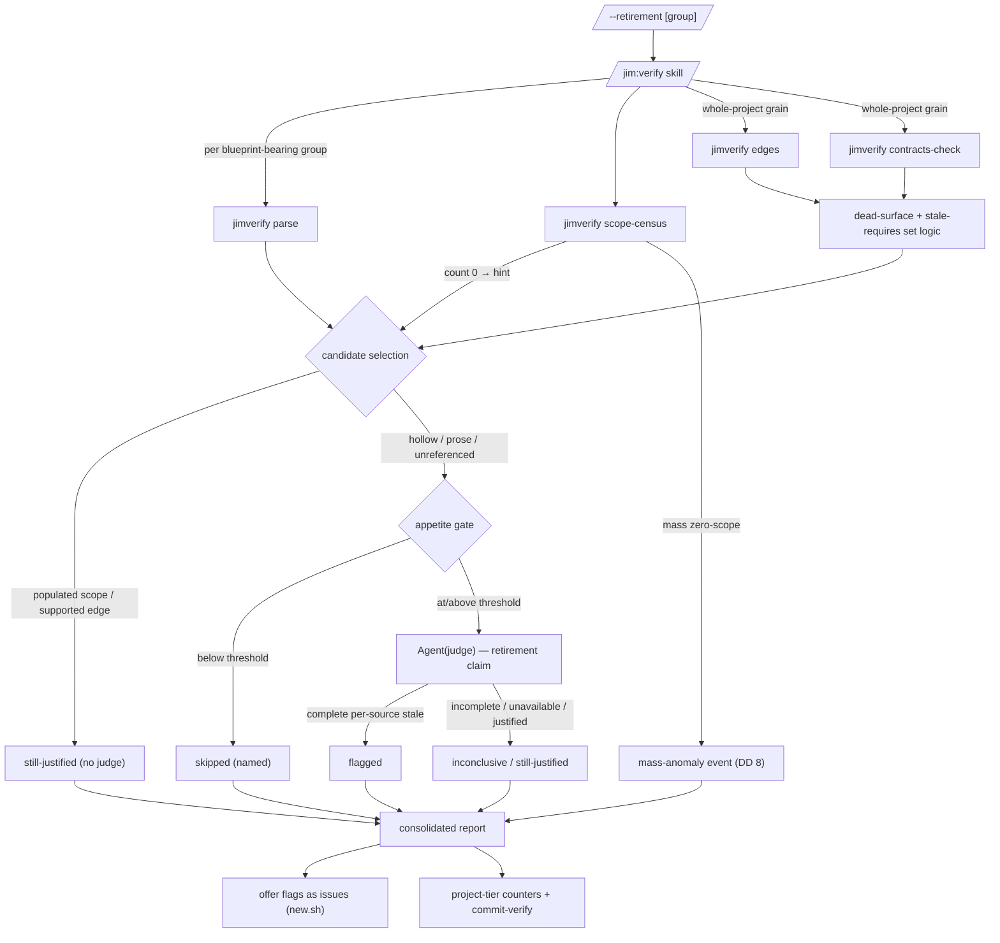

# Retirement sweep — Plan

## Overview

Add a `/jim:verify --retirement [<group>]` mode that runs the load-bearing
sources in reverse: one new facts-only script verb (`scope-census`) supplies
the single deterministic staleness signal the record grammar cannot express
today (per-invariant scope population), and the rest is skill-level
composition over the existing `parse` / `edges` / `contracts-check` verbs plus
a third read-only `judge` claim type — flagging stale invariants, stale
requires entries, and dead surface in one consolidated report, offered as
issues, never written.

## Design Decisions

### 1. One new script verb (`scope-census`), everything else composed

- **Chosen:** Add a single facts-only verb, `scope-census <blueprint-dir>
  <map> <group>`, emitting per pattern/structure invariant the count of
  tracked files its resolved scope covers. Stale-requires and dead-surface
  hints are pure skill composition over the existing `edges` and
  `contracts-check` output; no other script code changes.
- **Why:** The research established the *only* fact the current grammar
  cannot express: a `must-not` pattern over an empty scope emits the same
  `holds` as a genuinely-clean scope (`check_pattern` L397–408 has no
  file-count field). Every other retirement hint is derivable from facts the
  script already emits — `edges` (declared edges) intersected with
  `contracts-check` `CROSS-REF` facts (supporting references) yields
  unreferenced edges (stale requires) and the dead-surface set logic already
  documented in `contracts-methodology.md`. Minimizing new script surface
  honors the facts-vs-verdicts rule and the byte-compatibility discipline the
  existing verbs guard.
- **Rejected:** Extending `check` to emit an auxiliary `SCOPE` record —
  touches the 035/036 consumers' contract and breaks `check`'s guarded
  byte-compatibility. A composite `retire-scan` verb folding cross-group
  facts — mixes one-group invariant scope with cross-group edge data
  (`contracts-check`'s territory), muddying the input boundary.

### 2. Populated scope ⇒ still justified without a judge; the hollow ones are judged

- **Chosen:** A pattern/structure invariant whose scope resolves to **≥1**
  tracked file is reported `still-justified` mechanically — no judge spent.
  Only entries the mechanical layer cannot rule live — zero-scope
  pattern/`exists` invariants, all `judge`-method (prose) invariants, and
  unreferenced requires edges — become judge candidates, appetite-gated.
- **Why:** The load-bearing-source model is a *union* — a constraint earns
  its place if **any** source holds (brainstorm 20260630-000, "if ANY of
  these hold"). A check actively running over real code is a live
  verification source, so it justifies keeping the invariant on its own; no
  judgment is owed. This is the cost win behind User Story 2 and the mockup's
  cheap "still justified (14)" line — judges fall only on entries no cheap
  fact can justify.
- **Rejected:** Judging every invariant unconditionally — needlessly
  expensive and fights the cost-conscious story; a populated-scope check is
  already the examination AC #2 demands ("checked and still justified").

### 3. `absent=` checks are not emptiness candidates; `exists=`/`pattern` are

- **Chosen:** `scope-census` tags each record with `kind ∈ pattern | exists
  | absent`. The skill treats a zero count as a staleness hint only for
  `pattern` and `exists`; `absent=` zero is the *healthy* state (nothing
  forbidden present) and never generates a candidate.
- **Why:** An `absent=` invariant asserts a glob matches nothing; zero
  matches is permanent success, not obsolescence. Reading it as staleness
  would flag every healthy negative check.
- **Rejected:** Uniform zero-is-stale across kinds — mass false candidates on
  every `must-not`/`absent` guard.

### 4. `--retirement`, not `--retire` (collision avoidance)

- **Chosen:** Name the mode flag `--retirement`, composing with `--appetite`
  under the established strip-and-remainder convention; bare = whole-project,
  a `<group>` operand = group-scoped.
- **Why:** `/jim:blueprint --retire <group>` already exists (spec 038, group
  retirement). Reusing `--retire` on `/jim:verify` — a read-only sweep that
  writes nothing — would conflate the flag with blueprint's write-side group
  dissolution. `--retirement` reads as the sweep the spec names and cannot be
  mistaken for the blueprint arm.
- **Rejected:** `--retire` (collision + write connotation); `--stale`
  (diverges from the spec's "retirement sweep" vocabulary).

### 5. The whole-project sweep contains its engine pass; it consumes no history

- **Chosen:** The sweep derives every source signal from a fresh in-run pass
  — `parse` + `scope-census` + `edges` + `contracts-check` + spec-corpus
  paths — never from a persisted prior run. Dead surface reuses the
  contract-mode set logic (`contracts-methodology.md`) over fresh
  `contracts-check` output.
- **Why:** By the no-standing-verdict doctrine (034 AC #3 / 035 AC #11)
  **no durable per-entry outcome exists anywhere** — only counters. So the
  "verification dependency" source can only be the containing run's own
  facts (spec AC #5, as amended). One fresh pass also gives one engine
  opinion per entry (the 037 AC #12 spirit), no double-run.
- **Rejected:** Consuming a prior `--contracts` run's records — there are
  none to consume; the doctrine forbids persisting them.

### 6. Judge extended (third claim type), not a sibling agent

- **Chosen:** Add a retirement claim type to `agents/judge.md` (entry kinds:
  invariant | requires | provides-surface) with a parallel output contract
  (`sources_examined` + `verdict: justified|stale|inconclusive`); no new
  agent, no tool change (`Read`/`Glob`/`Grep` unchanged).
- **Why:** The judge already generalized once (invariant → edge side, 037)
  with the same capability boundary; a retirement candidate is the same
  read-only reasoning over handed evidence. The capability-backed read-only
  boundary (a prompt injection in scanned content cannot mutate anything)
  carries verbatim. The intent source is handed as a **bounded** spec-corpus
  path set the judge greps within — not a repo-roam (security Finding 6).
- **Rejected:** A sibling `retirement-judge` agent — duplicates the boundary
  and the dispatch plumbing for no capability difference (the same call 037
  made).

### 7. Confirmation carries per-source evidence or fails toward inconclusive

- **Chosen:** A `stale` verdict counts as a flag only when the judge returns
  a complete `sources_examined` block (intent / usage / verification each
  examined, with a location or an explicit `none`/`unavailable`), and the
  no-source conclusion does not rest on `unavailable` sources. A `stale`
  verdict missing that evidence, or resting on unavailable sources, is
  downgraded by the skill to `inconclusive`.
- **Why:** Retirement inverts the engine's polarity — a confirmation
  *initiates constraint removal*, so a bare "confirmed" cannot be trusted
  (security Findings 1/2). Fail-toward-inconclusive is the shape-validation
  analog of the established fail-closed rule, applied in the direction that
  preserves constraints. AC #6 keeps unavailable distinct from "found
  nothing".
- **Rejected:** Trusting a bare `stale` verdict — the highest-value injection
  target in the engine with nothing to check against.

### 8. Mass-anomaly guard is a skill heuristic over `scope-census` counts

- **Chosen:** When zero-scope `pattern`/`exists` invariants in a group are
  **both** ≥3 in absolute count **and** ≥50% of that group's
  mechanically-scoped invariants, the skill emits one "territory may have
  moved / evidence may be shaped" event naming the affected scope(s) —
  instead of that many individual stale-invariant candidates.
- **Why:** A moved or renamed territory makes every scope zero-match at once
  — indistinguishable at hint level from shaped evidence, and a flood of
  flags + judge spend either way (security Finding 1). The mass event is
  itself the finding. Thresholds live in the methodology doc as skill
  guidance — **no config key** (spec Out of Scope).
- **Rejected:** Emitting each as an individual candidate — alarm flood, and
  hands an evidence-shaper N pre-justified removal flags.

### 9. Methodology to a new `references/` doc; SKILL.md stays lean

- **Chosen:** The full method (sources, hint→candidate→judge flow, the
  mass-anomaly guard, dead-surface reuse, the two grains, outcome
  vocabulary, report shape, durability, issue offer, degradation) lives in
  a new `skills/verify/references/retirement-methodology.md`; SKILL.md gains
  only an argument-routing row and a short "Retirement mode" section
  pointing to it (the `--contracts` → `contracts-methodology.md` precedent).
- **Why:** SKILL.md is at 298/500; a full inline mode would blow the budget.
  Progressive disclosure is the documented skill convention.
- **Rejected:** Inlining the methodology — pushes SKILL.md toward the limit
  the contract mode already had to reclaim.

### 10. Whole-project judge fan-out is run-global, not per-group

- **Chosen:** `verify_fanout_cap` bounds the **whole retirement run's total**
  judge fan-out across all groups (highest-criticality-first, cross-group),
  with the un-judged remainder named as in SKILL.md Step 7 — never a per-group
  cap.
- **Why:** The whole-project grain iterates every blueprint-bearing group into
  candidates; a per-group cap would let an M-group repo fan out M × cap judges
  — a self-inflicted cost/latency blowup and exactly the spend User Story 2
  warns against (security Finding 5). A run-global cap mirrors the contract
  mode's whole-graph fan-out.
- **Rejected:** Per-group cap — unbounded in the number of groups.

## Constitution Check

**ARCHITECTURE.md status:** Present — constraints noted below.

| Constraint from ARCHITECTURE.md | Honored? | Notes |
| :--- | :--- | :--- |
| Bash + POSIX only, no third-party deps, `set -uo pipefail` | Yes | `scope-census` is bash/awk/git ls-files; reuses existing helpers |
| Never source/eval untrusted data; parse with awk/grep | Yes | Blueprint/map/corpus read as data; no eval |
| SKILL.md < 500 lines (progressive disclosure) | Yes | +~25 lines routing/mode; full method in new `references/` doc |
| Inter-script composition via `BASH_SOURCE`-relative paths | Yes | `scope-census` reuses the resolved `$JIMFILE` boundary |
| Bash-vs-Prompt: script emits facts, skill judges | Yes | `scope-census` emits counts; candidate classification + judgment in skill |
| Judge capability boundary (`Read`/`Glob`/`Grep` only) | Yes | Third claim type added; tools unchanged |
| One-level subagent nesting | Yes | Sweep runs inline like other modes; judge fan-out is the single level |
| No-standing-verdict doctrine (no verdict artifact) | Yes | Report + issues + ledger counters only (DD 5) |
| Ledger metrics channel is content-free | Yes | Numeric per-class counters only; names/scopes stay in the report |
| Engine is read-only toward the project | Yes | No blueprint/code/map write (AC #8) |
| No new configuration keys | Yes | Appetite/fan-out/model reused; mass-anomaly threshold is skill guidance |
| Untrusted-content discipline, location-only evidence | Yes | Extended to spec-corpus (AC #11 / Finding 3) |

## File Manifest

| Component | File Path | Action | Notes |
| :--- | :--- | :--- | :--- |
| scope-census verb | `skills/verify/scripts/jimverify.sh` | Update | New `cmd_scope_census` + dispatch case + usage line + header doc |
| scope-census tests | `tests/jimverify.sh` | Update | New `case_jimverify_scope_census_*` cases |
| Judge claim type | `agents/judge.md` | Update | Third claim type (retirement) + `sources_examined`/verdict output contract |
| Retirement methodology | `skills/verify/references/retirement-methodology.md` | Create | Full method — the `contracts-methodology.md` sibling |
| Verify skill wiring | `skills/verify/SKILL.md` | Update | `--retirement` routing row + short mode section pointing to the reference |

## Interface Contracts

### `scope-census` verb (jimverify.sh)

```
scope-census <blueprint-dir> <map-path> <group>
  Resolve the group's territory (reuse cmd_territory → terr_paths) exactly as
  cmd_check does. For each pattern/structure invariant from cmd_parse, resolve
  its search scope the same way check_pattern/check_structure do (explicit
  verify-checks scope=/exists=/absent=, else territory default; explicit scopes
  through safe_path_param), then count the TRACKED files under it via the
  check_conformance pattern — enumerate `git ls-files` ONCE with NO pathspec,
  then filter with `path_under "$f" "$scope"` in bash. NEVER pass the untrusted
  scope to git as a pathspec (`git ls-files -- <scope>`): git pathspec-magic
  (`:(exclude)…`, `:/`, `:(glob)`) can slip past the relpath shape gate and
  skew the count (security Finding 4). Pure string logic over gated relpaths.

  OUTPUT (TAB-separated, one record per pattern/structure invariant):
    SCOPE \t <id> \t <count|na> \t <kind> \t <scope-desc>
      - kind  ∈ pattern | exists | absent
      - count = tracked files under the resolved scope; `na` when not a git
                tree (unavailable ≠ zero — AC #6)
      - scope-desc = the resolved scope path(s) or `territory` (sanitized,
                     location-only; never file content)
    UNSCOPED                          no territory declared and no explicit
                                      scope — the skill names the degradation
    HYGIENE \t <scope>                an explicit scope failing safe_path_param
                                      (excluded; the invariant → judge path)
  - judge / registry / malformed invariants emit NO SCOPE record (no mechanical
    scope); the skill accounts for them from cmd_parse (the full set).
  - rc 2 on missing args / missing blueprint spec / invalid group (mirrors check).
```

### Judge retirement claim (agents/judge.md)

```
INPUT (handed by the skill; the judge reads only within the handed set):
  - entry kind: invariant | requires | provides-surface
  - entry id/key + verbatim text          (inside a delimited untrusted block)
  - criticality
  - mechanical hint: why it is a candidate — "scope resolves to 0 files" |
      "declared edge, no cross-reference" | "provides surface, no consumer
      cross-reference (dead)" | "prose invariant, no mechanical check"
  - intent scope:   the group's spec-corpus file paths — a BOUNDED set (cap
                    the file count and/or per-file matched-excerpt size around
                    the invariant's subject terms). The judge greps ONLY this
                    handed path set — never repo-roaming (security Finding 6;
                    closes AC #5 "handed, not roamed").
  - usage evidence: the contract-graph edges touching the entry (or "single-
                    group: none")
  - verification evidence: the scope-census fact / check status
  - territory scope paths (to read code)

OUTPUT:
  entry: <id/key>
  sources_examined:
    intent:        <justified|none|unavailable> [@ <spec-id/section>]
    usage:         <justified|none|unavailable> [@ <file:line|edge>]
    verification:  <justified|none|unavailable> [@ <file:line|scope>]
  verdict: justified | stale | inconclusive
  detail: <one-line reasoning; no quoted secrets, locations only>

  - verdict `stale` requires: all three sources_examined present, and the
    no-source conclusion does NOT rest on any `unavailable` source (AC #6).
  - The invariant/edge-side output contract (spec 035/037) is UNCHANGED; this
    is a parallel retirement contract selected by the retirement claim.
```

### Retirement outcome vocabulary (skill / methodology)

```
flagged        — a candidate the judge confirmed stale with complete per-source
                 evidence (→ offered as an issue).
inconclusive   — hint fired but the judge could not confirm, rested on
                 unavailable sources, or was appetite-skipped / fan-out-capped
                 (named, never silently dropped).
still-justified— a source demonstrably backs the entry (populated scope, a
                 supporting cross-reference, or the judge finding intent/usage).
skipped        — a judge-only candidate below the appetite threshold (named).
dead-surface   — a provides entry with no declared edge and no cross-reference
                 (reused from the contract mode's set logic; whole-project grain).
unswept        — a group without a blueprint (named, AC #10).
mass-anomaly   — the DD-8 "territory may have moved / evidence may be shaped"
                 event, replacing individual zero-scope candidates for a group.
```

### Ledger event (specs-root, project-tier)

```
jimledger.sh event <specs-root> verify started  tier=project op=retirement
jimledger.sh event <specs-root> verify finished tier=project op=retirement \
  groups=<n> swept=<n> invariants=<n> requires=<n> candidates=<n> \
  flagged=<n> inconclusive=<n> justified=<n> skipped=<n> dead=<n>
jimledger.sh commit-verify <specs-root>
```
Free `k=v` tokens + a dir-arg commit — **no `jimledger.sh` change** (the 037
precedent). Content-free numbers only; scopes/names live in the report.

## Data Flow



## Task Breakdown

1. [ ] **Add the `scope-census` verb to `jimverify.sh`** — `cmd_scope_census`
   resolving territory via `cmd_territory`, iterating `cmd_parse` output, and
   for each `pattern`/`structure` invariant resolving its scope
   (`verify-checks` `scope=`/`exists=`/`absent=` via `parse_params`, else
   territory default) and counting tracked files the **`check_conformance`
   way** — one `git ls-files` enumerate (no pathspec) filtered by `path_under`
   in bash, **never** `git ls-files -- <scope>` (git pathspec-magic evades the
   relpath gate — security Finding 4) — emitting `SCOPE \t <id> \t <count|na>
   \t <kind> \t <scope-desc>`, plus `UNSCOPED`/`HYGIENE` per the contract.
   Reuse `safe_path_param`, `path_under`, `terr_of`. Add the `scope-census)`
   dispatch case, the usage line, and the header-doc block. Non-git tree →
   `na`. `judge`/`registry`/`malformed` invariants emit nothing.
   **Verify:** `grep -n "scope-census)" /mnt/src/jim/skills/verify/scripts/jimverify.sh && bash /mnt/src/jim/skills/verify/scripts/jimverify.sh scope-census 2>&1 | grep -q "need <blueprint-dir>"`

2. [ ] **Add `scope-census` tests to `tests/jimverify.sh`** — cases covering:
   a populated `scope=` (count ≥1, `still-justified` upstream); an empty
   `scope=` path (count 0, kind `pattern`); a territory-default pattern with a
   populated then emptied territory; an `exists=` present (1) and absent (0);
   an `absent=` check (kind `absent`, tagged so the skill excludes it); a
   `judge`-method invariant emitting no `SCOPE` record; `UNSCOPED` when no
   territory; a bad-arg `rc 2`; **and a pathspec-magic scope** (e.g.
   `scope=:(exclude)*` or `:/`) that either fails the `safe_path_param` gate
   (`HYGIENE`) or is counted literally by the `path_under` filter — never
   interpreted as a git pathspec (security Finding 4). Build fixtures with the
   existing `verify_repo_scoped` / temp-git-repo helpers.
   **Verify:** `bash /mnt/src/jim/tests/jimverify.sh scope_census 2>&1 | grep -Eq "Ran [1-9][0-9]* tests: [0-9]+ passed, 0 failed"`

3. [ ] **Full `jimverify.sh` suite stays green** — confirm the new verb and
   cases did not regress `parse`/`territory`/`check`/`faces`/`edges`/
   `contracts-check`/`health`.
   **Verify:** `bash /mnt/src/jim/tests/jimverify.sh 2>&1 | grep -Eq "Ran [1-9][0-9]* tests: [0-9]+ passed, 0 failed"`

4. [ ] **Extend `agents/judge.md` with the retirement claim type** — add the
   third claim (entry kinds invariant | requires | provides-surface) with the
   handed-input list and the parallel `sources_examined` + `verdict:
   justified|stale|inconclusive` output contract from Interface Contracts.
   State the fail-toward-inconclusive rule (a `stale` verdict resting on
   `unavailable` sources is not a flag) and that the invariant/edge output
   contract is unchanged. Tools stay `Read`/`Glob`/`Grep`.
   **Verify:** `grep -q "sources_examined" /mnt/src/jim/agents/judge.md && grep -q "retirement" /mnt/src/jim/agents/judge.md`

5. [ ] **Create `skills/verify/references/retirement-methodology.md`** — the
   full method: the three load-bearing sources and their mechanical/judge
   mapping (DD 2); the hint→candidate→judge flow; per-kind emptiness rules
   (DD 3); the mass-anomaly guard with its exact ≥3-and-≥50% threshold (DD 8),
   named as the *mass-event* defense with the independent intent-source
   confirmation (AC #5) as the distinct *targeted-shaping* defense so neither
   Finding-1 control is oversold (security Finding 7);
   dead-surface + stale-requires reuse via `edges`/`contracts-check` and a
   pointer to `contracts-methodology.md`'s set logic (not restated); the two
   grains (whole-project incl. dead surface; group-scoped invariants+requires);
   the outcome vocabulary; the criticality-led report shape (matching the spec
   mockup, critical/high verify-then-trim framing per AC #7); appetite/fan-out
   gating (reused knobs), stating `verify_fanout_cap` bounds the whole run's
   **total cross-group** fan-out (highest-criticality-first, remainder named,
   never per-group — DD 10, security Finding 5); the project-tier ledger
   choreography; the issue
   offer (location-only bodies, secrets redacted — AC #11/Finding 3); and the
   degradation rules (unswept groups, `na`, single-group short-circuit).
   **Verify:** `test -f /mnt/src/jim/skills/verify/references/retirement-methodology.md && grep -Eq "mass-anomaly|territory may have moved" /mnt/src/jim/skills/verify/references/retirement-methodology.md`

6. [ ] **Wire `--retirement` into `skills/verify/SKILL.md`** — add the
   argument-routing rows (`--retirement` = whole-project, `--retirement
   <group>` = group-scoped; composes with `--appetite`, strip-and-remainder;
   fewer than two blueprint-bearing groups → nothing-to-sweep short-circuit,
   AC #1) and a short "Retirement mode" section pointing to
   `references/retirement-methodology.md` (the `--contracts` precedent),
   noting the run-global cross-group fan-out bound (DD 10). No new
   `allowed-tools` entries needed (judge/new.sh/index.sh/jimverify.sh/
   jimfile.sh/Read/Glob/Grep all present). Keep under 500 lines.
   **Verify:** `grep -q -- "--retirement" /mnt/src/jim/skills/verify/SKILL.md && grep -q "retirement-methodology" /mnt/src/jim/skills/verify/SKILL.md && [ "$(wc -l < /mnt/src/jim/skills/verify/SKILL.md)" -lt 500 ]`

7. [ ] **Blueprint-anchored self-check of the wiring** — confirm the mode
   short-circuits cleanly on jim's own single-group repo (the AC #1 path is
   the only one exercisable here) and the skill's routing text names the
   two-grain / short-circuit behavior. This is the observable host-repo check;
   multi-group detector behavior is fixture- and shakedown-validated (Insight
   6).
   **Verify:** `grep -Eq "nothing to sweep|fewer than two" /mnt/src/jim/skills/verify/SKILL.md /mnt/src/jim/skills/verify/references/retirement-methodology.md`

## Requirements Coverage Summary

| Spec Acceptance Criterion | Addressed In Task(s) |
| :--- | :--- |
| AC #1 — two grains + <2-group short-circuit | 6, 7 |
| AC #2 — three classes, exhaustive buckets | 1, 5 |
| AC #3 — disagreement diagnostic (per-source) | 4, 5 |
| AC #4 — hints first, candidate-generators, mass-anomaly guard | 1, 2, 5 |
| AC #5 — judge evidence-fed, appetite-gated, per-source-evidence-or-inconclusive | 4, 5 |
| AC #6 — unavailable ≠ found-nothing | 1, 4, 5 |
| AC #7 — consolidated criticality-led report, issues, verify-then-trim framing | 5 |
| AC #8 — never writes | 5, 6 (read-only mode; no write path) |
| AC #9 — project-tier counters, self-commit, no verdict artifact | 5 |
| AC #10 — flags only on declared data; unswept named; coverage explicit | 1, 5 |
| AC #11 — untrusted discipline, location-only incl. spec corpus, redaction | 4, 5 |

## Out of Scope

- **Multi-group end-to-end shakedown** — the detector fires only with ≥2
  blueprint-bearing groups; jim's host repo is single-group (short-circuits by
  AC #1). Real-world exercise on the developer's multi-group test projects is
  a pre-done-condition (Insight 6), not a code task here.
- **`ARCHITECTURE.md` refresh** — performed by the `/jim:build` completion
  gate via `/jim:arch` (pipeline-owned; not a plan task, not a deferral).
- **Blueprint check-data / template changes** — the sweep reads existing
  `verify-checks` / `contract-checks`; no new format (spec Out of Scope: the
  `source:` provenance annotation is deferred).
- **Triggers** (review-sensor, reconcile, regeneration) and **any write path**
  (retire fork, auto-removal) — spec Out of Scope; on-demand signal only.
- **New config keys** — the mass-anomaly threshold is skill guidance in the
  methodology doc, not a knob.

## Open Questions

- [x] ~Does the sweep need a full `check` floor run?~ → No; `scope-census`
  supplies the verification-source fact, and a vacuous `holds` from `check`
  adds nothing (DD 5).
- [x] ~Reuse or re-implement dead surface?~ → Reuse the contract-mode set
  logic over fresh `edges`/`contracts-check` facts; the methodology doc points
  to `contracts-methodology.md` rather than restating it (DD 1/5).
- [x] ~New agent for retirement judgment?~ → No; third claim type on the
  existing `judge` (DD 6).
- None blocking.
