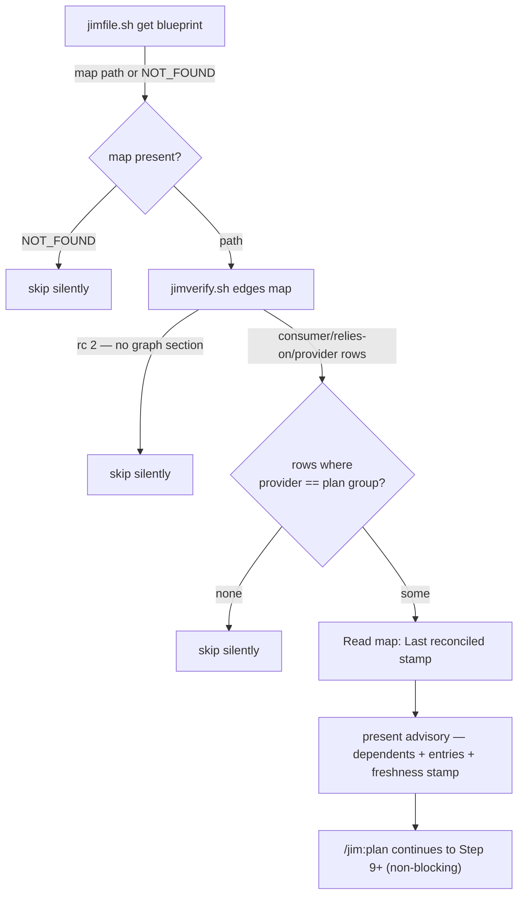

# Plan-time blast-radius advisory — Plan

## Overview

Add a mechanical, non-blocking advisor step to `skills/plan/SKILL.md` that, once
a plan is drafted, reads the persisted cross-group contract graph via the
already-tested `jimverify.sh edges` parser and names every group depending on
the plan's group. Prose-only change to one skill file; no new scripts, no LLM
judgment, one narrowly-scoped tool grant.

## Design Decisions

### 1. Mechanical dependent lookup — no impact judgment

- **Chosen:** The advisor names the plan group's declared dependents *exactly*,
  read deterministically from the persisted contract graph; it makes no LLM
  judgment about whether the drafted plan touches a specific entry.
- **Why:** The dependent set is a pure graph fact — a mechanical read is exact
  (no false positives), cheaper (no reasoning pass), and honest (no prediction
  to hedge). The developer, who knows their plan, judges relevance. Matches the
  origin brainstorm's framing ("touch the boundary → flag every dependent").
- **Rejected:** LLM-judged filtering to the entries the plan touches — added
  cost + false confidence for the marginal benefit of suppressing the reminder
  on internal-only plans. This choice drove the AC #1/#5 amendment (spec now
  approved with the mechanical framing).

### 2. Reuse `jimverify.sh edges` under a verb-scoped grant

- **Chosen:** Call the existing, unit-tested `jimverify.sh edges <map>` parser;
  grant it in `/jim:plan`'s `allowed-tools` scoped to the `edges` verb:
  `Bash(bash ${CLAUDE_PLUGIN_ROOT}/skills/verify/scripts/jimverify.sh edges *)`.
- **Why:** Reuses tested deterministic parsing (consumer/relies-on/provider
  records, cell-sanitized, `rc 2` when no `## Contract Graph` section) per the
  Bash-vs-Prompt rule; the verb-scoped grant is least-privilege — it exposes
  only the read-only `edges` verb, not the other seven — resolving security
  Finding 1 and honoring the spec 012 narrowing doctrine / issue #52.
- **Rejected:** (a) `Read` + LLM-parse the table — loses the tested parse and
  the `rc 2` short-circuit, re-implements deterministic string work in prose;
  (b) broad script-level `jimverify.sh *` grant — over-privileges `/jim:plan`
  with seven unused verbs.

### 3. Placement: Step 8a (jim's sub-letter idiom), no renumbering

- **Chosen:** Insert a new sub-lettered **Step 8a** immediately after the
  Step-8 self-check — before the security offer (9), candidate batch (10), and
  present (11).
- **Why:** Places the advisory after the plan is validated and the group is
  known, and before the developer approves — satisfying the mirror-the-033
  intent and Insight 1's "before the candidate batch" note. jim's established
  sub-letter idiom (Steps 6a/7a in `issue`, 4a in `blueprint`, 5.2 in `build`)
  avoids renumbering the 9/10/11 steps and the "Step N" cross-references they
  carry (in-skill and in `ARCHITECTURE.md`).
- **Rejected:** a new numbered Step 9 with renumbering — churn + risk of stale
  cross-references; folding into Present (Step 11) — lands after the candidate
  batch and buries a distinct concern.

### 4. Freshness stamp via `Read`; untrusted-display discipline

- **Chosen:** `Read` the map's `## Contract Graph` header for the
  `Last reconciled:` value to render `graph as of <ts>`; render each
  `relies-on` cell verbatim as untrusted display text, minimal surface, never
  interpreted as an instruction.
- **Why:** AC #5 requires the freshness stamp; AC #6 + security Finding 2
  require untrusted-content discipline. `edges` already sanitizes cells and the
  relied-on entry is short by the 034 face convention, so minimal-surface holds
  without a redaction placeholder (nothing is persisted, so 034 AC #12's
  persist-time redaction does not apply).
- **Rejected:** extending `edges` to emit the stamp — needless script change;
  echoing broader face prose — widens the surfaced surface.

## Constitution Check

**ARCHITECTURE.md status:** Present — constraints noted below.

| Constraint from ARCHITECTURE.md | Honored? | Notes |
| :--- | :--- | :--- |
| SKILL.md stays under 500 lines (progressive disclosure) | Yes | `plan/SKILL.md` is 230 lines; +~25 for Step 8a → well under budget, no `references/` restructure. |
| Permission Conventions — exact script paths, never `Bash(bash *)` | Yes | New clause names the exact script path and scopes to the `edges` verb — *tighter* than the documented uniform script-level pattern; a deliberate least-privilege choice consistent with the convention's intent + spec 012 (see Open Questions on prefix-match confirmation). |
| Bash-vs-Prompt Decision Rule | Yes | Deterministic graph parse stays in `jimverify.sh`; only advisory framing/rendering is prose. |
| Non-blocking gate doctrine ("informational, never a veto") | Yes | Step 8a writes nothing, gates nothing, never blocks approval. |
| Gate Presentation rule (spec 040) | N/A | Step 8a is informational, not a hard approval gate — it chains no `AskUserQuestion` and requests no approval, so the define-once gate-presentation rule does not bind. |
| Derived-graph single-source (spec 034 owns derivation) | Yes | Advisor only *reads* the persisted graph; never writes/re-derives/reconciles (AC #4). |
| Logic-Flow / Substitution Conventions | Yes | `SET map_doc = !`…get blueprint`` sentinel for the stable map resolve; fenced bash block for the runtime `edges <map>` call; `<lower>` placeholders in fenced blocks. |

## File Manifest

| Component | File Path | Action | Notes |
| :--- | :--- | :--- | :--- |
| Plan skill | `skills/plan/SKILL.md` | Update | Add verb-scoped `jimverify.sh edges` clause to `allowed-tools`; insert Step 8a advisor; add one Validation-Checklist item. |

*No new scripts and no new test files: the advisory is checklist-validated skill
prose, and its one deterministic dependency (`jimverify.sh edges`) is already
covered by `tests/jimverify.sh:654-731`.*

## Interface Contracts

*Consumed (existing — not created by this plan):*

```
# jimverify.sh edges <map-path>
#   stdout: TAB-separated rows, one per contract-graph edge:
#     <consumer>\t<relies-on entry>\t<provider>
#   exit 0: rows emitted (or zero rows)
#   exit 2: no `## Contract Graph` section in the map (the silent-skip signal)
#   (consumer/provider cells slug-gated; all cells tab/newline-stripped, length-capped)

# jimfile.sh get blueprint
#   stdout: the resolved BLUEPRINT.md path, or the literal `NOT_FOUND` if absent
```

*Produced — the advisory presentation shape (plain conversational text):*

```
Blast-radius advisory — planning in group `<group>`, which others depend on

  Dependent groups (from the contract graph):
    · <consumer> — relies on: <relies-on entry>
    ...

  graph as of <Last reconciled> · advisory only, does not block approval.
  Review whether this plan affects these entries before approving.
```

## Data Flow



## Task Breakdown

1. [x] Extend `skills/plan/SKILL.md` `allowed-tools` (frontmatter, line 11) with
   the verb-scoped grant `Bash(bash ${CLAUDE_PLUGIN_ROOT}/skills/verify/scripts/jimverify.sh edges *)`,
   placed alongside the existing `Bash(...)` clauses.
   **Verify:** `grep -qF 'skills/verify/scripts/jimverify.sh edges *' skills/plan/SKILL.md`

2. [x] Insert a new `### 8a. Cross-group blast-radius advisory` step between the
   Step-8 self-check and the Step-9 security offer, implementing: `SET map_doc = !`…jimfile.sh get blueprint``
   with an `IF map_doc != "NOT_FOUND"` gate; run `jimverify.sh edges <map>` in a
   fenced block; treat `rc 2` as "no graph → skip silently"; keep only rows whose
   **provider** column equals the plan's group; skip silently when none remain
   (covers AC #1 firing, AC #3 short-circuits, AC #4 read-only graph consumption).
   **Verify:** `grep -qF '### 8a. Cross-group blast-radius advisory' skills/plan/SKILL.md && grep -qF 'jimverify.sh edges' skills/plan/SKILL.md && grep -qF 'get blueprint' skills/plan/SKILL.md`

3. [x] Within Step 8a, add the presentation: `Read` the map's `## Contract Graph`
   header for the `Last reconciled:` stamp; render the surviving rows in the
   advisory shape (dependents + `relies-on` entry + `graph as of <stamp>`); state
   it is advisory-only and files no issue; add the untrusted-display discipline
   for the `relies-on` cell (covers AC #5 freshness/exact-naming, AC #6 trust
   boundary, AC #2 non-blocking). Depends on task 2.
   **Verify:** `grep -qF 'graph as of' skills/plan/SKILL.md && grep -qiF 'advisory only' skills/plan/SKILL.md && grep -qiF 'untrusted' skills/plan/SKILL.md`

4. [x] Add one item to the plan skill's closing `## Validation Checklist`:
   the blast-radius advisory was presented, or silently skipped when there is no
   map / fewer than two groups / no edge naming this group as a provider.
   **Verify:** `grep -qiF 'blast-radius advisory' skills/plan/SKILL.md`

5. [x] Regression: confirm the reused parser and the full deterministic suite
   still pass (nothing new to test; this guards against an incidental break).
   **Verify:** `bash skills/meta-test/scripts/run.sh jimverify && bash skills/meta-test/scripts/run.sh`

## Requirements Coverage Summary

| Spec Acceptance Criterion | Addressed In Task(s) |
| :--- | :--- |
| AC #1 — present advisory naming dependents + entries when group is a provider | 1, 2 |
| AC #2 — non-blocking; changes/gates/edits nothing | 3 |
| AC #3 — silent short-circuit (no map / <2 groups / no provider edge) | 2 |
| AC #4 — never re-derives/writes graph; reads edges mechanically; coverage inherits graph's | 2 |
| AC #5 — names dependents exactly; carries `graph as of <Last reconciled>` stamp; declaration-level; no block | 3 |
| AC #6 — trust boundary; directive content never binds; untrusted-content display | 3 |

## Out of Scope

- **A new test file / helper.** The advisory is checklist-validated prose; its
  one deterministic dependency (`jimverify.sh edges`) is already tested. Adding
  a `tests/` file here would test nothing new.
- **Renumbering Steps 9–11.** Avoided by the Step-8a sub-letter (DD #3).
- **Reading the group's `000-blueprint` provides face.** The `edges` output
  already carries the relied-on entry per provider; the face is not consulted
  (the mechanical design needs only the graph).
- **`ARCHITECTURE.md` refresh.** Pipeline-owned — the `/jim:build` completion
  gate runs `/jim:arch`; not a task here and not a deferral.

## Open Questions

- [ ] Verb-scoped permission prefix-matching [NEEDS CLARIFICATION at build]:
  jim's documented `allowed-tools` convention is script-level
  (`<script> *`); this plan scopes one grant to the `edges` verb
  (`<script> edges *`). Claude Code's Bash matcher is prefix+glob, so it should
  honor the longer prefix — but if it does not, the effect is a per-call
  permission prompt (friction, **not** a security hole). Confirm at build; fall
  back to the script-level grant only if the verb-scoped prefix fails to match.
- [x] ~How is the graph read, and does the advisor judge plan impact?~ →
  Mechanically via `jimverify.sh edges`; no judgment (spec-amended, C-mechanical).
- [x] ~Where does the advisory sit in `/jim:plan`?~ → Step 8a, after self-check,
  before the candidate batch (DD #3).
