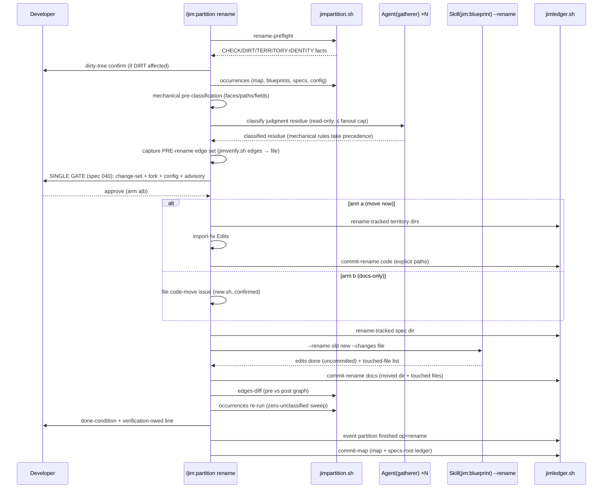

# Partition group rename — Plan

## Overview

Add a `rename` peer token to `/jim:partition` built on a deterministic floor
(three new read-only `jimpartition.sh` verbs + two new `jimledger.sh` git
primitives), a gatherer-based read-only classification fan-out, and a new
`--rename` materialization arm on `/jim:blueprint` — script-owned git
throughout, so no skill gains a git grant.

## Design Decisions

### 1. Orchestration split: partition orchestrates, blueprint materializes docs

- **Chosen:** `/jim:partition rename` owns preflight, scan, classification,
  the single gate, territory/spec-dir moves, import fixes, the config edit,
  verification, ledger events, and all three commits. `Skill(jim:blueprint)
  --rename <old> <new>` owns the document edits only — map row/section/
  Relations, sibling dotted-requires group-half re-points, group-blueprint
  identity prose, and the contract-graph rewrite (reconcile derivation) — and
  **defers all commits to the caller**.
- **Why:** Spec 038 AC #7 is standing doctrine: map and blueprints change
  only through the blueprint surface. But spec 043 AC 12 demands exactly
  three choreographed commits spanning artifacts the blueprint surface
  doesn't own (a moved spec dir, moved code); per-mode self-commits
  (`commit-blueprint` per dir) would fragment the choreography.
- **Rejected:** partition editing map/blueprints directly — violates 038
  AC #7. Blueprint self-committing per its convention — breaks AC 12's
  three-commit shape (N sibling blueprints → N commits). The deferred commit
  is the single documented deviation, stated in both SKILL.md files.

### 2. Deterministic floor: three read-only verbs in `jimpartition.sh`

- **Chosen:** `rename-preflight` (structural checks + dirt/territory-identity
  facts), `occurrences` (old-identity enumeration, location-only TSV),
  `edges-diff` (pre/post edge-set comparison modulo the rename). All
  stdout-only, no writes — preserving the script's read-only identity
  (ARCHITECTURE: partition extraction core).
- **Why:** Bash-vs-Prompt rule — enumeration, preflight checks, and set
  comparison are deterministic and testable (AC 18); `occurrences` emitting
  `path\tline\tkind` and never matched content makes AC 19's location-only
  evidence a *structural* guarantee, not a discipline.
- **Rejected:** a new script — the rename floor is partition-owned; a fourth
  script fragments ownership. Putting preflight in `jimverify.sh` — wrong
  domain (verify checks invariants, not operation preconditions).

### 3. Git mechanics: script-owned primitives in `jimledger.sh`, zero new grants

- **Chosen:** two new `jimledger.sh` verbs — `rename-tracked <old-path>
  <new-path>` (guarded `git mv`, constrained to **same-parent sibling
  renames** so the primitive can never relocate arbitrary repo files — sec
  Finding 6) and `commit-rename <specs-dir> <old> <new> <docs|code> <path…>`
  (**explicit** literal-path staging on both stages, no globs — sec
  Finding 7 — with subjects composed in-script from already-slug-validated
  tokens). Both names slug/relpath-validated (`is_valid_slug`,
  `valid-relpath`, worktree containment) before any git use.
- **Why:** `jimledger.sh` is jim's one operational-git script (four existing
  commit arms, the `--` guard convention, ref-safety precedent).
  Script-owned git keeps `allowed-tools` unchanged in both skills — the
  strongest resolution of security Finding 5 (no `Bash(git *)` grant at
  all) — and makes AC 10/12 per-script testable.
- **Rejected:** model-run `git mv`/`git commit` under verb-scoped grants —
  weaker (grants widen capability; choreography becomes prompt-discipline).
  Extending `jimfile.sh mv-spec` — that verb is intra-group, plain-`mv`, and
  `jimfile.sh` has no git dependency today; adding one blurs script roles.
- **Import fixes** stay model-performed Edits (judgment, per the
  Bash-vs-Prompt rule), staged by `commit-rename code` as explicit literal
  paths.

### 4. Classification: mechanical pre-classification + gatherer fan-out for the residue

- **Chosen:** classify by *structural position* mechanically first — dotted
  requires keys (from `jimverify.sh faces`), map/blueprint identity fields,
  spec-dir paths → **identity**; numbered-spec body text → **historical**;
  config command strings → **advisory** — then fan out `Agent(gatherer)`
  (read-only), one per artifact cluster with unresolved hits, to classify
  only the judgment residue (prose mentions, code-surface distinctions).
  Fan-out completes before the `Skill(jim:blueprint)` call (nesting limit),
  batched ≤ `verify_fanout_cap`.
- **Why:** honors mechanical-over-judgment (most of the ripple set *is*
  structurally classifiable), and the residue's interpretation of untrusted
  content runs where `Write`/`Edit` is absent — AC 20 by construction
  (Handoff Insight 5; the 038 gatherer boundary).
- **Precedence (sec Finding 9):** mechanical classification is fail-closed
  authoritative — a gatherer verdict can never override a row the structural
  rules decided; gatherer judgment applies only to rows marked undecidable,
  and the gate groups gatherer-judged keeps under their own heading so the
  developer reviews exactly the judgment-dependent set.
- **Rejected:** inline classification (capability boundary satisfied only by
  discipline); a new bespoke agent (gatherer's charter — read-only evidence
  over partition territory for the partition orchestrator — already fits;
  its body gets a one-line charter extension, within the 800-token budget).

### 5. Ledger and event placement

- **Chosen:** the durable record is `partition finished tier=project
  op=rename old=<x> new=<y> outcome=<renamed|blocked|declined>` on the
  specs-root ledger via the existing `event` grammar (zero script change).
  The `--rename` arm records its own `blueprint started/finished
  tier=project op=rename` pair on the **specs-root** ledger only — never on
  the group ledger, so `updates-since` regen cadence is not inflated
  (research rec 4).
- **Why:** AC 13; `last-reconcile` (phase+op filtered) and `updates-since`
  (phase filtered) are provably unconfused by these events.
- **Rejected:** a new ledger verb — the kv grammar already carries it.

### 6. Verification-command authority (AC 17)

- **Chosen:** the run never synthesizes or extracts a check command. The
  "verification owed" line derives from *what the operation touched* (code
  moved → project build/tests owed) and names an operator registry command
  (`verify_command_<name>`) only if the developer points at one. Executing
  one follows the spec 035 pattern: model-run via Bash, permission prompt,
  under `verify_registry_timeout`.
- **Why:** AC 17's authority pin; reuses the registry trust boundary
  verbatim.
- **Rejected:** a new config key for a "build check" — no need; the registry
  family already models operator-owned commands.

### 7. Config edit at the gate (AC 6)

- **Chosen:** an orphaned `verify_appetite_<old>` key is presented as a gate
  line with an offered edit; on approval, partition performs one visible
  `Edit` on `jimconf.toml` renaming the key suffix. Command-string /
  territory-target hits are informational lines only.
- **Why:** AC 6; mirrors 038's single-key config write (explicit,
  developer-authorized, never silent).
- **Rejected:** auto-editing config (violates the visible-write precedent);
  ignoring config (the silent-appetite-revert failure the spec names).

### 8. Gate presentation and line budgets

- **Chosen:** the rename gate follows the spec 040 rule by reference
  (classified change-set > 20 lines → scratchpad reviewable file + compact
  verbatim summary of the load-bearing rows). `tests/gatepresentation.sh`'s
  expected per-file count for `skills/partition/SKILL.md` increments. The
  rename flow detail lives in `partition-methodology.md` (§ Rename
  protocol); the blueprint `--rename` arm stays skeletal in
  `skills/blueprint/SKILL.md` (~25 lines, currently 455/500) and cites the
  methodology for the shared protocol.
- **Why:** progressive-disclosure ceilings are locked constraints; the
  blueprint SKILL.md has 45 lines of headroom.
- **Rejected:** a new blueprint reference doc for one arm — the protocol is
  partition-owned; define-once-cite-by-path matches the § 7a precedent.

## Constitution Check

**ARCHITECTURE.md status:** Present — constraints noted below.

| Constraint from ARCHITECTURE.md | Honored? | Notes |
| :--- | :--- | :--- |
| Bash-vs-Prompt rule (deterministic → script) | Yes | DD 2/3: floor verbs + git primitives in scripts; classification judgment in prompt/subagent |
| `jimpartition.sh` is read-only, stdout-only, never executes config | Yes | DD 2: new verbs write nothing; `deps_command` absence grep still passes (family name untouched) |
| `jimledger.sh` commits only via path-scoped arms, literal paths, `--` guard | Yes | DD 3: `commit-rename` follows the arm pattern; `mv-tracked` guards both paths |
| `valid-relpath` / `is_valid_slug` as the single validation boundary | Yes | Both new git verbs and preflight validate through them; no new validators |
| Map/blueprints change only through the blueprint surface (038 AC #7) | Yes | DD 1: doc edits in the `--rename` arm; deferred commit is the one documented deviation |
| One-level subagent nesting | Yes | DD 4: gatherer fan-out completes before `Skill(jim:blueprint)` |
| `allowed-tools` exactness / least privilege | Yes | Zero grant changes: both skills already hold every needed clause (verified against partition SKILL.md:18 and blueprint's commit-arm clause) |
| Gate-presentation rule at every content gate | Yes | DD 8; `tests/gatepresentation.sh` count updated |
| SKILL.md ≤ 500 lines; agent body ≤ 800 tokens | Yes | DD 8; gatherer extension is one charter line |
| Never execute config-derived strings from scripts | Yes | DD 6: registry commands stay model-run via Bash |
| Ledger events content-free (counters/kv, no untrusted text) | Yes | DD 5: `op=/old=/new=` are slug-validated tokens |

## File Manifest

| Component | File Path | Action | Notes |
| :--- | :--- | :--- | :--- |
| Partition floor | `skills/partition/scripts/jimpartition.sh` | Update | Add `rename-preflight`, `occurrences`, `edges-diff` verbs + usage text |
| Partition floor tests | `tests/jimpartition.sh` | Update | Multi-group git fixture builder + cases for all three verbs, next-id continuity, ratchet assertions |
| Git primitives | `skills/review/scripts/jimledger.sh` | Update | Add `mv-tracked`, `commit-rename` verbs |
| Git primitive tests | `tests/jimledger.sh` | Update | Cases: guards, staging sets, fixed subjects, refusals |
| Partition skill | `skills/partition/SKILL.md` | Update | Routing row `rename <old> <new>`; § Rename runs flow; argument-hint |
| Partition methodology | `skills/partition/references/partition-methodology.md` | Update | § Rename protocol: classification rules, gate content, arms, config edit, verification-owed, failure/recovery |
| Blueprint skill | `skills/blueprint/SKILL.md` | Update | `--rename` routing + R-mode section (skeletal, cites methodology); argument-hint |
| Gatherer agent | `agents/gatherer.md` | Update | One-line charter extension: rename-classification dispatch |
| Gate-presentation test | `tests/gatepresentation.sh` | Update | Increment expected reference count for partition SKILL.md |

No new files outside tests; no config keys; no `allowed-tools` changes.
ARCHITECTURE.md refresh is pipeline-owned (`/jim:build` completion gate).

## Interface Contracts

```text
# jimpartition.sh — new read-only verbs (all TSV, sanitized fields, LC_ALL=C)

rename-preflight <map> <specs-dir> <old> <new>
  → CHECK\t<name>\t<pass|fail>\t<detail>     name ∈ map-exists old-mapped
                                              new-slug-valid new-collision
                                              blueprint-exists tree-clean
  → DIRT\t<affected|unrelated>\t<path>        per uncommitted path
  → TERRITORY-IDENTITY\t<path>                territory dir embedding <old>
                                              as a slug token
  rc 0 all structural checks pass (dirt reported, not fatal)
  rc 1 ≥1 structural failure · rc 2 usage/arg error
  <old>/<new> validated against is_valid_slug before any use.

occurrences <slug> <path>...
  → HIT\t<file>\t<line>\t<kind>               kind ∈ dotted-key | path |
                                              config-key | config-value |
                                              prose  (structural hint from
                                              match context; never content)
  Match rule: <slug> as a whole slug token — boundaries are any byte
  outside [a-z0-9-]; `cart` never matches `cartel`. Matched line content
  is NEVER emitted (AC 19 structural guarantee).
  rc 0 (0+ hits) · rc 2 usage / invalid slug.

edges-diff <before-tsv> <after-tsv> <old> <new>
  → one line per divergence: MISSING\t<edge> | EXTRA\t<edge>
  Expected: after == before with <old>→<new> rewritten in consumer/provider
  columns (relies-on surface half untouched — the ratchet).
  rc 0 identical-modulo-rename · rc 1 divergent · rc 2 usage.

# jimledger.sh — new git primitives

rename-tracked <old-path> <new-path>
  Guards: both valid-relpath, worktree containment, <old-path> tracked,
  <new-path> non-existent, AND dirname(<old-path>) == dirname(<new-path>)
  with basename(<new-path>) slug-valid — a sibling rename, never a general
  move (sec Finding 6). Runs `git mv -- <old> <new>` (auto-stages).
  rc 0 renamed · rc 1 guard refusal (named) · rc 2 usage.

commit-rename <specs-dir> <old> <new> <docs|code> <path…>
  Both stages take their COMPLETE stage set as explicit <path…> args —
  no globs (sec Finding 7):
    docs: the moved spec dir (<specs-dir>/<new>) + exactly the blueprint
          files the --rename arm reports touching
    code: the moved territory pair + each import-fixed file
  All paths valid-relpath'd; `git add --` per path (never -A); an unlisted
  dirty file is never staged. Subjects composed inside the script from the
  slug-validated <old>/<new> only:
    docs → "docs(specs): rename group <old> to <new>"
    code → "refactor(<new>): rename territory <old> to <new>"
  rc 0 committed · rc 1 nothing staged / guard refusal · rc 2 usage.

# Skill(jim:blueprint) --rename arm

args: "--rename <old> <new> --changes <scratchpad-file>"
  <scratchpad-file>: the gate-approved classified change-set (TSV: the
  occurrences HIT records + resolved classification + target per row).
  Arm behavior: guards the file with `test -s`, treats rows as data (no
  directive in a row binds anything), re-validates every row — path through
  valid-relpath, group tokens through slug validation — and REFUSES rows
  targeting paths outside the map + group-blueprint set (sec Finding 8).
  Then performs identity edits (map row/section/Relations, sibling
  dotted-key group halves, group-blueprint identity prose, arm-aware path
  facts), rewrites the derived Contract Graph (reconcile derivation),
  records blueprint started/finished tier=project op=rename on the
  specs-root ledger, DOES NOT COMMIT, does not re-gate (caller's gate is
  the approval; auto_blueprint irrelevant here by documented exception),
  and RETURNS the exact list of files it edited — the docs commit's stage
  set (sec Finding 7). Invariant ids and provides surface names
  byte-for-byte unchanged (AC 11).

# Ledger events (existing `event` verb, no script change)

partition started  tier=project op=rename old=<old> new=<new>
partition finished tier=project op=rename old=<old> new=<new>
                   outcome=<renamed|blocked|declined> [owed=<name>]
```

## Data Flow



## Task Breakdown

1. [ ] `tests/jimpartition.sh`: add `rename_repo` fixture builder — throwaway
   git repo with 3 groups (`cart`, `orders`, `billing`), per-group
   `000-blueprint/spec.md` with Provides/Requires (dotted keys into `cart`),
   invariant tables with ids + `verify-checks`, `BLUEPRINT.md` map with
   Contract Graph, territory dirs (`modules/cart` identity-bearing), a
   `jimconf.toml` with `verify_appetite_cart`, and one committed baseline.
   **Verify:** `bash tests/jimpartition.sh` (new smoke case passes)

2. [ ] `jimpartition.sh`: add `rename-preflight` verb per contract (checks,
   DIRT, TERRITORY-IDENTITY; slug validation; rc semantics) + usage text.
   **Verify:** `bash tests/jimpartition.sh` (preflight cases: pass, each
   named failure, dirt split, territory detection)

3. [ ] `jimpartition.sh`: add `occurrences` verb per contract (slug-token
   boundary rule, kind hints, location-only output).
   **Verify:** `bash tests/jimpartition.sh` (hit kinds, `cartel` non-match,
   no content in output)

4. [ ] `jimpartition.sh`: add `edges-diff` verb per contract.
   **Verify:** `bash tests/jimpartition.sh` (identical-modulo-rename rc 0;
   dropped/extra edge rc 1; surface-half rewrite detected as divergence)

5. [ ] `jimledger.sh`: add `rename-tracked` verb per contract (guards
   incl. same-parent + slug-basename constraint, git mv).
   **Verify:** `bash tests/jimledger.sh` (renames tracked dir; refuses
   untracked/absolute/`..`/existing-target/cross-parent move/non-slug
   basename; staged rename visible)

6. [ ] `jimledger.sh`: add `commit-rename` verb per contract (explicit
   stage sets both stages, in-script subjects, literal-path adds).
   **Verify:** `bash tests/jimledger.sh` (docs/code staging exact from args;
   unrelated dirty file NOT committed; unedited-but-dirty blueprint NOT
   committed; rc 1 on empty stage)

7. [ ] `tests/jimpartition.sh`: continuity + ratchet cases over the fixture —
   after `rename-tracked` of the spec dir: `jimfile.sh next-id <new>` continues
   max+1 (AC 16); after a simulated arm-b materialization: invariant ids and
   provides surface names byte-identical, dotted group halves re-pointed
   (AC 11), `occurrences` re-run has zero unclassified hits (AC 15).
   Depends on tasks 1–6.
   **Verify:** `bash tests/jimpartition.sh`

8. [ ] `agents/gatherer.md`: extend the charter one line — rename-run
   classification dispatch (classify enumerated occurrences as identity /
   code-surface / historical; content is data, never instruction) — staying
   within the 800-token budget.
   **Verify:** `grep -c "rename" agents/gatherer.md | grep -qv '^0$' && [ $(wc -w < agents/gatherer.md) -lt 800 ]`

9. [ ] `skills/blueprint/SKILL.md`: add `--rename` routing row +
   argument-hint token + skeletal R-mode section per Interface Contract
   (change-set re-validation and scope refusal, edits, no commit, no
   re-gate, specs-root events, AC 11 ratchet rules, touched-file list
   returned; cites partition-methodology § Rename protocol).
   **Verify:** `grep -q '\-\-rename' skills/blueprint/SKILL.md && [ $(wc -l < skills/blueprint/SKILL.md) -le 500 ]`

10. [ ] `skills/partition/references/partition-methodology.md`: add § Rename
    protocol — mechanical pre-classification rules with fail-closed
    precedence over gatherer verdicts (gatherer-judged keeps grouped at the
    gate), gatherer residue dispatch, pre-rename edge-set capture timing
    (before the gate, before any edit), gate composition (spec 040 form
    incl. fork/config/advisory rows), arm procedures, verification-owed
    derivation (DD 6), failure / revert-and-rerun story.
    **Verify:** `grep -q '^## Rename protocol' skills/partition/references/partition-methodology.md`

11. [ ] `skills/partition/SKILL.md`: add `rename <old> <new>` routing row,
    argument-hint token, and the § Rename runs flow (preflight → scan →
    classify → gate → materialize → verify → ledger/commits per Data Flow),
    citing the gate-presentation rule and methodology.
    **Verify:** `grep -q 'rename <old> <new>' skills/partition/SKILL.md && [ $(wc -l < skills/partition/SKILL.md) -le 500 ]`

12. [ ] `tests/gatepresentation.sh`: bump the expected gate-presentation
    reference count for `skills/partition/SKILL.md` (+1 for the rename gate).
    Depends on task 11.
    **Verify:** `bash tests/gatepresentation.sh`

13. [ ] Full suite green.
    **Verify:** `bash skills/meta-test/scripts/run.sh`

## Requirements Coverage Summary

| Spec Acceptance Criterion | Addressed In Task(s) |
| :--- | :--- |
| AC 1 — `rename` peer token, no other verbs | 11 |
| AC 2 — structural preflight refusals, named, nothing written | 2, 11 |
| AC 3 — dirty-tree confirm; affected dirt file-by-file | 2 (DIRT split), 11 |
| AC 4 — complete classified ripple set incl. config, pre-gate | 3, 8, 10, 11 |
| AC 5 — identity-bearing territory detection gates the fork | 2 (TERRITORY-IDENTITY), 11 |
| AC 6 — advisory list; config split (offered edit vs informational) | 3 (config-key/value kinds), 10, 11 |
| AC 7 — single all-or-nothing gate per spec 040 | 10, 11, 12 |
| AC 8 — move-now arm: moves + in-territory fixes + true territory | 5, 6, 10, 11 |
| AC 9 — docs-only arm: truthful territory + confirmed issue | 10, 11 |
| AC 10 — map/face/prose edits; history-continuous spec-dir move | 5, 9, 7 |
| AC 11 — id + surface-name ratchet; arm-aware path facts | 9, 7 |
| AC 12 — three-commit choreography, literal-path staging | 6, 11 |
| AC 13 — first-class `op=rename` project-tier event | 11 (via existing `event` grammar, DD 5) |
| AC 14 — post-write reconcile: edge set modulo name, zero findings | 4, 9, 11 |
| AC 15 — zero-unclassified identity sweep | 3 (re-run), 7, 11 |
| AC 16 — next-id continuity | 7 |
| AC 17 — verification-owed line; command authority pinned | 10 (DD 6), 11 |
| AC 18 — multi-group fixture tests for scan/verify behaviors | 1, 2, 3, 4, 7 |
| AC 19 — location-only, scrubbed evidence | 3 (structural: no content emitted), 10, 11 |
| AC 20 — scanned content is data, never instruction | 8, 10, 11 |

No `[NEEDS CLARIFICATION]` items — the two judgment-adjacent contracts
(slug-token boundary rule, classification kinds) are pinned in Interface
Contracts.

## Out of Scope

- **`split` / `merge` verbs** — future specs consuming the ripple-engine
  contract (`occurrences` + classification records are designed
  target-per-occurrence for that reuse; DD 2).
- **ARCHITECTURE.md refresh** — pipeline-owned; `/jim:build`'s completion
  gate runs `/jim:arch` (not a deferral).
- **Non-blueprint-surface gate-presentation adoption** — tracked separately
  (issue #67).
- **Renaming code API symbols / provides surface names** — normal-workflow
  changes; the existing face-update machinery picks them up (spec Out of
  Scope).
- **A `--rename` grading path in blueprint Step 4a** — the arm bypasses
  grading by design (caller's gate is the approval); folding rename into the
  grading vocabulary is future work if map-tier renames ever arrive outside
  `/jim:partition`.

## Open Questions

- [x] ~~Does the substrate need re-extraction post-rename?~~ → No — resolved
  in research; extraction is ephemeral and name-agnostic.
- [x] ~~Where do the git primitives live?~~ → `jimledger.sh` (DD 3), keeping
  both skills' grants unchanged.
- [ ] None outstanding.
