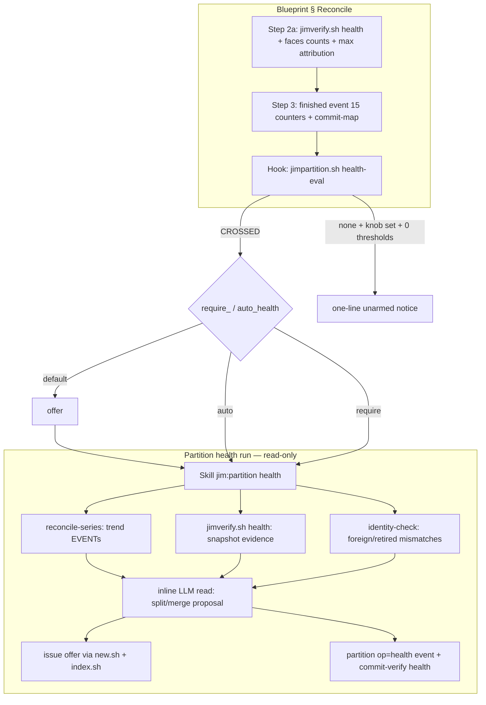

# Partition-health sensors — Plan

## Overview

Two new deterministic script verbs supply the trend facts (`jimledger.sh
reconcile-series`) and threshold/mismatch evaluation (`jimpartition.sh
health-eval` / `identity-check`); the judgment surface is a new `health` mode
on `/jim:partition`, and the reconcile hook is a ~12-line post-close step in
`/jim:blueprint` funded by extracting U2a's regen-cadence detail to the
methodology doc (the 500/500 line cap).

## Design Decisions

### 1. Hook position — after reconcile close (Step 3), not inside it

- **Chosen:** The threshold evaluation runs after § Reconcile Step 3 has
  recorded the `blueprint finished op=reconcile` event and committed via
  `commit-map`. `require_health` holds the run's *completion presentation*
  (its terminal stop), mirroring how `require_blueprint` holds the terminal
  review (`skills/review/SKILL.md:221`).
- **Why:** The just-recorded event is then part of the series the sensor
  reads — no special-casing "fresh counters not yet on the ledger" — and the
  reconcile's own commit choreography stays byte-identical (spec AC: 
  "reconcile behavior otherwise unchanged" analog, 039 AC #10 precedent).
- **Rejected:** Hook inside Step 2a — interleaves health ledger events with
  the reconcile's own started/finished pair and stalls the map commit behind
  a human prompt.

### 2. Script split — series in jimledger, evaluation in jimpartition

- **Chosen:** `jimledger.sh reconcile-series <specs-dir>` extracts the
  whitelisted event series (generalizing `last-reconcile`'s parse,
  `jimledger.sh:608-644`). `jimpartition.sh health-eval <specs-dir>`
  composes it via a `BASH_SOURCE`-relative path (the `jimfile.sh` →
  `jimconf.sh` pattern), resolves the five threshold keys via `jimconf.sh
  get`, and emits `CROSSED` / `THRESHOLDS` / `INVALID` facts.
- **Why:** jimledger owns event parsing and its injection-proof whitelist;
  the threshold predicates are partition-health domain logic and belong to
  the sensor's own script. Scripts reading config via `jimconf.sh get` is
  established (the issue scripts resolve `issues_path` the same way);
  reading numeric knobs is not the never-execute-config boundary — nothing
  config-derived is executed, only integer-compared.
- **Rejected:** Everything in jimledger — puts domain predicates in the
  review-owned script. Skill-side `IF` chains per threshold (the U2a shape)
  — five knobs × SET/IF lines in a file with zero headroom.

### 3. Threshold keys and predicates

- **Chosen:** Five bare-name integer keys, default `"0"` (disabled), junk →
  disabled + `INVALID` record (spec 032 semantics): `health_threshold_cycles`,
  `health_threshold_fanin`, `health_threshold_uncovered`,
  `health_threshold_faces_max` — predicate: the *latest* event's value ≥
  threshold (`na` never crosses) — and `health_threshold_breaking_runs` —
  predicate: the trailing consecutive events with `breaking>0` number ≥
  threshold (the "recurring findings" arming signal).
- **Why:** Latest-value predicates are explainable in one clause and match
  the counters' semantics; breaking needs a run-length form or a single
  noisy reconcile would arm the gate. Resolution rides a new `health_*`
  prefix arm in `jimconf.sh resolve()` (`:167`).
- **Rejected:** Delta/slope predicates ("rising over N") — the LLM trend
  read covers shape judgment; mechanical arming stays simple. A single
  combined threshold — per-signal keys were fixed at spec time (AC #6).

### 4. Face-size counters + attribution — `faces=`, `faces_max=`, `faces_max_group=`, `fanin_group=`

- **Chosen:** Reconcile Step 2a counts `provides` rows from `jimverify.sh
  faces <group-blueprint>` per blueprint-bearing group; the finished event
  carries `faces=` (sum) and `faces_max=` (max) as int-only counters, plus
  two **slug-validated attribution keys**: `faces_max_group=` and — for
  spec 039's `fanin=` — `fanin_group=`, each the sorted comma-joined group
  slug(s) holding that maximum, so a trend's identity survives history (a
  rising `faces_max` reads as one group fattening vs a lead change). The
  whitelist in `cmd_last_reconcile` (`jimledger.sh:615`) and the new
  `reconcile-series` share one 15-key list; attribution values are
  shape-validated on extraction (each element a valid slug, total ≤ 256
  bytes — the spec 043 `old=`/`new=` bounded-value precedent, 028
  Finding-1 pattern), emitted only when the metric > 0, and consumed as
  display data only — never by the threshold predicates. Events predating
  this change simply lack the keys; the face-growth signal then reports
  insufficient history (spec AC #9), never fabricated zeros.
- **Why:** Fixed-key contract forbids per-group dynamic keys (spec Insight
  1); sum + max mirrors `fanin=`'s concentration encoding, and the
  attribution keys fix both counters' anonymity at the root (user
  decision, 2026-07-12).
- **Rejected:** int-or-na — there is no not-computable state: when the
  reconcile runs, blueprints exist and counting is total. Anonymous
  aggregates with snapshot-time attribution — lossy across history (lead
  changes invisible). Backfilling old events — spec Out of Scope.

### 5. `identity-check` — two deterministic match classes

- **Chosen:** `jimpartition.sh identity-check <map> [<specs-dir>]` reuses
  `map_group_slugs` / `old_group_territories` / `slug_token_match`
  (`jimpartition.sh:840-885`): for each group G and territory path P, emit
  `MISMATCH\t<G>\t<P>\t<token>\tforeign` when P whole-token-matches another
  *current* group's slug, and — when `<specs-dir>` is given — 
  `MISMATCH\t…\tretired` when P matches an `old=` slug read (whitelisted)
  from `partition finished op=rename` ledger events. No token → no record
  (the false-positive guard, spec AC #8).
- **Why:** The `retired` class is exactly issue #71's stalled docs-only
  rename, grounded in the rename events spec 043 already records — 
  deterministic, no heuristics. `rename-preflight`'s `TERRITORY-IDENTITY`
  logic (`:953-961`) is the extraction source.
- **Rejected:** Fuzzy basename-vs-name matching — undecidable, false
  positives on legitimately name-free territories.

### 6. Ledger + commit choreography for health runs

- **Chosen:** A health run records `partition started` / `finished
  tier=project op=health signals=<evaluated> fired=<n>` on the specs-root
  ledger (the 038/043 partition-event precedent — no `jimledger.sh` stage
  change needed) and self-commits the ledger alone via `commit-verify
  <specs-root> health`, extending that arm with a whitelisted optional mode
  (`verify|health`, default `verify`) that selects the commit subject
  (`chore(health): record partition-health run`) — the commit-blueprint
  `create|update` pattern.
- **Why:** Spec 037 established `commit-verify <specs-root>` for
  project-tier ledger-only self-commits; a mode arg keeps the durable
  record's subject honest without a sixth commit arm. Filed issues ride the
  working tree per the normal flow.
- **Rejected:** A new `commit-health` arm — ~10 duplicated lines for a
  subject string. Reusing the `chore(verify)` subject verbatim — misleading
  history.

### 7. Interpretation runs inline — no agent fan-out (security F4)

- **Chosen:** The health report's LLM judgment runs inline in the main
  thread, like the 031 fork evidence, 034 reconcile report, and 036 sweep.
- **Why (recorded rationale per security.md F4):** the surface writes
  nothing and its outputs are advisory + human-gated (issue filing), so the
  delimiter discipline (spec AC #12) plus capability-irrelevant outputs
  bound the blast radius; a judge/gatherer-style read-only fan-out buys
  capability-backing at the cost of a new agent, fan-out latency, and a
  second interpretation context for a conversational advisory. Also keeps
  the blueprint→partition inline chain free of Agent nesting entirely.
- **Rejected:** Read-only subagent for interpretation — disproportionate;
  revisit if the report ever gains write-adjacent authority.

### 8. Read-only invariant for health mode (security F2)

- **Chosen:** The `health` token dispatches to a partition SKILL.md section
  that contains **no** `Skill(jim:blueprint)` invocation site and no
  Write/Edit of any artifact — its only writes are the ledger event append
  and the `commit-verify … health` ledger commit. All script verbs it runs
  (`reconcile-series`, `health-eval`, `identity-check`, `jimverify.sh
  health`/`faces`, `last-reconcile`) are read-only. Stated in the section
  text as a hard invariant, enforced by the skill's validation checklist,
  and structurally by the section simply having no blueprint call site.
- **Why:** Breaks the blueprint↔partition invocation cycle by construction
  (security F2): blueprint → partition(health) exists, but health never
  re-enters the blueprint surface.
- **Rejected:** Relying on AC #1's prose alone — the fork demands a
  structural guard, not just intent.

### 9. Line budget — fund the hook by extracting U2a detail

- **Chosen:** Move the regen-cadence mechanics (blueprint SKILL.md:245-285,
  ~41 lines) to `reconcile-methodology.md` § Regen cadence, leaving an
  ~8-line summary + pointer (the 036 fork-grounding extraction precedent).
  The freed ~33 lines fund the ~12-line hook; final `wc -l` must be ≤ 500.
- **Why:** The cap is a locked constraint and the file sits at exactly
  500/500 (research; spec Insight 5). U2a is the most self-contained,
  already-methodology-shaped block, and the hook lands adjacent to the same
  doc's new § Health hook — cohesive.
- **Rejected:** Waiting on issue #43's full restructure — couples this spec
  to unscheduled work; #43 remains open for the wholesale pass.

## Constitution Check

**ARCHITECTURE.md status:** Present — constraints noted below.

| Constraint from ARCHITECTURE.md | Honored? | Notes |
| :--- | :--- | :--- |
| SKILL.md ≤ 500 lines (Progressive Disclosure) | Yes | DD #9; Task 7 verifies `wc -l` ≤ 500 for blueprint; partition lands ~370 |
| Bash-vs-Prompt rule | Yes | Facts/thresholds in script verbs; judgment/framing in the health section |
| Never-execute-config | Yes | Threshold values are integer-compared, never executed; no new command family |
| Scripts: `set -uo pipefail`, `LC_ALL=C`, no third-party deps, never `source` user data | Yes | All new verbs follow the house preamble; parsing via awk/grep/sed |
| Inter-script composition via `BASH_SOURCE`-relative paths | Yes | `health-eval` → `reconcile-series` / `jimconf.sh` (DD #2) |
| Fixed-key, shape-validated counter contract (034/039/028) | Yes | One shared key list (13 keys) for `last-reconcile` + `reconcile-series`; contract doc updated in the same change (Task 6) |
| Content-free ledger events (026, as reframed by 028: fixed keys, shape-validated values) | Yes | `signals=`/`fired=` numeric; the two attribution keys carry slug-validated bounded values (the 043 `old=`/`new=` precedent); free text never rides an event |
| Path-scoped commits, literal pathspecs, `--` guard | Yes | `commit-verify` mode extension stages `ledger.md` only (DD #6) |
| Permission Conventions (exact-path clauses; same-edit frontmatter) | Yes | Blueprint gains `Skill(jim:partition)` + two verb-scoped `jimpartition.sh` clauses (`health-eval`, `identity-check`) in the same edit as its new call sites (Task 7; security F6) |
| Gate Presentation rule at content-presenting gates | Yes | The health report + issue offer references `gate-presentation.md`; `tests/gatepresentation.sh` count updated (Task 8) |
| One-level agent nesting | Yes | Health mode spawns no agents (DD #7) |
| Logic-Flow sentinel vocabulary (SET/IF, no EXISTS-family) | Yes | Hook uses `SET require_health = …` / paren-free `IF` |
| Untrusted content in delimited blocks; location-only evidence | Yes | Spec AC #12; report quotes ride `<untrusted-*>` delimiters |

## File Manifest

| Component | File Path | Action | Notes |
| :--- | :--- | :--- | :--- |
| Ledger script | `skills/review/scripts/jimledger.sh` | Update | New `reconcile-series` verb; shared 15-key whitelist (+`faces`,`faces_max` int; +`faces_max_group`,`fanin_group` slug-list); `commit-verify` optional `verify\|health` mode |
| Partition script | `skills/partition/scripts/jimpartition.sh` | Update | New `health-eval` and `identity-check` verbs |
| Config resolver | `skills/conf/scripts/jimconf.sh` | Update | 7 new keys in `KEYS`/`default_for`; `health_*` prefix arm in `resolve()` |
| Blueprint skill | `skills/blueprint/SKILL.md` | Update | U2a shrink; Step 2a faces counting + max attribution; Step 3 event +4 counters; post-close hook; frontmatter `allowed-tools` +`Skill(jim:partition)` + two verb-scoped jimpartition clauses (`health-eval`, `identity-check`) |
| Reconcile methodology | `skills/blueprint/references/reconcile-methodology.md` | Update | § Outcome counters 11→13; new § Regen cadence (extracted U2a detail); new § Health hook |
| Partition skill | `skills/partition/SKILL.md` | Update | Routing row `health`; new `## Health runs (health)` section with read-only invariant + gate-presentation reference |
| Partition methodology | `skills/partition/references/partition-methodology.md` | Update | New `## § Health` section (signal definitions, report shape, insufficient-history rendering, judgment framing) |
| Ledger tests | `tests/jimledger.sh` | Update | `reconcile-series` cases; 13-key cases; `commit-verify` mode cases |
| Partition tests | `tests/jimpartition.sh` | Update | `health-eval` + `identity-check` cases |
| Config tests | `tests/jimconf.sh` | Update | New-key defaults + `health_*` prefix resolution |
| Gate-presentation test | `tests/gatepresentation.sh` | Update | Expected reference count for `skills/partition/SKILL.md` +1 |
| Example config | `jimconf.toml.example` | Update | Document the 7 new keys |

## Interface Contracts

```text
jimledger.sh reconcile-series <specs-dir>
  stdout (oldest → newest):
    EVENT\t<iso>\t<k=v>[\t<k=v>…]     # keys from the shared 13-key whitelist,
                                       # canonical order, unknown keys dropped,
                                       # health keys int-or-na, others int-only
    EXCLUDED\t<line-ref>\t<reason>     # an op=reconcile finished line failing
                                       # shape validation (named degradation)
  rc: 0 ≥1 EVENT · 1 no ledger / zero valid events · 2 bad args

jimpartition.sh health-eval <specs-dir>
  (composes reconcile-series + jimconf.sh get, BASH_SOURCE-relative)
  stdout:
    THRESHOLDS\t<active>\t<disabled>   # counts of configured-valid vs
                                       # disabled/unset keys
    INVALID\t<key>                     # junk value → disabled + noted (032)
    CROSSED\t<signal>\t<observed>\t<threshold>
  predicates: cycles|fanin|uncovered|faces_max → latest ≥ N (na never
  crosses); breaking_runs → trailing consecutive events with breaking>0 ≥ N
  rc: 0 facts emitted · 1 no series · 2 bad args

jimpartition.sh identity-check <map> [<specs-dir>]
  stdout: MISMATCH\t<group>\t<path>\t<token>\t<foreign|retired>
    foreign: path whole-token-matches another current group slug
    retired: path matches an old= slug from op=rename ledger events
             (only with <specs-dir>; whitelisted parse)
  no identity token in a path → no record
  rc: 0 (clean or mismatches) · 2 absent/invalid map

jimledger.sh commit-verify <dir> [verify|health]   # extended, default verify
  health → subject "chore(health): record partition-health run"

Reconcile finished event — counter contract v3 (15 keys):
  edges leaks breaking dead unresolved undeclared stale   (int, spec 034)
  groups cycles fanin uncovered                           (int|na, spec 039)
  faces faces_max                                         (int, this spec)
  faces_max_group fanin_group                             (slug-list, this spec:
    sorted comma-joined slug(s) at the max; each element slug-validated,
    total ≤ 256 bytes; present only when the metric > 0; display data
    only — never consumed by threshold predicates)

Health-run ledger events (specs-root ledger):
  partition\tstarted\ttier=project;op=health
  partition\tfinished\ttier=project;op=health;signals=<n>;fired=<n>

New config keys (all bare-name):
  require_health "false" · auto_health "false"
  health_threshold_cycles|fanin|uncovered|faces_max|breaking_runs "0"

Blueprint § Reconcile post-close hook (shape):
  run health-eval → SET require_health / auto_health
  IF any CROSSED THEN offer (default) | run unattended (auto_health) |
    hold run completion until health run completes (require_health)
  ELSE IF a knob is "true" AND active thresholds == 0 THEN
    one-line unarmed notice
  ENDIF
```

## Data Flow



## Task Breakdown

1. [x] `tests/jimconf.sh` + `jimconf.sh`: add the 7 keys (`KEYS`,
   `default_for`, `health_*` prefix arm in `resolve()`); cases for defaults
   (`"false"`/`"0"`) and configured-value resolution.
   **Verify:** `bash tests/jimconf.sh`

2. [x] `tests/jimledger.sh` + `jimledger.sh`: `reconcile-series` verb —
   cases: multi-event series ordering, non-reconcile events skipped,
   malformed event → `EXCLUDED` + valid ones kept, `na` passthrough,
   rc 1 empty, rc 2 bad args. Factor the whitelist/int-or-na awk shared
   with `last-reconcile`.
   **Verify:** `bash tests/jimledger.sh`

3. [x] `tests/jimledger.sh` + `jimledger.sh`: extend the shared key list
   with `faces`/`faces_max` (int-only) and `faces_max_group`/`fanin_group`
   (slug-list: per-element slug validation, ≤256 bytes, malformed → the
   same fail-closed path as a malformed int) — `last-reconcile` and
   `reconcile-series` both accept 15-key and legacy 11/7-key events; extend
   `commit-verify` with the whitelisted `verify|health` mode arg (bad mode →
   rc 2; subject assertion per mode). Depends on task 2.
   **Verify:** `bash tests/jimledger.sh`

4. [x] `tests/jimpartition.sh` + `jimpartition.sh`: `health-eval` verb —
   cases: no thresholds → `THRESHOLDS 0 5` and no `CROSSED`; junk value →
   `INVALID` + disabled; latest-value predicates fire/don't-fire; `na`
   never crosses; `breaking_runs` trailing-run predicate; rc 1 no series.
   Uses `-c`-style temp config + fixture ledger. Depends on tasks 1, 2.
   **Verify:** `bash tests/jimpartition.sh`

5. [x] `tests/jimpartition.sh` + `jimpartition.sh`: `identity-check` verb —
   cases: foreign-token mismatch, retired-token via `op=rename` event,
   token-free territories → silent, non-slug map cells excluded, rc 2 no
   map.
   **Verify:** `bash tests/jimpartition.sh`

6. [x] `reconcile-methodology.md`: § Outcome counters 11→15 (+`faces=`,
   `faces_max=` int-only; +`faces_max_group=`, `fanin_group=` slug-list
   attribution keys with the metric>0 presence rule; consumers named); new
   § Regen cadence (receives
   U2a detail verbatim); new § Health hook (hook shape, offer/auto/require
   wording incl. arming rule + enforcement token + unarmed notice, spec AC
   #5–#7).
   **Verify:** `grep -c '^## ' skills/blueprint/references/reconcile-methodology.md | awk '{exit !($1>=5)}' && grep -q 'faces_max' skills/blueprint/references/reconcile-methodology.md`

7. [x] `skills/blueprint/SKILL.md`: shrink U2a to summary + methodology
   pointer; Step 2a gains the per-group `faces` provides count plus the
   max-holder attribution (faces from the counts, fanin from `jimverify.sh
   health`'s `FANIN_GROUP` rows); Step 3 event line carries 15 counters;
   add the post-close hook (SET/IF form,
   ~12 lines); frontmatter `allowed-tools` += `Skill(jim:partition)` + two
   **verb-scoped** clauses (the spec 042 precedent; security F6):
   `Bash(bash ${CLAUDE_PLUGIN_ROOT}/skills/partition/scripts/jimpartition.sh health-eval *)`
   and `Bash(bash ${CLAUDE_PLUGIN_ROOT}/skills/partition/scripts/jimpartition.sh identity-check *)`.
   Depends on task 6.
   **Verify:** `test $(wc -l < skills/blueprint/SKILL.md) -le 500 && grep -q 'health-eval' skills/blueprint/SKILL.md && grep -q 'Skill(jim:partition)' skills/blueprint/SKILL.md`

8. [x] `skills/partition/SKILL.md` + `partition-methodology.md` +
   `tests/gatepresentation.sh`: routing row `health`; `## Health runs`
   section (mode announcement, script calls, inline read, insufficient
   history, `<untrusted-*>` delimiters, issue offer, ledger events +
   `commit-verify … health`, read-only invariant clause, gate-presentation
   reference); methodology `## § Health`; bump the partition SKILL.md
   expected count in the gate-presentation test. Depends on tasks 4, 5.
   **Verify:** `bash tests/gatepresentation.sh && test $(wc -l < skills/partition/SKILL.md) -le 500 && grep -q '§ Health' skills/partition/references/partition-methodology.md`

9. [x] `jimconf.toml.example`: document the 7 keys with the disabled-by-
   default semantics and one worked threshold example.
   **Verify:** `grep -c 'health_' jimconf.toml.example | awk '{exit !($1>=7)}'`

10. [x] Full suite green.
    **Verify:** `bash skills/meta-test/scripts/run.sh`

## Requirements Coverage Summary

| Spec Acceptance Criterion | Addressed In Task(s) |
| :--- | :--- |
| AC #1 — ad-hoc run, conversational, no artifact, mutates nothing | 8 (health section), 2, 4, 5 |
| AC #2 — four signal classes | 2 (trend), 3 (faces data), 5 (mismatch), 8 (composition) |
| AC #3 — evidence + reasoned proposal, advisory, remedy pointer | 8 (+ methodology § Health) |
| AC #4 — face-size counters, contract updated same change | 3, 6, 7 |
| AC #5 — deterministic hook, silent when unconfigured (+ notice exception) | 4, 7 |
| AC #6 — threshold knobs, 032 semantics, unarmed notice | 1, 4, 6, 7 |
| AC #7 — offer / auto / require, arming rule, enforcement token | 6, 7, 8 (run-to-completion) |
| AC #8 — name-mismatch sensor, no-token guard | 5, 8 |
| AC #9 — insufficient history explicit | 2 (series facts), 8 (rendering) |
| AC #10 — issue offer, decline leaves nothing | 8 |
| AC #11 — stage event, content-free counters, self-commit | 3 (commit mode), 8 |
| AC #12 — delimiters; trusted-channel-only firing | 2 (whitelist), 8 |
| AC #13 — series-grain shape validation; na never numeric | 2, 4 |

## Out of Scope

- **Chronic straddle recording/sensing** — tracked as
  `20260712-record-and-sense-chronic-domain-domain-straddle-flags`.
- **Issue #43's wholesale blueprint SKILL.md restructure** — this plan does
  one targeted U2a extraction only; #43 stays open.
- **`partition` in `jimledger.sh`'s per-stage metrics allowlist** — the
  events write fine via the generic `event` verb (038 precedent); adding
  partition stage metrics to `/jim:review` is a pre-existing, separate
  concern.
- **WORKFLOW.md / README.md user-docs refresh** — genuinely deferred human
  work post-ship (the pipeline auto-refreshes only ARCHITECTURE.md via the
  build gate — that refresh is gate-handled, not parked here).
- **Delta/slope threshold predicates** — the LLM read interprets trend
  shape; mechanical arming stays latest-value/run-length (DD #3).

## Open Questions

- [x] ~Where does threshold evaluation live?~ → `jimpartition.sh
      health-eval`, composing `jimledger.sh reconcile-series` (DD #2).
- [x] ~New commit arm for health runs?~ → No — `commit-verify` gains a
      whitelisted mode (DD #6).
- [x] ~Security F4 execution context?~ → Inline, rationale recorded (DD #7).
- [x] ~Security F2 cycle guard?~ → Structural: no blueprint call site in
      the health section + read-only verbs (DD #8).
