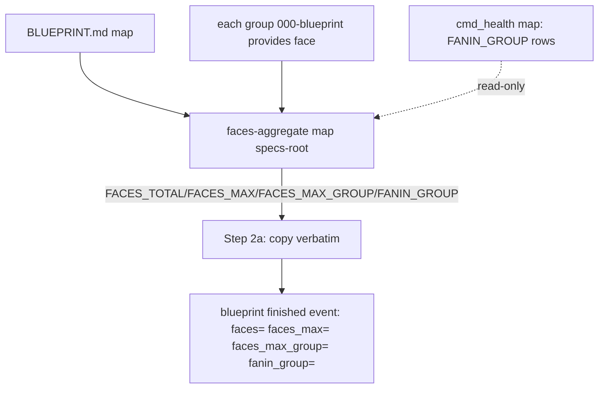

# Compute reconcile face-size counters deterministically — Plan

## Overview

Add one deterministic verb, `jimverify.sh faces-aggregate <map> <specs-root>`,
that emits the four reconcile face/concentration counters ready-to-copy
(`FACES_TOTAL`, `FACES_MAX`, `FACES_MAX_GROUP`, `FANIN_GROUP`); rewrite blueprint
§ Reconcile Step 2a to copy those values verbatim onto the finished event, and
reword the methodology contract so all fifteen counters are script-emitted. The
verb is purely additive — it reuses the existing `cmd_faces` and `cmd_health`
functions read-only, so no existing code or test changes.

## Design Decisions

### 1. One verb emits all four counters (resolves spec Insight 1)

- **Chosen:** A single `faces-aggregate <map> <specs-root>` emits the three
  faces values *and* the joined `FANIN_GROUP`, giving Step 2a one copy-source
  for all four counters (spec Insight 1 option (a)).
- **Why:** Spec AC #3 requires "the *same* deterministic surface" to emit the
  fan-in holders, and AC #4 forbids the LLM from doing any comma-join — so the
  join must be script-side, and co-locating it with the faces aggregation is the
  minimal, single-call shape.
- **Rejected:** Faces-only verb + LLM joins `cmd_health`'s `FANIN_GROUP` rows —
  violates AC #4 (LLM comma-join). Modifying `cmd_health` to emit a pre-joined
  line — risks the "existing tests pass unmodified" AC (tests assert the current
  per-holder `FANIN_GROUP` row format).

### 2. Fan-in reuses `cmd_health` read-only; `cmd_health` is not modified

- **Chosen:** `faces-aggregate` derives the fan-in holders by calling the
  existing `cmd_health "$map"` and joining its already-sorted `FANIN_GROUP` rows
  — `cmd_health` (and `cmd_faces`) are untouched.
- **Why:** `fanin_group` is a *graph*-derived attribution (sibling to `fanin`),
  so the graph fan-in logic must not be duplicated (DRY); reusing it read-only
  keeps the change purely additive and protects AC #10 (existing tests
  unmodified).
- **Rejected:** Re-deriving fan-in from `cmd_edges` inside the new verb —
  duplicates ~10 lines of the cycle/fan-in awk that already lives in
  `cmd_health`.

### 3. Provides count reuses `cmd_faces`, counting `kind == provides` rows

- **Chosen:** Per group, `faces-aggregate` counts the `provides` records emitted
  by `cmd_faces <group-blueprint>` (field 1 == `provides`, malformed entries
  included).
- **Why:** Parity — the current Step-2a LLM counts exactly those rows; reusing
  `cmd_faces` guarantees identical counting semantics and avoids a second
  Provides-section parser.
- **Rejected:** A bespoke `## Provides` list-item counter — a second parser to
  keep in sync with `cmd_faces`'s section tracking.

### 4. Group-slug guard before path construction (security AC #2)

- **Chosen:** Enumerate groups via `groups_of "$map"`, keep only tokens matching
  `^[a-z0-9][a-z0-9-]*$` **before** building `$specs_root/$g/000-blueprint/spec.md`,
  mirroring `cmd_contracts_check` (jimverify.sh:905/957); a failing token is
  skipped with no file access.
- **Why:** The map is untrusted data; `groups_of` is deliberately permissive, so
  the guard lives in the caller (spec AC #2, security.md Finding 1).
- **Rejected:** Trusting `groups_of` output directly — reintroduces the
  path-traversal exposure the sibling verbs already close.

### 5. Attribution shaping is mechanical (sort · comma-join · ≤256B · emit-when->0)

- **Chosen:** The verb sorts holder slugs, comma-joins them, caps the value at
  256 bytes, and emits `FACES_MAX_GROUP` / `FANIN_GROUP` **only when** their
  metric is > 0 — matching the extraction-side contract already in
  `jimledger.sh` (`RECONCILE_SLUG_KEYS`, ≤256 bytes; the spec 043/028 precedent).
- **Why:** Spec AC #4/#6 and the "producer-side tightening" the issue calls for.
- **Rejected:** Emitting empty attribution keys on a zero metric — would break
  the emit-only-when-`>0` rule the ledger consumers rely on.

### 6. Verb name `faces-aggregate` despite co-emitting fan-in

- **Chosen:** Keep the issue/spec name `faces-aggregate`; document that it also
  emits the fan-in attribution join because both are the reconcile pass's
  ledger-ready concentration attributions produced in one Step-2a call.
- **Why:** Matches the spec's language and the issue's proposed name; a rename
  would ripple into the spec/research without benefit.
- **Rejected:** `reconcile-counters` / `concentration` — `health` already owns
  the graph-metrics namespace; a new coined name adds churn for no clarity gain.

## Constitution Check

**ARCHITECTURE.md status:** Present — constraints noted below.

| Constraint from ARCHITECTURE.md | Honored? | Notes |
| :--- | :--- | :--- |
| Bash-vs-Prompt rule: deterministic + verifiable logic lives in a bash script (§ Bash-vs-Prompt Decision Rule) | Yes | This refactor *moves* counter arithmetic from prompt to script — the prescribed direction. |
| `jimverify.sh` is the deterministic core (line 53, 377); output TAB-separated + field-sanitized so a crafted cell cannot shift columns | Yes | New verb emits TSV `KEY\tVALUE`; slug-guarded group cells + integer values are inherently column-safe; the join is `san()`-capped. |
| Scripts use `set -uo pipefail; export LC_ALL=C` (§ Scripting Layer) | Yes | New verb lives in-file under the existing preamble; reuses in-file functions (no cross-script sourcing). |
| Tests: per-script `tests/jimverify.sh`, shared `testlib.sh`, run via `run.sh` (§ Tests) | Yes | New cases appended to `tests/jimverify.sh`; existing cases untouched. |
| Blueprint SKILL.md `allowed-tools` grants `jimverify.sh *` (wildcard) | Yes | The new verb is covered by the existing wildcard — no `allowed-tools` change. |
| CLAUDE.md → Bash scripts: POSIX+bash only, no third-party deps, no `source`/`eval` of user data | Yes | Pure bash/awk; reuses in-file functions; reads files as data only. |

## File Manifest

| Component | File Path | Action | Notes |
| :--- | :--- | :--- | :--- |
| Aggregator verb | `skills/verify/scripts/jimverify.sh` | Update | Add `cmd_faces_aggregate`; add `faces-aggregate)` dispatch arm; add the `usage()` line. Additive — `cmd_faces`/`cmd_health`/`groups_of` unchanged. |
| Verb tests | `tests/jimverify.sh` | Update | Append `case_jimverify_faces_aggregate_*` cases. Additive — existing cases unchanged. |
| Step 2a rewrite | `skills/blueprint/SKILL.md` | Update | § Reconcile Step 2a: replace LLM counting with the single `faces-aggregate` call + verbatim copy; update the § Reconcile checklist line. |
| Contract text | `skills/blueprint/references/reconcile-methodology.md` | Update | § Outcome counters: the two face counters + two attribution keys are script-emitted (from `faces-aggregate`); the "script-emitted value" contract now holds for all fifteen. |

## Interface Contracts

```text
faces-aggregate <map-path> <specs-root>

  Reads:  <map-path> ## Groups headings (via groups_of), each blueprint-bearing
          group's <specs-root>/<group>/000-blueprint/spec.md provides face, and
          (read-only) cmd_health <map-path> for the graph fan-in holders.

  stdout: TAB-separated KEY<TAB>VALUE lines, in this order:
    FACES_TOTAL      <int>              # Σ provides rows over blueprint-bearing groups (≥ 0)
    FACES_MAX        <int>              # max provides rows any single group carries (≥ 0)
    FACES_MAX_GROUP  <slug[,slug...]>   # sorted, comma-joined holders of FACES_MAX;
                                        #   EMITTED ONLY WHEN FACES_MAX > 0; ≤ 256 bytes
    FANIN_GROUP      <slug[,slug...]>   # sorted, comma-joined holders of the graph fan-in max;
                                        #   EMITTED ONLY WHEN fan-in > 0; ≤ 256 bytes

  Rules:
    - group token used in path construction ONLY IF it matches ^[a-z0-9][a-z0-9-]*$;
      a failing token is skipped — NO file access for it.
    - a group counts toward totals only if its 000-blueprint/spec.md exists
      (blueprint-bearing); provides count = # of cmd_faces records with field1 == "provides".
    - holder lists sorted ascending, comma-joined, byte-capped at 256.

  rc: 0 normal (FANIN_GROUP simply omitted when cmd_health yields no fan-in
        holders — fanin 0/na or no Contract Graph);
      2 on usage error (missing arg) or unreadable map.

  Step 2a copy map (verbatim, no LLM arithmetic):
    FACES_TOTAL → faces=   ·  FACES_MAX → faces_max=
    FACES_MAX_GROUP → faces_max_group= (when present)
    FANIN_GROUP → fanin_group= (when present)
```

## Data Flow



## Task Breakdown

1. [x] **Aggregator core.** Add `cmd_faces_aggregate` to `jimverify.sh`: enumerate
   groups via `groups_of`, apply the `^[a-z0-9][a-z0-9-]*$` guard before path use
   (skip failing tokens, no file access), count `provides` rows per
   blueprint-bearing group via `cmd_faces`, and emit `FACES_TOTAL`, `FACES_MAX`,
   and `FACES_MAX_GROUP` (sorted comma-joined holders, ties → all, ≤256-byte cap,
   emitted only when `FACES_MAX > 0`). Wire the `faces-aggregate)` dispatch arm
   and the `usage()` line. Cover with new `tests/jimverify.sh` cases: sum, max,
   ties → all-sorted holders, all-zero → no `FACES_MAX_GROUP`, ≤256-byte cap, and
   a crafted/`..`-bearing `## Groups` heading yielding no file access.
   **Verify:** `bash tests/jimverify.sh faces_aggregate` (new cases pass) and
   `bash tests/jimverify.sh` (all existing jimverify cases still pass).

2. [x] **Fan-in holders.** Extend `cmd_faces_aggregate` to emit `FANIN_GROUP` —
   the sorted, comma-joined holders read from `cmd_health "$map"`'s `FANIN_GROUP`
   rows (≤256-byte cap, emitted only when fan-in > 0; omitted when `cmd_health`
   yields no fan-in holders). `cmd_health` itself is not modified. Add cases:
   single holder, ties → all-sorted, fan-in 0 → no `FANIN_GROUP`.
   **Verify:** `bash tests/jimverify.sh faces_aggregate` passes and
   `bash tests/jimverify.sh` (whole file) passes.

3. [x] **Rewrite Step 2a.** In `skills/blueprint/SKILL.md` § Reconcile Step 2a,
   replace the per-group LLM counting/sum/max/holder-derivation with a single
   `jimverify.sh faces-aggregate <map-path> <specs-root>` call and copy
   `FACES_TOTAL`/`FACES_MAX`/`FACES_MAX_GROUP`/`FANIN_GROUP` verbatim onto the
   finished event (no sum, max, sort, or comma-join by the model). Update the
   § Reconcile checklist line to say the four counters are copied from
   `faces-aggregate`.
   **Verify:** `grep -q 'faces-aggregate' skills/blueprint/SKILL.md && ! grep -qi 'count each blueprint-bearing group' skills/blueprint/SKILL.md`

4. [x] **Reword the contract.** In `reconcile-methodology.md` § Outcome counters,
   describe `faces=`/`faces_max=`/`faces_max_group=`/`fanin_group=` as
   `faces-aggregate`-emitted (drop the "Counted at Step 2a" LLM-counting wording),
   so the "every counter is a script-emitted value, never a value lifted from
   content" statement reads true for all fifteen counters.
   **Verify:** `grep -q 'faces-aggregate' skills/blueprint/references/reconcile-methodology.md && ! grep -q 'Counted at Step 2a from' skills/blueprint/references/reconcile-methodology.md`

5. [x] **Regression gate.** Run the full suite; existing tests must pass with no
   edits to their bodies (additive-only change).
   **Verify:** `bash skills/meta-test/scripts/run.sh`

## Requirements Coverage Summary

| Spec Acceptance Criterion | Addressed In Task(s) |
| :--- | :--- |
| #1 Single deterministic call emits total / max / max-holders | 1 |
| #2 Slug-validate group token before path construction; crafted heading → no file access (External Constraint) | 1 |
| #3 Same surface emits fan-in max holders ready-to-copy | 2 |
| #4 Holder + fan-in values sorted comma-joined slugs, ties→all, ≤256B, script-emitted (External Constraint) | 1, 2 |
| #5 Step 2a copies all four verbatim; no LLM sum/max/sort/join | 3 |
| #6 All-zero → `faces_max=0`, no `faces_max_group` (External Constraint) | 1 |
| #7 Ledger contract unchanged: non-neg ints, attribution emit-when->0, fifteen-key set (External Constraint) | 1, 2, 3 |
| #8 Methodology § Outcome counters reworded; contract true for all fifteen | 4 |
| #9 New tests: sum, max, ties→all sorted, all-zero, slug validation, ≤256 cap, crafted-heading no-file-access | 1, 2 |
| #10 Existing tests pass without modification | 5 |

## Out of Scope

- **`fanin=` (the fan-in value).** Already script-emitted (copied verbatim from
  `cmd_health`'s `FANIN`); deliberately excluded per spec Insight 1 — this
  refactor targets only the four LLM-*assembled* counters.
- **Extraction-side validation.** `jimledger.sh` `last-reconcile` /
  `reconcile-series` already shape-validate the four keys on read; untouched —
  this tightens only the producer side.
- **Downstream consumers.** `jimpartition.sh health-eval` (`faces_max`
  predicate), `jimconf.sh` (`health_threshold_faces_max`), and the partition
  trend reads are insulated by the unchanged event contract; no change.
- **Backfilling historical events.** Pre-044 events lack the keys; none are
  rewritten (spec 044 Out of Scope, unchanged).
- **`ARCHITECTURE.md` refresh.** Handled by the `/jim:build` completion gate via
  `/jim:arch` — pipeline-owned, not a deferral.

## Open Questions

- [x] ~~Does `faces-aggregate` own the `fanin_group` join, or `cmd_health`?~~ →
  The new verb owns it, reusing `cmd_health` read-only (DD #1, #2).
- [x] ~~Count malformed provides entries toward `faces=`?~~ → Yes — count all
  `cmd_faces` `provides` records, matching the current Step-2a LLM semantics
  (DD #3).
