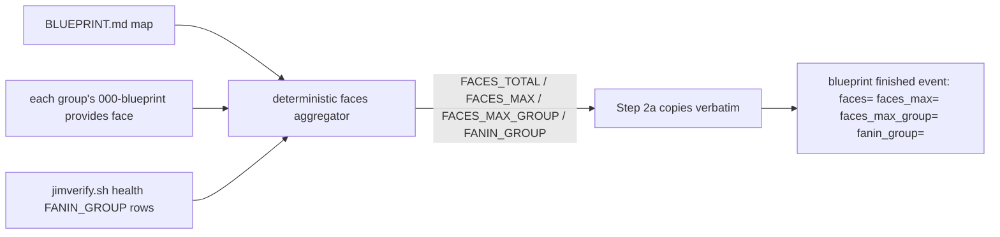

# 045 Compute reconcile face-size counters deterministically

## Overview
Move the reconcile pass's four face-size counters (`faces=`, `faces_max=`,
`faces_max_group=`, `fanin_group=`) off LLM arithmetic and onto a deterministic
script surface, so every counter on the `blueprint finished` reconcile event is
a script-emitted value copied verbatim — honoring the "script-emitted, never
lifted from content" contract the methodology already states.

## Refactor Rationale
- **Motivation:** Issue #74. `reconcile-methodology.md` § Outcome counters
  declares *"every counter is a script-emitted value, never a value lifted from
  content."* Thirteen of the fifteen counters honor it — the classifier emits
  the seven findings and `jimverify.sh health` emits the four graph-health
  counters, which the skill copies verbatim. The two face counters and their
  two attribution keys do not: blueprint SKILL.md § Reconcile Step 2a has the
  LLM run `jimverify.sh faces <group-blueprint>` per blueprint-bearing group,
  then **sum**, take the **max**, sort-and-comma-join the max holders, and
  apply the ≤256-byte cap by hand. That is LLM arithmetic assembling
  security-relevant, shape-validated ledger values.
- **Current State:** Step 2a computes `faces=` (sum of `provides` rows across
  groups), `faces_max=` (per-group max), and `faces_max_group=` (sorted
  comma-joined slug list of the max holders) through model reasoning over
  per-group `jimverify.sh faces` output; `fanin_group=` is likewise the LLM
  comma-joining the health verb's already-sorted `FANIN_GROUP` rows. This was a
  deliberate spec 044 decision (DD #4), so it is a known deviation, not a bug —
  but it violates both the stated counter contract and the
  mechanical-over-judgment principle.
- **Desired State:** A single deterministic call, given the map and specs root,
  emits all four values ready to copy: the total, the max, the max holders, and
  the fan-in max holders — each already sorted, comma-joined, slug-validated,
  and length-capped. Step 2a copies the four values verbatim onto the finished
  event exactly as it already copies the health counters, doing no arithmetic
  or string assembly. The emitted ledger contract (key set, shapes, emit-only-
  when-`>0` rule) is unchanged.
- **Affected Systems:** `skills/verify/scripts/jimverify.sh` (the aggregating
  surface); `skills/blueprint/SKILL.md` § Reconcile Step 2a (copy-verbatim
  instruction); `skills/blueprint/references/reconcile-methodology.md` §
  Outcome counters (the contract text that now holds for all fifteen counters);
  the verify bash test suite.

## Acceptance Criteria
- [ ] A single deterministic invocation, given the map path and specs root,
      reads every blueprint-bearing group's `provides` face and emits the
      aggregate face-size measurements in one call: the **total** `provides`
      entries across all groups, the **maximum** any single group carries, and
      the **group(s) at that maximum**.
- [ ] Before using any group token from the map in blueprint-path construction,
      the aggregator validates it against the group-slug grammar
      `^[a-z0-9][a-z0-9-]*$` and **skips** any token that fails — a crafted or
      `..`-bearing `## Groups` heading yields **no file access** for that token
      (map-hygiene skip, never a resolved path). *(External Constraint —
      reconcile-methodology.md § Inputs and the trust boundary treats map
      content as untrusted; the slug guard mirrors the established
      `cmd_contracts_check` convention, jimverify.sh:905/957.)*
- [ ] The same deterministic surface also emits the **fan-in max holders**
      (`fanin_group`) as a ready-to-copy value, so no LLM assembly is required
      for any of the four counters.
- [ ] The max-holder value and the fan-in-holder value are each **sorted,
      comma-joined slug(s)** (ties → all holders), every element a valid group
      slug, the whole value ≤ 256 bytes — emitted by the script, not assembled
      by the model. *(External Constraint — reconcile-methodology.md § Outcome
      counters; spec 044 DD #4.)*
- [ ] Reconcile Step 2a copies all four counters (`faces=`, `faces_max=`,
      `faces_max_group=`, `fanin_group=`) **verbatim** from the script output
      onto the `blueprint finished` event — performing no sum, max, sort, or
      comma-join itself.
- [ ] The all-zero case is handled by the script: when the maximum is `0`
      (every group's `provides` face is empty), `faces_max=` is `0` and no
      `faces_max_group=` attribution key is emitted, matching the existing
      emit-only-when-`>0` rule. *(External Constraint — reconcile-methodology.md
      § Outcome counters.)*
- [ ] The four counters' ledger contract is unchanged: `faces=`/`faces_max=`
      remain non-negative integers, the two attribution keys are emitted only
      when their metric > 0, and the `blueprint finished` event still carries
      the same fifteen-key set. *(External Constraint — reconcile-methodology.md
      § Outcome counters.)*
- [ ] `reconcile-methodology.md` § Outcome counters no longer names the two
      face counters or the two attribution keys as producers that require
      model counting — the "every counter is a script-emitted value" contract
      reads as true for all fifteen counters.
- [ ] New tests cover the aggregating surface: total sum, per-group max,
      ties → all-holders sorted comma-join, the all-zero (no-attribution) case,
      slug validation of holder cells, the ≤256-byte cap, and a crafted/
      `..`-bearing `## Groups` heading producing no file access for that token.
- [ ] Existing tests pass without modification.

## Data Flow

## Out of Scope
- **Extraction-side validation.** `jimledger.sh last-reconcile` and
  `reconcile-series` already shape-validate the four keys on read against the
  shared fifteen-key whitelist; this refactor tightens only the producer side
  and leaves the consumer validation untouched.
- **The other eleven counters.** The seven finding counters and the four
  graph-health counters are already script-emitted and are not revisited.
- **Backfilling historical events.** Events predating spec 044 lack the four
  keys; no historical event is rewritten (spec 044 Out of Scope, unchanged).
- **Changing the ledger contract.** The key set, shapes, ordering rules, and
  emit-only-when-`>0` semantics are preserved exactly — this changes *where*
  the values are computed, not *what* is recorded.
- **The nothing-to-reconcile short-circuit.** Step 2a is full-run-only; the
  aggregator does not run when fewer than two groups have blueprints, and that
  path (four counters ride as `na`) is unchanged.

## Research & Architecture Handoff

*Implementation insights surfaced during scoping. These are context for the
architect — not requirements, not exclusions. Treat each as a starting point to
evaluate, not a directive.*

### Insight 1: aggregator home and signature

- **Relates to AC:** *"A single deterministic invocation … emits the aggregate
  face-size measurements in one call"* (AC #1) and *"… also emits the fan-in max
  holders"* (AC #2).
- **Surfaced as:** Issue #74 proposes a `jimverify.sh faces-aggregate <map>`
  verb (or a jimpartition helper) emitting `FACES_TOTAL`, `FACES_MAX`, and
  `FACES_MAX_GROUP`, and folding `fanin_group=` "into the same mechanical path
  if convenient."
- **Levelled-up requirement (already in the ACs):** the functional need is a
  single deterministic call that emits all four ready-to-copy values; the
  concrete verb name, home, and TSV field names are the architect's to settle.
- **Deflection reason:** Delegation.
- **Architect note:** `cmd_contracts_check` already takes `<map> <specs-root>`
  and resolves each group's blueprint as `$specs_root/$g/000-blueprint/spec.md`
  via `groups_of`; the aggregator likely reuses that two-arg shape and the
  `cmd_faces` `provides`-row logic. Note the seam: `faces=`/`faces_max=`/
  `faces_max_group=` derive from the *faces*, but `fanin_group=` derives from
  the *graph* (the health verb's `FANIN_GROUP` rows). Weigh (a) one verb that
  emits all four — which broadens a `faces`-named verb to carry a fan-in value —
  versus (b) an aggregator that emits the three face values while the fan-in
  holders are joined mechanically from the health verb's existing rows. Either
  satisfies the ACs; the naming/cohesion trade-off is the open call.
- **`fanin=` cohesion (scope decision — deliberately excluded).** The fan-in
  *value* `fanin=` is already script-emitted (copied verbatim from the health
  verb's `FANIN` row) and is **out of scope** — this refactor targets only the
  four LLM-*assembled* counters. If the architect chooses option (a), a single
  aggregator owning the whole fan-in pair, folding `fanin=` through it too is a
  reasonable cohesion move — but purely optional, with no correctness gain, and
  it introduces a mild two-sources-for-one-value redundancy against the health
  verb. Not an AC either way.
- **Routing hint:** Architect to decide.

## Open Questions
None
