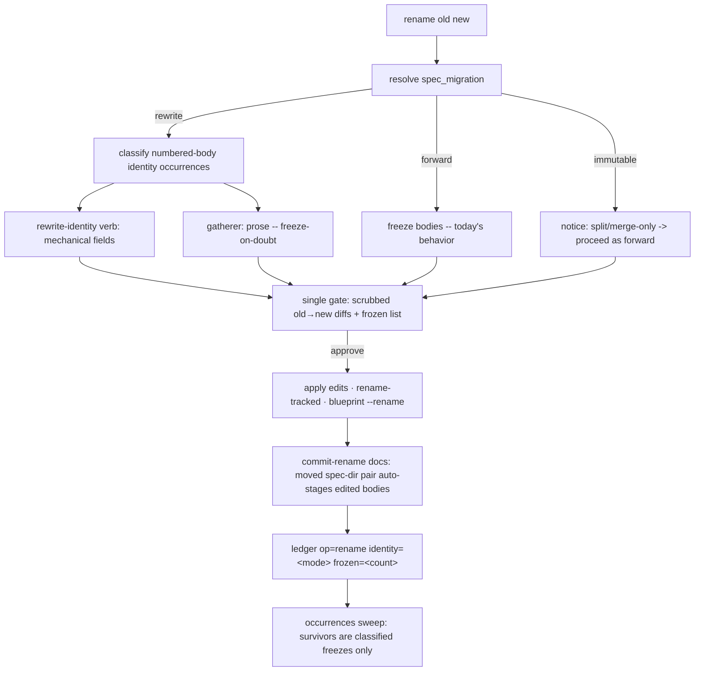

# Spec migration — Plan

## Overview

Implement the identity-on-move preference as a **mode gate on the existing
rename engine**: a new `spec_migration` config key selects whether a
rename edits numbered-spec-body identity (`rewrite`), freezes it behind the
existing `op=rename` ledger alias (`forward` — today's behavior, named), or is
declared not-applicable (`immutable`, a split/merge-only mode). The mechanical
rewrite lands in a new deterministic `jimpartition.sh rewrite-identity` verb;
ambiguous prose is left to the gatherer under a freeze-on-doubt rule; the
freeze-history doctrine is reconciled mode-conditionally across both its homes.

## Design Decisions

### 1. Mode is a classification gate on the rename engine, not new machinery

- **Chosen:** `spec_migration` selects whether numbered-spec-body identity
  occurrences classify `identity` (rewrite → edited) or `historical`
  (forward/immutable → frozen). Everything else — `occurrences`, the
  mechanical-first/gatherer-residue split, `rename-tracked`, the three-commit
  choreography, `edges-diff`, the zero-unclassified sweep — is reused verbatim.
- **Why:** the spec's core framing and research both land on "largely a
  classification flip" (`partition-methodology.md:246`).
- **Rejected:** a standalone spec-migration verb — duplicates the shipped rename
  engine for no gain.

### 2. A deterministic `rewrite-identity` verb carries the mechanical floor

- **Chosen:** a new `jimpartition.sh rewrite-identity <old> <new> <file>...`
  performs the structurally-unambiguous identity edits in numbered-spec bodies
  (frontmatter `group:` value, `<old>.<surface>` dotted-key group-halves,
  whole-token typed refs such as `Spec: <old>/NNN`); it never touches free prose.
  As jim's first in-place file-mutating verb, it carries the write-primitive
  containment guard (each target confirmed under the worktree top; a symlink
  escaping the worktree or a non-tracked path refused — the `commit-map`
  precedent), so the deterministic path is *safer* than a raw skill `Edit`
  (security Finding 5).
- **Why:** AC 11 requires the deterministic portion to be bash-testable, and the
  spec's Insight 2 anticipates a scripted floor; this keeps the Bash-vs-Prompt
  split clean (mechanical = script, judgment = gatherer).
- **Rejected:** performing the mechanical edits with the skill's `Edit` tool —
  not bash-testable, so AC 11 would have nothing to cover.

### 3. Freeze-on-doubt = the gatherer defaults to keep on ambiguous prose

- **Chosen:** free-prose `<old>` mentions the read-only gatherer cannot
  confidently classify as the group identity are left unchanged; only
  high-confidence identity prose is `Edit`-ed by the skill.
- **Why:** AC 3 — a rewrite must never corrupt substance; "the `cart` group" vs
  "the user's cart" is judgment a `sed` cannot make, and the gatherer's
  Read/Glob/Grep-only capability makes an embedded injection un-actionable
  (AC 10).
- **Rejected:** rewriting every prose `<old>` token — corrupts domain-noun prose
  inside a frozen historical spec.

### 4. The gate shows scrubbed body-edit diffs; freeze-on-doubt is recorded and referenced

- **Chosen:** the single rename gate presents each numbered-body edit as a
  secret-scrubbed old→new diff; each ambiguous mention left frozen is listed by
  `file:line`, tallied on the `op=rename` ledger event as `frozen=<count>`, and
  its locations offered as one tracked candidate.
- **Why:** security Findings 1/2 (a wrong prose rewrite or a pasted secret must
  not land unseen) and AC 12/13.
- **Rejected:** a bare changed-file count at the gate; a silent freeze-on-doubt
  skip.

### 5. `forward` = today's freeze, named; `immutable` is not applicable to rename

- **Chosen:** `forward` reuses 043's freeze-and-move exactly (numbered bodies
  untouched; the existing `op=rename` event is the alias) — the only additions
  are the `identity=forward` ledger tag and the named mode. `immutable` on a
  rename emits a named notice ("split/merge-only; rename relocates the group's
  home") and proceeds with `forward` semantics, recording `identity=forward`.
- **Why:** AC 4 and AC 6 — rename is the sole op that relocates a group's home,
  so `immutable` degenerates there; AC 6 forbids silent degradation.
- **Rejected:** silently treating `immutable` as `forward` (violates AC 6);
  refusing the rename outright (needlessly blocks a valid rename).

### 6. The new ledger keys are emit-only — no `jimledger.sh` change

- **Chosen:** `partition finished … op=rename` gains `identity=<mode>` and
  `frozen=<count>`; nothing in `jimledger.sh` changes.
- **Why:** `cmd_event` (`jimledger.sh:369`) appends its `k=v` args verbatim with
  no key whitelist, so the keys are added purely in the emitted event string;
  they follow spec 044's display-data-only bounded-value precedent
  (`faces_max_group=`).
- **Rejected:** a ledger schema/validation change — unnecessary; the `event`
  verb is already open, and `identity-check` matches on `old=` only.

### 7. Doctrine reconciled in both homes; ARCHITECTURE.md left to the pipeline

- **Chosen:** the freeze-history invariant (`SKILL.md:384-387` + checklist
  `:409`) and the methodology classification (`:237-257`) both become
  mode-conditional, plus a recorded reconciled doctrine (directory = live
  binding; body identity = preference; ledger `op=` = bridge) and the split/merge
  mode-to-operation mapping + composition rule in the methodology.
  `ARCHITECTURE.md` is **not** hand-edited.
- **Why:** research Peer Feedback #1 (a single-home edit leaves the invariant and
  the rule disagreeing); ARCHITECTURE.md regenerates via `/jim:arch` at the
  `/jim:build` completion gate, and hand-edits bypass that surface.
- **Rejected:** editing only one doctrine home; hand-refreshing ARCHITECTURE.md
  in this plan.

## Constitution Check

**ARCHITECTURE.md status:** Present — constraints noted below.

| Constraint from ARCHITECTURE.md | Honored? | Notes |
| :--- | :--- | :--- |
| Group identity is **path-derived** (`docs/specs/<group>/`; ARCH L294) | Yes | The rewrite edits a body's *label*, never the dir-as-group binding; the home-indirection alternative was rejected in the spec. |
| Map/blueprint writes go **only** through the blueprint surface (038 AC #7) | Yes | `Skill(jim:blueprint) --rename` still owns the map/blueprint/`000-blueprint` edits in every mode; numbered-spec bodies are the partition skill's own surface (it already holds `Edit`), not blueprint artifacts. |
| Ledger events are **content-free / counters** (026; 044 bounded display keys) | Yes | `identity=<mode>` is an enum tag; `frozen=<count>` a non-negative int — no path/name/content; the 044 `faces_max_group=` precedent. |
| **Bash-vs-Prompt** decision rule (ARCH §) | Yes | Mechanical rewrite = the `rewrite-identity` script verb; prose judgment = the gatherer. |
| **Never-execute-config-content** (035) | Yes | The mode resolves only from `spec_migration` config or developer input, never scanned content (AC 10). |
| **Freeze-history** (038 AC #14: "no mode edits a numbered spec's content") | **Intentionally revised** | This approved spec reconciles freeze-history to a mode-conditional rule — the deliberate deliverable, not a violation. ARCHITECTURE.md's prose (L264-266) refreshes via `/jim:arch` post-build. |

## File Manifest

| Component | File Path | Action | Notes |
| :--- | :--- | :--- | :--- |
| Config key | `skills/conf/scripts/jimconf.sh` | Update | Add `spec_migration` to `KEYS` and `default_for` (default `"rewrite"`). |
| Config test | `tests/jimconf.sh` | Update | Cover the new key's resolution + default. |
| Example config | `jimconf.toml.example` | Update | Document `spec_migration` with its three values. |
| Rewrite verb | `skills/partition/scripts/jimpartition.sh` | Update | Add the `rewrite-identity` verb (dispatch + `cmd_rewrite_identity`). |
| Verb test | `tests/jimpartition.sh` | Update | Cover `rewrite-identity` over the `rename_repo` fixture (rewrite applied; prose untouched; idempotent). |
| Gatherer charter | `agents/gatherer.md` | Update | Add the freeze-on-doubt prose rule to the rename-classification branch. |
| Rename methodology | `skills/partition/references/partition-methodology.md` | Update | Mode-conditional classification; the rewrite materialize step; mode-aware sweep; reconciled doctrine; split/merge mode-to-op mapping + composition rule. |
| Partition skill | `skills/partition/SKILL.md` | Update | Mode resolution + validation; rewrite orchestration; scrubbed gate diffs; freeze-on-doubt recording + `identity=`/`frozen=` ledger keys; mode-conditional freeze-history invariant + checklist. |

## Interface Contracts

The one new deterministic surface — every other change is prose or config:

```
jimpartition.sh rewrite-identity <old> <new> <file>...

  Rewrites structurally-unambiguous whole-token identity occurrences of <old> to
  <new>, in place, in each numbered-spec file:
    · frontmatter `group:` value            (group: "<old>"  → group: "<new>")
    · dotted-key group-halves               (<old>.<surface> → <new>.<surface>;
                                             surface half untouched)
    · whole-token typed refs                (e.g. Spec: <old>/NNN path segment)
  Leaves free-prose <old> tokens UNTOUCHED — those are the gatherer's domain
  (freeze-on-doubt). Never edits a `000-blueprint` (the blueprint surface owns it).

  Output: one `REWROTE\t<file>\t<line>\t<kind>` per applied edit — location-only;
          success AND error output alike never emit matched or surrounding
          content (a named reason / `file:line` only) — the occurrences
          exfiltration guard (AC 19 / AC 10; security Finding 6).
  Exit:   0 = applied (zero edits is success); 2 = usage error / invalid slug /
          a target path outside the worktree.
  Guards: <old>/<new> validated against ^[a-z0-9][a-z0-9-]*$ before any edit;
          whole-token boundaries only (never a substring of a longer token);
          each <file> resolved and confirmed under the worktree top (the
          `jimledger.sh commit-map` precedent, :204-227), a symlink escaping the
          worktree or a non-tracked path refused before any edit (security
          Finding 5).
```

Mode resolution (skill-side, following the `verify/SKILL.md:161` degrade-and-note
precedent):

```
spec_migration ∈ { rewrite (default), forward, immutable }
  · unset/empty            → rewrite
  · not one of the three   → degrade to rewrite, name the fallback in the report
  · resolved ONLY from config or an explicit developer instruction (AC 10)
For a rename op:  rewrite → edit bodies · forward → freeze · immutable → notice + forward
```

## Data Flow



## Task Breakdown

1. [x] **Add the `spec_migration` config key.** In
   `skills/conf/scripts/jimconf.sh`, add `spec_migration` to `KEYS`
   (line 42) and a `default_for` case returning `"rewrite"`. First add a case to
   `tests/jimconf.sh` asserting the default and a set value resolve (red→green).
   **Verify:** `bash tests/jimconf.sh && bash skills/conf/scripts/jimconf.sh get spec_migration | grep -qx rewrite`

2. [x] **Add the `rewrite-identity` verb.** In
   `skills/partition/scripts/jimpartition.sh`, add the dispatch entry and
   `cmd_rewrite_identity` per the Interface Contract — including the
   write-primitive containment guard (security Finding 5). Write the
   `tests/jimpartition.sh` case first, over the existing `rename_repo` fixture:
   assert the numbered `cart/001-initial/spec.md` body's `group:` and any
   dotted-key become `checkout`, a free-prose `cart` sentence is untouched,
   output is location-only `REWROTE` lines, a second run is idempotent, a target
   path outside the worktree is refused (rc 2, location-only reason), and a
   malformed-`group:` input errors location-only with no content echoed
   (Finding 6) — red→green. **Verify:** `bash tests/jimpartition.sh`

3. [x] **Add the freeze-on-doubt rule to the gatherer.** In `agents/gatherer.md`,
   extend the rename-classification branch: under the rewrite mode, an ambiguous
   prose `<old>` mention (group identity vs domain word) is classified *keep*
   (freeze-on-doubt) — default to not-rewrite when unsure.
   **Verify:** `grep -qi 'freeze-on-doubt' agents/gatherer.md`

4. [x] **Reconcile the doctrine in the methodology.** In
   `skills/partition/references/partition-methodology.md` § Rename protocol: make
   the numbered-body classification (`:246`) mode-conditional
   (rewrite→identity/freeze-on-doubt, forward/immutable→historical); add the
   rewrite materialize sub-step and the mode-aware zero-unclassified sweep; add
   the reconciled freeze-history doctrine (directory = live binding, body =
   preference, ledger `op=` = bridge) and the split/merge mode-to-operation
   mapping + composition rule (AC 8/9).
   **Verify:** `grep -q 'spec_migration' skills/partition/references/partition-methodology.md && grep -qi 'composition rule\|no continuing group' skills/partition/references/partition-methodology.md`

5. [x] **Resolve and gate the mode in the rename skill.** In
   `skills/partition/SKILL.md` § Rename runs: resolve/validate
   `spec_migration` (degrade-to-rewrite + note; config/developer only —
   AC 10); state `immutable` is not applicable to rename and proceed as forward
   (AC 6). **Verify:** `grep -q 'spec_migration' skills/partition/SKILL.md && grep -qi 'immutable' skills/partition/SKILL.md`

6. [x] **Wire rewrite orchestration + scrubbed gate diffs.** In `SKILL.md`
   Materialize step 5: under rewrite, call `rewrite-identity` for the mechanical
   fields and `Edit` gatherer-approved prose; present each body edit as a
   secret-scrubbed old→new diff at the gate (AC 12).
   **Verify:** `grep -q 'rewrite-identity' skills/partition/SKILL.md && grep -qi 'scrub' skills/partition/SKILL.md`

7. [x] **Record and reference freeze-on-doubt; add the ledger keys.** In
   `SKILL.md`: list frozen mentions by location at the gate, add
   `identity=<mode> frozen=<count>` to the `partition finished … op=rename` event,
   and offer the frozen locations as one candidate (AC 13).
   **Verify:** `grep -q 'identity=' skills/partition/SKILL.md && grep -q 'frozen=' skills/partition/SKILL.md`

8. [x] **Make the freeze-history invariant mode-conditional.** In `SKILL.md`
   § Security and data discipline (`:384-387`) and the two checklist lines
   (`:407`, `:409`): reword "no mode edits a numbered spec's content" to the
   mode-conditional rule (rewrite edits identity; forward/immutable freeze).
   **Verify:** `grep -qi 'spec_migration\|rewrite mode' skills/partition/SKILL.md`

9. [x] **Document the key in the example config.** In `jimconf.toml.example`, add
   a commented `spec_migration` line naming the three values and the
   `rewrite` default. **Verify:** `grep -q 'spec_migration' jimconf.toml.example`

10. [x] **Full deterministic suite green.** Run the two touched script suites
    to confirm no regression. **Verify:** `bash tests/jimconf.sh && bash tests/jimpartition.sh`

## Requirements Coverage Summary

| Spec Acceptance Criterion | Addressed In Task(s) |
| :--- | :--- |
| 1 — three-mode preference, default `rewrite` | 1, 5 |
| 2 — reconciled doctrine; ledger `op=` bridge | 4, 7, 8 |
| 3 — rewrite edits identity, not substance; freeze-on-doubt | 2, 3, 6 |
| 4 — `forward` freezes + ledger alias | 6, 7 (forward path), 4 |
| 5 — `immutable` leaves history in place (split/merge) | 4 (doctrine; immutable is split/merge-only) |
| 6 — rename honors preference; `immutable` N/A stated | 5, 6 |
| 7 — governs 001+ only; `000-blueprint` re-identifies every mode | 4, 8 (blueprint `--rename` unchanged — re-identifies always) |
| 8 — split/merge mode-to-op mapping recorded | 4 |
| 9 — composition rule recorded | 4 |
| 10 — structural-position edits; mode from config; no injection binds | 2, 3, 5 |
| 11 — deterministic rewrite covered by tests | 2, 10 |
| 12 — scrubbed body-edit diffs at the gate | 6 |
| 13 — freeze-on-doubt recorded (`frozen=`) + referenced (gate + candidate) | 3, 7 |

## Out of Scope

- **Split/merge verb implementation** — this plan records their *doctrine* only
  (tasks 4); the mechanics (per-child assignment, merge id-collision) are their
  own future specs.
- **The retroactive reconciler** for the one existing half-moved dir — declined
  during scoping; a manual one-off, not automated.
- **`jimledger.sh` schema/validation change** — unneeded; `event` appends `k=v`
  verbatim, so the two new keys are emit-only.
- **`Skill(jim:blueprint) --rename` arm changes** — it already re-identifies the
  map/blueprint/`000-blueprint` in every mode; numbered bodies are the partition
  skill's surface, not blueprint artifacts.
- **ARCHITECTURE.md refresh** — *not* a deferral: the `/jim:build` completion
  gate regenerates it via `/jim:arch`. Hand-editing it here would bypass that
  surface.

## Open Questions

- [x] ~Does the mechanical rewrite need a new script verb, or can the skill
  `Edit` it?~ → New verb (`rewrite-identity`); AC 11 needs a bash-testable
  deterministic floor (DD 2).
- [x] ~Do the new ledger keys require a `jimledger.sh` change?~ → No; `event`
  appends `k=v` verbatim (DD 6).
- [ ] Frozen-mention candidate granularity — one run-level candidate listing all
  frozen `file:line`s (chosen, to stay lean) vs one per mention. Revisit only if
  a real run makes the single-issue list unwieldy. Non-blocking.
