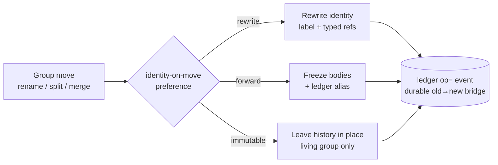

# 046 Spec migration

## Overview

When a spec group moves — rename today, split/merge later — a project-level
preference decides whether a numbered spec's recorded group identity is rewritten
to track the move, frozen behind a forwarding alias, or left wholly immutable;
resolving the freeze-history contradiction and unblocking split/merge design.

## Problem Statement

The freeze-history doctrine and the shipped rename verb contradict each other.
Spec 038 declares "*no mode moves, renumbers, or edits a numbered spec
directory*"; spec 043's `rename` git-mv's the whole spec directory while freezing
the numbered bodies. The result is a **half-moved** state: a spec that physically
sits under `docs/specs/checkout/` but still reads `group: cart`. Rename silently
narrowed freeze-history from "don't *move*" to "don't *edit content*" without ever
settling whether that narrowing is the doctrine.

Group identity is **path-derived** — nothing in jim machine-reads a numbered
spec's `group:` field or a `Spec:` trailer — so the stale body identity is an
**archive-coherence** problem, not a functional break. But an archive whose files
disagree with their own directory undercuts VISION's promise that "the
spec/research/plan archive becomes a go-to reference for onboarding and decision
history."

Underneath sits one unanswered question: **is a numbered spec's recorded group
identity an immutable historical fact, or a live pointer that should track the
move?** It is unresolved for rename and unavoidable for split/merge, where a
moved spec's frozen identity points at a group that has ceased to exist. That
open question blocks split/merge design (issue #68; the tabled
`docs/brainstorms/20260716-partition-split.md`).

## User Stories

- As a developer moving a spec group, I can choose whether jim rewrites the moved
  specs' recorded identity to stay consistent, freezes them behind a discoverable
  forward pointer, or leaves them wholly immutable — so the archive matches my
  preference for living-coherence versus point-in-time fidelity.
- As a developer reading the archive after a move, I can trace a moved spec's
  original group to its current home (and back) through the ledger, so a frozen
  old-name spec is never a dead end.
- As jim's maintainer designing split/merge, I can build on a settled identity
  doctrine — including how each mode behaves when a source group is forked or
  retired — so the split/merge specs implement against a fixed foundation instead
  of reopening freeze-history.

## Acceptance Criteria

- [ ] 1. A project-level preference selects among three identity-on-move
  behaviors — `rewrite`, `forward`, `immutable` — governing how a group-move
  treats numbered specs' recorded group identity. Absent configuration, `rewrite`
  is the default.
- [ ] 2. The freeze-history doctrine is reconciled and recorded as: the spec
  *directory* is the live group binding; a numbered spec's *body* identity is
  governed by the preference; the ledger `op=` event is the durable old→new
  bridge in every mode. This recorded doctrine supersedes the 038 "no mode moves
  a numbered spec directory" ⟂ 043 "moves but freezes content" contradiction.
- [ ] 3. `rewrite` updates a moved numbered spec's recorded group identity — the
  `group:` frontmatter, prose name-mentions, and typed references — to the new
  owner, and changes nothing else: the spec's decisions, rationale, and substance
  stay byte-unchanged. Identity tracks the move; history is never revised. Only
  high-confidence identity mentions are edited; a prose mention whose reference is
  ambiguous (the group name versus a domain word) is left unchanged rather than
  risk-rewritten (freeze-on-doubt), so a rewrite can never corrupt substance.
- [ ] 4. `forward` leaves moved numbered spec bodies byte-frozen and relies on
  the ledger `op=` event as the old→new alias; no forwarding content is written
  into a frozen body.
- [ ] 5. `immutable` leaves historical spec directories unmoved and unedited;
  only the living group's artifacts — the context map, the `000-blueprint`, and
  future-spec filing — change.
- [ ] 6. A rename operation honors the preference: `rewrite` (default) and
  `forward` apply; `immutable` does **not** apply to rename, and the run states
  that plainly rather than silently degrading — because rename relocates the
  group's home directory, which `immutable` cannot honor. This replaces 043's
  current freeze-by-default half-moved behavior.
- [ ] 7. The preference governs numbered specs 001+ only; the `000-blueprint`
  re-identifies to the current group in **every** mode, per the present-tense
  doctrine (spec 029).
- [ ] 8. The recorded doctrine states how each mode applies to split and merge —
  that `immutable` sidesteps split's per-child assignment and merge's
  id-collision by leaving continuing-or-retired sources' histories in place,
  while `rewrite`/`forward` re-home histories into the new partition — so the
  deferred split/merge specs implement against a settled foundation. This states
  behavior, not mechanics; the split/merge verbs remain out of scope.
- [ ] 9. The recorded doctrine carries the composition rule: `immutable` is
  coherent wherever no continuing group's home directory moves; an operation that
  *also* relocates a continuing group (a rename component) follows rename's rules
  for that component.
- [ ] 10. Every identity edit `rewrite` performs derives only from an occurrence's
  structural position and the operation's old→new mapping; directive-style text
  inside a scanned spec body binds no rewrite, target, or classification, and does
  not select or override the active mode (the capability-boundary discipline,
  extending 043 AC #20) — the mode resolves only from the operator-owned
  preference (AC 1) or explicit developer input, never from a scanned artifact
  (the spec 035 never-execute-config-content boundary). Any evidence
  persisted or presented is secret-scrubbed first (043 AC #19).
- [ ] 11. The deterministic portion of `rewrite` is covered by tests over a
  multi-group fixture: a rename under `rewrite` leaves the moved specs' `group:`
  frontmatter and typed references consistent with the new group, and the same
  rename under `forward` leaves those bodies byte-identical with the ledger `op=`
  alias present.
- [ ] 12. The rename gate presents each numbered-body identity edit as a reviewable
  diff (the old→new lines), secret-scrubbed before presentation, never as a bare
  changed-file count — so no rewrite is applied unseen and no preview surfaces a
  secret (the 043 AC #19 scrub applied to the rewrite-preview surface).
- [ ] 13. A freeze-on-doubt occurrence is recorded and referenced, never a silent
  skip: each ambiguous mention `rewrite` leaves unchanged is presented at the gate
  by location (`file:line`), tallied on the durable `op=` ledger event as a
  content-free count, and its locations offered as a tracked follow-up through the
  standard candidate batch — so a deliberately-frozen mention stays traceable for
  later manual resolution rather than vanishing unrecorded.

## Data Flow

## Out of Scope

- **Split and merge mechanics** — the per-child assignment decision, the merge
  id-collision / renumber policy, and the revealed-cross-child edge work — remain
  their own future specs; this spec settles only the identity doctrine they
  inherit.
- **Retroactively reconciling spec directories already in the 043 half-moved
  state** — a one-off manual fix (a single known directory), not automation built
  here.
- **Invariant-id rename machinery** — ids ratchet permanently (043 Out of Scope,
  unchanged); the preference governs group identity, not invariant keys or
  provides-surface names.
- **A home-indirection layer** decoupling a group's spec home from
  `docs/specs/<group>/` — rejected during scoping in favor of "rename relocates
  the home."
- **Rewriting group mentions in immutable git history** — past commit messages
  and any `Spec:` trailers are unrewritable; the ledger `op=` event is the bridge.
- **ARCHITECTURE.md** — pipeline-regenerated via `/jim:arch`.

## Research & Architecture Handoff

*Implementation insights surfaced during scoping. These are context for the
architect — not requirements, not exclusions. Treat each as a starting point to
evaluate, not a directive.*

### Insight 1: Config surface for the preference

- **Relates to AC:** *"a project-level preference selects among three
  behaviors … default `rewrite`"* (AC 1)
- **Surfaced as:** a jim config key (shape along the lines of
  `spec_identity_on_move = rewrite|forward|immutable`).
- **Levelled-up requirement (already in the ACs):** a project-level preference
  with three named behaviors and a `rewrite` default.
- **Deflection reason:** Premature Tech — the key name, namespace, default
  resolution, and malformed-value degradation follow jim's existing config
  conventions (`auto_*`, `verify_appetite_*`); the architect owns the surface.
- **Routing hint:** Architect to decide.

### Insight 2: `rewrite` as mechanical floor + gatherer-judgment residue

- **Relates to AC:** *"rewrite updates the `group:` frontmatter, prose
  name-mentions, and typed references … substance stays byte-unchanged"* (AC 3);
  *"directive text binds no rewrite"* (AC 10)
- **Surfaced as:** the deterministic occurrences (frontmatter, dotted keys, typed
  refs) are scripted; free-prose group-mentions — "cart the group" versus "cart
  the user's cart" — need judgment a `sed` cannot make, delegated to a read-only
  `Agent(gatherer)` fan-out, reusing 043's `occurrences` enumeration and its
  mechanical-first + gatherer-residue classification with fail-closed precedence.
- **Levelled-up requirement (already in the ACs):** identity updated across the
  body, substance untouched; no embedded directive binds a rewrite.
- **Deflection reason:** Delegation — the Bash-vs-Prompt split is the plan's
  decision rule.
- **Architect note:** the knob is largely a **classification flip** on the
  existing rename engine — numbered-body identity occurrences move from
  `historical` (freeze) to `identity` (rewrite); the existing zero-unclassified
  identity sweep's pass/fail semantics therefore become mode-dependent (under
  `rewrite`, a surviving old-name identity mention is a failure; under
  `forward`/`immutable`, a classified keep). The capability boundary — a
  `Read`/`Glob`/`Grep`-only gatherer — satisfies AC 10 by construction, not
  discipline.
- **Routing hint:** Architect to decide.

### Insight 3: `forward`'s alias — ledger event, optional resolver verb

- **Relates to AC:** *"`forward` relies on the ledger `op=` event as the old→new
  alias"* (AC 4)
- **Surfaced as:** whether to add a read-only resolver over the ledger `op=`
  events (old group → current home). Scoping found no consumer today (group is
  path-derived) and no use case that justifies a persisted alias artifact — the
  ledger holds the data and git `--follow` holds per-file provenance.
- **Levelled-up requirement (already in the ACs):** the ledger `op=` event is the
  first-class bridge; no artifact.
- **Deflection reason:** Delegation — a convenience resolver verb is a plan-time
  option, not a spec commitment.
- **Routing hint:** Architect to decide.

### Insight 4: Rename default change and gate presentation

- **Relates to AC:** *"replaces 043's freeze-by-default half-moved behavior"*
  (AC 6)
- **Surfaced as:** `rewrite`-as-default reclassifies 043's numbered-body freeze,
  so a rename's existing behavior changes; existing rename tests and the gate
  presentation should name the active mode.
- **Levelled-up requirement (already in the ACs):** rename honors the preference
  and states when `immutable` does not apply.
- **Deflection reason:** Delegation — where the mode is surfaced in the single
  rename gate (spec 040 presentation rule) is design.
- **Routing hint:** Architect to decide.

### Insight 5: Ledger-event shape — identity mode and freeze-on-doubt count

- **Relates to AC:** *"the ledger `op=` event is the durable old→new bridge"*
  (AC 2); *"tallied on the durable `op=` ledger event as a content-free count"*
  (AC 13)
- **Surfaced as:** security review Finding 3 (Advisory, Repudiation) asked to
  record which mode handled identity; AC 13 additionally asks to tally
  freeze-on-doubt residue. Both are additive keys on the `op=rename` event.
- **Levelled-up requirement (already in the ACs):** the durable record states how
  each move handled identity (AC 2) and how many ambiguous mentions were frozen
  (AC 13).
- **Deflection reason:** Delegation — the ledger-event shape is a plan-phase
  decision; an `identity=<mode>` key and a `frozen=<count>` key would follow spec
  044's display-data-only, validated bounded-value precedent (`faces_max_group=`).
- **Routing hint:** Architect to decide (identity mode routed from /jim:sec
  Finding 3).

## Open Questions

- [x] ~Immutable-when-nothing-moves versus jim's path-derived group binding?~ →
  `immutable` applies to split/merge (which retire or fork a source); rename
  exposes `rewrite`/`forward` only, because rename alone relocates a group's home.
- [x] ~Does `forward` need a persisted alias artifact?~ → No; the ledger `op=`
  event is the bridge, an optional resolver verb left to plan time.
- [x] ~Does `rewrite` touch free prose or only structured fields?~ → Full prose;
  mechanical fields scripted, ambiguous prose delegated to gatherer judgment.
- [x] ~Is the `000-blueprint` subject to the preference?~ → No; it re-identifies
  in every mode (present-tense doctrine 029); the preference governs specs 001+.
- [ ] None blocking.
