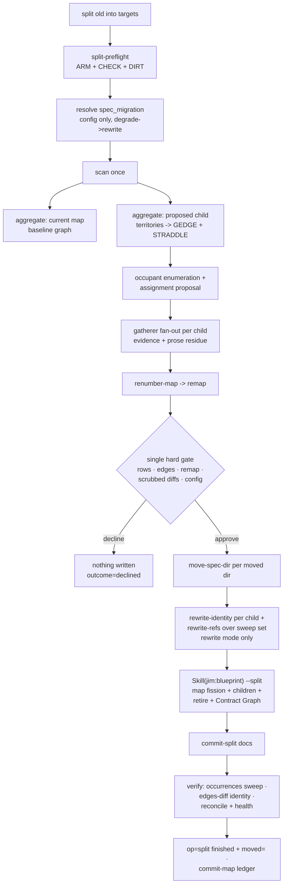

# Partition split — Plan

## Overview

Build `split` as a peer partition verb on the shipped 043/046 ripple engine:
five new deterministic script verbs (cross-parent move, vacated-id floor,
split preflight, renumber map, remap-keyed reference rewrite) supply the
mechanical floor, the existing `aggregate` substrate re-run over proposed child
territories supplies the revealed-edge floor, and one new blueprint `--split`
arm materializes the doc fission — orchestrated by a compact § Split runs
section whose protocol detail lives in the partition methodology.

## Design Decisions

### 1. Skill-surface shape — compact § Split runs + methodology § Split protocol

- **Chosen:** `partition/SKILL.md` gains a routing row and a compact § Split
  runs section (mirroring § Rename runs); the full protocol (assignment
  proposal, spanning rules, reference sweep, commit choreography, mode table)
  lives in `partition-methodology.md` § Split protocol.
- **Why:** `partition/SKILL.md` sits at 455/500 lines (research); the
  methodology holds 443 with room. This is the established 036/#43
  extraction pattern.
- **Rejected:** full protocol in SKILL.md — blows the 500-line progressive-
  disclosure cap.

### 2. Reference rewriting — new `rewrite-refs` verb, not an overload of `rewrite-identity`

- **Chosen:** a separate `jimpartition.sh rewrite-refs <remap-file> <file>...`
  verb for remap-keyed `group/NNN` reference rewriting (typed refs + path
  prefixes); `rewrite-identity` stays as shipped and is invoked once per
  target child (batch-by-target) for moved bodies' group-half identity.
- **Why:** the input shapes differ structurally — a remap *table* with
  per-occurrence targets versus one global `<old> <new>` pair. The remap file
  is simultaneously the whitelist (security Finding 4): only refs whose
  `group/NNN` appears in the approved remap are ever touched, so a ref to an
  unmoved spec is unrewritable by construction. Both verbs share the
  guards-before-any-edit containment stack.
- **Rejected:** extending `rewrite-identity` with an optional remap arg — two
  input grammars in one verb, and the shipped verb's contract (046, tested)
  stays byte-stable this way.

### 3. Vacated-id floor — `jimledger.sh vacated-max` consumed by `jimfile.sh next-id`

- **Chosen:** `jimledger.sh vacated-max <specs-dir> <group>` owns the
  whitelisted ledger parse (its own event grammar); `jimfile.sh cmd_next_id`
  calls it BASH_SOURCE-relative and takes `max(dir-max, floor) + 1`. Absent
  script or ledger → dir-only behavior (older checkouts degrade cleanly).
- **Why:** the floor must live in `next-id` itself — `/jim:spec` files specs
  without the partition skill in the loop. Grammar ownership stays with
  `jimledger.sh` (the `reconcile-series` precedent); the cross-script call
  follows the `jimpartition → jimconf/jimledger` BASH_SOURCE pattern. The
  parse is fail-closed per security Finding 2: event-type gate, per-element
  charset gate, invalid elements inert, floor only ever raises.
- **Rejected:** parsing ledger grammar inside jimfile.sh — grammar coupling
  across owners; a persisted marker file — a second durability home that can
  drift from the ledger's authoritative record.

### 4. Move primitive — new `move-spec-dir`, `rename-tracked` untouched

- **Chosen:** a new `jimledger.sh move-spec-dir` verb doing one cross-parent
  `git mv` (move + renumber in one history-continuous step), bounded to spec
  dirs: both endpoints under `<specs-dir>`, `NNN-slug`/`NNN-wip` basename
  shapes, source tracked, destination absent, realpath-under-top.
- **Why:** `rename-tracked`'s sibling constraint is a guard its existing
  callers rely on (security Finding 1); relaxing it would widen every caller.
  The new verb's bound set is *narrower* in scope (specs-only) while allowing
  exactly the cross-parent move split needs.
- **Rejected:** relaxing `rename-tracked` — guard erosion on a shipped
  primitive; skill-level `git mv` — skills hold no git grants (043 doctrine).

### 5. Ledger remap encoding — repeatable `moved=` pairs, elements ≤256-byte chunks

- **Chosen:** the `op=split` finished event carries the remap as one or more
  `moved=<og/onum:ng/nnum>[,…]` pairs, each value split at element boundaries
  to stay ≤256 bytes (the 044 bounded-value precedent), elements drawn from
  the charset `[a-z0-9-/:,]` (no `;`, no TAB — the kv joiners). Consumers
  iterate *all* `moved=` pairs and charset-gate each element on read.
- **Why:** bounded values without new grammar — `cmd_event` appends verbatim
  and the reconcile extractors drop unknown keys, so repetition is additive-
  safe (research finding). Security Finding 5's cap/charset/overflow policy
  becomes "chunk at element boundaries," never silent truncation.
- **Rejected:** one unbounded value — no size discipline; a separate remap
  artifact file — a second durable home when the ledger is the bridge (046
  doctrine).

### 6. Post-split graph check — expected-after TSV + `edges-diff` identity trick

- **Chosen:** the skill composes the expected after-graph TSV (baseline edges
  with each provider/consumer re-pointed to its assigned child, plus the
  gate-confirmed revealed edges) and runs
  `edges-diff <expected> <actual> <t1> <t1>` — with old==new the rewrite is
  the identity, so the verb degrades to a pure multiset diff.
- **Why:** zero script change for AC 16's graph check; MISSING/EXTRA output
  and rc semantics are already tested.
- **Rejected:** a new diff verb — duplicate of shipped behavior.

### 7. Revealed-edge floor — `aggregate` re-run over proposed child territories

- **Chosen:** run `scan` once, `aggregate` twice: current-map territories
  (baseline) and proposed child territories. Cross-child `GEDGE` rows are the
  candidate `requires` edges (counts = call-site evidence); `STRADDLE` rows
  are the spanning units. The skill classifies candidates against the
  declared graph and presents each for confirm/reject at the gate.
- **Why:** research Recommendation 1 — the substrate already computes this;
  `aggregate` takes any territories-file, and intra-group edges dropping out
  means cross-child edges surface exactly when the child boundary is drawn.
- **Rejected:** a bespoke revealed-edge verb — re-implements `aggregate`.

### 8. Renumber map — deterministic `renumber-map` verb

- **Chosen:** `jimpartition.sh renumber-map <old> <targets-csv> <assign-file>`
  computes the full remap: a continuing child (== `<old>`) keeps numbers;
  each fresh child renumbers arrivals `001..N` ordered by ascending source
  number; `-wip` rows ride with their reserved number renumbered in sequence.
- **Why:** AC 19 names the renumber map a tested deterministic portion; the
  Bash-vs-Prompt rule puts pure id arithmetic in the script, and the gate
  presents its output verbatim (no LLM arithmetic — the 045 doctrine).
- **Rejected:** skill-level arithmetic — unverifiable by the test suite and
  against the script-emitted-values doctrine.

### 9. Commit choreography — two commits via `commit-split` + `commit-map`

- **Chosen:** split lands as (1) a docs commit through a new
  `jimledger.sh commit-split` arm — explicit literal paths only: moved
  spec-dir pairs, touched blueprints, reference-edit files, issue INDEX.md —
  and (2) the map + specs-root ledger through the existing `commit-map`.
  There is no code commit (assignment-only, spec AC 6).
- **Why:** rename's three-commit choreography minus the code arm it cannot
  have; `commit-rename`'s docs arm auto-derives a single old/new pair, which
  does not generalize to N moved dirs — so the split arm takes its complete
  set as explicit args (the `code`-arm precedent, security Finding 7 of 043).
- **Rejected:** reusing `commit-rename docs` — its auto-derived pair staging
  is wrong for N pairs; one mega-commit — loses the docs/map separation the
  choreography encodes.

### 10. Blueprint `--split` arm — re-gate-free, target-set-validated, line-funded

- **Chosen:** `Skill(jim:blueprint) --split <old> --targets <csv>
  --changes <file>` re-validates every change-set row (`valid-relpath` +
  slug + **row target ∈ the approved targets list**, security Finding 3),
  performs map fission, in-place remainder edit, kernel-first fresh child
  blueprints, symmetric-source retirement (no re-prompt — the split gate
  authorized it; the standalone `--retire` prompt stays for standalone use),
  rewrites the Contract Graph, defers all commits, returns the touched-file
  list. Line funding: extract the existing `--rename` arm's protocol detail
  to a new `references/migrate-arms.md`; both arms keep ~5-line stubs.
- **Why:** the 043 deferred-commit exception generalizes; blueprint SKILL.md
  is at 498/500 (research), so the arm cannot land without extraction.
- **Rejected:** partition editing map/blueprints directly — violates the
  blueprint-surface-only invariant (038 AC 7).

### 11. Reference sweep set — tracked files from jim-resolved artifact dirs

- **Chosen:** under `rewrite`, the sweep set is
  `git ls-files -- <specs-root> <issues-dir> <brainstorms-dir> <debug-dir>`
  filtered to `*.md`, dirs resolved via `jimfile.sh` (never hand-typed);
  `rewrite-refs` runs over the set with the approved remap; touched issue
  files get an `updated:` refresh (`jimfile.sh now`, spec 022) and one
  `INDEX.md` regeneration after the batch. Strategic docs are advisory rows
  only (never in the sweep set).
- **Why:** spec AC 8 + Insight 8; tracked-only matches `rewrite-refs`'
  containment guard (untracked refs are invisible to the verb by design,
  consistent with `rewrite-identity`).
- **Rejected:** sweeping untracked files — outside the containment guard;
  sweeping ROADMAP/README/WORKFLOW — the spec pins them advisory (043
  parity).

## Constitution Check

**ARCHITECTURE.md status:** Present — constraints noted below.

| Constraint from ARCHITECTURE.md | Honored? | Notes |
| :--- | :--- | :--- |
| Map/blueprint writes go through the blueprint surface only (038 AC 7) | Yes | All doc fission via the `--split` arm (DD 10); partition edits no blueprint directly. |
| Script-owned git primitives; no skill gains a git grant (043) | Yes | `move-spec-dir` / `commit-split` live in `jimledger.sh`; wildcard script grants already cover new verbs — zero `allowed-tools` change. |
| Bash-vs-Prompt: deterministic facts script-emitted, judgment in skill | Yes | Renumber map, remap, floor, preflight, revealed-edge counts are script facts (DD 2/3/7/8); assignment proposal and spanning calls are gated judgment. |
| Never-execute-config; mode from operator config/developer only (035/046) | Yes | `spec_migration` resolution reuses the shipped rename block; no scanned content binds mode, row, or edge (spec AC 18). |
| Capability-backed read-only gatherer; fan-out before `Skill(jim:blueprint)` (038/043) | Yes | Per-child dispatches batched ≤ `verify_fanout_cap`, all before the blueprint call (one-level nesting). |
| Ledger events content-free; counters script-emitted (026/039/045) | Yes | `moved=` carries ids only, chunked ≤256B (DD 5); `frozen=` counted from verb output. |
| SKILL.md ≤ 500 lines (progressive disclosure) | Yes | DD 1 (partition) and DD 10's extraction (blueprint) — both `wc -l` gated in tasks 10/12. |
| Freeze-history reconciled doctrine (046): dir = live binding, body = preference, ledger = bridge | Yes | Modes applied per spec ACs 7–9; `000-blueprint` re-identifies in every mode. |

## File Manifest

| Component | File Path | Action | Notes |
| :--- | :--- | :--- | :--- |
| Partition substrate | `skills/partition/scripts/jimpartition.sh` | Update | Add `split-preflight`, `renumber-map`, `rewrite-refs`; extend `identity-check` (op=split retired arm); usage + dispatch. |
| Ledger primitives | `skills/review/scripts/jimledger.sh` | Update | Add `move-spec-dir`, `vacated-max`, `commit-split`. |
| Path resolver | `skills/file/scripts/jimfile.sh` | Update | `cmd_next_id` vacated floor + >999 refusal. |
| Partition skill | `skills/partition/SKILL.md` | Update | Routing row, argument-hint, compact § Split runs, checklist bullet. |
| Partition methodology | `skills/partition/references/partition-methodology.md` | Update | § Split protocol (full). |
| Blueprint skill | `skills/blueprint/SKILL.md` | Update | `--split` routing + stub; `--rename` detail slimmed to stub. |
| Blueprint migrate arms | `skills/blueprint/references/migrate-arms.md` | Create | Full `--rename` + `--split` arm protocol (extracted + new). |
| Gatherer agent | `agents/gatherer.md` | Update | Third dispatch role: split assignment evidence + spanning + non-spec freeze-on-doubt. |
| Partition tests | `tests/jimpartition.sh` | Update | `split_repo` fixture + split-preflight / renumber-map / rewrite-refs / identity-check-split / revealed-edge cases; #77/#78 rewrite-identity cases. |
| Ledger tests | `tests/jimledger.sh` | Update | move-spec-dir / vacated-max / commit-split cases. |
| File tests | `tests/jimfile.sh` | Update | next-id floor cases. |

## Interface Contracts

```text
# ── jimpartition.sh ─────────────────────────────────────────────────────
split-preflight <map> <specs-dir> <old> <new>...        (2+ targets)
  CHECK\t<name>\t<pass|fail>\t<detail>
    names: map-exists · old-mapped · blueprint-exists · targets-arity
           (>=2, no duplicates) · target-slug-valid:<t> ·
           target-collision:<t> (map groups + spec dirs; skipped for t==old)
           · tree-clean (non-fatal)
  ARM\t<extraction|symmetric>       (old in targets ?)
  TERRITORY-IDENTITY\t<path>        DIRT\t<affected|unrelated>\t<path>
  rc: 0 clean (dirt warns) · 1 structural fail · 2 usage / invalid slug
  All detail fields san_field-sanitized; location/name-only output.

renumber-map <old> <targets-csv> <assign-file>
  assign-file line: <NNN[-wip]>\t<child>          (child in targets)
  emits: MAP\t<old>/<NNN[-wip]>\t<child>/<NNN'[-wip]>
    child == old  -> NNN' = NNN (continuing keeps numbers)
    fresh child   -> arrivals sorted by source NNN -> 001..N sequential
                     (wip rows numbered in the same sequence, suffix kept)
  rc: 0 · 1 validation (unknown child, duplicate source, bad shape) · 2 usage

rewrite-refs <remap-file> <file>...
  remap-file line: <og>/<onum>\t<ng>/<nnum>
    gates per line: slugs ^[a-z0-9][a-z0-9-]*$, nums ^[0-9]{3}$; any
    malformed line -> rc 2 before any edit (the remap IS the whitelist)
  rewrite rule (whole-token): char before <og> not [a-z0-9-]; literal
    "<og>/<onum>"; char after <onum> not [a-z0-9] — dash and any other
    delimiter permitted (security Finding 8) -> covers typed refs
    (cart/006) and dir-path prefixes (docs/specs/cart/006-foo/…) while
    cart/006abc, cart/006x, cart/0060 never match;
    group and number halves both rewritten, everything else verbatim
  guard pass (ALL files before ANY edit): valid_relpath · realpath under
    worktree top · git-tracked;  failure -> rc 2, zero files touched
  emits: REWROTE\t<file>\t<line>\t<typed-ref|path>    (location-only)
  rc: 0 applied (zero edits = success) · 2 usage/malformed/containment

identity-check <map> [<specs-dir>]                       (extended)
  retired-slug set additionally derives from ;op=split; partition-finished
  events: old= slug is retired iff old not in comma-split(new=);
  every extracted token slug-gated (op=rename parse unchanged)

# ── jimledger.sh ────────────────────────────────────────────────────────
move-spec-dir <specs-dir> <old-group> <src-basename> <new-group> <dst-basename>
  one cross-parent `git mv` (move + renumber, history-continuous)
  guards (before git): 5 args · specs-dir valid-relpath · groups
    slug-valid · basenames ^[0-9]{3}(-[a-z0-9][a-z0-9-]*|-wip)$ ·
    both endpoints realpath under worktree top AND under <specs-dir> ·
    src tracked · dst absent (mkdir -p dst parent) 
  rc: 0 moved+staged · 1 named guard refusal · 2 usage

vacated-max <specs-dir> <group>
  awk -F'\t' over <specs-dir>/ledger.md: $3=="partition" &&
  $4=="finished" && kv has ";op=split;"; iterate EVERY moved= pair;
  element charset ^[a-z0-9][a-z0-9-]*/[0-9]{3}:[a-z0-9][a-z0-9-]*/[0-9]{3}$
  (invalid element -> ignored, inert); emit max onum where og==<group>
  (3-digit), or nothing when none
  rc: 0 · 1 no ledger file · 2 usage / invalid group slug

commit-split <specs-dir> <old> <targets-csv> <path>...
  literal-path staging of the explicit set only (moved pairs, blueprints,
  reference edits, INDEX.md); every path valid-relpath + realpath-under-top;
  refuses empty stage; msg composed in-script from validated tokens:
    docs(specs): split group <old> into <t1>, <t2>[, ...]
  rc: 0 committed · 1 nothing staged / guard · 2 usage

# ── jimfile.sh ──────────────────────────────────────────────────────────
next-id <group>                                          (extended)
  floor = vacated-max(<specs-root>, <group>) via BASH_SOURCE-relative
  ../../review/scripts/jimledger.sh (script absent / rc!=0 / empty -> no
  floor); result = max(dir-max, floor) + 1; result > 999 ->
  "id space exhausted for <group>" on stderr, rc 1 (never a 4-digit id)

# ── blueprint surface ───────────────────────────────────────────────────
Skill(jim:blueprint) --split <old> --targets <t1,t2,...> --changes <file>
  row re-validation: test -s · valid-relpath + slug per row · row target
  in {targets} (out-of-set refused, location-only, before any edit)
  edits: map fission (row/section per child, Relations per assignment) ·
  remainder 000-blueprint in place (extraction) · fresh children
  kernel-first · symmetric source retired WITHOUT the standalone --retire
  prompt (the split gate authorized) · Contract Graph rewritten
  defers every commit; returns touched-file list        (043 exception)

# ── ledger event contract (op=split) ────────────────────────────────────
partition started  tier=project op=split old=<old> new=<t1>,<t2>
partition finished tier=project op=split old=<old> new=<t1>,<t2>
  identity=<mode> frozen=<n> outcome=<split|blocked|declined>
  moved=<og/onum:ng/nnum>[,...]     repeatable key; each value <=256
  bytes, chunked at element boundaries; ids only (content-free)
```

## Data Flow



## Task Breakdown

1. [x] `jimledger.sh`: add `move-spec-dir` per Interface Contracts — the
   bound set of security Finding 1 (specs-scoped endpoints, basename shapes,
   tracked source, absent destination, realpath containment), single `git mv`.
   Tests in `tests/jimledger.sh`: happy cross-parent move+renumber staged;
   refusals — outside specs-dir, untracked src, existing dst, bad basename
   shape, `..`/absolute path, cross-repo symlink escape; usage rc 2.
   **Verify:** `bash skills/meta-test/scripts/run.sh move_spec_dir`

2. [x] `jimledger.sh`: add `vacated-max` — whitelisted `op=split` parse,
   per-element charset gate, invalid elements inert (security Finding 2).
   Tests: floored max from one event; multiple `moved=` pairs iterated;
   malformed element ignored while valid siblings count; op=rename-only
   ledger → empty; no ledger → rc 1.
   **Verify:** `bash skills/meta-test/scripts/run.sh vacated_max`

3. [x] `jimledger.sh`: add `commit-split` — explicit literal-path staging,
   script-composed message. Tests: stages exactly the given set (unrelated
   dirt excluded), message shape, empty-stage rc 1, unsafe path rc 1,
   usage rc 2.
   **Verify:** `bash skills/meta-test/scripts/run.sh commit_split`

4. [x] `jimfile.sh`: extend `cmd_next_id` with the vacated floor
   (BASH_SOURCE-relative `vacated-max`, degrade when absent) and the >999
   refusal. Tests in `tests/jimfile.sh`: tail-move floor raises next-id;
   dir-max wins when higher (monotonic merge); no ledger → dir behavior;
   malformed moved= element ignored; retired-group re-mint floors past the
   old archive; 999 exhaustion → rc 1 stderr, no 4-digit id. Depends on
   task 2.
   **Verify:** `bash skills/meta-test/scripts/run.sh next_id`

5. [x] `jimpartition.sh`: add `split-preflight` (reusing `emit_check` /
   `map_group_slugs` / `old_group_territories` / `slug_token_match` /
   `san_field`) with the `ARM` fact and per-target checks incl. the
   extraction exception. Tests over a new `split_repo` fixture (extend
   `rename_repo`: movable tail specs `cart/006–009` with typed refs +
   dotted keys, a wip dir, per-child territory subtrees with cross-child
   imports, an issue file with `origin:` + typed body ref, a brainstorm
   with a typed ref): clean extraction pass (`ARM extraction`), symmetric
   pass (`ARM symmetric`), duplicate target, <2 targets, collision with
   existing group/dir, target==old collision exemption, missing blueprint,
   dirty-tree DIRT classification, usage/invalid-slug rc 2.
   **Verify:** `bash skills/meta-test/scripts/run.sh split_preflight`

6. [x] `jimpartition.sh`: add `renumber-map`. Tests: extraction tail move
   (`006–009 → checkout/001–004`, remainder keeps), interleaved extraction
   (gaps preserved in remainder, fresh child dense), symmetric (all fresh,
   both children renumber from 001), wip row rides in sequence, unknown
   child / duplicate source / bad shape rc 1, usage rc 2.
   **Verify:** `bash skills/meta-test/scripts/run.sh renumber_map`

7. [x] `jimpartition.sh`: add `rewrite-refs` per Interface Contracts —
   remap-file gate first (malformed line → rc 2, zero edits), guard pass
   before edit pass (the `rewrite-identity` loop-separation precedent).
   Tests: typed ref rewritten; dir-path prefix rewritten (issue `origin:`
   line); boundary negatives (`cart/0060`, `cart/006abc`, `cart/006x`,
   `xcart/006`, `cart-x/006` untouched — security Finding 8); ref to an
   unmoved number untouched (remap-as-whitelist);
   idempotent second run; multi-file mixed good+guard-failing edits
   nothing; malformed remap line rc 2; untracked / symlink-escape target
   rc 2; location-only output.
   **Verify:** `bash skills/meta-test/scripts/run.sh rewrite_refs`

8. [x] `rewrite-identity` hardening (closes issues #77 + #78, security
   Finding 4 precondition): narrow the dotted-key rule past a file-extension
   suffix set and the typed-ref rule to `group:`-adjacent shapes where
   safe (#77, keeping the gate diff as the net); add the missing negative /
   guard tests — multi-file guard-abort leaves the good file unedited,
   `cart/subdir` path segment untouched, `valid_relpath` `..`/absolute
   refusal, invalid `<new>` slug, not-in-a-git-repo (#78).
   **Verify:** `bash skills/meta-test/scripts/run.sh rewrite_identity`

9. [x] `jimpartition.sh`: extend `identity-check` with the `op=split`
   retired-slug arm (retired iff `old=` ∉ `new=` list, slug-gated). Tests:
   symmetric-split event yields `retired` mismatch on a territory embedding
   the old slug; extraction event (old ∈ new) yields none; malformed
   `new=` tokens ignored. Plus one `aggregate` revealed-edge case: child
   territories over `split_repo` imports emit the cross-child `GEDGE` +
   `STRADDLE` facts (AC 4's deterministic floor evidence).
   **Verify:** `bash skills/meta-test/scripts/run.sh identity_check`

10. [x] Blueprint surface: create `references/migrate-arms.md` carrying the
    full `--rename` + `--split` arm protocols (extraction from SKILL.md +
    the new arm per DD 10, incl. the target-set row validation of security
    Finding 3 and the no-re-prompt retirement rule); slim both arms to
    stubs in `skills/blueprint/SKILL.md` and add the `--split` routing row.
    **Verify:** `test $(wc -l < skills/blueprint/SKILL.md) -le 500 && grep -q '\-\-split' skills/blueprint/SKILL.md && grep -q 'migrate-arms' skills/blueprint/SKILL.md`

11. [x] `agents/gatherer.md`: add the third dispatch role — split assignment
    evidence (child slug + proposed territory + substrate slice in;
    structured per-child evidence out), spanning-case disambiguation, and
    non-spec prose classification under the same freeze-on-doubt default;
    returned suggestions are proposal evidence only, the gate binds
    (security Finding 6).
    **Verify:** `grep -q 'split' agents/gatherer.md && grep -c 'freeze-on-doubt' agents/gatherer.md | grep -qv '^0$'`

12. [x] Partition skill surface: add the `split <old> into <new>...` routing
    row + argument-hint + compact § Split runs (preflight → mode → substrate
    → proposal/fan-out → renumber → gate → materialize → verify → close) +
    the validation-checklist bullet in `skills/partition/SKILL.md`; write
    the full § Split protocol in `partition-methodology.md` — occupant
    enumeration, assignment-proposal heuristic, spanning invariant/file
    rules (owner + tracked issue via `new.sh`), reference-sweep assembly
    (DD 11, incl. issue `updated:` refresh + single INDEX regen), gate
    presentation (rangeable rows, scrubbed diffs, freeze-on-doubt list,
    config rows, REFERENCES block, advisory mentions, and an explicit
    RETIRES `<old>` row on the symmetric arm — the standalone `--retire`
    prompt is skipped, so the gate line carries the authorization; security
    Finding 10), per-mode materialization (rewrite/forward/immutable arms),
    two-commit choreography, the failure/recovery subsection (043
    revert-and-rerun parity stated for partially-staged multi-dir moves and
    a partially-applied sweep — security Finding 9), verify (sweep +
    edges-diff identity + reconcile-to-clean + health), close event with
    `moved=` chunking, and the merge duality forward-compat note (spec
    Insight 7).
    **Verify:** `test $(wc -l < skills/partition/SKILL.md) -le 500 && grep -q 'Split runs' skills/partition/SKILL.md && grep -q 'Split protocol' skills/partition/references/partition-methodology.md`

13. [x] Full-suite gate: every per-script suite green; line budgets hold.
    **Verify:** `bash skills/meta-test/scripts/run.sh 2>&1 | tail -3 && test $(wc -l < skills/partition/SKILL.md) -le 500 && test $(wc -l < skills/blueprint/SKILL.md) -le 500`

## Requirements Coverage Summary

| Spec Acceptance Criterion | Addressed In Task(s) |
| :--- | :--- |
| 1. Peer verb, `into` grammar, two arms, malformed refusal | 5, 12 |
| 2. Preflight refusals + dirty-tree warn-confirm | 5, 12 |
| 3. Every occupant a proposed, editable row; single gate | 11, 12 |
| 4. Revealed edges from imports, confirmed at gate, graph born truthful | 9 (floor evidence), 10 (graph write), 12 (classification + gate) |
| 5. Spanning invariant: owner + ratchet + contract issue | 12 |
| 6. Spanning territory: provisional owner + code-split issue; no code moves | 12 |
| 7. `rewrite`: relocate + renumber + identity rewrite, substance frozen | 1, 6, 8, 12 |
| 8. Archive-wide + non-spec reference re-point; forward/immutable no edits | 7, 12 |
| 9. `forward` files move/bodies frozen; `immutable` nothing moves, stated | 1, 6, 12 |
| 10. Freeze-on-doubt presented, tallied, offered | 11, 12 |
| 11. Vacated ids never reused; wip dirs assigned + renumbered | 2, 4, 6 |
| 12. `op=split` event: mode, frozen, outcome, complete remap | 3, 12 (emit via existing `event`) |
| 13. Living artifacts re-identify; blueprint-surface-only; deferred commits | 10, 12 |
| 14. Config keys as explicit gate rows | 12 |
| 15. Whole change-set at one gate, scrubbed artifact diffs | 12 |
| 16. Mode-aware sweep over full artifact set; graph check; reconcile+health | 12 (sweep + DD 6 + reconcile) |
| 17. Sensors recognize split-retired slugs | 9 |
| 18. Nothing binds from scanned content; scrub; untrusted wrapping | 11, 12 (+ capability boundary by construction) |
| 19. Deterministic-portion tests over a multi-group fixture | 1–9 (fixture in 5) |

## Out of Scope

- **Merge mechanics** — the change-set shapes stay `(sources, targets,
  assignment)`-parameterized (DD 5/6/8) and the methodology carries the
  duality note (task 12); the verb, collision policies, and edge collapse are
  merge's own spec (spec Out of Scope).
- **Code moves** — assignment-only; spanning files route via tracked issues
  (spec AC 6).
- **A one-time reconciler** for pre-046 half-moved archives (spec Out of
  Scope, unchanged).
- **`ARCHITECTURE.md` refresh** — pipeline-owned: the `/jim:build` completion
  gate runs `/jim:arch`; not a deferral.
- **User-facing docs (WORKFLOW.md / README.md)** — deferred to the post-ship
  docs pass convention (post-merge follow-up, not built here).
- **New config keys** — none needed; `spec_migration` and the
  `verify_appetite_*` dynamic family are shipped surfaces.

## Open Questions

- [x] ~~Where does the vacated floor live?~~ → `vacated-max` in jimledger
  (grammar owner), consumed by `next-id` BASH_SOURCE-relative (DD 3).
- [x] ~~One diff verb or two for the post-split graph?~~ → reuse
  `edges-diff` with old==new (DD 6).
- [x] ~~Does `--split` re-prompt for the symmetric source's retirement?~~ →
  No — the split gate authorized it; standalone `--retire` keeps its prompt
  (DD 10).
- [ ] None blocking.
