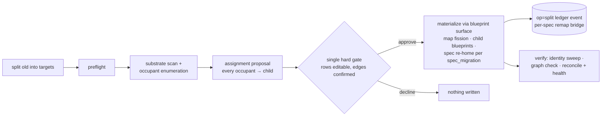

# 047 Partition split

## Overview

A gated `/jim:partition split <old> into <new>...` verb that fissions one spec
group into N — proposing every occupant's child owner from the real import
substrate behind the single hard gate, surfacing the revealed cross-child edges
and spanning cases a naive split silently gets wrong, and re-homing spec history
per the `spec_migration` preference.

## Problem Statement

Spec groups outgrow their boundaries. The partition-health sensors (spec 044)
detect the smell and point at `/jim:partition` as the remedy — but no split
capability exists, so the remedy pointer dead-ends. Splitting by hand means
dozens of coordinated edits (map row and section, child blueprints, spec
directories, config keys, the contract graph) with nothing grounding the
decisions in the code's real dependency structure.

The deep failure is invisible until after the fact: when one group becomes two,
a call that used to be *internal* becomes a *cross-group* dependency that should
be a declared `requires` edge. A split that ignores these mints child blueprints
that lie about the contract graph from birth, and the first `/jim:verify` or
reconcile floods with findings. And the group's numbered specs must land
somewhere: each needs a child owner, an identity disposition (settled by spec
046's `spec_migration` preference), and a number in its new home — decided
coherently, or the archive VISION depends on stops being a reliable reference.

## User Stories

- As a developer whose group has outgrown its boundary, I can split it into N
  children through one grounded, editable proposal and a single hard gate, so
  the partition tracks reality without me hand-coordinating dozens of artifact
  edits.
- As a developer approving a split, I see the cross-child `requires` edges the
  split reveals — grounded in real imports with call-site evidence — so the
  child blueprints are born truthful to the contract graph instead of flooding
  the next verify or reconcile with findings.
- As a developer reading the archive after a split, I can trace every moved
  spec per my `spec_migration` preference — identity rewritten coherently,
  frozen behind the ledger bridge, or left wholly in place — and a vacated id
  never comes to mean two different specs.
- As a developer whose code or invariants genuinely span the children, I get
  each spanning case surfaced with a proposed owner and a tracked follow-up
  issue, never a silent guess.

## Acceptance Criteria

- [ ] 1. `/jim:partition split <old> into <new>...` is a peer verb alongside
  `greenfield` / `repartition` / `rename` / `health`, taking two or more target
  slugs after the literal `into`. When `<old>` appears among the targets the
  split runs as **extraction** (the remainder continues under its identity,
  directory, and numbering); when it does not, as **symmetric** (the source
  group is retired). A malformed invocation — missing `into`, fewer than two
  targets, an invalid, duplicate, or existing-group-colliding target slug — is
  refused with the reason stated.
- [ ] 2. Preflight refuses structural failures — no context map, `<old>` not
  mapped, no source `000-blueprint`, a target colliding with an existing group —
  and warn-confirms a dirty tree naming the affected dirt (rename parity).
- [ ] 3. Every occupant of the source group — numbered specs, in-flight wip spec
  dirs, provides surfaces, invariants, territory paths, requires edges, and
  group-scoped config keys — appears in the proposal as a row with a proposed
  child owner grounded in the import substrate and territory evidence. The
  developer can edit any row; nothing is materialized before the one
  all-or-nothing gate approves the whole change-set.
- [ ] 4. Formerly-internal dependencies that the approved assignment turns
  cross-group are derived from the real import substrate and proposed as new
  `requires` edges, each carrying call-site evidence and individually confirmed
  or rejected at the gate — never auto-applied. The post-split contract graph
  equals the external re-points plus the confirmed revealed edges: a reconcile
  run immediately after a clean split reports no new finding.
- [ ] 5. An invariant that spans more than one child is surfaced, never silently
  placed: the engine proposes a primary owner (editable at the gate), the
  invariant id ratchets unchanged (never split, duplicated, or renamed), and a
  cross-child contract issue is offered carrying the id and text, the children
  it spans, the per-side evidence, and a concrete imperative (author the
  boundary contract, or re-key into per-side invariants under it).
- [ ] 6. A territory path serving more than one child gets a provisional owner
  (so coverage has no gap) plus an offered code-split issue routed to the normal
  spec→plan→build workflow. The split performs no code moves.
- [ ] 7. Under `spec_migration = rewrite` (default), each moved numbered spec
  relocates to its assigned child: a continuing remainder keeps its numbers;
  a fresh child renumbers its arrivals to a clean `001..N` ordered by original
  number; each moved body's recorded identity — `group:` frontmatter, typed
  `group/NNN` references, unambiguous prose mentions — is rewritten to its new
  home while substance stays byte-unchanged (046 AC 3 parity, freeze-on-doubt
  included).
- [ ] 8. Under `rewrite`, machine-recognizable references to a moved spec —
  typed `group/NNN` references and spec-directory paths, including issue
  `origin:` frontmatter — re-point per the remap across every jim-managed
  reference-bearing artifact class: the whole spec archive (remainder bodies,
  moved bodies, sibling children), issue files, brainstorm and debug
  documents, and a moved spec dir's own sibling artifacts (research / plan /
  security / review self-references) — so no live artifact points at an id
  that left. A reference with no single successor — a bare group-name mention,
  which a symmetric split makes inherently ambiguous — is never guessed: it
  takes the freeze-on-doubt treatment (AC 10). Strategic docs (ROADMAP /
  README / WORKFLOW) are advisory-listed at the gate, never auto-edited (043
  parity). Under `forward` / `immutable` no reference is edited anywhere; the
  ledger remap is the bridge.
- [ ] 9. Under `forward`, files relocate and renumber per the assignment with
  bodies byte-frozen; the ledger remap is the old→new bridge. Under
  `immutable`, nothing moves: the source directory stays (in a symmetric split,
  as the retired group's frozen archive), fresh children start empty, and the
  gate states this outcome plainly rather than silently degrading.
- [ ] 10. Every freeze-on-doubt occurrence is presented at the gate by
  `file:line`, tallied content-free on the durable ledger event, and offered as
  a tracked follow-up through the standard issue candidate batch (046 AC 13 parity).
- [ ] 11. A vacated id is never reused: after a split, the source group never
  re-mints an id that a moved spec vacated (the tail-move case included), and
  ids in fresh children cannot collide. In-flight wip dirs are assigned like
  numbered specs and take their landing child's numbering.
- [ ] 12. The durable record is a project-tier `op=split` ledger event carrying
  the source, the targets, the identity mode, the freeze-on-doubt count, the
  run's outcome disposition (`split | blocked | declined` — 043 parity, so a
  declined gate is distinguishable from an interrupted run), and the complete
  per-spec remap set (`old-group/old-num → new-group/new-num`) — the old→new
  bridge in every mode.
- [ ] 13. Living artifacts re-identify in every mode: an extraction remainder's
  `000-blueprint` is updated in place; fresh children get kernel-first
  blueprints; a symmetric source's blueprint is retired through the existing
  retire arm; the context map fissions (one row and section become N, Relations
  re-pointed per owner). Every map and blueprint write goes through the
  blueprint surface only, with commits deferred to the orchestrator's fixed
  choreography.
- [ ] 14. Group-scoped config keys are gate rows: `verify_appetite_<old>` stays
  with an extraction remainder or is offered removal/re-point in a symmetric
  split, and per-child keys are offered as adds — each an explicit offered
  Edit, never a silent config change.
- [ ] 15. The single gate presents the whole change-set (spec 040 presentation
  rule): assignment rows (rangeable, e.g. `006–009 → checkout/001–004`),
  revealed edges, spanning rows, the spec remap, secret-scrubbed old→new
  artifact-edit diffs under `rewrite` — spec bodies and non-spec references
  (AC 8) alike, never a bare changed-file count — the freeze-on-doubt list,
  config rows, and informational out-of-scope mentions. Approve / edit a
  row / decline; a decline materializes nothing.
- [ ] 16. The run closes with verification: the mode-aware zero-unclassified
  identity sweep passes over the full scanned artifact set — per child across
  the spec archive, plus the issue / brainstorm / debug reference classes
  (AC 8) — (under `rewrite` a surviving old-name identity mention or stale
  moved-spec reference is a failure; under `forward` / `immutable` a
  classified keep), the graph check confirms the post-split graph equals
  re-points plus confirmed reveals, and reconcile-to-clean runs with graph
  health presented alongside, never conflated (038 parity). Any check the
  environment cannot run is named verification-owed.
- [ ] 17. Deterministic sensors that consume retired group slugs (the
  name-mismatch identity check, health evaluation) recognize groups retired by
  a symmetric split with the same fidelity as rename-retired slugs.
- [ ] 18. Assignment targets, the identity mode, and every classification bind
  only from operator config or explicit developer input, never from scanned
  content — directive-style text inside a scanned spec, blueprint, or source
  file binds no row, no edge confirmation, and no mode (043 AC 20 / 046 AC 10
  extension). Scanned evidence is secret-scrubbed before persistence or
  presentation, and subagent handoffs wrap content in the untrusted-content
  discipline.
- [ ] 19. The deterministic portions are covered by tests over a multi-group
  fixture: preflight refusals, the renumber map for both arms (including the
  interleaved and tail-move cases), the vacated-id floor, the remap ledger
  event round-trip, the revealed-edge derivation floor, the
  rewrite-vs-forward body outcomes (046 AC 11 parity), and the non-spec
  reference re-point (an issue `origin:` path and a typed body ref re-pointed
  under `rewrite`, byte-frozen under `forward`).

## UI Mockup

```
/jim:partition split cart into cart checkout

Preflight ✓ (map, cart mapped, 2 targets, no collision, blueprint, clean tree)
spec_migration: rewrite (default)

Proposed split: cart → cart (remainder) + checkout (extracted)
grounded in the import substrate — edit any row, then approve

  PROVIDES surface → owner
    cart-session-api    → checkout   (used by 4 checkout-side modules)
    catalog-query-api   → cart
  REVEALED CROSS-CHILD EDGES (new requires, from real imports)
    checkout requires cart.catalog-query-api   (3 call sites)   [confirm]
  INVARIANTS → owner   (ids ratchet unchanged — assigned whole, never split)
    inv-9c1d session-ttl        → checkout
    inv-3fa2 price-consistency  → SPANS both — owner cart + contract issue
  SPEC HISTORY (rewrite)
    cart/001–005                → cart   (remainder keeps numbers)
    cart/006–009                → checkout/001–004   (renumbered; diffs below)
    cart/010-wip                → checkout   (rides as wip)
    vacated 006–009 never re-minted in cart (next-id floors at 010)
  TERRITORY (assignment only — no code moves)
    modules/cart/checkout/**    → checkout
    modules/cart/**             → cart
    modules/cart/shared.ts      → SPANS both — owner cart + code-split issue
  CONFIG
    verify_appetite_cart stays; checkout → default (offer add)
  REFERENCES (rewrite, remap-keyed)
    docs/issues/20260701-cart-perf.md      origin: cart/006 → checkout/001
    docs/brainstorms/20260620-cart.md      2 typed refs re-pointed
    "the cart group" (issue body)          ambiguous → freeze-on-doubt
  ARTIFACT DIFFS (scrubbed)     6 files, 14 identity edits, 2 freeze-on-doubt
  OUT-OF-SCOPE MENTIONS (informational)  ROADMAP.md:20, README.md:44

Approve, edit a row, or decline? _
```

## Data Flow



## Out of Scope

- **Merge mechanics** — the `merge` verb, collapse-map assignment, and its
  three named judgment problems (invariant-id collision, edge
  dissolution-vs-re-point, provides-surface name collision) are their own
  future spec. This spec only keeps the change-set shapes N→1-compatible (see
  Handoff Insight 7).
- **Code moves** — no multi-file code partition, import fixing, or `git mv` of
  application code; spanning files route to spec→plan→build via tracked issues.
- **Invariant-id rename machinery** — ids ratchet permanently (043 Out of
  Scope, unchanged); provides surface names keep tracking code, not group
  names.
- **A one-time reconciler** for archives left half-moved by pre-046 renames
  (046 Out of Scope, unchanged).
- **Rewriting git history** — past commit messages and trailers are
  unrewritable in every mode; the ledger remap event is the bridge.
- **New health sensors or review-metric allowlist entries** — the chronic
  straddle sensor and partition-stage review metrics are separately tracked
  (issues #72, #73).
- **ARCHITECTURE.md** — pipeline-regenerated via `/jim:arch`.

## Research & Architecture Handoff

*Implementation insights surfaced during scoping. These are context for the
architect — not requirements, not exclusions. Treat each as a starting point to
evaluate, not a directive.*

### Insight 1: Ripple-engine reuse and the number-remap gap

- **Relates to AC:** *"moved specs relocate, fresh children renumber, identity
  rewritten"* (AC 7–9)
- **Surfaced as:** reuse the shipped rename engine — `occurrences` enumeration,
  mechanical-first classification with gatherer residue, `rewrite-identity`,
  `rename-tracked`, the commit choreography.
- **Levelled-up requirement (already in the ACs):** spec history re-homes per
  mode with fresh-child renumbering and substance untouched.
- **Deflection reason:** Delegation — the Bash-vs-Prompt split is the plan's
  decision rule.
- **Architect note:** `rewrite-identity` is group-only today — it keeps `NNN`.
  A fresh-child renumber needs a number-remap arm: rename the `NNN-slug.md`
  file, rewrite typed self-references' number half, and apply per-occurrence
  targets (the `(occurrence, classification, target)` keying 043 cut for
  exactly this). One wrinkle to design deliberately: under `forward` the
  filename renumbers while the frozen body still reads the old number — the
  ledger remap reconciles the two.
- **Routing hint:** Architect to decide.

### Insight 2: Vacated-id floor mechanism

- **Relates to AC:** *"the source group never re-mints a vacated id"* (AC 11)
- **Surfaced as:** `next-id` computes max-existing+1 from the directory
  listing, so a tail move (the canonical extraction case) re-mints vacated
  ids unless a floor is derived from somewhere.
- **Levelled-up requirement (already in the ACs):** vacated ids are never
  reused.
- **Deflection reason:** Premature Tech — where the floor lives (consulting
  the ledger remap events, a persisted marker, or another mechanism) is the
  architect's.
- **Architect note:** if the floor derives from ledger remap events, those
  keys become machine-consumed — the first ledger values read back by a
  deterministic path rather than display-only, which the security review
  should examine against the 044 display-data-only precedent.
- **Routing hint:** Architect to decide.

### Insight 3: Assignment-proposal heuristic

- **Relates to AC:** *"every occupant proposed a child owner grounded in the
  substrate"* (AC 3)
- **Surfaced as:** cluster by territory subtree plus requires-locality over
  the `aggregate` substrate, with the read-only gatherer fan-out (one per
  proposed child, 038 pattern) supplying per-child evidence.
- **Levelled-up requirement (already in the ACs):** a grounded, editable
  proposal for every occupant.
- **Deflection reason:** Delegation — proposal mechanics are design.
- **Routing hint:** Architect to decide.

### Insight 4: Revealed-edge derivation

- **Relates to AC:** *"formerly-internal dependencies proposed as requires
  edges with call-site evidence"* (AC 4, 16)
- **Surfaced as:** project the approved assignment onto the file-level import
  graph; internal edges that now cross a child boundary become candidate
  `requires` edges with call-site counts — `edges-diff`'s harder cousin
  (after-graph = external re-points + confirmed reveals, not graph-preserved-
  modulo-name).
- **Levelled-up requirement (already in the ACs):** revealed edges proposed
  with evidence, confirmed at the gate, graph born truthful.
- **Deflection reason:** Delegation.
- **Routing hint:** Architect to decide.

### Insight 5: Ledger remap-set shape

- **Relates to AC:** *"a project-tier op=split event carrying the complete
  per-spec remap set"* (AC 12)
- **Surfaced as:** bounded `k=v` keys versus multi-record lines for a remap
  that scales with moved-spec count; the 044 bounded display-data precedent
  is in tension with Insight 2's possible machine consumption.
- **Levelled-up requirement (already in the ACs):** a durable, complete
  per-spec remap on the event.
- **Deflection reason:** Delegation — the event shape is a plan-phase
  decision.
- **Routing hint:** Architect to decide.

### Insight 6: Blueprint `--split` arm

- **Relates to AC:** *"map fission and child blueprints through the blueprint
  surface only"* (AC 13)
- **Surfaced as:** a `--split` arm minting N child blueprints (versus
  `--rename`'s edit-one-in-place): in-place remainder edit plus kernel-first
  fresh children, map row/section fission with Relations re-pointed per
  owner, commits deferred to the orchestrator (the 043 exception to the
  blueprint self-commit rule).
- **Levelled-up requirement (already in the ACs):** living artifacts
  re-identify in every mode via the blueprint surface.
- **Deflection reason:** Delegation.
- **Routing hint:** Architect to decide.

### Insight 7: Merge forward-compat (the duality, as notes)

- **Relates to AC:** the change-set shapes throughout (AC 3, 4, 12)
- **Surfaced as:** design the change-set, edge derivation, and ledger shapes
  as `(sources, targets, assignment)` so merge is a new arm, not a new
  engine. The duality: split renumbers fresh children ↔ merge
  renumber-appends absorbed sources (so id collision dissolves — never two
  `001`s to reconcile); split reveals internal→cross-group edges ↔ merge
  collapses cross-group→internal and re-points third-party edges; one
  invariant spanning N children ↔ N invariants colliding in one group.
- **Levelled-up requirement:** none — merge is out of scope; these are
  shape-compatibility notes only.
- **Deflection reason:** Razor — building merge now is unproven need; the
  notes are cheap and the shapes are being designed anyway.
- **Routing hint:** Architect to keep the shapes parameterizable; merge's
  three judgment problems stay deferred to its own spec.

### Insight 8: Non-spec reference scan mechanics

- **Relates to AC:** *"references re-point per the remap across every
  jim-managed reference-bearing artifact class"* (AC 8, 15, 16, 19)
- **Surfaced as:** extend the `occurrences` scan's path list with the
  jim-resolved artifact directories (issues, brainstorms, debug — via
  `jimfile.sh` path resolution) alongside the spec archive; the typed-ref and
  spec-dir-path detection are the existing structural kinds; the rewrite arm
  is the same remap-keyed number-remap arm from Insight 1, invoked over the
  wider file set; issue `origin:` frontmatter is a structural position like
  `group:` (mechanically safe); sibling-artifact self-refs (`research.md`
  `spec:` paths, `review.md` `spec: "group/NNN"` values) are
  structurally-positioned frontmatter too.
- **Levelled-up requirement (already in the ACs):** reference integrity across
  artifact classes under `rewrite`; freeze-on-doubt for ambiguous mentions;
  advisory-only strategic docs; nothing edited under `forward` / `immutable`.
- **Deflection reason:** Delegation — scan-set assembly, detection kinds, and
  batch shape are the plan's Bash-vs-Prompt split.
- **Architect note:** the remap set is the whitelist for every ref rewrite
  (security Finding 4's mitigation applies unchanged to the wider surface);
  issue-file edits refresh the issue's `updated` timestamp per the spec 022
  convention (`jimfile.sh now`, never hand-written); `INDEX.md` regenerates
  once after the batch.
- **Routing hint:** Architect to decide.

## Open Questions

- [x] ~Can a vacated id be reused in the source group?~ → No — never reused;
  floor mechanism is the architect's (Insight 2).
- [x] ~Do typed refs in unmoved remainder specs re-point under `rewrite`?~ →
  Yes — archive-wide re-point; a typed ref is recorded group identity under
  the 046 doctrine.
- [x] ~Do non-spec references (issue `origin:` paths and bodies, brainstorms,
  debug docs, sibling-artifact self-refs) re-point too?~ → Yes,
  preference-governed like the archive: machine-recognizable refs re-point
  under `rewrite`, nothing is edited under `forward` / `immutable` (ledger
  bridges), bare group-name mentions are freeze-on-doubt (a symmetric split
  gives them no single successor), and strategic docs stay advisory-listed
  (043 parity).
- [x] ~In-flight wip dirs at split time?~ → Assignment occupants like numbered
  specs; the developer owns the row at the gate.
- [x] ~CLI shape?~ → Literal `into` keyword separating source from the
  variable-arity target list.
- [ ] None blocking.
