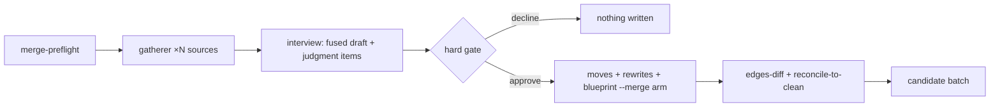

# 048 Partition merge

## Overview

Add `/jim:partition merge <src>... into <target>` — the N→1 counterpart to
split (047) on the shared classified ripple engine — collapsing two or more
spec groups into one behind an interview plus a single hard gate. This
completes the ripple-engine verb family (rename 1→1, split 1→N, merge N→1),
serving the vision's core promise that architectural intent stays documented
and verifiable as a project's shape evolves.

## Problem Statement

The partition doctrine deliberately biases toward fewer, coarser groups
because un-merging is expensive — but partitions still go bad in the merge
direction: two groups become chronically entangled (leaky boundaries,
co-changing provides faces, "everything affects everything" blast radius), or
an early split proves premature. The health sensors already carry a first-class
`Merge signal:` output slot, yet no mechanism exists to act on it. An operator
today must hand-edit the map, both blueprints, spec directories, archive
references, config keys, and the ledger — exactly the invisible, error-prone
bulk edit the gated verb family exists to prevent. Merge is the single
remaining unbuilt verb: the contracts, blueprints, and invariant investment
that make a bad partition *expensive* to keep are the same accretions that make
collapsing it by hand dangerous.

## User Stories

- As a developer maintaining a multi-group project built with jim, I can merge
  spec groups whose boundary no longer carries its weight so that the partition
  is repaired through the same gated, provable machinery as rename and split —
  not a hand edit.
- As a developer, I can absorb a small group into an existing one
  (`merge wishlist into cart`) so that the commonest 2→1 case reads naturally
  at the CLI.
- As a developer, I can merge groups into a fresh slug
  (`merge cart wishlist into shopping`) so that a new unified context can
  supersede its parts.
- As a developer, I am interviewed over the judgment content — the fused
  blueprint prose and any collisions — before the gate, so that I approve a
  resolved change-set rather than rubber-stamping a bulk diff.
- As a future maintainer, I can follow any pre-merge reference — a commit
  trailer, an issue origin, a spec cross-ref — to the spec's post-merge home,
  so that the archive stays navigable after the partition changes.
- As a future maintainer, I can trust that a spec id names exactly one spec —
  even after groups merge, retire, or are re-minted — so that I never act on
  the wrong document.

## Acceptance Criteria

- [ ] 1. **Grammar & arms.** `merge <src>... into <target>` resolves the
  *effective source set* = listed sources ∪ {target, if target is a mapped
  group}. The arm is **absorption** iff the target is a mapped group (the
  target continues; listed sources are absorbed) and **fresh-target** iff the
  target slug is fresh (all sources retire). Listing the target among the
  sources explicitly is legal and dedupes; duplicate listed sources are
  refused.
- [ ] 2. **Degenerate reject.** An effective source set smaller than 2 (e.g.
  `merge a into b` with `b` fresh) is refused with a pointer to
  `/jim:partition rename` — a merge never masquerades as a rename.
- [ ] 3. **Preflight.** A new read-only `merge-preflight` verb names the arm
  and emits per-source structural checks (source mapped, blueprint exists),
  target validation (slug validity; collision when a fresh target's name is
  already a directory or an unmapped group), and territory-identity /
  dirty-tree collection across every source — with split-preflight's rc
  convention (0 clean · 1 structural fail · 2 usage) and field-sanitized
  output. Nothing proceeds on a structural fail.
- [ ] 4. **Full collapse allowed, named.** Merging all mapped groups into one
  is permitted; the gate carries an explicit advisory row stating the partition
  collapses to a single group.
- [ ] 5. **Interview before gate (always).** The flow is mechanical prep →
  read-only gatherer fan-out (one source group per dispatch) → interview →
  single hard gate → materialize. The interview always occurs: it covers the
  fused blueprint draft (Responsibility / Structure / map row) in every run,
  plus one targeted prompt per detected judgment item — differing-text
  invariant-id collision, provides-surface homonym, non-defaultable edge
  disposition, divergent duplicate-requires guarantee text. Mechanical items
  (spec remap, identical-text auto-unifies, forced dispositions) are never
  interviewed; they appear only as gate rows. Quoted blueprint/spec content
  presented during the interview and the gate rides inside untrusted-content
  delimiters; an embedded directive binds nothing — resolutions and
  dispositions bind only from developer responses.
- [ ] 6. **Collision resolution.** Collision *detection* is mechanical
  (id-set and surface-name intersection across source blueprints;
  identical-text collisions auto-unify). Differing-text collisions and
  homonyms resolve in the interview; a re-keyed invariant id is presented at
  the gate as a knowing identifier-ratchet break, and each ratchet break is
  recorded durably — at minimum as old→new id pairs in the merge docs
  commit's body — so invariant lineage survives the merge. A surface collision
  rooted
  in a genuine code-level name clash routes to a tracked issue (merge performs
  no code moves) with the merged face disambiguated descriptively in the
  interim.
- [ ] 7. **Edge collapse.** An edge with both endpoints in the effective
  source set dissolves to internal; the default disposition removes the
  newly-internal surface from the merged Provides face unless a surviving
  third-party consumer forces it public. Every dissolved edge and every
  disposition is a confirmable gate row. Third-party edges re-point to the
  target on the dotted key's group half only — surface names and invariant ids
  otherwise stay byte-identical (the ratchet).
- [ ] 8. **Single hard gate.** One gate presents the fully-resolved change-set
  per the spec-040 presentation rule: a per-group disposition header naming
  every participating group exactly once with its fate — continues (with what
  changes), created (the fresh-target arm), or retires — so an absorption
  target's modification is explicit even when the command line left it
  untyped; the spec remap verbatim
  (rangeable), dissolved and re-pointed edges, collision resolutions, fused
  blueprint and map old→new diffs (secret-scrubbed under `rewrite`), a
  `RETIRES` row per retired source, config rows, and the full-collapse
  advisory when applicable. Approval is all-or-nothing; a declined gate
  materializes nothing.
- [ ] 9. **Deterministic renumber-append.** A deterministic verb computes the
  merge remap with no LLM arithmetic (the 045 script-emitted doctrine): an
  absorption target keeps its numbers
  (no remap rows of its own); absorbed sources renumber-append in CLI argument
  order, each source's specs in ascending original id; in-flight `wip` dirs
  ride in sequence; the append seed honors the vacated floor — `max(target
  dir-max, target vacated-max)` — so a previously-vacated target id is never
  re-minted. The gate presents this remap verbatim.
- [ ] 10. **Identity modes.** `spec_migration` governs moved numbered specs
  exactly as recorded by 046: `rewrite` (default) re-homes histories and
  rewrites moved bodies' identity via `rewrite-identity` per source;
  `forward` moves directories with bodies frozen; `immutable` moves nothing —
  retired source directories stay in place holding frozen specs, and no remap
  is emitted. The mode resolves only from config or explicit developer input,
  and the gate states the mode's consequences.
- [ ] 11. **Reference sweep.** Under `rewrite`, every machine-recognizable
  `group/NNN` ref and spec-dir path across the archive and the issue /
  brainstorm / debug classes re-points under the approved remap — the remap
  table is the whitelist, so a ref to an unmoved spec is unrewritable by
  construction. Bare group-name prose takes freeze-on-doubt; strategic docs
  stay advisory.
- [ ] 12. **Blueprint surface owns doc fusion.** All map and blueprint writes
  go through a new `Skill(jim:blueprint) --merge` arm (sources whitelist +
  approved change-set): map fusion (N rows/sections → 1), the fused group
  blueprint (in-place edit of an absorption target; fresh for a fresh target),
  retirement of every non-continuing source without the standalone `--retire`
  prompt (the merge gate authorized it), and a Contract Graph rewrite that
  collapses cross-source edges and re-points third-party edges — so a
  reconcile immediately after a clean merge reports no new finding. The arm
  defers all commits and returns its touched-file list; `/jim:partition`
  never writes these artifacts directly (the single-writer doctrine — 033
  AC 3 / 038 AC 7).
- [ ] 13. **Territory union & residue.** The merged territory is the union of
  the source territories, each path revalidated at write. In `directory` mode
  the multi-root result is recorded truthfully with the project mode
  unchanged. A code-consolidation issue is offered whenever residue exists —
  always in `directory` mode; in any mode when at least one absorbed root
  embeds a retired source slug. Merge performs no code moves.
- [ ] 14. **Durable bridge event.** The close event is `partition finished
  tier=project op=merge old=<effective sources> new=<target>` carrying the
  per-spec `moved=` remap (rewrite/forward; split's chunking and charset),
  `identity=`, `frozen=`, and `outcome=<merged|blocked|declined>` — never a
  drop+add pair. Its values derive only from the preflight-validated argument
  set and the renumber verb's emitted remap — never from scanned content (the
  045 script-emitted doctrine).
- [ ] 15. **Machine consumers extended.** `vacated-max` accepts `op=merge`
  events under its existing fail-closed element parse, so `next-id` floors a
  re-minted retired source slug past its historical maximum; `identity-check`
  gains the `op=merge` retired-slug arm under one uniform retirement rule —
  retired = old-tokens not among new-tokens — shared with rename and split.
- [ ] 16. **Graph done-condition.** `edges-diff` gains a merge form whose
  expected-after set rewrites every source slug to the target and drops
  consumer==provider rows (the dissolved internals); rc 0 = identical-modulo-
  op remains the post-merge done-condition.
- [ ] 17. **Commit choreography.** A fixed two-commit choreography: docs via a
  new path-scoped `commit-merge` explicit stage set, then map + ledger via
  `commit-map`; spec-dir moves ride `move-spec-dir` per absorbed spec. No code
  commit; no skill gains a git grant (043's script-owned-primitives
  resolution).
- [ ] 18. **Reconcile-to-clean.** Materialization ends with the reconcile pass
  and graph health presented together, never conflated; the merge is complete
  only when the `edges-diff` merge form passes and the reconcile reports no
  new finding.
- [ ] 19. **Misalignments as issues.** The consolidation issue (AC 13),
  code-clash issues (AC 6), and gatherer-surfaced misalignments are offered
  through the end-of-run candidate batch; declining leaves no hidden state
  beyond the truthful artifacts.
- [ ] 20. **Gatherer merge dispatch.** The read-only gatherer gains a merge
  role — one source group per dispatch — returning per-source evidence with
  collision candidates flagged (the dual of split's spanning cases); evidence
  only, the gate binds, and the agent's capability set is unchanged.
- [ ] 21. **Tests.** Every new or extended deterministic verb is covered by
  bash tests over multi-group temp-dir fixtures (reusing or extending the 047
  `split_repo` family): preflight arms and the degenerate reject,
  renumber-append with the floored seed, `vacated-max` over `op=merge`,
  post-merge `next-id`, `identity-check` retirement, and the `edges-diff`
  merge form. Skill and agent prose changes are validated by checklist.

## UI Mockup

The gate, absorption arm (illustrative):

```
MERGE wishlist into cart                              arm: absorption
─────────────────────────────────────────────────────────────────────
CONTINUES  cart — absorbs wishlist (blueprint fused, territory unioned,
           id space extends 007+)
RETIRES    wishlist
SPECS      cart/001–006         keep (no move)
           wishlist/001–004  →  cart/007–010
EDGES      dissolved   wishlist → cart.checkout-hold   (internalized —
                       no surviving third-party consumer)
           re-pointed  billing → wishlist.gift-flag ⇒ billing → cart.gift-flag
COLLISION  invariant `atomic-write` — differing text → unified (interview)
           surface `config` — homonym → re-keyed; code-clash issue offered
BLUEPRINT  cart 000-blueprint fused diff (secret-scrubbed); map: 2 rows → 1
TERRITORY  cart: src/cart/ + src/wishlist/ — retired-slug residue →
           consolidation issue offered
CONFIG     verify_appetite_wishlist — drop (offered)
ADVISORY   (none — partition retains 4 groups)

approve all / decline (nothing materializes)
```

The same disposition header on the fresh-target arm:

```
MERGE cart wishlist into shopping                     arm: fresh-target
─────────────────────────────────────────────────────────────────────
CREATES    shopping — fused from cart + wishlist (blueprint fused,
           territory = union of both, ids appended in CLI order)
RETIRES    cart      (specs → shopping/001–006)
RETIRES    wishlist  (specs → shopping/007–010)
```

## Data Flow



## Out of Scope

- **Detector-side merge signal.** The interpretive rule that turns health
  sensor readings into a merge recommendation (filed:
  `docs/issues/20260722-define-the-merge-signal-interpretive-rule-for-partition-health.md`)
  and issue #72's chronic-straddle sensing. `health`'s `Merge signal:` slot
  keeps its inline judgment.
- **Consolidate-now code moves.** Merge is assignment-only; the rename-style
  move-now fork for territory consolidation is a future enhancement if real
  merges show demand (signed off in the origin brainstorm).
- **Split retrofit to the interview shape.** Filed:
  `docs/issues/20260722-align-partition-split-flow-to-interview-plus-gate-shape.md`;
  waits until merge's interview is validated in practice.
- **Issue #79.** The rename-path re-mint floor gap stays rename's own; neither
  merge arm carries a rename component.
- **New config keys or territory modes.** Merge inherits `spec_migration` and
  `group_territory` unchanged; no per-group mode overrides, no redefinition of
  the `directory` rung.
- **Reconcile measurement additions.** The 039 measurement/interpretation
  boundary holds — merge adds no counters to the reconcile pass.

## Research & Architecture Handoff

*Implementation insights surfaced during scoping. These are context for the
architect — not requirements, not exclusions. Treat each as a starting point
to evaluate, not a directive.*

### Insight 1: Uniform retirement rule via `old=` carrying the effective set

- **Relates to AC:** *"identity-check gains the op=merge retired-slug arm
  under one uniform retirement rule"* (AC #15) and the event shape (AC #14)
- **Surfaced as:** the brainstorm's event-grammar lean — record
  `old=<effective sources>` (including an absorbed target) rather than
  `old=<retired set only>`
- **Levelled-up requirement (already in the ACs):** one retirement rule —
  retired = old-tokens ∉ new-tokens — shared by rename, split, and merge
- **Deflection reason:** Delegation (event grammar is the architect's; the AC
  fixes the observable rule, not the encoding)
- **Architect note:** with this encoding, `identity-check` and `vacated-max`
  extend by widening one op filter each, with zero new parse logic; it also
  makes issue #79's eventual fix (rename carrying identity `moved=` pairs) a
  drop-in. The alternative encoding (`old=` = retired set) reads more
  literally but forks the rule per op.
- **Routing hint:** Architect to decide

### Insight 2: The append seed must be the floored maximum

- **Relates to AC:** *"the append seed honors the vacated floor"* (AC #9)
- **Surfaced as:** seeding the renumber verb from the target's directory max
- **Levelled-up requirement (already in the ACs):** a previously-vacated
  target id is never re-minted
- **Deflection reason:** Delegation (seed sourcing is mechanism)
- **Architect note:** counterexample fixing the requirement: `shopping` held
  001–009, a split moved 006–009 away (dir-max 5, vacated-max 9); a merge
  seeded at dir-max would assign an absorbed spec `shopping/006` — recreating
  the two-referents ambiguity 047 closed. Options: caller passes the seed
  (orchestrator runs `jimfile.sh next-id <target>` first; keeps the verb pure
  and testable) vs cross-script composition inside the verb.
- **Routing hint:** Architect to decide

### Insight 3: `edges-diff` merge form via multi-rewrite + self-edge elision

- **Relates to AC:** *"expected-after rewrites every source slug to the
  target and drops consumer==provider rows"* (AC #16)
- **Surfaced as:** extending `rw()` (built for one slug pair) to N sources
- **Levelled-up requirement (already in the ACs):** rc 0 =
  identical-modulo-op stays the done-condition
- **Deflection reason:** Delegation (awk composition is mechanism)
- **Architect note:** the elision is safe by construction — a pre-merge
  contract graph cannot contain self-edges (the requires face is cross-group
  by template), so post-rewrite self-rows can only be dissolved cross-source
  edges. Whether this is a flag on `edges-diff` or a sibling verb is open.
- **Routing hint:** Architect to decide

### Insight 4: Invariant-id collisions cannot renumber-append

- **Relates to AC:** *"identical-text collisions auto-unify; differing-text
  collisions and homonyms resolve in the interview"* (AC #6)
- **Surfaced as:** 047's forward-compat note "merge renumber-appends absorbed
  sources (so id collision dissolves)"
- **Levelled-up requirement (already in the ACs):** collision resolution is
  unify-or-re-key with the ratchet break made explicit
- **Deflection reason:** Constraint-Sourcing — invariant ids are semantic
  kebab-case slugs (verified against `docs/specs/jim/000-blueprint/spec.md` at
  HEAD), not sequential tokens; there is no number space to append into. The
  047 note holds for spec ids only.
- **Architect note:** the common collision is the same convention declared in
  both groups — identical text, mechanical unify (criticality reconciliation:
  lean max). The rare homonym forces the first sanctioned ratchet break;
  trend continuity for the re-keyed id is knowingly lost and the gate says so.
- **Routing hint:** Architect to decide

### Insight 5: Seam F rides two stale comments

- **Relates to AC:** *"identity-check gains the op=merge retired-slug arm"*
  (AC #15)
- **Surfaced as:** `cmd_identity_check`'s header comment and
  partition-methodology § Health both still say retired slugs come from
  `op=rename` only, while the code already handles `op=split`
- **Levelled-up requirement (already in the ACs):** none — documentation
  accuracy rides the same edit
- **Deflection reason:** Razor (a separate issue would outlive its fix; the
  op=merge edit touches both locations anyway)
- **Architect note:** update both to name all three ops when the filter
  widens; comments state current behavior only.
- **Routing hint:** Architect to decide

### Insight 6: The seam map is the implementation index

- **Relates to AC:** ACs #3, #9, #12, #15–#17 collectively
- **Surfaced as:** the origin brainstorm's grounded seam analysis (A:
  preflight cardinality inversion · B: collision-resolving renumber · C:
  gatherer collision-case arm · D: blueprint doc-fusion arm · E: commit-merge
  · F: identity-check / edges-diff / vacated-max extensions)
- **Levelled-up requirement (already in the ACs):** the observable behavior
  of each seam's verb or arm
- **Deflection reason:** Delegation (attachment points and reuse inventory
  are plan material)
- **Architect note:** the brainstorm and its research handoff cite every seam
  `file:line` against HEAD of `feat/blueprint`; the reusable-as-is list
  (`scan`, `ingest`, `aggregate`, `coverage`, `occurrences`, `rewrite-refs`,
  the gatherer contract, the `san`/helper family) is inventoried there.
- **Routing hint:** Architect to decide

## Open Questions

None.

- [x] ~Gate shape — single vs multi?~ → Interview + single hard gate (Shape
  B); the interview always runs, covering the fused draft plus detected
  judgment items.
- [x] ~Grammar — strict mirror or sugar?~ → Sugar: effective sources = listed
  ∪ existing target; degenerate 1→1 refused toward rename.
- [x] ~Consolidation issue — directory mode only?~ → Mode-independent,
  residue-gated (rename AC #9 precedent; the sensor is a backstop, not the
  tracking channel).
- [x] ~Full collapse to a single group?~ → Allowed, with an explicit advisory
  gate row.
- [x] ~`immutable` coherence when all sources retire?~ → Coherent on both
  arms; retired dirs stay in place and dir-max self-covers a re-mint.
