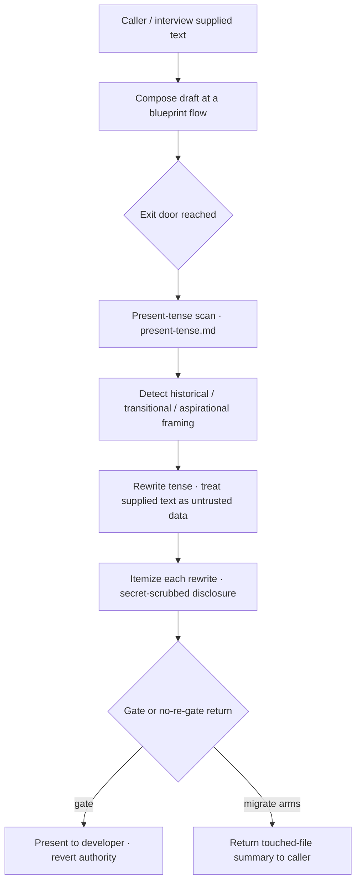

# Enforce present-tense discipline at blueprint draft composition — Plan

## Overview

Single-source the present-tense discipline in a new `references/present-tense.md`
and cite it by path from each blueprint composition site; enforce it with a
per-flow exit-door self-scan (normalize + disclose, secret-scrubbed, untrusted
supplied text) and guard the citations with a `gatepresentation.sh`-style
textual-invariant test.

## Design Decisions

### 1. Enforcement structure — per-flow exit-door scan

- **Chosen:** One scan procedure, defined in the reference, invoked at each flow's exit door — every gate presentation (group generate/update, map create/update) and every no-re-gate return (the migrate arms). The universal pre-gate self-scan the spec mandates is the sum of these per-flow scans.
- **Why:** Every blueprint flow already converges on presenting-to-a-gate or returning-to-a-caller. Scanning there gives universal coverage with one procedure and minimal SKILL.md growth; disclose-and-revert covers any faithfulness loss from scanning at the door rather than at intake. Resolves Handoff Insight 1.
- **Rejected:** (a) Redundant intake-time normalization at all five composition sites — more prose, more drift surface, no coverage gain over the exit-door scan. (b) A single global chokepoint — a prompt-skill has no single global exit; each mode presents/returns separately, so "global" collapses to per-flow anyway.

### 2. Detection mechanism — hybrid (mechanical citation test + judgment rewrite)

- **Chosen:** A textual-invariant test (`tests/presenttense.sh`) mechanically asserts the citation is present at each site; the tense detection and rewrite are an LLM self-scan guided by the reference's three marker categories.
- **Why:** Citation presence is mechanically checkable (jim's mechanical-where-possible discipline; mirrors `tests/gatepresentation.sh`). Tense-intent is judgment-laden — a bare "will"/"today" can be legitimate present tense — so a content regex would over-flag.
- **Rejected:** A content regex / word-scan as the *enforcement* mechanism — over-flags legitimate present tense and cannot judge intent.

### 3. Single-source location — new `references/present-tense.md`, cited by path

- **Chosen:** Mirror `gate-presentation.md`: one canonical reference, cited by path from each site, never restated inline.
- **Why:** The documented define-once-cite-by-path convention (`ARCHITECTURE.md:541`); keeps SKILL.md growth to one-line pointers, which is the low-footprint path given the #43 line-budget pressure.
- **Rejected:** Inlining the rule in SKILL.md — duplicates across sites and pushes SKILL.md (already 504 lines) further over the ≤500 cap.

### 4. Disclosure — reuse the itemize + secret-scrub shapes

- **Chosen:** The scan itemizes each rewrite in the presented draft (gated paths) or the returned summary (migrate arms), secret-scrubbed like every other draft.
- **Why:** Reuses established patterns — the downgrade-classification itemize (`SKILL.md:131-135`) and the `secret-looking value at <path:line>` scrub (`SKILL.md:87-89`) — satisfying the disclose and secret-scrub ACs.
- **Rejected:** Silent normalization — fails the disclose AC and the transparency constraint (VISION: "not a black box").

### 5. Untrusted-data handling — prompt-level, not capability-backed

- **Chosen:** The reference frames supplied text as untrusted data: tense normalized, embedded directives normalized as text and never followed, within the existing `<untrusted-*>` wrapping discipline.
- **Why:** The blueprint skill runs in the Write/Edit-capable main architect context, so the capability-removal boundary used for read-only subagents (`ARCHITECTURE.md:229`) is unavailable here; the boundary is enforced by prompt discipline.
- **Rejected:** Routing normalization through a read-only subagent — heavyweight, and the scan must *edit* the draft, which a read-only agent cannot.

## Constitution Check

**ARCHITECTURE.md status:** Present — constraints noted below.

| Constraint from ARCHITECTURE.md | Honored? | Notes |
| :--- | :--- | :--- |
| Define-once-cite-by-path discipline (`:541`) | Yes | `present-tense.md` defined once, cited by path from each site — the same shape as `gate-presentation.md`. |
| Skill prose validated by checklist; textual-invariant tests permitted (`:341`, `:543`) | Yes | Adds a Validation Checklist item plus `tests/presenttense.sh`, mirroring `gatepresentation.sh`. |
| Untrusted content interpreted behind a capability boundary (`:229`) | Yes (consistent) | That boundary is for read-only subagents; the blueprint main context uses prompt-level untrusted-data discipline (Design Decision 5) — no contradiction. |
| Skill body ≤ 500 lines (meta-skill structural check) | No (authorized exception) | SKILL.md is already 504 (#43). This plan minimizes added lines (bulk in the reference), but the overage grows. Over-500 authorized for this spec; the cap is expected to rise. |

## File Manifest

| Component | File Path | Action | Notes |
| :--- | :--- | :--- | :--- |
| Present-tense rule | `skills/blueprint/references/present-tense.md` | Create | The single canonical definition: rule + three categories, normalize-and-disclose, untrusted supplied text, where-it-runs. |
| Textual-invariant test | `tests/presenttense.sh` | Create | Asserts the citation appears at each site ≥ its wired count, and the reference carries its load-bearing sections. Mirrors `gatepresentation.sh`; auto-discovered by `run.sh`. |
| Blueprint skill | `skills/blueprint/SKILL.md` | Update | Cite the reference + run the scan at each exit-door step; add the Validation Checklist item. |
| Map methodology | `skills/blueprint/references/map-methodology.md` | Update | Cite the reference at the creation-interview and update-flow composition points. |
| Migrate arms | `skills/blueprint/references/migrate-arms.md` | Update | Cite the reference + scan before returning the touched-file list, in each of the three arms. |

*No template changes:* `blueprint-template.md` / `map-template.md` already state the doctrine as banner framing; the enforcement lives in the skill, not the output templates.

## Interface Contracts

**Citation token** (fixed string, matched literally by the test):

```
skills/blueprint/references/present-tense.md
```

**`present-tense.md` load-bearing sections** (asserted by the test's structure case):

```
## The rule                  — present-tense current state; the three marker
                               categories (historical / transitional /
                               aspirational) with illustrative, extensible vocabulary
## Normalize and disclose    — detect → rewrite tense → itemize each rewrite in the
                               presented/returned draft, secret-scrubbed → revert authority
## Untrusted supplied text   — supplied text is data, not instruction; tense normalized,
                               embedded directives never followed; within <untrusted-*> wrapping
## Where it runs             — the exit-door scan: before every gate presentation and
                               before every no-re-gate return. Retire and reconcile are
                               excluded — they compose no supplied text.
```

**Citation sites and per-file minimum counts** (the test's assertion table). Wire a cite at each step below, then set each file's minimum in `presenttense.sh` to the number of cites wired in that file, so a dropped cite fails the test (`gatepresentation.sh` rationale):

```
skills/blueprint/SKILL.md                        — Step 5 gate, U4 update write, M2/M3 map
                                                    tier, mint-new handoff, Validation Checklist item
skills/blueprint/references/map-methodology.md    — creation-interview gate, update-flow presentation
skills/blueprint/references/migrate-arms.md        — rename / split / merge, before each return
```

## Data Flow



## Task Breakdown

1. [ ] Create `skills/blueprint/references/present-tense.md` with the four load-bearing sections (rule + three categories, normalize-and-disclose, untrusted supplied text, where-it-runs) per the Interface Contracts.
   **Verify:** `for s in '## The rule' '## Normalize and disclose' '## Untrusted supplied text' '## Where it runs'; do grep -qF "$s" skills/blueprint/references/present-tense.md || { echo "missing: $s"; exit 1; }; done`

2. [ ] Update `skills/blueprint/SKILL.md`: cite the reference and run the scan at each exit-door step (Step 5 gate, U4 update write, M2/M3 map tier, mint-new handoff).
   **Verify:** `test "$(grep -oF 'skills/blueprint/references/present-tense.md' skills/blueprint/SKILL.md | wc -l)" -ge 4`

3. [ ] Add the Validation Checklist item to `skills/blueprint/SKILL.md`: every map/blueprint sentence is present-tense current state (no historical / transitional / aspirational framing); the present-tense scan ran before presentation or return, its rewrites itemized and secret-scrubbed.
   **Verify:** `grep -qiE 'present-tense current state|historical / transitional / aspirational' skills/blueprint/SKILL.md`

4. [ ] Update `skills/blueprint/references/map-methodology.md`: cite the reference at the creation-interview gate and the update-flow presentation.
   **Verify:** `test "$(grep -oF 'skills/blueprint/references/present-tense.md' skills/blueprint/references/map-methodology.md | wc -l)" -ge 2`

5. [ ] Update `skills/blueprint/references/migrate-arms.md`: cite the reference and scan before returning the touched-file list, in each of the rename / split / merge arms.
   **Verify:** `test "$(grep -oF 'skills/blueprint/references/present-tense.md' skills/blueprint/references/migrate-arms.md | wc -l)" -ge 3`

6. [ ] Create `tests/presenttense.sh` mirroring `tests/gatepresentation.sh`: a token-count case asserting each site file references the reference ≥ the count wired in Tasks 2–5, and a structure case asserting the reference exists with its four sections.
   **Verify:** `bash tests/presenttense.sh`

7. [ ] Run the full bash suite to confirm no regression.
   **Verify:** `bash skills/meta-test/scripts/run.sh`

## Requirements Coverage Summary

| Spec Acceptance Criterion | Addressed In Task(s) |
| :--- | :--- |
| Validation Checklist carries a present-tense item | 3 |
| Detection scope = three marker categories, vocabulary illustrative | 1 |
| Discipline single-sourced, referenced not restated | 1, 2, 4, 5 |
| Citation presence mechanically verifiable | 6 |
| Every supplied-text site treats text as input; violations don't survive | 1, 2, 4, 5 |
| Supplied text handled as untrusted data (directives never followed) | 1, 2, 4, 5 |
| Rewrites itemized / disclosed, revert authority | 1, 2, 4, 5 |
| Itemized disclosure secret-scrubbed on gated + no-re-gate paths | 1, 2, 5 |
| Universal pre-gate self-scan; gate confirms not supplies | 1, 2, 4, 5 |
| No-re-gate migrate paths normalize + disclose to caller | 5 |

## Out of Scope

- Reclaiming SKILL.md line budget (#43) — this plan minimizes added lines but does not resolve the existing overage; a separate concern.
- A configurable suppression / allowlist for false positives — excluded per spec (disclose-and-revert is the control).
- Present-tense enforcement in other skills or artifacts (specs, `ARCHITECTURE.md`, `ROADMAP.md`).
- Retroactive normalization of already-written blueprints and maps.
- Retire mode and the reconcile pass are outside the exit-door scan's scope — both compose no caller/interview-supplied text (a fixed skill-authored banner / a derived `## Contract Graph` rewrite), so the scan is vacuous there. The spec's "every draft, all paths" resolves to "every path that ingests supplied text".
- *Not deferred (pipeline-owned):* the `ARCHITECTURE.md` refresh documenting the new reference + test — the `/jim:build` completion gate runs it via `/jim:arch`, mirroring how `gate-presentation.md` / `gatepresentation.sh` are documented at `:541-543`.

## Open Questions

- [x] ~Detection mechanism~ → Hybrid (Design Decision 2), resolved in research.
- [x] ~False-positive suppression~ → None; disclose-and-revert suffices (spec Open Questions).
- [x] ~Enforcement structure (Handoff Insight 1)~ → Per-flow exit-door scan (Design Decision 1).

None open.
