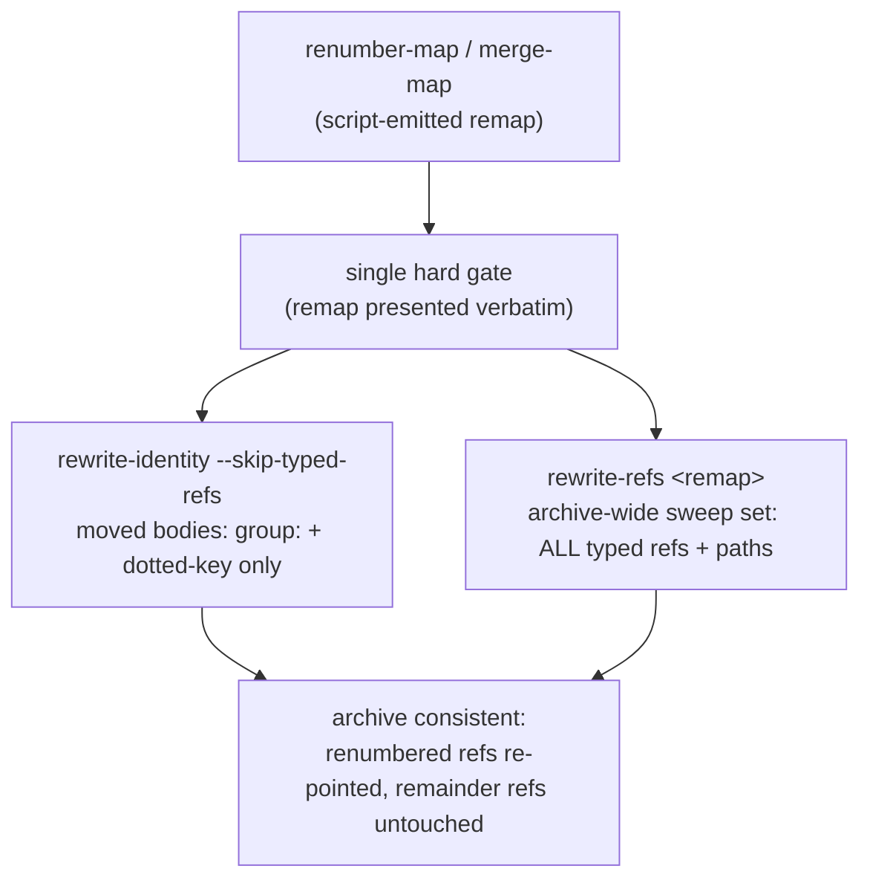

# Partition ref sweep mis-rewrites typed refs on renumbering moves — Plan

## Overview

Add an opt-in `--skip-typed-refs` flag to `rewrite-identity` so renumbering moves (split/merge) leave typed `group/NNN` refs exclusively to `rewrite-refs`' remap sweep, and pin the composed per-arm behavior with regression tests. Rename keeps today's unflagged behavior byte-for-byte.

## Design Decisions

### 1. Mechanism — opt-in `--skip-typed-refs` on `rewrite-identity`

- **Chosen:** A single optional flag, first-position (`rewrite-identity [--skip-typed-refs] <old> <new> <file>...`), that excludes the typed-ref kind from the identity rewrite (no edit, no `REWROTE` record). The split and merge materialize flows pass it; rename does not.
- **Why:** Manifestation 2 is order-independent, so scoping — not reordering — is the necessary fix. A *blanket* skip is behaviorally identical to a remap-aware skip for every non-dangling ref, because both remap emitters cover all live numbers of the affected groups (`renumber-map` emits remainder identity rows; `merge-map` covers every moved source spec — research.md § Anchors). The flag only *narrows* what identity rewrites, leaving the guard surface untouched (security.md Finding 1).
- **Rejected:** *Reorder-only* — empirically insufficient (manifestation 2 breaks in either order). *Remap-aware skip (`--remap <file>`)* — same forget-the-flag fragility, more coupling, zero observable gain over the blanket skip. *Default-flip (identity skips typed refs unless told otherwise)* — misuse-safest polarity, but it changes rename's shipped contract and fails the spec's AC 3 (existing rename/identity tests pass unmodified). *Composed wrapper verb* — the two passes run over different file sets (identity: moved bodies only; refs: the archive-wide sweep set), so one verb cannot own the composition without a clunkier dual-set signature; surface growth without full structural gain.

### 2. Misuse resistance (security.md Finding 2) — pin the composition mechanically

- **Chosen:** Three layers: (a) composed-sweep regression tests per arm that run flag-carrying identity + refs over realistic fixtures; (b) the flag written into every canonical invocation line (SKILL.md split + merge, methodology split + merge) plus a division-of-labor sentence in both sweep-assembly sections; (c) a *prose-pin test case* that greps the four canonical invocation lines for `--skip-typed-refs`, so a future flow edit that drops the flag fails the suite, not the archive.
- **Why:** The original bug shipped through prose drift; (a)+(b) alone cannot detect a prose regression. The prose-pin converts the residual risk into a deterministic check — the only mechanical answer available once the default-flip is off the table (Decision 1).
- **Rejected:** *Accepting the residual* — cheap but leaves the exact channel that caused this bug unwatched. *Structural default* — see Decision 1. **Note:** the prose-pin stretches `tests/jimpartition.sh`'s per-script charter (it asserts doc content, not script behavior); flagged for the developer at approval.

### 3. Documented sweep order — retained (identity, then refs)

- **Chosen:** Keep the shipped order in both flows; the doc edits add the flag and state that typed refs belong exclusively to the remap sweep on renumbering moves.
- **Why:** With typed refs out of identity's set, order is inert for the collision zone — retaining it minimizes doc churn, and AC 4's prose/mechanism agreement is met by the flag + the division-of-labor sentence.
- **Rejected:** Flip to refs-first — pure churn once scoping lands; would touch the same lines for no behavioral difference.

### 4. Test shape — unit cases plus composed-arm regressions

- **Chosen:** Additive cases in `tests/jimpartition.sh` beside the existing verb blocks, using the `git_init`/`repo_add` fixture pattern (template: `case_jimpartition_rewrite_refs_typed_ref`, `tests/jimpartition.sh:1774-1783`): flag-unit cases for `rewrite-identity --skip-typed-refs`, then two composed cases mirroring the empirical repros — split extraction arm (manifestations 1 + 2 in one fixture) and merge arm (manifestation 1).
- **Why:** The composed cases are the regression contract the spec demands (AC 5) — they exercise the exact two-verb sequence the flows document, over both arms.
- **Rejected:** Script-level-only unit tests — they cannot catch a wrong composition, which is where this bug lived.

## Constitution Check

**ARCHITECTURE.md status:** Present — constraints noted below.

| Constraint from ARCHITECTURE.md | Honored? | Notes |
| :--- | :--- | :--- |
| Bash-vs-Prompt: deterministic work lives in scripts | Yes | Fix is a script flag + prose alignment; no LLM judgment added |
| Remap-as-whitelist (only remap-listed `group/NNN` touched by refs) | Yes | `rewrite-refs` untouched; flag only narrows identity |
| Write-primitive containment guard (guards-before-any-edit, tracked-only, symlink escape) | Yes | Guard pass unchanged; flag parsed before it, alters only the awk token branch |
| Location-only output (no matched content in stdout/stderr) | Yes | Skipped tokens emit nothing; no new output |
| Slug-gated `awk -v` inputs | Yes | Flag is a fixed literal, not interpolated; `old`/`new` gates unchanged |
| Bash + POSIX only, `set -uo pipefail`, no third-party deps | Yes | awk/grep only |
| No spec/artifact IDs in code comments | Yes | Comments state behavior only |

## File Manifest

| Component | File Path | Action | Notes |
| :--- | :--- | :--- | :--- |
| Ripple engine | `skills/partition/scripts/jimpartition.sh` | Update | Flag parse in `cmd_rewrite_identity` (`:1654-1665`), `skiptyped` in the awk typed branch (`:1750-1751`), usage line (`:68`), header comment (`:1645-1653`) |
| Engine tests | `tests/jimpartition.sh` | Update | Additive only: flag-unit cases, two composed-arm regressions, prose-pin case |
| Split/merge flows | `skills/partition/SKILL.md` | Update | Flag in the two canonical invocation lines (`:369`, `:425`) |
| Flow protocols | `skills/partition/references/partition-methodology.md` | Update | Flag in materialize steps (`:493-495`, `:678-680`); division-of-labor sentence in sweep assembly (`:458-469`, `:643-650`) |
| Gatherer persona | `agents/gatherer.md` | Update | One-line caveat to the mechanical-floor parenthetical (`:60-64`): typed refs belong to the remap sweep on renumbering moves |
| This plan | `docs/specs/jim/051-partition-ref-sweep/plan.md` | Create | — |

## Interface Contracts

```text
rewrite-identity [--skip-typed-refs] <old> <new> <file>...
  --skip-typed-refs   Optional, first position only. Typed `<old>/NNN` refs are
                      left untouched — no rewrite, no REWROTE record. The
                      `group:` frontmatter and dotted-key rewrites, the guard
                      pass, rc contract (0 applied / 2 usage-guard-slug), and
                      location-only output are unchanged. Without the flag,
                      behavior is byte-identical to today (rename path).

Composition contract — renumbering moves (split both arms, merge), rewrite mode:
  rewrite-identity --skip-typed-refs <old> <child|target> <moved-spec-files>...
  rewrite-refs <remap> <sweep-set-files>...
  ⇒ every remap-covered typed ref lands on its post-materialize id (group AND
    number); refs to remainder specs are untouched; group:/dotted-key identity
    re-points; the two verbs commute over typed refs.
```

## Data Flow



## Task Breakdown

1. [x] **Reproduce** both manifestations against the unfixed engine in a throwaway fixture (temp dir, `git init`, one tracked file with `src/002` + remap `src/002→target/008`; one with `old/002`/`old/005` + remap incl. the identity row): run the documented order and confirm the wrong refs.
   **Verify:** `cd "$(mktemp -d)" && git init -q . && git -C . config user.email t@t && git -C . config user.name t && printf 'ref src/002\n' > m1.md && printf 'src/002\ttarget/008\n' > r1.tsv && git add m1.md && bash /mnt/src/jim/skills/partition/scripts/jimpartition.sh rewrite-identity src target m1.md >/dev/null && bash /mnt/src/jim/skills/partition/scripts/jimpartition.sh rewrite-refs r1.tsv m1.md >/dev/null; grep -q 'target/002' m1.md && echo M1-REPRODUCED`

2. [x] **Red:** add flag-unit test cases to `tests/jimpartition.sh` (beside the `rewrite-identity` block): `--skip-typed-refs` leaves typed refs untouched and emits no `typed-ref` record while `group:`/dotted-key rewrites still land; unflagged behavior unchanged on the same fixture. Cases fail against the unmodified script.
   **Verify:** `cd /mnt/src/jim && ! bash skills/meta-test/scripts/run.sh jimpartition`

3. [x] **Green:** implement the flag in `cmd_rewrite_identity` per the Interface Contract — parse `--skip-typed-refs` ahead of the positionals, thread `-v skiptyped=` into the awk, require `!skiptyped` on the typed branch (`typed && !skiptyped`); update the usage line and the function header comment to state the new behavior.
   **Verify:** `cd /mnt/src/jim && bash skills/meta-test/scripts/run.sh jimpartition`

4. [x] **Regression (composed arms):** add the two composed-sweep cases — split extraction (moved body with a renumbered ref *and* a remainder ref; remap with both rows; flag-carrying identity + refs in documented order; assert `child/001` and `old/005` survive correctly) and merge (moved body `src/002` → assert `target/008`). Depends on task 3.
   **Verify:** `cd /mnt/src/jim && bash skills/meta-test/scripts/run.sh jimpartition`

5. [ ] **Doc alignment:** add `--skip-typed-refs` to the canonical invocation lines in `skills/partition/SKILL.md` (split `:369`, merge `:425`) and `partition-methodology.md` (split `:493-495`, merge `:678-680`); add the division-of-labor sentence to both sweep-assembly sections; add the gatherer.md mechanical-floor caveat.
   **Verify:** `test "$(grep -c 'skip-typed-refs' /mnt/src/jim/skills/partition/SKILL.md)" -eq 2 && test "$(grep -c 'skip-typed-refs' /mnt/src/jim/skills/partition/references/partition-methodology.md)" -ge 2 && grep -q 'skip-typed-refs' /mnt/src/jim/agents/gatherer.md`

6. [ ] **Prose-pin test:** add the case asserting the four canonical invocation lines carry the flag (grep-based, location-only assertions). Depends on task 5.
   **Verify:** `cd /mnt/src/jim && bash skills/meta-test/scripts/run.sh jimpartition`

7. [ ] **Full-suite + no-modification check:** whole test suite green; existing test cases untouched (additions only).
   **Verify:** `cd /mnt/src/jim && bash skills/meta-test/scripts/run.sh && git diff -U0 -- /mnt/src/jim/tests/jimpartition.sh | grep '^-[^-]' | wc -l | grep -qx 0`

## Requirements Coverage Summary

| Spec Acceptance Criterion | Addressed In Task(s) |
| :--- | :--- |
| AC 1 — every typed ref in a moved body lands on its post-materialize id (group + number per remap) | 3, 4 |
| AC 2 — extraction arm: refs to remainder specs untouched | 4 |
| AC 3 — rename behavior unchanged; existing tests pass unmodified | 2 (unflagged case), 7 |
| AC 4 — documented sweep order agrees with the engine's guarantee | 5, 6 |
| AC 5 — regression test covers both arms and both manifestations | 2, 4 |

## Out of Scope

- **`ARCHITECTURE.md` verb-catalog refresh** — gate-handled, not a deferral: the `/jim:build` completion gate regenerates it via `/jim:arch`.
- **Post-materialize ref-integrity tell** and **archive audit** — declined in the spec (Out of Scope there).
- **Dangling-ref handling** (typed refs to ids absent from the remap) — degrade unchanged per spec.
- **Generalized prose-lint tooling** (linting all SKILL.md invocation lines against script contracts) — the prose-pin case covers only this composition; anything broader is future work.

## Open Questions

- [x] ~~Mechanism: reorder vs scope vs wrapper~~ → opt-in `--skip-typed-refs` flag (Decision 1; reorder empirically insufficient, wrapper blocked by the dual file-set shape).
- [x] ~~Security Finding 2's structural default~~ → blocked by AC 3; prose-pin test chosen instead (Decision 2).
