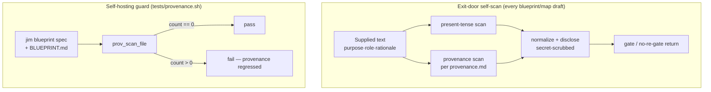

# Guard blueprints and maps against provenance references — Plan

## Overview

Add a companion `provenance.md` doctrine doc (mirroring `present-tense.md`), wire
it into the same exit-door self-scan at every present-tense composition site, and
add a deterministic `tests/provenance.sh` that both proves the detection patterns
fire and guards jim's own blueprint spec + project map against provenance
regressions. jim's own map is normalized *through* `/jim:blueprint` so the new
scan dogfoods itself; the wiring invariant rides the standard post-build fold.

## Design Decisions

### 1. Companion doctrine doc, not a fourth present-tense category

- **Chosen:** a new `skills/blueprint/references/provenance.md`, structured with
  the same four `##` sections as `present-tense.md` (`The rule`, `Normalize and
  disclose`, `Untrusted supplied text`, `Where it runs`).
- **Why:** the developer's scoping decision — provenance is a distinct axis (a
  stable-looking ref to a *mutable* identifier, not a tense marker), so keeping
  "tense" conceptually pure earns a sibling doc. Mirroring the four-section shape
  lets the doc-structure test generalize and pins AC #4's safety sections
  mechanically.
- **Rejected:** a fourth marker category inside `present-tense.md` — conflates
  two axes and muddies the tense doctrine.

### 2. Cite provenance at the same 10 sites as present-tense

- **Chosen:** wire `provenance.md` at every site that cites `present-tense.md`
  (`SKILL.md` ×5, `map-methodology.md` ×2, `migrate-arms.md` ×3); the scan-invocation
  prose becomes "run the present-tense **and** provenance self-scans."
- **Why:** provenance rides the *same* supplied-text drafts through the *same*
  exit door; one scan mechanism runs both. Resolves spec OQ #1. The rename
  migrate-arm's provenance scan is vacuous (identity-only, composes no prose),
  exactly as present-tense's is — the citation documents the discipline.
- **Rejected:** a provenance-only subset of sites — asymmetric, and it would fork
  the wiring test from its `presenttense.sh` template.

### 3. Extend the existing `present-tense` verify invariant, don't add one

- **Chosen:** extend the one `present-tense` wiring invariant's text to require
  sites reference the present-tense **and** provenance rules and run both scans.
- **Why:** the invariant is a *wiring* check; folding provenance in keeps the
  invariant set lean (matches the lean-tracking preference). Resolves spec OQ #3.
- **Rejected:** a parallel `no-provenance` invariant — more surface for no gain.

### 4. Grep patterns live once, as a test helper — no new production script

- **Chosen:** a `prov_scan_file <file>` helper inside `tests/provenance.sh` holds
  the provenance patterns; both the positive-fixture case and the self-hosting
  absence case call it. No production bash script.
- **Why:** the mechanical guard is a self-hosting regression test, exactly like
  `presenttense.sh` (a textual invariant with no script-under-test). The exit-door
  scan is judgment-driven (in the skill), so no shared runtime script is needed —
  adding one would be dead weight.
- **Rejected:** a `jimprovenance.sh` production script — unused by the skill;
  over-engineering.

### 5. Route the two skill-maintained artifacts through `/jim:blueprint`

- **Chosen:** normalize the project map (AC #7) via a `/jim:blueprint`
  project-tier pass during the build — the newly-extended exit-door scan flags the
  boundary-rationale ranges and the developer confirms the functional rewrites;
  the blueprint wiring invariant (AC #8) rides the standard post-build
  `/jim:blueprint --from-review` fold.
- **Why:** both the map and the blueprint spec carry `/jim:blueprint`-maintained
  freshness headers (`Last reconciled` / `Last updated`; `last_full_generate`).
  Hand-editing stales them — the anti-pattern flagged for `ARCHITECTURE.md`.
  Routing through the skill keeps headers correct and *dogfoods* the new scan on
  jim's own map.
- **Rejected:** direct surgical edits — cheaper but stale the freshness headers
  and bypass the surface that owns those artifacts.

## Constitution Check

**ARCHITECTURE.md status:** Present — constraints noted below.

| Constraint from ARCHITECTURE.md | Honored? | Notes |
| :--- | :--- | :--- |
| Bash-vs-Prompt — deterministic work in scripts, judgment in prompts | Yes | The mechanical guard is a deterministic test; provenance *detection in authored drafts* stays LLM judgment in the exit-door scan. No judgment added to a script. |
| No third-party deps (bash + POSIX) | Yes | `tests/provenance.sh` uses `grep` / `wc` / `tr` only. |
| Textual-invariant test convention (`presenttense.sh` / `gatepresentation.sh`) | Yes | New test clones that shape: `PROV_`-prefixed globals, `rows` min-counts, `run_discovered_cases` tail. |
| File-level identifier uniqueness (aggregate runner sources all `tests/*.sh`) | Yes | All globals/helpers carry a `PROV_` / `prov_` prefix. |
| Single-source doctrine (defined once, cited by path, never restated) | Yes | `provenance.md` is the single definition; sites cite it by path. |
| Untrusted-supplied-text discipline | Yes | The doc carries the `Untrusted supplied text` section (AC #4); the scan stays inside the existing `<untrusted-*>` wrapping. |
| Generated docs edited via their skill (map, blueprint spec) | Yes | DD #5 routes both through `/jim:blueprint`. |
| No spec/artifact IDs in `skills/*/scripts/` comments | Yes | The doctrine doc and skill edits carry no provenance; test-file AC citations are under `tests/` (outside that rule's scope). |

## File Manifest

| Component | File Path | Action | Notes |
| :--- | :--- | :--- | :--- |
| Provenance doctrine | `skills/blueprint/references/provenance.md` | Create | Four sections mirroring `present-tense.md`; rule + forms + normalization + over-constraint guard + untrusted-text + secret-scrub |
| Blueprint skill wiring | `skills/blueprint/SKILL.md` | Update | 5 `provenance.md` citations; extend the two scan-invocation blocks (`:147-150`, `:301-304`), the map/mint-new sites, and the checklist item to name both scans |
| Map-methodology wiring | `skills/blueprint/references/map-methodology.md` | Update | 2 citations + scan prose (create/converge + differential update) |
| Migrate-arms wiring | `skills/blueprint/references/migrate-arms.md` | Update | 3 citations (rename/split/merge no-re-gate returns) |
| Provenance guard test | `tests/provenance.sh` | Create | `prov_scan_file` helper + doc-structure, wiring min-count, positive-fixture, self-hosting-absence cases |
| Project map | `BLUEPRINT.md` | Update *(via `/jim:blueprint`)* | Normalize the 4 boundary-rationale ranges to functional cluster names; edited through the skill, headers restamped (DD #5) |
| Blueprint wiring invariant | `docs/specs/jim/000-blueprint/spec.md` | Update *(post-build fold)* | Extend the `present-tense` invariant to cover provenance; delivered via `/jim:blueprint --from-review`, not a build task (AC #8) |

## Interface Contracts

```bash
# tests/provenance.sh — provenance forms the guard recognizes.
# prov_scan_file <abs-file> : print the count of provenance hits (0 == clean).
#   Union of these forms, EXCLUDING the reserved 000-blueprint path:
#     spec id     :  [Ss]pec[ -]0[0-9]{2}          e.g. spec-047, Spec 047
#     spec range  :  [0-9]{3}[-–—][0-9]{3}          e.g. 017–025  (3–3; date-safe)
#     version pin :  v[0-9]+\.[0-9]+\.[0-9]+        e.g. v2.0.0
#     mutable path:  docs/specs/[a-z0-9-]+/0[0-9]{2}-   then drop lines matching /000-blueprint
#
# Wiring-test min-counts (one row per site file, mirrors presenttense.sh):
#     skills/blueprint/SKILL.md                       5
#     skills/blueprint/references/map-methodology.md  2
#     skills/blueprint/references/migrate-arms.md     3
#
# provenance.md load-bearing sections (doc-structure case asserts each):
#     ## The rule              ## Normalize and disclose
#     ## Untrusted supplied text   ## Where it runs
```

## Data Flow



## Task Breakdown

1. [x] **Doctrine doc + doc-structure guard.** Create `tests/provenance.sh` (clone
   `tests/presenttense.sh` shape, `PROV_` globals) with `case_provenance_rule_doc_structure`
   asserting `provenance.md` exists and carries its four `##` sections (Red — doc
   absent). Then create `skills/blueprint/references/provenance.md`: the rule (a
   blueprint/map references a group's surface by stable current-state name, never
   by the mutable spec/version that introduced it), the flagged forms + their
   normalization, the over-constraint guard (verb names, functional groupings,
   the reserved `000-blueprint` path, dates/counts are legitimate), the
   `Untrusted supplied text` discipline, and the secret-scrubbed
   `Normalize and disclose`.
   **Verify:** `bash /mnt/src/jim/tests/provenance.sh rule_doc_structure`

2. [x] **Wire citations + extend the scan prose.** Add `case_provenance_sites_reference_rule`
   with the min-count rows (Red — 0 citations). Then add a `provenance.md`
   citation at each of the 10 present-tense sites and extend the two SKILL.md
   scan-invocation blocks, the map-methodology sites, and the migrate-arm returns
   to run "the present-tense and provenance self-scans"; extend the SKILL.md
   checklist item.
   **Verify:** `bash /mnt/src/jim/tests/provenance.sh sites_reference_rule`

3. [x] **Detection helper + fixtures.** Add `case_provenance_detect_forms` calling
   `prov_scan_file` on two temp fixtures (Red — helper undefined). Then define
   `prov_scan_file` per the Interface Contract: a positive fixture (`spec-047`,
   `017–025`, `v2.0.0`) counts ≥ 3; a negative fixture (a `000-blueprint` path, a
   functional grouping, a `2026-07-13` date) counts 0.
   **Verify:** `bash /mnt/src/jim/tests/provenance.sh detect_forms`

4. [x] **Self-hosting guard + map normalization via `/jim:blueprint`.** Add
   `case_provenance_self_hosting_clean` asserting `prov_scan_file` == 0 on both
   `docs/specs/jim/000-blueprint/spec.md` (already clean) and `BLUEPRINT.md` (Red —
   the map carries `017–025` / `026–028` / `029–034` / `035–037`). Green: run
   `/jim:blueprint` (project tier); the extended exit-door scan flags the ranges,
   confirm the functional rewrites (drop the parenthetical ranges), and the skill
   restamps the map's freshness headers. Depends on tasks 2 and 3.
   **Verify:** `bash /mnt/src/jim/tests/provenance.sh self_hosting_clean && bash /mnt/src/jim/skills/meta-test/scripts/run.sh`

## Requirements Coverage Summary

| Spec Acceptance Criterion | Addressed In Task(s) |
| :--- | :--- |
| AC 1 — canonical companion doctrine doc, cited by path | 1 |
| AC 2 — enumerated forms + normalization, illustrative/extensible framing | 1 |
| AC 3 — over-constraint guard (legit names, `000-blueprint`, dates) | 1, 3 (negative fixture) |
| AC 4 — untrusted-text + secret-scrub discipline, pinned by doc-structure test | 1 |
| AC 5 — deterministic guard: jim's artifacts provenance-free | 3 (helper), 4 |
| AC 6 — wiring test: min-count citations of the companion doc | 2 |
| AC 7 — jim's map normalized through the blueprint surface | 4 (via `/jim:blueprint`) |
| AC 8 — `/jim:verify` senses a dropped provenance citation | Post-build fold (see Out of Scope) |
| AC 9 — coverage exercises the shipped forms as fixtures | 3 |

## Out of Scope

- **AC 8 — the blueprint wiring-invariant update.** Delivered via the standard
  post-build `/jim:blueprint --from-review` fold, where the extended-wiring diff
  drives the `present-tense` invariant's provenance extension (developer-confirmed
  at the fold gate). This is *pipeline-owned* — a jim phase performs it — not a
  deferral to a human, and not a hand-edit (DD #5 keeps the blueprint
  edited-via-skill). The build delivers everything the fold consumes.
- **The ARCHITECTURE.md refresh** — the `/jim:build` completion gate runs
  `/jim:arch`; not a plan task.
- **Mechanical coverage of arbitrary/consuming-project blueprints** — the guard is
  self-hosting only; consuming projects get the judgment exit-door scan (spec Out
  of Scope).
- **The extended `CLAUDE.md` artifact-ref set** (AC/Finding/DD/issue/line-ranges) —
  tracked as issue #93.

## Open Questions

- [x] ~~OQ #1 — cite the companion doc at every site or a subset?~~ → DD #2: the
  same 10 sites present-tense uses.
- [x] ~~OQ #2 — how the build touches the map/invariant?~~ → DD #5: map via a
  `/jim:blueprint` project-tier pass; invariant via the post-build fold.
- [x] ~~OQ #3 — one wiring invariant or a new one?~~ → DD #3: extend the existing
  `present-tense` invariant.
- [ ] None outstanding.
