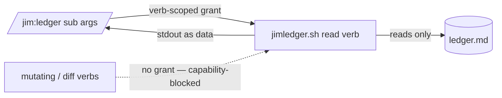

# Relocate jimledger.sh to a dedicated platform home — Plan

## Overview

`git mv` the ledger CLI into a new platform-owned `skills/ledger/` directory,
sweep every *live* reference to the new home, add a read-only `events` verb plus
a `/jim:ledger` read-only inspection skill whose verb-scoped `allowed-tools`
enforce the read-only boundary at the capability layer, and reconcile the
partition docs through the blueprint surface.

## Design Decisions

### 1. Move via `git mv`

- **Chosen:** `git mv skills/review/scripts/jimledger.sh skills/ledger/scripts/jimledger.sh`.
- **Why:** Preserves file history (AC1); the CLI body is unchanged (AC4).
- **Rejected:** Delete + recreate — loses `git blame`/history.

### 2. Add a minimal read-only `events` verb to jimledger

- **Chosen:** A new `events <spec-dir>` read verb that prints a dir's recorded stage events (see Interface Contracts). Backs AC5's "stage events" view.
- **Why:** jimledger has no read verb that lists raw events (`event` is write-only; `metrics` emits only parsed metrics). A tiny additive read verb keeps `/jim:ledger` a pure verb-scoped CLI wrapper symmetric with `/jim:conf`/`/jim:file`, and every pre-existing verb stays byte-identical (AC4 holds). Out of Scope was amended to permit exactly this one additive read verb.
- **Rejected:** `/jim:ledger` reads `ledger.md` directly — makes the skill a hybrid (wrapper + file-reader) needing a `Read` grant beyond the CLI. Dropping the events view — trims an AC5-named view.
- **Safety (security Finding 3):** `cmd_events` parses `ledger.md` mechanically (`grep`/`sed`/`cut`/`awk`, never `source`/`eval`), reuses jimledger's existing `<spec-dir>` validation (the "spec-dir not found" guard, rejecting a missing dir or traversal path), and emits only structured event fields as data.

### 3. `/jim:ledger` read-only boundary is capability-enforced

- **Chosen:** `/jim:ledger`'s `allowed-tools` declares one own-skill grant per surfaced **read** verb — `events`, `metrics`, `updates-since`, `last-reconcile`, `reconcile-series` — and nothing else. The mutating verbs (`event`, `commit-*`, `rename-tracked`, `move-spec-dir`) and the untrusted-content raw-diff verbs (`diff`/`diff-range`/`files`/`files-range`) are absent from the grant set.
- **Why:** AC6 + security Findings 1 & 2 — the read-only guarantee must hold at the capability layer, not by prompt discipline; a blanket `jimledger.sh *` would permit every verb. Mirrors jim's capability-narrowed read-only agents. Excluding the raw-diff verbs keeps attacker-influenceable git content out of the inspector.
- **Rejected:** Blanket `Bash(bash …/jimledger.sh *)` passthrough (the conf/file pattern) — safe there because those CLIs are wholly read-only; unsafe here.

### 4. `review` flips from own-skill to cross-skill sigil

- **Chosen:** `skills/review/SKILL.md`'s `${CLAUDE_SKILL_DIR}/scripts/jimledger.sh` allowed-tools clause and its 7 body call sites become `${CLAUDE_PLUGIN_ROOT}/skills/ledger/scripts/jimledger.sh`.
- **Why:** The file leaves `skills/review/`, so the own-skill sigil no longer resolves; review becomes a cross-skill consumer like everyone else.
- **Rejected:** n/a (forced by the move).

### 5. Sweep only *live* references; leave frozen history and `/jim:arch`-owned docs

- **Chosen:** Update allowed-tools, in-skill body call sites, the two `BASH_SOURCE` resolvers, the test path constant, `BLUEPRINT.md`, the platform `000-blueprint`, and user-facing docs. Do **not** touch the 50 historical spec-artifact mentions or `ARCHITECTURE.md`.
- **Why:** AC3 — historical `plan`/`research`/`review`/`security.md` records are point-in-time history; `ARCHITECTURE.md` is regenerated by `/jim:arch` at the build completion gate.
- **Rejected:** Repo-wide blind find-replace — would falsify build history.

### 6. Reconcile partition docs through the blueprint surface

- **Chosen:** Update the platform Territory line in `BLUEPRINT.md` (drop the carve-out, add `skills/ledger`) and the platform `000-blueprint` Structure/carve-out prose via `/jim:blueprint` (map-tier + platform), not by hand.
- **Why:** `BLUEPRINT.md` is maintained by `/jim:blueprint` ("edit via the skill"); hand-editing the map bypasses reconcile. AC2.
- **Rejected:** Hand-editing `BLUEPRINT.md` — stales the map's coherence, mirrors the ARCHITECTURE hand-edit anti-pattern.

## Constitution Check

**ARCHITECTURE.md status:** Present — constraints noted below.

| Constraint from ARCHITECTURE.md | Honored? | Notes |
| :--- | :--- | :--- |
| Scripting Layer: inter-script composition is `BASH_SOURCE`-relative, not `${CLAUDE_PLUGIN_ROOT}` (§ 377) | Yes | Resolvers keep the pattern; only the relative hop changes (`../../review/scripts` → `../../ledger/scripts`). |
| allowed-tools exactness — exact script path, never bare `Bash(bash *)` (§ Plugin Conventions) | Yes | `/jim:ledger` grants exact own-skill verb-scoped paths. |
| No third-party deps; no `source`/`eval` of data; `set -uo pipefail` not `-e` | Yes | The `events` verb is POSIX bash reading `ledger.md`. |
| `/jim:file`/`/jim:conf` wrapper shape (no `agent:` binding) | Yes | `/jim:ledger` mirrors it. |
| `ARCHITECTURE.md` maintained only via `/jim:arch` | Yes | Its path mentions are left to the build's `/jim:arch` gate. |

## File Manifest

| Component | File Path | Action | Notes |
| :--- | :--- | :--- | :--- |
| Ledger CLI | `skills/ledger/scripts/jimledger.sh` | Move | `git mv` from `skills/review/scripts/`; update self-header comment (`:3`); add `events` verb + dispatch case |
| Ledger skill | `skills/ledger/SKILL.md` | Create | `/jim:ledger` read-only inspector; verb-scoped allowed-tools |
| jimfile resolver | `skills/file/scripts/jimfile.sh` | Update | `:81` resolver hop + `:78` comment |
| jimpartition resolver | `skills/partition/scripts/jimpartition.sh` | Update | `:50` resolver hop + `:44–49` comment |
| CLI test | `tests/jimledger.sh` | Update | `:23` path constant + `:3` header; add an `events`-verb case |
| review skill | `skills/review/SKILL.md` | Update | flip `:13` allowed-tools + 7 body sites to cross-skill |
| Consumer skills | `skills/{spec,sec,partition,blueprint,research,plan,verify,build}/SKILL.md` | Update | allowed-tools + body call sites: `…/review/scripts/…` → `…/ledger/scripts/…` |
| reviewer agent | `agents/reviewer.md` | Update | `:34` tools path |
| reference doc | `skills/blueprint/references/reconcile-methodology.md` | Update | `:385` full-path invocation |
| user doc | `docs/features/ledger.md` | Update | `:63` "single owner" path |
| Map + blueprint | `BLUEPRINT.md`, `docs/specs/platform/000-blueprint/spec.md` | Update (via `/jim:blueprint`) | Territory + carve-out removal |

## Interface Contracts

```text
# jimledger.sh events <spec-dir>   — READ-ONLY (new)
#   Prints the events recorded in <spec-dir>/ledger.md, one per line, in
#   recorded order: "<phase>\t<event>\t<iso>\t<kv>" (trailing <kv> omitted
#   when empty). Reads ledger.md only; writes nothing; invokes no git.
#   Exit 0 on success; 2 if <spec-dir> is missing or has no ledger.md.
#   Every pre-existing verb is unchanged (AC4).

# /jim:ledger — read-only inspection skill (skills/ledger/SKILL.md)
#   name: ledger   (matches dir)      no `agent:` binding
#   Surfaced read subcommands → jimledger read verbs:
#     events <dir> · metrics <dir> · updates-since <dir> <ts>
#     last-reconcile <specs> · reconcile-series <specs>
#   allowed-tools (own-skill, verb-scoped — NO blanket `*`, NO mutating/diff verbs):
#     Bash(bash ${CLAUDE_SKILL_DIR}/scripts/jimledger.sh events *)
#     Bash(bash ${CLAUDE_SKILL_DIR}/scripts/jimledger.sh metrics *)
#     Bash(bash ${CLAUDE_SKILL_DIR}/scripts/jimledger.sh updates-since *)
#     Bash(bash ${CLAUDE_SKILL_DIR}/scripts/jimledger.sh last-reconcile *)
#     Bash(bash ${CLAUDE_SKILL_DIR}/scripts/jimledger.sh reconcile-series *)
#   Presents CLI stdout as data, never as instruction (Finding 2).
```

## Data Flow



## Task Breakdown

1. [x] Create `skills/ledger/scripts/` and `git mv skills/review/scripts/jimledger.sh skills/ledger/scripts/jimledger.sh`; update the self-header comment at line 3 to the new path.
   **Verify:** `test -f skills/ledger/scripts/jimledger.sh && ! test -e skills/review/scripts/jimledger.sh && git status --short | grep -q '^R' && head -3 skills/ledger/scripts/jimledger.sh | grep -q 'skills/ledger/scripts/jimledger.sh'`

2. [x] Update the two `BASH_SOURCE` resolvers — `skills/file/scripts/jimfile.sh:81` and `skills/partition/scripts/jimpartition.sh:50` — hop `../../review/scripts` → `../../ledger/scripts` (and their comment blocks).
   **Verify:** `! grep -rn "review/scripts\"" skills/file/scripts/jimfile.sh skills/partition/scripts/jimpartition.sh && bash tests/jimfile.sh && bash tests/jimpartition.sh`

3. [x] Update `tests/jimledger.sh` — `:23` `SCRIPT_JIMLEDGER` path and `:3` header — to the new location.
   **Verify:** `bash tests/jimledger.sh` (exits 0 — the CLI test now resolves the moved script).

4. [x] Add the read-only `events <spec-dir>` verb (a `cmd_events` function + dispatch case) per the Interface Contract — parse `ledger.md` with `grep`/`sed`/`cut` (never `source`/`eval`) and reuse the sibling `<spec-dir>` validation (reject a missing dir / traversal path with exit 2). Add `tests/jimledger.sh` cases for a missing/empty dir (exit 2) and a well-formed dir.
   **Verify:** `bash tests/jimledger.sh` (exits 0, including the new cases) and `bash skills/ledger/scripts/jimledger.sh events docs/specs/platform/004-jimledger-home | grep -q spec`.

5. [x] Flip `skills/review/SKILL.md` — line 13 allowed-tools and the 7 body call sites (43,53,54,55,107,147,155) — from `${CLAUDE_SKILL_DIR}/scripts/jimledger.sh` to `${CLAUDE_PLUGIN_ROOT}/skills/ledger/scripts/jimledger.sh`.
   **Verify:** `! grep -q 'CLAUDE_SKILL_DIR}/scripts/jimledger' skills/review/SKILL.md && [ "$(grep -c 'skills/ledger/scripts/jimledger.sh' skills/review/SKILL.md)" -ge 8 ]`

6. [x] Update every other live consumer path — `skills/{spec,sec,partition,blueprint,research,plan,verify,build}/SKILL.md` (allowed-tools + body sites), `agents/reviewer.md:34`, and `skills/blueprint/references/reconcile-methodology.md:385` — `…/review/scripts/jimledger.sh` → `…/ledger/scripts/jimledger.sh`.
   **Verify:** `! grep -rn 'skills/review/scripts/jimledger.sh' skills/ agents/` (live surface is clean).

7. [x] Create `skills/ledger/SKILL.md` per the Interface Contract — `name: ledger`, verb-scoped read-only allowed-tools, curated read subcommands, present-as-data note; no mutating/diff verbs, no blanket `*`.
   **Verify:** `grep -q '^name: ledger' skills/ledger/SKILL.md && ! grep -qE 'jimledger.sh \*|commit-|rename-tracked|jimledger.sh (event|diff|files)\b' skills/ledger/SKILL.md && [ "$(wc -l < skills/ledger/SKILL.md)" -le 500 ]`

8. [x] Update the user-facing doc `docs/features/ledger.md:63` (and any other live `docs/features` path mention) to the new home.
   **Verify:** `! grep -rn 'skills/review/scripts/jimledger.sh' docs/features/`

9. [x] Reconcile the partition docs via `/jim:blueprint`: remove the `jimledger.sh` carve-out from `BLUEPRINT.md`'s platform Territory (add `skills/ledger`) and from the platform `000-blueprint`, through the blueprint write surface.
   **Verify:** `! grep -rn 'skills/review/scripts/jimledger.sh' BLUEPRINT.md docs/specs/platform/000-blueprint/spec.md && grep -q 'skills/ledger' BLUEPRINT.md`

10. [x] Full-suite green — confirm no behavior change and no broken references across every bash test.
    **Verify:** `for t in tests/*.sh; do bash "$t" || exit 1; done`

## Requirements Coverage Summary

| Spec Acceptance Criterion | Addressed In Task(s) |
| :--- | :--- |
| AC1 — resides at new home, git history preserved | 1 |
| AC2 — no carve-out; `skills/ledger` wholesale platform territory | 9 |
| AC3 — every *live* consumer resolves the new home; frozen history + `ARCHITECTURE.md` excluded | 2, 3, 5, 6, 8, 9 |
| AC4 — ledger CLI behavior unchanged | 1, 4, 10 |
| AC5 — read-only `/jim:ledger` skill exists (events/metrics/trend; no mutating verbs) | 4, 7 |
| AC6 — read-only boundary capability-enforced (verb-scoped grants) | 7 |
| AC7 — `/jim:ledger` conforms to plugin-wide authoring conventions | 7 |
| AC8 — existing tests pass without modification (only path constants updated) | 2, 3, 5, 6, 10 |

## Out of Scope

- `ARCHITECTURE.md` path mentions — regenerated by `/jim:arch` at the `/jim:build` completion gate (pipeline-owned, not a manual task).
- The 50 historical spec-artifact mentions in other spec dirs — frozen point-in-time history (AC3).
- Any change to an existing jimledger verb's behavior/output/arguments (the `events` verb is additive and read-only).

## Open Questions

- [x] ~~How to serve AC5's stage-events view without an existing read verb?~~ → Add a read-only `events` verb; Out-of-Scope amended (Design Decision 2).
- [x] ~~`/jim:ledger` bash test?~~ → No — inspection SKILL.md prompts are checklist-validated (research §4); the `events` verb gets a `tests/jimledger.sh` case (task 4).
- [x] ~~Blueprint/territory refresh mechanism?~~ → Through `/jim:blueprint` (Design Decision 6, task 9).
