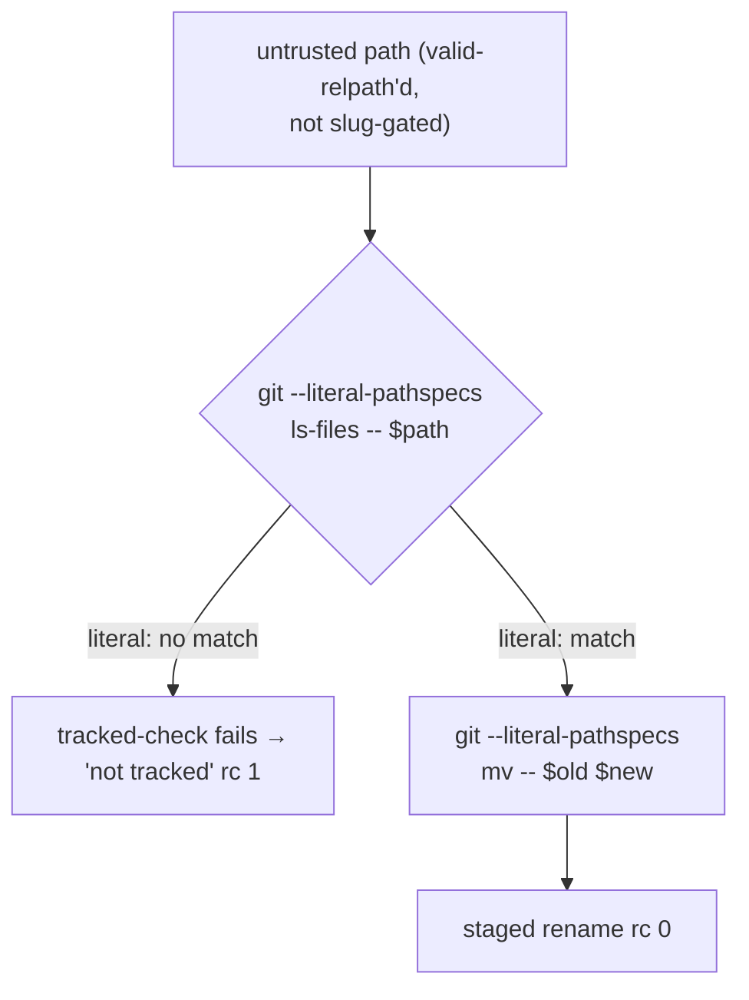

# Neutralize pathspec magic in the ledger git-mv primitives — Plan

## Overview

Add git's native `--literal-pathspecs` neutralizer to the four git calls in
`cmd_rename_tracked` and `cmd_move_spec_dir` that receive an untrusted path,
add a regression case per primitive, and restore the reworded
`relpath-validation` invariant to the platform blueprint via `/jim:blueprint`.

## Design Decisions

### 1. Neutralization mechanism — `git --literal-pathspecs <subcmd>` flag form

- **Chosen:** the top-level `--literal-pathspecs` option before each subcommand
  — `git --literal-pathspecs ls-files -- "$path"` and
  `git --literal-pathspecs mv -- "$old" "$new"` — at all four call sites.
- **Why:** explicit and self-documenting at each call site; symmetric with the
  file's existing `--end-of-options` ref-neutralizer (`resolve_ref`, line ~134);
  and inherently per-call — it cannot leak into other git invocations the way a
  process-wide `GIT_LITERAL_PATHSPECS` export or repo `git config` could
  (directly satisfies security.md Finding 2). Verified (git 2.54.0): the flag
  form neutralizes `:(glob)…` / `:/…` / `:!…` and leaves literal file and
  directory paths matching normally.
- **Rejected:** `GIT_LITERAL_PATHSPECS=1 git …` env prefix — equivalent effect
  but easier to accidentally hoist to a script-wide export (the process-wide
  footgun that would break intentional-glob pathspecs like
  `scripts/jim-deps-refs.sh`'s `'skills/*/SKILL.md'`), and less consistent with
  the file's inline `--end-of-options` style.

### 2. Coverage — all four calls (both primitives × {ls-files, mv})

- **Chosen:** neutralize `ls-files` and `mv` in both `cmd_rename_tracked` and
  `cmd_move_spec_dir`.
- **Why:** `git ls-files` is the live magic sink (proven: it matches on
  `:(glob)…`); `git mv` already rejects magic sources (`fatal: bad source`) but
  is included so "every untrusted path is handed to git only literally" holds
  uniformly, making the restored invariant's letter trivially true.
- **Rejected:** ls-files-only — leaves `git mv` syntactically passing a path in
  pathspec position; uniform coverage is simpler to state and verify.

### 3. Regression discriminator — assert the early tracked-check refusal

- **Chosen:** feed each primitive a pathspec-magic path that *pre-fix* matches
  at `git ls-files` (bypassing the tracked-check and proceeding to a
  `git mv failed`), and assert *post-fix* rc 1 **plus** stderr matching the
  tracked-check refusal (`old path is not tracked` / `source not tracked`).
- **Why:** the message difference is a mechanical discriminator — pre-fix the
  path reaches `git mv` and stderr reads `git mv failed`; post-fix the literal
  path fails the tracked-check first and stderr reads `not tracked`. Asserting
  rc alone is insufficient (both paths return rc 1). Verified both directions.
- **Rejected:** asserting only the exit code — pre-fix already returns rc 1 via
  `git mv failed`, so rc alone would not catch a regression.

### 4. Magic-family coverage across the two cases

- **Chosen:** the rename-tracked case uses a long-form `:(glob)…`; the
  move-spec-dir case uses a short-form leading-`:` (`:/…`). Both verified
  interpreted pre-fix and neutralized post-fix.
- **Why:** satisfies security.md Finding 1 — neutralization is proven across a
  `:(…)` long form and a leading-`:` short form, not a single syntax.
- **Rejected:** one magic form in one primitive — leaves the other primitive and
  the other magic family unproven.

### 5. Invariant restoration goes through `/jim:blueprint`, not a hand-edit

- **Chosen:** restore the `relpath-validation` row and edit the fail-closed note
  in `docs/specs/platform/000-blueprint/spec.md` by invoking
  `Skill(jim:blueprint)` with `platform` — the blueprint write surface — as a
  step performed by the orchestrating agent **after** the code tasks are green.
- **Why:** the group blueprint is authored by its skill; a hand-edit bypasses
  the surface and stales its provenance/header. The restoration is fail-open —
  it must land only once the code conforms, so it depends on Task 3.
- **Rejected:** a direct `Edit` of the blueprint `spec.md` — bypasses the
  authoring surface. Note the TDD `@coder` lacks the `Skill` tool, so this step
  is not part of its Red-Green-Refactor loop (see Open Questions).

## Constitution Check

**ARCHITECTURE.md status:** Present — constraints noted below.

| Constraint | Honored? | Notes |
| :--- | :--- | :--- |
| Bash + POSIX only, no third-party deps | Yes | `--literal-pathspecs` is a native git option; no new dependency. |
| `set -uo pipefail`, not `set -e` | Yes | No change to the script's error-handling mode. |
| `--` end-of-options / pathspec guards preserved | Yes | The `--` separators stay; `--literal-pathspecs` precedes the subcommand. |
| `BASH_SOURCE`-relative inter-script composition | Yes | Untouched — no new `JIMFILE` resolution. |
| No spec IDs / artifact refs in code comments | Yes | Any new comment states current behavior only — no spec/AC/finding IDs. |
| Test conventions (testlib, name-discovered `case_*`) | Yes | New cases follow `tests/jimledger.sh` conventions. |

## File Manifest

| Component | File Path | Action | Notes |
| :--- | :--- | :--- | :--- |
| Ledger git-mv primitives | `skills/ledger/scripts/jimledger.sh` | Update | Add `--literal-pathspecs` to the 4 git calls (`ls-files`/`mv` in `cmd_rename_tracked` and `cmd_move_spec_dir`). |
| Ledger tests | `tests/jimledger.sh` | Update | Add one pathspec-magic refusal case per primitive. |
| Platform blueprint | `docs/specs/platform/000-blueprint/spec.md` | Update (via `/jim:blueprint platform`) | Restore the reworded `relpath-validation` row; drop it from the fail-closed note. |

## Interface Contracts

The exact neutralized call forms (the coder replaces only the `git` invocation,
leaving each surrounding guard and message unchanged):

```bash
# cmd_rename_tracked
git --literal-pathspecs ls-files -- "$old"        # was: git ls-files -- "$old"
git --literal-pathspecs mv -- "$old" "$new"       # was: git mv -- "$old" "$new"

# cmd_move_spec_dir
git --literal-pathspecs ls-files -- "$src"        # was: git ls-files -- "$src"
git --literal-pathspecs mv -- "$src" "$dst"       # was: git mv -- "$src" "$dst"
```

Reworded `relpath-validation` invariant (Task 4, authored via `/jim:blueprint`):
repo-relative path inputs pass `valid-relpath` (non-empty, not absolute, no `..`
segment) before recording or git use; and every untrusted path is handed to git
only under literal-pathspec semantics (`git --literal-pathspecs …` /
`GIT_LITERAL_PATHSPECS`), so pathspec magic (`:(exclude)` / `:/` / `:(glob)`) is
never interpreted. Project-wide script rule; criticality `critical`, check
`judge`.

## Data Flow



## Task Breakdown

1. [x] **Reproduce** — confirm the defect: on a scratch repo, the current
   `cmd_rename_tracked` interprets a magic `$old`, bypassing the tracked-check
   and failing later at `git mv`.
   **Verify:** `d=$(mktemp -d); git -C "$d" init -q; git -C "$d" -c user.email=t@t -c user.name=t commit -q --allow-empty -m x; mkdir -p "$d/modules/cart"; echo a > "$d/modules/cart/a.js"; git -C "$d" add -A; git -C "$d" -c user.email=t@t -c user.name=t commit -qm f; (cd "$d" && bash /mnt/src/jim/skills/ledger/scripts/jimledger.sh rename-tracked ':(glob)modules/**' ':(glob)modules/renamed' 2>&1) | grep -q 'git mv failed'` (exit 0 = bug reproduced: magic reached `git mv`)

2. [x] **Regression (Red)** — add `case_jimledger_rename_tracked_refuses_pathspec_magic` (long-form `:(glob)…`, via `rename_git_fixture`) and `case_jimledger_move_spec_dir_refuses_pathspec_magic` (short-form `:/…` injected through the specs-dir arg, via `move_git_fixture`) to `tests/jimledger.sh`, each asserting rc 1 **and** `ERR` matching the tracked-check refusal (`not tracked`). Use `run_jimledger_in` + `assert_exit` + `assert_match`.
   **Verify:** `bash skills/meta-test/scripts/run.sh jimledger 2>&1 | grep -E 'FAIL - case_jimledger_(rename_tracked|move_spec_dir)_refuses_pathspec_magic'` (both new cases present and **failing** against current code)

3. [x] **Fix (Green)** — insert `--literal-pathspecs` into the four git calls per Interface Contracts, leaving guards and messages unchanged.
   **Verify:** `grep -c 'git --literal-pathspecs' skills/ledger/scripts/jimledger.sh` prints `4` **and** `bash skills/meta-test/scripts/run.sh jimledger 2>&1 | tail -1` reports `0 failed` (all cases, including the 2 new, pass)

4. [ ] **Restore invariant** — via `Skill(jim:blueprint)` with `platform`: return the reworded `relpath-validation` row (Interface Contracts) to the Invariants table and remove its clause from the fail-closed note (keeping the script-preamble clause). *Orchestrator/skill step — not part of the `@coder` TDD loop (Design Decision 5).*
   **Verify:** `grep -q '^| relpath-validation ' docs/specs/platform/000-blueprint/spec.md && ! grep -A6 'deliberately not recorded' docs/specs/platform/000-blueprint/spec.md | grep -q 'relpath-validation rule'` (row present in table; no longer named in the note)

## Requirements Coverage Summary

| Spec Acceptance Criterion | Addressed In Task(s) |
| :--- | :--- |
| AC #1 — magic path treated literally by the tracked-check (→ "not tracked", no spurious match) | 1 (repro), 2, 3 |
| AC #2 — every path-receiving git call (`ls-files` + `mv`) in both primitives treats paths literally | 3 |
| AC #3 — legitimate literal sibling rename / spec-dir move still succeeds unchanged | 3 (existing rename-tracked/move-spec-dir happy-path cases stay green) |
| AC #4 — `relpath-validation` row restored (reworded, project-wide) + dropped from the fail-closed note | 4 |
| AC #5 — regression test covers the reported scenario | 2 |

## Out of Scope

- The two sibling `git ls-files` sites in `skills/partition/scripts/jimpartition.sh`
  (`cmd_rewrite_identity`, `cmd_rewrite_refs`) — blueprint-group territory,
  tracked as issue #107 (a genuine deferral: a future spec picks it up).
- The `script-preamble` rule's clause in the fail-closed note stays as-is; only
  the `relpath-validation` clause is removed.
- `cmd_valid_relpath`'s own shape logic and the other guards (sibling, slug,
  containment) — unchanged by design.

## Open Questions

- [x] ~~Which mechanism form — flag or env?~~ → `git --literal-pathspecs <subcmd>` flag form (Design Decision 1).
- [x] ~~Can the TDD `@coder` perform Task 4?~~ → No (it has no `Skill` tool); Task 4 is a `/jim:blueprint platform` invocation the orchestrating agent runs after Tasks 1–3 are green. `/jim:build` executes the code/test tasks; the blueprint restoration is the sequenced skill step that follows.
