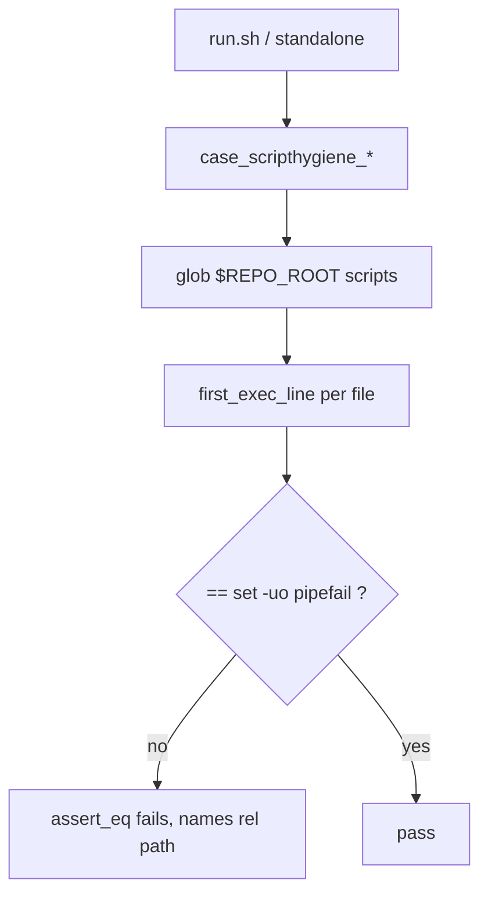

# Script-preamble conformance and invariant restoration — Plan

## Overview

Add `set -uo pipefail` directly to the three inheriting scripts under a new TDD guard test that sweeps every first-party script, then restore the now-held `script-preamble` invariant to platform's blueprint **through `/jim:blueprint`** (not a hand-edit) and close #99.

## Design Decisions

### 1. Restore the invariant via `/jim:blueprint`, not a hand-edit

- **Chosen:** Execute AC3 by running `/jim:blueprint platform` after the code conforms, and confirm the restored row + Structure update at the skill's section-diff gate.
- **Why:** `docs/specs/platform/000-blueprint/spec.md` is skill-generated — its header states *"Generated by `/jim:blueprint platform`; every claim traces to the group's specs, ARCHITECTURE.md, and code."* The withhold note is itself the blueprint skill's violation-fork output; once the code conforms the skill re-detects the invariant as **held** and restores it. A hand-edit bypasses the skill and collides with the `fork-no-silent-rewrite` and skill-maintenance invariants.
- **Rejected:** Coder hand-edits the Invariants table and deletes the withhold paragraph — bypasses `/jim:blueprint`, stales the doc's generation provenance, and re-authors a formerly-violated row outside the fork mechanism.

### 2. TDD ordering — guard test first (Red), then fix the scripts (Green)

- **Chosen:** Author `tests/scripthygiene.sh` first so it fails naming the three holdouts, then add the preamble lines to turn it green.
- **Why:** the guard *is* the test for this refactor; writing it first gives a real Red→Green cycle and proves the check actually catches the violation rather than being born green.
- **Rejected:** Fix scripts first, add the test after — the test would never be shown to catch the violation, masking the substring false-positive trap below.

### 3. Matcher — first executable line, anchored (never a substring)

- **Chosen:** For each file take the first line after the shebang and any leading comment/blank lines, and assert it matches `^[[:space:]]*set -uo pipefail`.
- **Why:** a substring `grep -q 'set -uo pipefail'` **false-passes `run.sh`** (its only occurrence is the comment at `run.sh:34`) and any file that merely mentions the string (research; security Finding 1). "First executable line" matches the invariant wording and is satisfiable by all 24 files.
- **Rejected:** substring match (false-positives); `count=N` (brittle — breaks on any script add/remove).

### 4. Safe path handling in the sweep (routed from the spec-phase safe-path finding)

- **Chosen:** enumerate via a quoted glob anchored to `$REPO_ROOT` (set by testlib), guard each hit with `[[ -e ]]`, quote every path expansion, and read files with `awk` on the quoted path.
- **Why:** file-enumerating tests are where unsafe path handling bites; absolute `$REPO_ROOT`-anchored operands begin with `/`, so a filename is never mistaken for an option, and the check works identically standalone or via `run.sh` regardless of PWD.
- **Rejected:** PWD-relative bare globs (break when not run from repo root); unquoted iteration (space/dash-filename hazard).

### 5. Guard fails closed on empty enumeration (routed from the plan-phase security Notable)

- **Chosen:** the guard counts the files each globbed root contributes and asserts each root yielded ≥ 1 file, so a zero-file sweep FAILS instead of reporting PASS. Enumeration uses the quoted-prefix glob idiom at each call site, keeping the count space-safe.
- **Why:** a per-file-only assertion passes vacuously when enumeration yields nothing (`REPO_ROOT` misresolved, an odd run context, or a future reorg that empties a root), silently voiding AC2's fail-closed intent. Asserting each root is non-empty turns "checked nothing" into a loud failure and also flags a reorg that strands a root.
- **Rejected:** trusting `REPO_ROOT`/globs to always resolve (fails *open* — the exact regression the guard exists to catch); a hardcoded total-count floor (brittle — drifts every time a script is legitimately added or removed).

## Constitution Check

**ARCHITECTURE.md status:** Present — constraints noted below.

| Constraint | Honored? | Notes |
| :--- | :--- | :--- |
| Scripting Layer: `set -uo pipefail`, not `set -e` (CLAUDE.md → Bash scripts) | Yes | The added preamble is exactly `set -uo pipefail`; no `-e`, so the `OUT=$(…)` capture pattern is unaffected. |
| No third-party deps — bash + POSIX only | Yes | Guard uses `grep`/`awk`/glob only. |
| Scripts never `source`/`eval` untrusted data | Yes | The guard `awk`s/greps files; it never sources them. |
| Inter-script composition is `BASH_SOURCE`-relative | Yes | The new test uses the scaffold's `BASH_SOURCE` → testlib source pattern. |
| Tests live under `tests/` | Yes | Guard is `tests/scripthygiene.sh`. |
| `000-blueprint` maintained only via `/jim:blueprint` | Yes | AC3 executed through the skill (Design Decision 1), never hand-edited. |
| `ARCHITECTURE.md` maintained only via `/jim:arch` | Yes | Its refresh is the `/jim:build` completion gate's job (Out of Scope), not a hand-edit here. |

## File Manifest

| Component | File Path | Action | Notes |
| :--- | :--- | :--- | :--- |
| Guard test | `tests/scripthygiene.sh` | Create | Sweeps all first-party `*.sh`; asserts first exec line is `set -uo pipefail`, and asserts each globbed root is non-empty (fail-closed, DD5). Carries its own direct preamble (it is in its own sweep). |
| Runner | `skills/meta-test/scripts/run.sh` | Update | Insert `set -uo pipefail` as first exec line, before `HERE=` (`:48`). |
| Test file | `tests/jimconf.sh` | Update | Insert `set -uo pipefail` as first exec line, before `HERE=` (`:16`). |
| Test file | `tests/jimfile.sh` | Update | Insert `set -uo pipefail` as first exec line, before `HERE=` (`:17`). |
| Issue #99 | `docs/issues/20260725-script-preamble-rule-vs-source-inherited-preambles-fix-or-fold.md` | Update | `status: closed`; refresh `updated` via `jimfile.sh now`. |
| Issue index | `docs/issues/INDEX.md` | Update | Regenerate via `index.sh`. |
| Platform blueprint | `docs/specs/platform/000-blueprint/spec.md` | Update **via `/jim:blueprint`** | Restore `script-preamble` row; drop withhold note; reflect `tests/scripthygiene.sh` in Structure. **Not a hand-edit.** |

## Interface Contracts

The guard test's core check (shape — the coder finalizes within testlib conventions):

```bash
# tests/scripthygiene.sh
first_exec_line() {                       # first non-shebang, non-comment, non-blank line
  awk 'NR==1 && /^#!/ {next}
       /^[[:space:]]*#/ {next}
       /^[[:space:]]*$/ {next}
       {print; exit}' "$1"
}

# Glob expansion happens at each call site with the quoted-prefix idiom
# ("$REPO_ROOT" quoted for space-safety; the /*.sh suffix unquoted so it globs),
# so matched files arrive here as "$@" — space- and dash-safe.
matches()     { local n=0 f; for f in "$@"; do [[ -e "$f" ]] && n=$((n+1)); done; printf '%s' "$n"; }
yn()          { [[ "$1" -ge 1 ]] && echo yes || echo no; }
check_files() {                           # per-file preamble assertion over existing files in "$@"
  local f rel line ok
  for f in "$@"; do
    [[ -e "$f" ]] || continue
    rel="${f#"$REPO_ROOT"/}"; line="$(first_exec_line "$f")"
    ok="no"; [[ "$line" =~ ^[[:space:]]*set\ -uo\ pipefail ]] && ok="yes"
    assert_eq "$rel first exec line sets 'set -uo pipefail'" "yes" "$ok"
  done
}

case_scripthygiene_every_script_sets_pipefail() {
  # fail-closed (DD5): each root must contribute >= 1 file, so an empty sweep
  # FAILS instead of vacuously passing.
  assert_eq "skills/*/scripts enumerated"  "yes" "$(yn "$(matches "$REPO_ROOT"/skills/*/scripts/*.sh)")"
  assert_eq "tests enumerated"             "yes" "$(yn "$(matches "$REPO_ROOT"/tests/*.sh)")"
  assert_eq "top-level scripts enumerated" "yes" "$(yn "$(matches "$REPO_ROOT"/scripts/*.sh)")"
  # per-file: first executable line is the preamble
  check_files "$REPO_ROOT"/skills/*/scripts/*.sh "$REPO_ROOT"/tests/*.sh "$REPO_ROOT"/scripts/*.sh
}
```

Reporting idiom (failing path embedded in the `assert_eq` label) mirrors `tests/gatepresentation.sh:38-57`. File shape (shebang → `set -uo pipefail` → `HERE=` → `source testlib.sh` → standalone tail) follows `skills/meta-test/assets/test-file.sh.tmpl`; scaffold with `/jim:meta-test scaffold scripthygiene`.

## Data Flow



## Task Breakdown

1. [ ] **(Red)** Create `tests/scripthygiene.sh` per Interface Contracts — the `$REPO_ROOT`-anchored sweep, the `first_exec_line` matcher, the per-file `assert_eq`, and the per-root non-vacuous enumeration assertions (DD5). The file carries its own direct `set -uo pipefail` (scaffold shape). It must fail now because the three holdouts lack a direct preamble (the per-root enumeration assertions pass — the roots are non-empty).
   **Verify:** `out=$(bash tests/scripthygiene.sh 2>&1); echo "$out"; ! grep -Eq '0 failed' <<<"$out" && grep -q 'meta-test/scripts/run.sh' <<<"$out" && grep -q 'tests/jimconf.sh' <<<"$out" && grep -q 'tests/jimfile.sh' <<<"$out"`

2. [ ] **(Green)** Insert `set -uo pipefail` as the first executable line — after the header comment block, before the existing `HERE=` — in `skills/meta-test/scripts/run.sh`, `tests/jimconf.sh`, and `tests/jimfile.sh`, matching the scaffold ordering (`set` → `HERE=` → `source`).
   **Verify:** `bash tests/scripthygiene.sh && bash skills/meta-test/scripts/run.sh`  (guard passes AND the full suite passes — existing tests unmodified)

3. [ ] Close issue #99: set `status: closed`, refresh `updated` to `jimfile.sh now`, then regenerate the issue index. Bookkeeping edit (the issue tooling has no edit verb; direct edit is the sanctioned path).
   **Verify:** `grep -q '^status: closed' docs/issues/20260725-script-preamble-rule-vs-source-inherited-preambles-fix-or-fold.md && bash skills/issue/scripts/index.sh`

4. [ ] **(Blueprint surface — run after Tasks 1–3 are green, outside the TDD loop.)** Restore the invariant by running `/jim:blueprint platform`. At its section-diff gate confirm: the `script-preamble` row returns to the Invariants table between `no-source-eval` and `bash-source-relative` with `Check: judge` and sharpened wording (*"directly (not solely via a sourced framework)"*), the withhold paragraph is removed, and `tests/scripthygiene.sh` is reflected in the Structure section.
   **Verify:** `grep -q '| script-preamble |' docs/specs/platform/000-blueprint/spec.md && ! grep -q 'deliberately not' docs/specs/platform/000-blueprint/spec.md`

## Requirements Coverage Summary

| Spec Acceptance Criterion | Addressed In Task(s) |
| :--- | :--- |
| AC1 — every first-party script sets the preamble directly, incl. the 3 inheritors | 2 (fix); 1 (guard proves coverage) |
| AC2 — a deterministic test fails when any script omits a directly-set preamble | 1 |
| AC3 — `script-preamble` row restored as `judge`, withhold note removed | 4 |
| AC4 — issue #99 closed as resolved | 3 |
| AC5 — existing tests pass without modification | 2 (Verify runs the full suite) |

## Out of Scope

- **ARCHITECTURE.md refresh** — performed automatically by the `/jim:build` completion gate via `/jim:arch`; pipeline-owned, not a deferral and not an issue.
- The `must-each` verify-floor extension — tracked as **#109** (blueprint-group engine work).
- The `export LC_ALL=C` clause — unchanged; the guard checks only the `set -uo pipefail` preamble.
- The retired `docs/specs/jim/000-blueprint` copy of the invariant — tracked as **#106**.
- Migrating the existing hardcoded-`rows` textual-invariant tests (`gatepresentation`/`presenttense`/`provenance`) to filesystem sweeps — those intentionally check curated sites, not all files.

## Open Questions

- [x] ~~How is the blueprint row restored — hand-edit or skill?~~ → via `/jim:blueprint platform` (Design Decision 1).
- [x] ~~Matcher strictness / false-positive risk?~~ → first-executable-line, anchored (Design Decision 3).
- [x] ~~Sweep path-safety?~~ → `$REPO_ROOT`-anchored, quoted (Design Decision 4).
