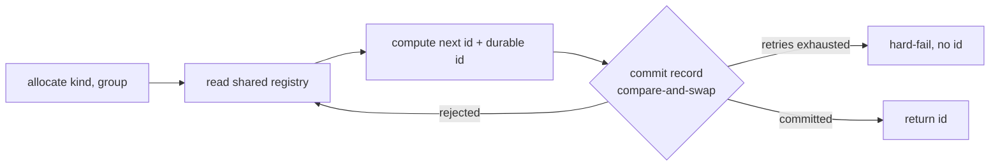

# 007 ID coordination allocator (foundation)

## Overview
A coordination substrate that hands out jim's IDs through a shared, append-only
registry so that separate users on separate branches never claim the same ID —
the foundation the issue-ordinal, spec-ID, and rename-ledger consumers will
build on.

## Problem Statement
Jim allocates IDs from state that lags unmerged work. Issue display ordinals
(`#42`) are assigned at filing time by an uncoordinated `max + 1` scan of the
collection and stored in the issue file — cross-branch duplicates are currently
tolerated as non-fatal; spec ordinals (`dashboard/047`), which *are* the
identity baked into directory paths and commit trailers, are derived from
listing the group on the current branch. When two developers work
the same repo on different branches — jim's near-term reality is separate users
in separate clones — both compute the same "next" ID, and nobody learns until
the branches meet. Unwinding a duplicate spec ordinal is expensive: it is
already frozen in paths, trailers, and cross-references. There is no point at
which allocation is coordinated across the people sharing the repo, so
collision is a matter of timing, not prevention.

## User Stories
- As a developer on a team sharing a repo, I can allocate an ID and trust it is
  mine alone across every clone and branch, so that I never pay the cost of
  unwinding a collision after the fact.
- As a jim skill that needs an ID (a future consumer), I can request one from a
  single allocator that guarantees the ID is durably reserved before I use it,
  so that I do not have to implement coordination myself.
- As a developer working a repo with no remote, I can still allocate
  consistent, non-colliding IDs within my clone, so that single-user and
  offline work is not blocked by the coordination machinery.
- As a developer citing an ID that was later renamed, I can resolve it to its
  current name, so that a reference written at one point in time stays
  dereferenceable after the thing it names moves.
- As a developer setting up jim for a team, I can choose and check in the
  coordination mechanism and the point it writes to, so that everyone sharing
  the repo allocates against the same scheme with no per-machine setup.
- As a developer inspecting the project, I can preview the id the next
  allocation would produce without reserving it, so that a "what's next?" query
  never burns an id or mutates the registry.

## Acceptance Criteria
- [ ] Allocation is at-most-once and durable before return: an ID is handed to
      the caller only after its allocation is durably committed to the shared
      coordination point. If the commit does not succeed, no ID is returned.
- [ ] Two allocations racing for the same next ID never both succeed: the loser
      is rejected, re-reads the shared state, recomputes, and retries within a
      bounded number of attempts; exhausting the attempts fails loudly with a
      clear message rather than issuing a duplicate.
- [ ] An allocated ID is never reused. Abandoning the work behind an ID leaves a
      permanent gap in the sequence; the next allocation does not reclaim it.
- [ ] Resolution is deterministic regardless of contributor clock skew:
      allocation order, not wall-clock timestamps on records, determines every
      outcome.
- [ ] Given an ID that has since been renamed — including across a group
      rename, and across multiple hops — resolution returns its current name. A
      name that was renamed away and later reused, or a rename later reverted,
      never mis-resolves to the wrong referent.
- [ ] A read-only preview reports the id the next allocation would produce from
      the current registry state, without committing anything. The preview is
      advisory: a concurrent allocation may intervene, so it never reserves an
      id and is never used to name a real artifact — only allocation binds.
- [ ] The registry's record vocabulary covers allocation, rename, and
      group-rename. This spec emits allocation records only; a later spec can
      begin emitting rename and group-rename records without any change to the
      record format or the resolution behavior above.
- [ ] Group names are themselves allocated once: a group name, once taken, is
      consumed permanently, so two developers cannot concurrently create the
      same group and a reused group name cannot collide with the original.
- [ ] The guarantee tier follows reachability: when a remote is reachable,
      allocations are coordinated across all clones and users of the repo; when
      no remote exists, allocation still coordinates across the sessions and
      worktrees of the local clone.
- [ ] When the coordination point cannot be reached — whether from network,
      authentication, or push policy — allocation performs bounded retries and
      then hard-fails with a clear message. In the reachable-remote tier it
      never silently falls back to an unpublished local allocation.
- [ ] If the append-only registry's history is truncated or rewritten (for
      example by a force-push or a revert on the coordination branch), the next
      allocation detects the erosion — relative to the history this clone has
      already seen — and hard-fails rather than reissuing an already-consumed
      ID. Detection is defense-in-depth: a first-time clone cannot detect
      erosion that predates its first fetch, so denying force-push and deletion
      on the coordination point is the primary control.
- [ ] When the durable ID form an allocation computes (for example a date-plus-
      slug identifier) already exists in the registry, the allocation is
      disambiguated so the returned durable ID is unique — the same guard covers
      both the ordinal and the durable ID form.
- [ ] Every value read back from the registry or supplied by configuration — an
      id, slug, group name, or the coordination point's name — is revalidated
      through the id/slug/name boundary before it is used as a git argument, a
      ref, or a filesystem path. Parsing the registry as data (below) is
      necessary but not sufficient: the coordination point is writable by anyone
      who can push it, so a crafted record must never reach git or the
      filesystem as an injected option, a path traversal, or an unintended ref.
- [ ] The coordination mechanism, the coordination point it writes to, and the
      unreachable-origin behavior are governed by checked-in configuration read
      from the current branch, so a team's coordination scheme is itself
      versioned and shared.
- [ ] The allocator adheres to jim's bash-script conventions (`CLAUDE.md` →
      Bash scripts; `ARCHITECTURE.md` → Scripting Layer): the registry is
      parsed as data — never sourced or evaluated — using Bash and POSIX text
      tools only, with no third-party dependencies. *(External Constraint —
      sourced to a documented project convention; the coordination branch is
      writable by everyone running jim, so its content is untrusted input.)*

## Data Flow

## Out of Scope
- Wiring the allocator into `/jim:issue` or `/jim:spec`. The consumers that
  replace today's derive-from-tree allocation are their own follow-on specs in
  the `issue` and `sdlc` groups.
- Emitting rename, split, or group-rename records, and the `/jim:partition`
  batch integration that would produce them — a `blueprint`-group follow-on.
  This spec fixes the format those records use; it does not write them.
- `provisional` unreachable-origin mode and the `reconcile` path that would
  later realize provisional IDs. This spec ships the `fail` behavior only.
- Migrating an existing project into the registry (a `seed` step over existing
  spec directories and the issue index) — a follow-on platform spec.
- Where issue or spec *content* lives. The coordination branch this mechanism
  writes to holds only the registry logs — no issue or spec files land on it.
  Whether a filed issue's content is centralized (the `issue_placement` choice)
  is the issue-ordinal consumer's deferred decision, and it targets its own
  destination, not the registry branch.
- A running check that the allocator is the only door to an ID (every ID on the
  branch has a registry record) and safety for relocating the coordination
  point mid-project — both deferred as follow-on issues.
- A non-git (service) backend. The mechanism is pluggable and the config value
  is reserved, but only the git and local tiers are implemented here.
- Changing the shape of the durable issue ID or the `Spec: group/NNN` commit-
  trailer convention.
- Treating registry records as an audit trail or an authorization/integrity
  anchor. The `<who>` and timestamp fields are self-asserted on a coordination
  point that is *less* protected than main; they are advisory provenance only.
  No consumer — here or downstream — may base an authentication, authorization,
  or integrity decision on an ID or a registry record.
- Opaque reservation for sensitive work. Allocation publishes the human-
  readable, title-derived slug to the coordination point at creation time —
  before the work merges — so it is visible to everyone with repo read access
  earlier than today's on-branch-only behavior. Binding an opaque token at
  reservation and the readable slug only at merge is a follow-on, not built
  here; the disclosure surface is acknowledged so a team can weigh it.

## Research & Architecture Handoff

*Implementation insights surfaced during scoping. These are context for the architect — not requirements, not exclusions. Treat each as a starting point to evaluate, not a directive.*

### Insight 1: Single allocator entrypoint

- **Relates to AC:** *"a single allocator that guarantees the ID is durably reserved"* (User Story 2; AC 1)
- **Surfaced as:** the brainstorm's "skills call one allocator script" — a new `jimalloc.sh`, or an extension of the existing `jimfile.sh` that already owns `next-id`/`next-num`.
- **Levelled-up requirement (already in the ACs):** the functional guarantee is at-most-once durable allocation behind one entrypoint; the ACs do not name the script.
- **Deflection reason:** Delegation — entrypoint shape and whether it is a new script vs. an extension is the architect's call, weighed against the platform CLI surface (`jimconf.sh`, `jimfile.sh`, `jimledger.sh`).
- **Architect note:** `jimfile.sh` already computes `next-id`/`next-num` from the tree; the allocator supersedes that derivation. Consider whether the coordinated path replaces or wraps it, and how consumers migrate.
- **Routing hint:** Architect to decide.

### Insight 2: The compare-and-swap realization

- **Relates to AC:** *"durably committed to the shared coordination point"* / *"two allocations racing … never both succeed"* (AC 1, 2, 8)
- **Surfaced as:** git's only atomic primitive is the ref update — origin tier via `git push` (non-fast-forward rejected), local tier via `git update-ref <ref> <new> <expected>`; and for touching the coordination branch from a feature branch, either a temp worktree on that branch or pure plumbing (`hash-object` → `mktree` → `commit-tree` → `push <sha>:<ref>`).
- **Levelled-up requirement (already in the ACs):** the ACs state the compare-and-swap (CAS) *semantics* (loser rejected, retries bounded, tier follows reachability) without prescribing push vs. update-ref or worktree vs. plumbing.
- **Deflection reason:** Delegation — which git primitive backs each tier, and worktree vs. plumbing, are implementation trade-offs (transparency vs. working-dir churn).
- **Architect note:** the worktree path is porcelain and easy to reason about but churns the working dir; the plumbing path is leaner but heavier bash. Non-interactive git (`GIT_TERMINAL_PROMPT=0`) matters so a mid-flow auth prompt cannot hang a consumer; allocate as late as possible in a consumer's flow.
- **Routing hint:** Architect to decide.

### Insight 3: Registry layout and forward-replay resolution

- **Relates to AC:** *"append-only registry"*, *"resolution … allocation order"*, *"renamed … resolution returns its current name"* (AC 3–7, 10)
- **Surfaced as:** one greppable append-only log file per kind (`specs.log`, `issues.log`); records like `spec allocate dashboard/047 <slug> <date> <who>`, `spec rename core/003 dashboard/001 <date>`, `group rename dashboard ui <date>`; resolution as a single forward scan that holds `current` and applies each matching record once, starting replay at the queried ID's `allocate` record.
- **Levelled-up requirement (already in the ACs):** the ACs fix the observable properties — file-order authoritative, cycle-safe multi-hop resolution, reused-name safety, allocate-once groups — without pinning file names or column order.
- **Deflection reason:** Delegation for layout; the *no-source / greppable* property is an External Constraint (below), not a free choice.
- **Architect note:** starting replay at the queried ID's allocate record (not the top of the log) is what makes a reused group name unambiguous. Per-kind files are expected to suffice at jim scale; per-group sharding looks premature.
- **Routing hint:** Architect to decide.

### Insight 4: Erosion guard as a byte-prefix check

- **Relates to AC:** *"detects the erosion and hard-fails"* (AC 9)
- **Surfaced as:** on every fetch, assert the previously-seen registry content is a byte-prefix of the fetched content; a mismatch signals a force-push/revert that un-appended consumed records.
- **Levelled-up requirement (already in the ACs):** the AC states the observable outcome (erosion detected, loud fail, no reissue); byte-prefix is the mechanism.
- **Deflection reason:** Delegation — byte-prefix is one cheap realization; the architect may choose another that satisfies the same detection guarantee.
- **Architect note:** pairs with a documented branch-protection profile for the coordination branch — direct pushes allowed, force-push and deletion denied — an unusual middle protection setting worth calling out in team setup.
- **Routing hint:** Architect to decide.

### Insight 5: Revalidating replayed and config-derived tokens

- **Relates to AC:** *"revalidated through the id/slug/name boundary before it is used as a git argument, a ref, or a filesystem path"* (the injection-guard AC)
- **Surfaced as:** the security review's Critical finding — the coordination point is branch-writable, so replayed ids/slugs/group-names and the config-supplied coordination-point name are attacker-influenced before they become git refs, git arguments, and directory paths. Parse-as-data (the External-Constraint AC) prevents execution but not option-injection or path traversal.
- **Levelled-up requirement (already in the ACs):** the AC states the observable property (a crafted record never injects into git or the filesystem); the concrete gates are the mechanism.
- **Deflection reason:** Delegation — the specific gates are implementation choices that mirror jim's existing discipline.
- **Architect note:** reuse the established boundary exactly — `is_valid_id` / `is_valid_slug` on every replayed token, `--end-of-options` before any ref/SHA, `--` before pathspecs, `--literal-pathspecs` on path arguments (the `jimledger.sh` / `jimpartition.sh` precedent). Validate the config-supplied coordination-point name as a git ref name before it reaches a git command.
- **Routing hint:** Architect to decide.

## Open Questions
- [x] ~Sync-at-allocation UX (hard-fail vs. degrade)~ → `on_unreachable` configurable; this spec ships `fail` plus the no-remote local tier.
- [x] ~Local vs. origin guarantee tier~ → origin out of the box; local is the no-remote degradation.
- [x] ~How much of rename/resolution lands here~ → full record grammar and forward-replay resolution now; emit allocation records only.
- [x] ~Default coordination point for the git mechanism~ → a **dedicated, registry-only** coordination branch (e.g. `jim/registry`), ideally an orphan branch, is the shipped default; `main` is opt-in for small low-traffic teams. The branch carries only the registry logs — no issue or spec content (see Out of Scope).
- [x] ~Verb surface beyond `allocate` + resolve~ → ship `peek`, a read-only, non-authoritative next-id preview: it preserves today's `/jim:file next-id` introspection without turning a query into a durable allocation, and only `allocate` binds. `release` / `reconcile` remain deferred with provisional mode.
- [x] ~Registry granularity~ → one append-only file per kind (`specs.log`, `issues.log`); per-group sharding is premature.
