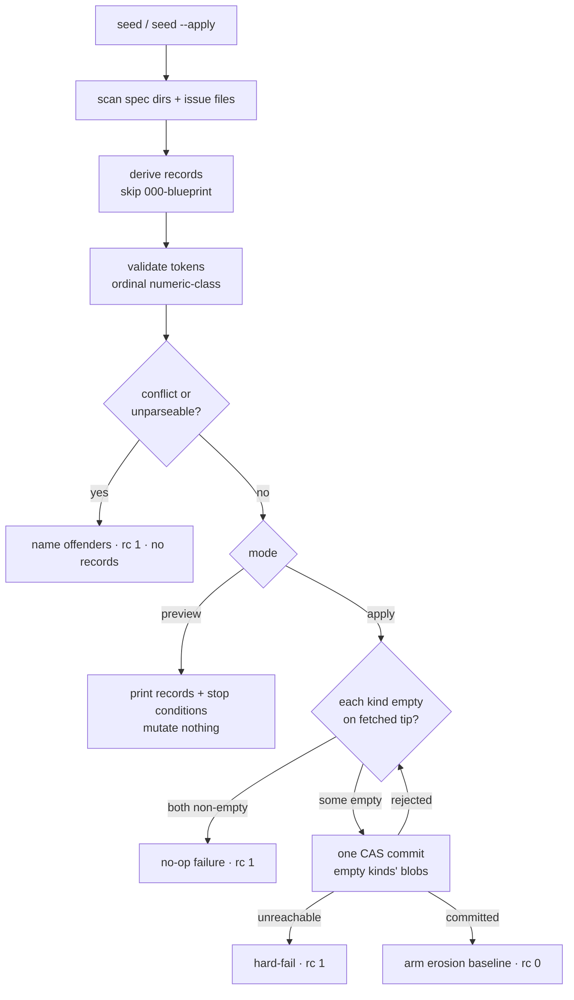

# Registry seed from existing artifacts — Plan

## Overview

A new `seed` verb on `skills/file/scripts/jimalloc.sh` reconstructs the
id-coordination registry from the repo's existing spec directories and issue
files, following jim's one-time-migration doctrine (preview by default,
`--apply` to land) and reusing `platform/007`'s record grammar, git-plumbing CAS,
and `is_valid_id` boundary — so bootstrapping introduces no second, weaker path
to writing the registry.

## Design Decisions

### 1. A `seed` verb on `jimalloc.sh`, not a separate migration script

- **Chosen:** Add `seed` as a subcommand of `skills/file/scripts/jimalloc.sh`, reusing its record encoders (`alloc_encode_allocate_*`), high-water/derivation helpers, config resolution, CAS landing, erosion baseline, and the single `alloc_valid_token` boundary.
- **Why:** Spec AC 8 forbids a second, weaker path to writing the registry; co-locating seed with the allocator keeps the grammar, plumbing, and validation boundary in exactly one place, and lets seed be tested in the existing `tests/jimalloc.sh` fixtures (the `JIMALLOC_REGISTRY_DIR` seam + repo/bare-remote helpers).
- **Rejected:** A standalone `migrate.sh`-style script — would duplicate 007's CAS/plumbing/boundary and create the exact parallel write path the AC forbids.

### 2. Preview-then-apply, mirroring jim's migration doctrine

- **Chosen:** Bare `seed` is a read-only preview (derive + validate + conflict-scan over the tree, print the records it would write and any stop condition, mutate nothing); `seed --apply` runs the same pipeline and lands the commit.
- **Why:** Research → Local Patterns: `migrate.sh` (bare-run-then-`--apply`), `backfill.sh`, and `jimpartition` preflight are uniformly preview-first. This resolves the spec's dry-run open question and makes the AC 5/AC 6 stop conditions observable before anything is written.
- **Rejected:** Apply-only with a `--dry-run` flag — inverts the safe default; the destructive-by-omission shape is exactly what the migration precedent avoids.

### 3. Reconstruct `specs.log` from directory names; `issues.log` from issue frontmatter

- **Chosen:** Spec records come from the directory tree (`jimfile.sh glob specs`): group = parent dir, ordinal+slug = basename (`${name%%-*}` / the remainder). Issue records come from each issue file's frontmatter (`num`, `id`), parsed with the `index.sh` field-reader idiom — never `INDEX.md`.
- **Why:** Spec identity is path-derived — nothing machine-reads a numbered spec's frontmatter (`blueprint/018`), so the tree is authoritative and no `spec.md` is opened. The issue ordinal durably lives in frontmatter `num`; `INDEX.md` is a regenerable projection that can lag or be uncommitted (research Insight 2).
- **Rejected:** Reading `INDEX.md` for issue ordinals — risks seeding from a stale projection.

### 4. One commit lands the empty kinds' logs (two-blob tree when both are empty)

- **Chosen:** A single CAS commit sets the blobs for exactly the kinds being seeded — both `specs.log` and `issues.log` in one two-blob tree when both are empty, one blob when only one kind is empty. Extends the plumbing builder (`alloc_build_commit` sets one blob) to accept ≥1 `(logfile, content)` pair in one tree.
- **Why:** Spec AC 4 ("the entire seed lands as a single durable commit — all derived records or none") honored literally, while AC 5's per-kind refuse is respected by including only the empty kinds. All-or-none atomicity: no observer sees a half-seeded registry.
- **Rejected:** One commit per kind — two observable commits, weaker atomicity than AC 4 asks; and appending to 007's one-file builder per kind would need two CAS rounds.

### 5. Emptiness precondition is evaluated against the CAS-fetched tip, inside the retry loop

- **Chosen:** Per kind, "the target log is empty" is re-checked against the tip fetched on each CAS attempt (not a stale pre-loop read). A kind that is non-empty on the fetched tip is skipped-and-reported; both non-empty is a no-op failure (rc 1).
- **Why:** Security F2 — a concurrent allocation landing between an early emptiness read and the push would otherwise let the seed's bulk records append onto a now-non-empty registry. Re-checking on the fetched tip closes the TOCTOU deterministically; 007's non-fast-forward CAS is the backstop.
- **Rejected:** Check-once-before-loop — leaves the TOCTOU window open.

### 6. Validate every derived token; ordinals get a numeric-class check

- **Chosen:** Every group name / slug / durable id read from the tree passes `alloc_valid_token` / `is_valid_slug`; every ordinal (spec `NNN`, issue `num`) additionally passes a pure numeric-class check (`^[0-9]+$` + a sane magnitude bound) before it enters a record or any `printf '%03d'` / base-10 arithmetic. A token that fails is a stop-and-report condition, never silently coerced or skipped.
- **Why:** Spec AC 9 + Security F3 — directory names and frontmatter are developer-authored inputs that become git arguments; `is_valid_id` admits non-ordinal tokens like `1abc`, so ordinals need their own class check (mirrors `alloc_next_id_spec`'s base-10 discipline). Prevents git option-injection, path traversal, and record/arithmetic corruption.
- **Rejected:** id-boundary only — admits malformed ordinals into records and next-id math.

### 7. Conflict/ambiguity halts the whole seed and names the offenders

- **Chosen:** Before any commit, scan for: duplicate issue display ordinals, duplicate durable issue ids, a spec directory whose ordinal or group cannot be parsed, and an issue file whose `num` or `id` is absent or unparseable. Any hit → list the specific offending artifacts, exit 1, write no records.
- **Why:** Spec AC 6 + Security F1 — the registry's uniqueness cannot represent these, and the halt-and-report decision keeps the fix in the developer's hands. F1 closes the spec↔issue asymmetry (spec dirs and issue frontmatter are treated symmetrically).
- **Rejected:** Renumber/skip on conflict — the halt-and-report scoping decision explicitly forbids silent reconciliation.

### 8. Arm the erosion baseline at seed time

- **Chosen:** After a successful apply commit, write the local per-clone erosion baseline for each seeded log (reuse `alloc_update_baseline`), so the first post-seed allocation's byte-prefix guard compares against the seeded state.
- **Why:** Security F4 — a fresh clone that seeds then allocates otherwise has no baseline, so a force-push that rewrote the registry between seed and first allocation would go undetected. Defense-in-depth; branch-protection remains the primary control.
- **Rejected:** Leave the baseline to the first allocation — leaves a detection gap across the seed→first-allocate window.

### 9. Provenance and ordering are deterministic and advisory-only

- **Chosen:** `<who>` is the synthetic marker `jim-seed`; `<date>` is the issue's `created` date for issue records and today's date (`jimfile.sh date`) for spec records (no date lives in a spec dir). Records are emitted in a deterministic order: per group, the `group allocate` then its specs in ascending ordinal; issues in ascending ordinal.
- **Why:** Spec Handoff Insight 3 — for an allocate-only log neither resolution nor next-id depends on order or provenance (next-id is a high-water max; date is never read for ordering). Determinism keeps the log greppable and the tests stable.
- **Rejected:** Recovering a real author/date per artifact from git history — cost with no functional payoff; provenance is advisory only (007 non-goal).

## Constitution Check

**ARCHITECTURE.md status:** Present — constraints noted below.

| Constraint from ARCHITECTURE.md / platform blueprint | Honored? | Notes |
| :--- | :--- | :--- |
| Bash-vs-Prompt: deterministic logic lives in a bash script | Yes | Seed is deterministic (same tree → same records/next-id) → a `jimalloc.sh` verb; no prompt judgment. |
| Scripting Layer: `set -uo pipefail`, `export LC_ALL=C`, `GIT_TERMINAL_PROMPT=0`, Bash+POSIX only, no third-party deps | Yes | Inherited — `seed` lives inside `jimalloc.sh`'s existing preamble; parsing is glob/grep/sed/awk. |
| `no-source-eval`: never `source`/`eval` untrusted content | Yes | Tree and frontmatter parsed as data (AC 10); DD 6. |
| `ref-validation` / single `is_valid_id` boundary (no fourth copy) | Yes | Reuses `alloc_valid_token` → `jimfile.sh valid-id`; DD 6 adds only a numeric-class check, not a new id copy. |
| Operational-git discipline (`--end-of-options`, `--`, `--literal-pathspecs`, never `git add -A`) | Yes | Reuses 007's plumbing landing; the two-blob builder stays plumbing-only (`hash-object`/`mktree`/`commit-tree`), touching no working tree. |
| `bash-source-relative` composition | Yes | Reuses `jimalloc.sh`'s existing `JIMFILE`/`JIMCONF` resolution. |
| `tests-under-tests` | Yes | Cases extend `tests/jimalloc.sh` (issue #120 already tracks that file's territory declaration — a map concern, not this plan). |

**New capability note (not a violation):** seed reads the local specs/issues tree and lands via 007's shared-ref CAS — no net-new git surface class beyond what 007 introduced. `ARCHITECTURE.md`'s Scripting-Layer entry and the platform `000-blueprint` are refreshed by the `/jim:build` completion `/jim:arch` and `/jim:blueprint` gates (see Out of Scope), not hand-edited here.

## File Manifest

| Component | File Path | Action | Notes |
| :--- | :--- | :--- | :--- |
| Seed verb | `skills/file/scripts/jimalloc.sh` | Update | Add `seed` dispatch + usage/header; pure derivation (tree→records); validation + conflict scan; preview; two-blob single-commit builder + apply landing; emptiness precondition; erosion-baseline arming. |
| Seed tests | `tests/jimalloc.sh` | Update | Fixture-tree derivation, 000-blueprint skip, preview-mutates-nothing, conflict halts (incl. F1), ordinal numeric-class (F3), apply landing + next-id parity + repo-immutability, empty-refuse + TOCTOU no-op (F2), erosion-baseline armed (F4). |

## Interface Contracts

```text
# ── CLI surface (added to skills/file/scripts/jimalloc.sh) ────────────────────
jimalloc.sh seed             # preview: derive+validate+conflict-scan both kinds,
                             #   print records-to-write + any stop condition, mutate nothing
jimalloc.sh seed --apply     # land the empty kinds' records via CAS (one commit)
# Exit codes: 0 success (clean preview / apply landed) · 1 hard-fail (conflict,
#   already-seeded no-op, unreachable, erosion, rejected token) · 2 usage error.
# Errors → stderr; stdout stays clean (preview prints the derived records).
#
# ── Derivation (pure; testable over a fixture tree, no git) ───────────────────
# specs.log — for each <specs>/<group>/<NNN>-<slug>/ with NNN != "000":
#   group allocate <group> <today>  jim-seed        # once per group, first sight
#   spec  allocate <group>/<NNN> <slug> <today> jim-seed
# issues.log — for each <issues>/*.md (exclude INDEX.md), fields num,id,created:
#   issue allocate <num> <id> <created-date> jim-seed
#   order: per group -> group then specs ascending NNN; issues ascending num.
#
# ── Validation (before any commit) ────────────────────────────────────────────
#   group/slug -> alloc_valid_token / is_valid_slug
#   durable id -> alloc_valid_token
#   ordinal (NNN, num) -> ^[0-9]+$ and magnitude <= 999 (spec) / sane (issue)
#   any failure -> stop-and-report (name artifact), rc 1, no records
#
# ── Conflict scan (AC 6 / F1; rc 1, no records, offenders named) ──────────────
#   duplicate issue ordinal · duplicate durable id ·
#   spec dir with unparseable ordinal or group ·
#   issue file with absent/unparseable num or id
#
# ── Precondition (AC 5 / F2) ──────────────────────────────────────────────────
#   per kind: target log must be empty on the CAS-fetched tip (re-checked each
#   attempt). Non-empty kind -> skip+report. Both non-empty -> no-op failure rc 1.
#
# ── Landing (AC 4 / AC 8) ─────────────────────────────────────────────────────
#   one commit sets the blobs for the empty kinds (two-blob tree when both);
#   reuse origin/local CAS (push non-ff / update-ref old-value) + bounded retry;
#   unreachable -> hard-fail, no silent local fallback; post-commit -> arm the
#   local erosion baseline per seeded log (F4).
```

## Data Flow



## Task Breakdown

1. [x] Scaffold the `seed` dispatch on `jimalloc.sh`: `seed` (preview) and `seed --apply`, rc 2 on misuse; extend the header CLI summary and `usage()`. Add a `tests/jimalloc.sh` usage-smoke case.
   **Verify:** `bash tests/jimalloc.sh`

2. [x] Pure derivation layer (no git): given a fixture specs tree + issues dir, emit the `specs.log` (group-allocate once per group, spec-allocate per dir, skip `000-blueprint` — AC 3) and `issues.log` record sets, with `jim-seed` provenance, the DD 9 date rules, and deterministic ordering. Fixture-driven via a tree seam. Depends on task 1.
   **Verify:** `bash tests/jimalloc.sh`

3. [x] Validation + conflict scan (AC 6, AC 9, F1, F3): every token through `alloc_valid_token`/`is_valid_slug`; every ordinal through the numeric-class check; detect duplicate ordinal, duplicate durable id, unparseable spec dir, and absent/unparseable issue `num`/`id` — on any, list offenders, rc 1, no records. Adversarial fixtures (leading-dash slug, `..`-bearing slug, `1abc` ordinal, missing `num`, duplicate `num`, duplicate durable id). Depends on task 2.
   **Verify:** `bash tests/jimalloc.sh`

4. [x] Preview mode: bare `seed` runs derive+validate+conflict over the resolved tree, prints the records it would write and any stop condition, and mutates nothing. Fixtures: preview leaves the registry byte-identical; preview over a conflicting tree reports the offenders and exits non-zero. Depends on task 3.
   **Verify:** `bash tests/jimalloc.sh`

5. [x] Two-blob single-commit builder + `--apply` landing (AC 4, AC 8, AC 2, AC 7): extend the plumbing builder to set ≥1 blob in one commit atop the fetched tip; land the empty kinds via origin/local CAS with bounded retry and unreachable hard-fail. Fixture: a fresh no-remote repo seeds both logs in one commit; `peek spec <group>` equals the pre-seed `jimfile.sh next-id` for each live group and `resolve` of a seeded id returns it (parity); a within-group gap stays a gap; no spec dir is renamed and no issue file is rewritten (repo unchanged but for the registry). Depends on task 4.
   **Verify:** `bash tests/jimalloc.sh`

6. [x] Emptiness precondition + idempotency (AC 5, F2): per-kind emptiness re-checked against the CAS-fetched tip inside the retry loop; a non-empty kind is skipped-and-reported; both non-empty is a no-op failure; a second `seed --apply` after success is a no-op failure that changes nothing. Fixture: re-run is a no-op failure; a kind pre-populated between the fetch and the push (simulated) is refused, not appended. Depends on task 5.
   **Verify:** `bash tests/jimalloc.sh`

7. [x] Erosion-baseline arming (F4) + full-suite green: after a successful apply, write the local baseline per seeded log; fixture — post-seed, a rewritten coordination history is detected by the next allocation. Then run the aggregate runner for no regression. Depends on task 6.
   **Verify:** `bash skills/meta-test/scripts/run.sh`

## Requirements Coverage Summary

| Spec Acceptance Criterion | Addressed In Task(s) |
| :--- | :--- |
| AC 1 — derive spec/group/issue allocate records in the frozen grammar into the per-kind logs | 2, 5 |
| AC 2 — post-seed next-id parity for materialized groups; resolve returns the seeded id | 5 |
| AC 3 — reserved `000-blueprint` slot not seeded | 2 |
| AC 4 — single durable commit, all-or-none | 5 |
| AC 5 — refuse a kind whose log is non-empty; re-run is a no-op failure | 6 |
| AC 6 — conflict/ambiguity halts before commit, names offenders, no records | 3 |
| AC 7 — never mutates existing artifacts | 5 |
| AC 8 — same guarantees as a normal allocation; no weaker write path | 1, 5, 6 |
| AC 9 — revalidate every tree/artifact token before git/ref/fs use | 3 |
| AC 10 — bash conventions; parse as data; no third-party deps | 1–7 (constitutionally) |
| Security F1 (issue-frontmatter parse symmetry) | 3 |
| Security F2 (empty-check inside CAS loop) | 6 |
| Security F3 (ordinal numeric-class) | 3 |
| Security F4 (erosion baseline at seed time) | 7 |

## Out of Scope

- **`ARCHITECTURE.md` Scripting-Layer entry for the `seed` verb** — refreshed by the `/jim:build` completion `/jim:arch` gate (pipeline-owned; not a task, not a deferral).
- **Platform `000-blueprint` refresh** — handled by the `/jim:blueprint` gate (pipeline-owned).
- **Operator-facing workflow docs (WORKFLOW.md / README) for the one-time seed** — a post-ship documentation pass, not a build task.
- Retired/partition-source group high-water (jim's own `jim` group) — deferred to the rename-emitting follow-on #113 (spec Out of Scope).
- A dedicated `/jim:` command wrapper for seed — the verb is invoked via the platform script for the one-time bootstrap.
- Consumer wiring (#111/#112), rename/group-rename emission (#113), the only-door sweep (#116), provisional mode (#115), and coordination-branch relocation (#117) — all spec Out of Scope.

## Open Questions

- [x] ~~Dry-run/preview mode?~~ → Yes, the default (DD 2), per jim's migration doctrine.
- [x] ~~One commit for both logs vs. per-kind?~~ → One commit setting the empty kinds' blobs (DD 4), honoring AC 4 while respecting AC 5's per-kind refuse.
- [x] ~~How to reproduce next-id parity for retired/partition-source groups?~~ → Out of scope; deferred to #113 (spec decision, Option A).
- None blocking.
