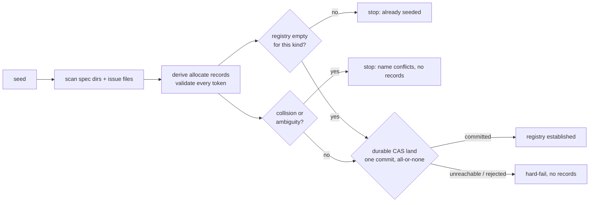

# 008 Registry seed from existing artifacts

## Overview
A one-time bootstrap that builds the id-coordination registry from a project's
existing spec directories and issue files, so the allocator's first real
allocation issues the next free id instead of reissuing one that is already
consumed by materialized work.

## Problem Statement
The `platform/007` allocator computes the next id from registry state. On a
project that already has spec directories and issue files but an empty registry
— every project the moment it adopts the allocator, jim included — the first
allocation recomputes from nothing and reissues an ordinal that materialized
work already owns (`platform/001` when `platform/001`…`007` already exist,
`#1` when a hundred issues already exist). That is exactly the collision the
allocator was built to prevent, reintroduced at adoption time. Until the
registry reflects what the repo already contains, wiring any consumer onto the
allocator (`/jim:spec`, `/jim:issue`) is unsafe: the allocator would hand back
consumed ids on the very first call. A developer adopting jim on a real
codebase needs a way to establish a correct starting registry from the
artifacts already in the tree, without hand-authoring registry lines.

## User Stories
- As a developer adopting the allocator on an existing project, I can build the
  initial registry from the spec directories and issue files already in the
  repo, so that the first allocation returns the next free id rather than one
  materialized work already owns.
- As a developer whose project has an ambiguous or duplicated id, I can have the
  seed tell me exactly what is wrong and stop, rather than silently guess a
  registry that misrepresents the repo, so that I fix the ambiguity before
  anyone allocates against a wrong baseline.
- As a developer who re-runs the seed, or runs it after allocation has already
  begun, I can trust it never double-seeds or corrupts the existing registry, so
  that the bootstrap is safe to invoke without first checking registry state.
- As a maintainer of the allocator, I can trust the seed writes only registry
  records — never renaming a directory or rewriting an issue file — so that
  seeding is a read-only-on-the-repo operation whose only effect is the new
  registry.

## Acceptance Criteria
- [ ] The seed derives, from the existing spec directories, one allocation
      record per spec (its `group/NNN` ordinal and slug) and one group-allocation
      record per distinct group; and from the existing issue files, one
      allocation record per issue (its display ordinal and durable id). The
      derived records use the registry's existing (`platform/007`-frozen)
      allocate grammar and land in the same per-kind logs, with no change to that
      grammar or to how the allocator reads it.
- [ ] After a successful seed, for every group whose ordinals are all
      materialized as spec directories in the tree, the allocator's next-id
      preview equals the value the pre-seed tree scan would produce, and resolving
      any seeded id returns that same id — the registry faithfully represents the
      materialized repo, so no consumed id is ever reissued. (Groups whose top
      ordinals were vacated by a prior split or merge and left no directory are
      handled separately — see Out of Scope.)
- [ ] The reserved blueprint slot is not seeded: a `000-blueprint` directory
      contributes no allocation record and does not affect any group's next id.
- [ ] The entire seed lands as a single durable commit — all derived records or
      none. A failure at any point leaves the registry exactly as it was before
      the seed began; no partial registry is ever observable.
- [ ] When the target registry already contains any records for a kind the seed
      would write, the seed does not write that kind: it stops with a clear
      message identifying the existing state, rather than appending to, merging
      with, or overwriting it. Re-running the seed after a successful seed is a
      no-op failure that changes nothing.
- [ ] When the existing artifacts contain a collision or ambiguity that the
      registry's uniqueness cannot represent — two issues claiming the same
      display ordinal, a spec directory whose ordinal or group cannot be parsed,
      or an issue file whose display ordinal or durable id is absent or cannot be
      parsed — the seed stops before committing anything, names the specific
      conflicting artifacts, and issues no records. It never renumbers, drops, or
      otherwise silently reconciles the conflict on the developer's behalf.
- [ ] Seeding never mutates the repository's existing artifacts: no spec
      directory is renamed and no issue file is rewritten. The seed's only
      durable effect is the new registry.
- [ ] Writing the seeded registry provides the same guarantees as a normal
      allocation: durable before it is reported successful, landing on the same
      configured coordination point, with the same reachability-determined tier
      and the same unreachable-then-hard-fail behavior. The seed introduces no
      path that writes the registry with weaker guarantees. *(External Constraint
      — sourced to upstream spec `platform/007`.)*
- [ ] Every value the seed reads from the tree or an artifact — a group name, an
      ordinal, a slug, a durable id — is revalidated through the allocator's
      id/slug boundary before it is used as a git argument, a ref, or a
      filesystem path, and any artifact-derived value that fails the boundary is
      a stop-and-report condition, not a value silently coerced or skipped.
      *(External Constraint — sourced to `CLAUDE.md` → Bash scripts and the
      `platform/007` security boundary; directory names and frontmatter are
      developer-authored inputs that become git arguments, so they are validated
      exactly as the untrusted registry is.)*
- [ ] The seed adheres to jim's bash-script conventions (`CLAUDE.md` → Bash
      scripts; `ARCHITECTURE.md` → Scripting Layer): artifacts are parsed as data
      — never sourced or evaluated — using Bash and POSIX text tools only, with
      no third-party dependencies. *(External Constraint — sourced to a
      documented project convention.)*

## Data Flow

## Out of Scope
- Renumbering, merging, or otherwise resolving duplicate or ambiguous ids. The
  seed detects and reports them and stops; the actual fix (and any renumber
  tooling) is the developer's, performed on the artifacts before re-seeding.
- Adopting a registry that already has records — reconciling drift between the
  tree and a partially-populated registry, or detecting artifacts that were
  created without going through the allocator. That is the deferred only-door
  verification sweep (issue #116), not the bootstrap.
- Emitting rename, split, or group-rename records. Like `platform/007`, the seed
  emits allocation records only.
- Wiring `/jim:spec` or `/jim:issue` onto the allocator (issues #112, #111) —
  those consumers depend on a seeded registry but are their own specs.
- Recovering ids that were allocated before adoption but left no artifact in the
  tree (an abandoned pre-registry branch). The seed captures materialized
  artifacts only; it cannot know about ids that never materialized, and those
  were never durably reserved.
- Reproducing the vacated-id floor for a retired or partition-source group — one
  whose highest ordinals were moved out by a prior split or merge and left no
  directory in that group. The pre-seed tree scan floors past those ordinals (via
  the specs-root ledger), but an allocate-only registry high-water cannot, and the
  frozen grammar has no floor record. Establishing that high-water and the
  redirect records that also make old citations resolve is the rename-emitting
  follow-on's job (issue #113). On jim itself, the retired `jim` group — whose
  specs were split into the four domain groups — is exactly this case; jim's four
  live groups seed faithfully.
- Coordination-branch protection and team setup (issue #118), and the
  `provisional` unreachable mode (issue #115) — unchanged and unaffected here.
- Repointing or relocating the coordination branch, and any `moved-to`
  tombstone handling (issue #117).

## Research & Architecture Handoff

*Implementation insights surfaced during scoping. These are context for the architect — not requirements, not exclusions. Treat each as a starting point to evaluate, not a directive.*

### Insight 1: Invocation surface — a `seed` verb on the allocator vs. a separate entrypoint

- **Relates to AC:** *"writing the seeded registry provides the same guarantees as a normal allocation … no path that writes the registry with weaker guarantees"* (the durability/tier AC)
- **Surfaced as:** the issue's "migration/`seed` step"; the natural home is a new `seed` subcommand on `jimalloc.sh`, since seeding must reuse the exact record grammar, CAS landing, config resolution, and validation boundary the allocator already owns.
- **Levelled-up requirement (already in the ACs):** the ACs fix that the seed inherits the allocator's landing/config and reuses its grammar and boundary, without naming the subcommand or script.
- **Deflection reason:** Delegation — whether this is a `jimalloc.sh seed` verb, a helper script, or a thin skill wrapper over one is the architect's call, weighed against the platform CLI surface.
- **Architect note:** a `seed` verb keeps the CAS/plumbing/erosion machinery in one place and avoids a second registry-writing path (which the durability AC forbids). Consider whether the developer-facing trigger is bare-script or a `/jim:` command, and how it reports the stop-and-name conditions. jim's one-time-migration precedent is uniformly preview-then-apply (`migrate.sh`'s bare-run-then-`--apply` gate; `jimpartition` preflight): mirror it so the preview reports the derived records and any stop condition while mutating nothing, and only an explicit apply lands the commit. Note also that `alloc_build_commit` sets one logfile per commit, so seeding both logs as one all-or-none commit (AC 4) needs a two-blob tree or a per-kind decision.
- **Routing hint:** Architect to decide.

### Insight 2: Reading the tree and artifacts

- **Relates to AC:** *"derives … from the existing spec directories … and from the existing issue files"* (AC 1); *"next-id preview equals the pre-seed tree scan"* (AC 2)
- **Surfaced as:** spec ids/slugs come from the directory tree (`docs/specs/<group>/<NNN>-<slug>/`, the same source `next-id` derives from today); issue ordinals come from each issue file's frontmatter (`num`/`id`), the durable per-issue source, in preference to the regenerable `INDEX.md` projection, which can lag or be uncommitted.
- **Levelled-up requirement (already in the ACs):** the ACs fix the observable outcome (registry matches the materialized tree; next-id preview matches the pre-seed scan) without pinning the enumeration mechanism or which file the issue ordinal is read from.
- **Deflection reason:** Delegation — enumeration can reuse `jimfile.sh glob`/`kinds`; frontmatter parsing is grep/sed. The *source-of-truth* choice (frontmatter over INDEX for issues) is the correctness lever worth preserving.
- **Architect note:** reading `INDEX.md` instead of per-issue frontmatter risks seeding from a stale projection; the frontmatter `num` is where the ordinal durably lives.
- **Routing hint:** Architect to decide.

### Insight 3: Record ordering and provenance fields

- **Relates to AC:** *"one allocation record per spec … one group-allocation record per distinct group"* (AC 1)
- **Surfaced as:** for an allocate-only log, neither resolution nor next-id depends on record order (next-id is a high-water max; resolution anchors on the id's own allocate record), so any deterministic order suffices; group-allocate records may precede their group's specs for greppability. Provenance `<date>` can be the artifact's own recorded date when available (issue `created`; specs best-effort) and `<who>` a synthetic seed marker — both are informational/advisory only, never used for ordering.
- **Levelled-up requirement (already in the ACs):** the ACs require the derived records to be correct and complete, not a specific byte order or provenance value.
- **Deflection reason:** Delegation — ordering and provenance are free within "deterministic and advisory-only."
- **Architect note:** consider whether to also write the local erosion baseline after a seed (defense-in-depth so the first post-seed allocation is guarded from the seed point), consistent with how allocation maintains it.
- **Routing hint:** Architect to decide.

## Open Questions
- [x] ~Duplicate issue ordinals: renumber vs. grandfather?~ → Neither. Halt and
      report: the seed stops before committing and names the conflicting
      artifacts; the developer resolves them and re-seeds (AC 6).
- [x] ~Behavior when the registry already has records?~ → Refuse for that kind
      with a clear message; the seed is a one-time bootstrap, and adopting a
      drifted/partial registry is the deferred only-door sweep's job (AC 5).
- [x] ~Read the issue ordinal from `INDEX.md` or from the issue files?~ → From
      each issue file's frontmatter, the durable per-issue source (Handoff
      Insight 2).
- [x] ~Should the seed offer a dry-run / preview mode?~ → Yes, in scope. jim's
      one-time-migration doctrine (`migrate.sh`, `backfill.sh`, `jimpartition`
      preflight) is uniformly preview-then-apply, so the seed follows it: a
      read-only preview that reports the records it would write and any stop
      conditions, and an explicit apply step to land them (research → Local
      Patterns). The exact flag/verb shape is the architect's (Handoff Insight 1).
