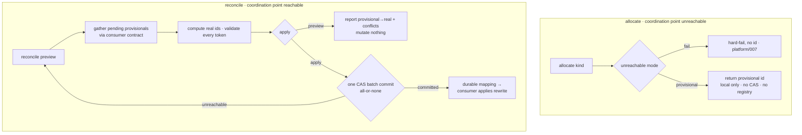

# 009 Provisional allocation and reconcile (unreachable-origin mode)

## Overview
An opt-in unreachable-origin mode where allocation hands back a structurally
distinct, local-only *provisional* identifier instead of hard-failing, plus a
deliberate `reconcile` step that later turns each pending provisional into a
real coordinated id — the mechanism that lets coordinated work continue offline
and become canonical once the coordination point is reachable again.

## Problem Statement
`platform/007` ships `on_unreachable = fail` only: whenever the coordination
point cannot be reached, every coordinated allocation hard-fails. That blocks
capture entirely in exactly the environments teams actually work in. jim's own
development is the proof — the sandbox cannot reach `origin` at all, so wiring
any consumer (`/jim:issue`, `/jim:spec`) onto the fail-only allocator would make
in-environment allocation impossible, not merely slower. Fork-workflow
contributors are shut out the same way: they can push only to their own fork, so
they can never win a compare-and-swap against the shared repo. Today the only
answers are "don't coordinate" (the collision the allocator exists to prevent)
or "don't work unless you can reach origin." There is no path to keep working
now and coordinate later — no way to defer the network-dependent part of an
allocation and settle it deterministically on the next successful contact.

## User Stories
- As a developer working where the coordination point is unreachable (jim's own
  sandbox, an offline session), I can still allocate and get a usable identifier
  immediately, so that being unable to reach origin never blocks capture.
- As a developer who has regained access to the coordination point, I can turn
  all my pending provisionals into real coordinated ids in one deliberate step,
  so that offline work becomes canonical without hand-renumbering anything.
- As a maintainer reviewing a fork contributor's change, I can reconcile the
  provisionals it carries once it reaches the shared repo, so that contributors
  who cannot push to it still take part in coordinated allocation.
- As a consumer skill that needs an id, I can request one through a single
  interface that returns a real id when origin is reachable and a provisional one
  when it is not, and later hand my pending set to reconcile, so that I do not
  implement offline handling myself.
- As a developer, I can preview what reconcile would assign before it writes
  anything, so that I see every provisional→real mapping and any conflict before
  it becomes durable.

## Acceptance Criteria
- [ ] When `id_coordination_unreachable = provisional` (the key `platform/007`
      reserved, read from the current branch) and the coordination point cannot
      be reached, an allocation returns a provisional identifier the caller can
      use immediately instead of hard-failing. The `fail` mode and the no-remote
      local tier from `platform/007` are unchanged; only the `provisional`
      value's behavior is added, and a team's choice of it is versioned and
      shared with no per-machine setup.
- [ ] A provisional identifier is drawn from a grammar disjoint from every
      allocated-ordinal grammar, so no allocated ordinal can ever equal a
      provisional identifier and no provisional identifier can be mistaken for
      one. A provisional identifier never enters the shared registry, the next-id
      computation, or the read-only preview — so a pending provisional can never
      inflate a later real allocation, and a real allocation can never collide
      with a pending provisional.
- [ ] Issuing a provisional identifier contacts neither the coordination point
      nor the shared registry and performs no compare-and-swap: it never blocks
      on the network and never fails for unreachability.
- [ ] Reconcile allocates a real coordinated id for each pending provisional over
      the same coordination point, reachability tier, compare-and-swap, and
      durable-before-reported path a normal allocation uses; it introduces no
      second, weaker registry-writing path. *(External Constraint — sourced to
      upstream spec `platform/007`.)*
- [ ] A reconcile pass is atomic: realizing N pending provisionals publishes as
      a single durable commit — all realized or none — and a failure at any point
      leaves the shared registry exactly as it was before the pass, with no
      partially-realized set ever observable.
- [ ] Reconcile is resumable and idempotent: the real id assigned to a
      provisional is durable before any consumer rewrite is applied, so
      re-running reconcile after an interruption never allocates a second real id
      for an already-realized provisional; a reconcile pass with nothing pending
      changes nothing.
- [ ] When the coordination point cannot be reached at reconcile time, reconcile
      realizes nothing and reports that it is still offline, changing nothing.
      Reconcile is the "on next successful contact" operation — distinct from the
      allocation-time unreachable hard-fail; being offline is a clean no-op, not
      an error.
- [ ] Realization is deterministic under concurrency and contributor clock skew:
      when two clones reconcile concurrently, every pending provisional realizes
      to a distinct real id — the shared-registry compare-and-swap serializes all
      realizations, and provisional identifiers, being local, are never compared
      across clones. Assignment order follows allocation order, never record
      timestamps. The realized ordinal is derived solely from the shared
      registry's high-water under the compare-and-swap, never from any field of
      the provisional marker, so a crafted marker in a branch-writable artifact
      cannot force a target ordinal or a deliberate collision.
- [ ] Reconcile has a read-only preview that reports the provisional→real
      assignments it would make and any conflict it would stop on, mutating
      nothing; only an explicit apply publishes them.
- [ ] Realizing a provisional whose underlying work no longer exists consumes a
      real ordinal that becomes a permanent gap; reconcile neither reclaims it
      nor fails on it, consistent with the never-reuse guarantee.
- [ ] The contract by which a consumer surfaces its pending provisionals to
      reconcile and applies the realized provisional→real mapping back to its own
      artifacts is defined and frozen, such that the issue consumer (issue #111)
      and, later, the spec consumer (#112/#113) can implement it without any
      change to the provisional grammar, the reconcile mechanism, or the
      guarantees above. The contract scopes pending-provisional discovery to the
      consumer's genuine artifact set (e.g. the issue collection under its
      configured root), not an arbitrary tree walk, so reconcile realizes only
      real pending work: provisional markers are self-asserted — the same trust
      model as an issue file today — and because an id carries no authority, a
      forged marker at most consumes an ordinal (a permanent gap), never a
      capability. This spec ships the mechanism and the contract; it wires no
      real consumer.
- [ ] Every provisional identifier, pending marker, and subject the reconcile
      path reads is revalidated through the id/slug/name boundary before it is
      used as a git argument, a ref, or a filesystem path. Pending markers ride
      in branch-writable artifacts and the coordination point is branch-writable,
      so an attacker-crafted value must never reach git or the filesystem as an
      injected option, a path traversal, or an unintended ref. *(External
      Constraint — sourced to `platform/007`'s security boundary and `CLAUDE.md`
      → Bash scripts.)*
- [ ] The mechanism adheres to jim's bash-script conventions (`CLAUDE.md` → Bash
      scripts; `ARCHITECTURE.md` → Scripting Layer): artifacts and the registry
      are parsed as data — never sourced or evaluated — using Bash and POSIX text
      tools only, with no third-party dependencies. *(External Constraint —
      sourced to a documented project convention.)*

## Data Flow

## Out of Scope
- The issue consumer itself (issue #111): where the pending marker lives in an
  issue file, how `show`/`list`/`INDEX` render an unreconciled provisional, the
  frontmatter `num` rewrite through the issue emitter, and wiring issue filing
  onto the allocator. This spec defines the contract those implement; it wires no
  real consumer.
- Spec-side provisional reconcile — realizing a provisional *spec* renames its
  directory and rewrites its references, which is the rename/redirect churn owned
  by the spec-wire and rename-emitting follow-ons (#112, #113). This spec's
  reconcile mechanism is consumer-agnostic; the spec consumer composes with those.
- A productized maintainer PR-review reconcile command or UX. The mechanism
  supports the fork-workflow case by construction (provisionals travel with the
  change and reconcile realizes them); a dedicated maintainer-facing flow is not
  built here.
- Changing `platform/007`'s `fail` mode, its no-remote local tier, its erosion
  guard, or its record grammar. `provisional` is added alongside; nothing
  existing changes shape.
- Opportunistically normalizing stale in-tree citations of a realized provisional
  (the G6 citation-rewrite concern) — deferred to the rename-emitting follow-on
  (#113), which owns tree-content citation normalization.
- The non-git `service` backend, opaque reservation for sensitive work, and any
  audit / authorization / integrity semantics on identifiers or records — all
  unchanged `platform/007` non-goals.

## Research & Architecture Handoff

*Implementation insights surfaced during scoping. These are context for the architect — not requirements, not exclusions. Treat each as a starting point to evaluate, not a directive.*

### Insight 1: Provisional-identifier grammar — identity-deferred vs ordinal-deferred

- **Relates to AC:** *"a grammar disjoint from every allocated-ordinal grammar … never enters the shared registry"* (AC 2)
- **Surfaced as:** the brainstorm's `P-<date>-<slug>` placeholder shape, revisited during edge-testing.
- **Levelled-up requirement (already in the ACs):** the AC fixes the *distinctness* and *not-in-shared-state* properties; the concrete token shape is not pinned.
- **Deflection reason:** Delegation — the exact prefix/shape is the architect's call; the distinctness property is the load-bearing constraint.
- **Architect note:** the two id forms defer *different* amounts. An issue's durable identity is its `YYYYMMDD-slug` (date-based, computable offline), so only the display *ordinal* need be provisional — issue reconcile is then a light frontmatter edit, no file rename (except the rare date-slug collision, which reconcile suffixes exactly as `platform/007`'s G9 guard does, no worse than today's cross-branch same-slug conflict). A spec's identity *is* its ordinal, so a spec provisional needs a full placeholder identity — which is why spec-side reconcile is deferred to compose with #112/#113. The grammar should express both flavors; issues exercise ordinal-deferred here.
- **Routing hint:** Architect to decide.

### Insight 2: Pending-state location — embedded in the consumer artifact

- **Relates to AC:** *"a consumer surfaces its pending provisionals … applies the realized mapping back to its own artifacts"* (AC 11); *"pending markers ride in branch-writable artifacts"* (AC 12)
- **Surfaced as:** the choice between a per-clone pending log and a marker embedded in the artifact.
- **Levelled-up requirement (already in the ACs):** the AC fixes that reconcile discovers pending work through the consumer contract and applies a durable mapping; it does not pin where the marker is stored.
- **Deflection reason:** Delegation — storage location is an implementation trade-off with a decided default.
- **Architect note:** embedding the marker in the artifact (not a separate local log) makes it the single source of truth, so it cannot drift from a log and it *travels with the branch* — which is what makes the fork-workflow (G5) case work by construction. Reconcile then delegates *discovery* to the consumer; `platform/008`'s seed is precedent that platform code may scan consumer frontmatter *as data*, but the write-back must respect the issue group's single-emitter invariant, so the issue rewrite rides with #111.
- **Routing hint:** Architect to decide.

### Insight 3: Reconcile is a batch allocation — reuse (and consolidate) the CAS machinery

- **Relates to AC:** *"the same … compare-and-swap … path a normal allocation uses"* / *"a single durable commit — all realized or none"* (AC 4, 5)
- **Surfaced as:** reconcile realizing N provisionals as one commit, like `platform/008`'s seed.
- **Levelled-up requirement (already in the ACs):** the ACs fix same-guarantees and batch-atomicity; the shared implementation is not pinned.
- **Deflection reason:** Delegation — reuse strategy is the architect's call.
- **Architect note:** reconcile is the *third* registry writer (allocate, seed, now reconcile). It reuses `platform/008`'s N-record single-commit builder, `platform/007`'s tier selection / reachability detection / erosion baseline. The `008` review already flagged (Finding 3) that seed re-implements the CAS publish inline rather than sharing the allocation helpers; adding a third writer is the moment to factor the shared publish step (tier-select + CAS + baseline) so all three share one implementation instead of three copies kept in sync by convention. Critically, that shared step must include the **in-loop erosion re-check** that the seed's current inline publish (`jimalloc.sh:1021-1081`) omits (issue #122; security review Finding 1) — otherwise a coordination-history truncation between a provisional's offline filing and its reconcile could go undetected and reissue a consumed ordinal, violating AC 4's "same guarantees." Consolidation turns that latent `008` gap into a fix rather than compounding it into a third copy.
- **Routing hint:** Architect to decide.

### Insight 4: Reconcile verb shape — explicit, preview-then-apply

- **Relates to AC:** *"a read-only preview … only an explicit apply publishes them"* (AC 9)
- **Surfaced as:** the open question of automatic-on-next-allocate vs an explicit reconcile verb.
- **Levelled-up requirement (already in the ACs):** the AC fixes preview-then-apply and the durable-mapping-before-rewrite ordering; the verb/flag surface is not pinned.
- **Deflection reason:** Delegation — surface shape is the architect's call.
- **Architect note:** jim's one-time/deferred-operation doctrine is uniformly preview-then-apply (`migrate.sh`, the `008` seed, `jimpartition` preflight); an explicit verb also matches the real workflow (deliberately run on the host / at PR review), whereas auto-on-allocate couples two concerns and silently no-ops every time you are offline anyway. Whether the trigger is `jimalloc.sh reconcile` and/or a per-consumer `/jim:` verb is open; the load-bearing part is the AC 6 ordering (real id durable before the consumer rewrite) that makes an interrupted reconcile resumable.
- **Routing hint:** Architect to decide.

## Open Questions
- [x] ~Reconcile trigger: automatic on next allocation vs. explicit verb~ →
      explicit verb, preview-then-apply (jim migration doctrine; Insight 4).
- [x] ~Provisional-ID shape so it can never collide with an allocated ordinal~ →
      a grammar disjoint from the ordinal grammar (AC 2); issues defer only the
      ordinal, specs the whole identity (Insight 1); concrete shape is the
      architect's.
- [x] ~Where pending-provisional state lives~ → embedded in the consumer
      artifact so it travels with the branch and supports the fork workflow
      (Insight 2).
- [ ] Does the fork-workflow (G5) maintainer-side reconcile need anything beyond
      the by-construction support noted here (e.g. surfacing "this change carries
      N provisionals" at review), or is that a separate follow-on? Leaning:
      separate follow-on; the mechanism suffices for this spec.
