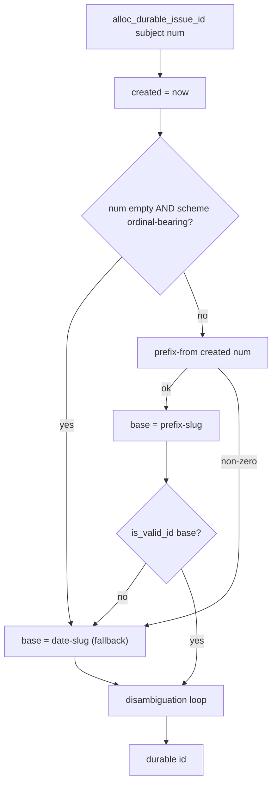

# Allocator honors the configured issue-id prefix — Plan

## Overview

Teach `alloc_durable_issue_id` to derive the issue durable-id prefix from the
configured `issue_id_prefix` via the existing `jimfile.sh prefix-from` helper
(fed the coordinated ordinal and an ISO `now`), falling back to `date-slug`
wherever a scheme can't be minted, then run the unchanged disambiguation loop.

## Design Decisions

### 1. Reuse `prefix-from` with `now`, not reimplement scheme logic

- **Chosen:** `alloc_durable_issue_id` calls `jimfile.sh prefix-from "$(jimfile.sh now)" "$num"` to obtain the scheme prefix, composes `<prefix>-<slug>`, and on any non-zero exit falls back to `${date}-${slug}`.
- **Why:** `prefix-from` is the single existing authority for every `issue_id_prefix` scheme, already takes the ordinal as an argument, and already gates its output through `is_valid_id` — reusing it avoids duplicating (and drifting from) `resolve_issue_prefix`. Research established that `now` (ISO) is *required* — the compact `jimfile.sh date` fails `prefix-from`'s input validation — and it renders the `timestamp` scheme at real sub-day precision.
- **Rejected:** reimplement scheme rendering inside the allocator — duplicates the scheme table and its `is_valid_id` gate, guaranteeing drift; passing `jimfile.sh date` — rejected by `prefix-from`'s regex.

### 2. Thread the coordinated ordinal; provisional force-fallback for ordinal-bearing schemes

- **Chosen:** `alloc_durable_issue_id` gains a `num` parameter. `alloc_build_issue` passes its already-computed coordinated `num` (derived before the durable id); `alloc_provisional_issue` passes empty. When `num` is empty (provisional), the allocator first reads the configured `issue_id_prefix` and, if it is **ordinal-bearing** — the `sequential` preset or any template containing a `{seq` token — skips `prefix-from` and uses `${date}-${slug}` directly. Num-independent schemes (`date`/`timestamp`/`project`) still route through `prefix-from` and are honored offline.
- **Why:** a provisional allocation has no ordinal, so every ordinal-bearing scheme must degrade *uniformly*. Leaning on `prefix-from`'s per-branch behavior would fall back for the `sequential` preset but render an arbitrary `0000` for a `{seq}` *template* (security review Advisory 1). The guard lives in the allocator because `prefix-from` is consumed as-is (its `num=0` template default is shared with `migrate.sh` — out of scope to change).
- **Rejected:** always date-slug in provisional mode — needlessly drops `project`/`timestamp`, which are num-independent and derivable offline; modifying `prefix-from`'s `num=0` default — out of scope and shared with `migrate.sh`.

### 3. Fallback trigger is any `prefix-from` non-zero

- **Chosen:** treat *any* non-zero exit from `prefix-from` (empty `issue_id_project`, un-derivable `{date:…}` template, non-numeric `num` for `sequential`) as the single AC-2 fallback to `${date}-${slug}`. Its stderr is never interpolated.
- **Why:** `prefix-from` already fails loudly with a reason on every un-derivable case; one uniform fallback needs no new failure taxonomy and matches `resolve_issue_prefix`'s existing degradation.
- **Rejected:** enumerate scheme-specific fallback conditions in the allocator — re-encodes knowledge `prefix-from` already owns.

### 4. Re-validate the composed base through the id boundary

- **Chosen:** after composing `<prefix>-<slug>` (or the fallback), pass the final base through `is_valid_id` before the disambiguation loop; a failure degrades to `date-slug`.
- **Why:** AC 5 — the config-supplied prefix is now part of the id; validating the *composed* base (not only the prefix `prefix-from` checked) keeps a crafted config value from reaching a filename, registry token, or git argument.
- **Rejected:** trust that valid-prefix + valid-slug is always a valid id — a cheap final gate closes the composition edge for free.

## Constitution Check

**ARCHITECTURE.md status:** Present — constraints noted below.

| Constraint from ARCHITECTURE.md | Honored? | Notes |
| :--- | :--- | :--- |
| Scripting Layer: Bash + POSIX only, no third-party deps | Yes | Composes `jimfile.sh prefix-from`/`now` via the existing `BASH_SOURCE`-relative `$JIMFILE` path. |
| Registry / config content untrusted: parse-as-data, revalidate before use | Yes | Config-derived prefix passes `prefix-from`'s `is_valid_id` gate and a final composed-base `is_valid_id` (DD4); stderr never interpolated (DD3). |
| `validator-lockstep`: byte-identical `is_valid_id` | Yes | Reuses `is_valid_id`; does not alter it. |
| Frozen `platform/007` record grammar + forward-replay resolution | Yes | A non-date durable id is another `<full-id>` token; `alloc_resolve_issue` maps num↔full-id with no date-shape assumption. Default config is byte-for-byte unchanged (AC 4). |
| File-order authoritative, dates informational | Yes | The durable-id prefix is an id-shape choice, never a resolution input. |

## File Manifest

| Component | File Path | Action | Notes |
| :--- | :--- | :--- | :--- |
| Allocator durable-id | `skills/file/scripts/jimalloc.sh` | Update | `alloc_durable_issue_id` derives via `prefix-from(now, num)` + fallback + final `is_valid_id`; thread `num` from `alloc_build_issue`, empty from `alloc_provisional_issue`. |
| Allocator tests | `tests/jimalloc.sh` | Update | Reproduction + regression cases across schemes and the provisional fallback. |

## Interface Contracts

```text
# jimfile.sh (consumed, unchanged)
now                            -> "YYYY-MM-DDTHH:MM:SSZ"  (ISO; satisfies prefix-from's input regex)
prefix-from <created> <num>    -> scheme prefix on stdout; non-zero + reason on stderr when un-derivable

# jimalloc.sh — changed signature (internal function; issues log on stdin)
alloc_durable_issue_id <subject> <num>
  created = now
  scheme  = config(issue_id_prefix)
  if num == "" and scheme is ordinal-bearing (== "sequential" OR contains "{seq"):
      base = "<date>-<slug>"                                  # DD2 provisional force-fallback
  else:
      prefix = prefix-from(created, num)
      base   = success ? "<prefix>-<slug>" : "<date>-<slug>"  # date = jimfile.sh date (compact)
  base    = is_valid_id(base) ? base : "<date>-<slug>"        # DD4 final gate
  -> disambiguation loop over base (unchanged) -> durable id

# callers
alloc_build_issue      : alloc_durable_issue_id "$subject" "$num"   # num computed just above
alloc_provisional_issue: alloc_durable_issue_id "$subject" ""       # no coordinated ordinal
```

## Data Flow



## Task Breakdown

*Bug structure: Reproduce → Fix → Regression, then a full-suite gate.*

1. [ ] **Reproduce.** Add a `tests/jimalloc.sh` case: in a temp repo with
   `issue_id_prefix = "sequential"`, `allocate issue` must yield a durable id
   whose prefix is the coordinated ordinal — asserting the scheme is honored.
   Confirm it fails on current code (durable id is date-slug).
   **Verify:** `! bash tests/jimalloc.sh` *(suite goes red — defect reproduced)*

2. [ ] **Fix.** Change `alloc_durable_issue_id` per DD1–DD4 (derive via
   `prefix-from(now, num)`, date-slug fallback on non-zero, final `is_valid_id`
   gate, existing disambiguation loop); thread `num` from `alloc_build_issue`
   and empty from `alloc_provisional_issue`. Depends on task 1.
   **Verify:** `bash tests/jimalloc.sh` *(reproduction case passes; suite green)*

3. [ ] **Regression coverage.** Add cases: provisional ordinal-scheme →
   date-slug fallback for **both** the `sequential` preset **and** a `{seq:04}`
   template (never `0000`, per DD2 — security review Advisory 1); num-independent
   `project` and `timestamp` schemes honored on both real and provisional paths;
   `date` default byte-for-byte unchanged (AC 4); a crafted/empty
   `issue_id_project` degrades rather than emitting an invalid id (AC 5). Depends
   on task 2.
   **Verify:** `grep -Eq 'prefix.*(provisional|project|default|fallback)' tests/jimalloc.sh && bash tests/jimalloc.sh`

4. [ ] **Full-suite gate.** The allocator and issue suites are green (the issue
   suite confirms `issue/010`'s default-config consumers are unaffected).
   **Verify:** `bash skills/meta-test/scripts/run.sh jimalloc && bash skills/meta-test/scripts/run.sh issues`

## Requirements Coverage Summary

| Spec Acceptance Criterion | Addressed In Task(s) |
| :--- | :--- |
| AC 1 — honor the configured scheme (ordinal schemes use the coordinated num) | 1, 2, 3 |
| AC 2 — degrade to date-slug where non-derivable; never error/malformed | 2, 3 |
| AC 3 — stays coordinated + consistent (disambiguation; sequential prefix == ordinal) | 2, 3 |
| AC 4 — default `date` config byte-for-byte unchanged; `007` frozen contract intact | 3, 4 |
| AC 5 — revalidate prefix + composed durable id through the id boundary | 2, 3 |
| AC 6 — regression test covers the reported scenario | 1, 3 |

## Out of Scope

- **The issue-group consumer.** `issue/010` already routes `new.sh` through the
  allocator; nothing in `skills/issue/` changes here. The `issue` suite (task 4)
  only *confirms* no default-config regression.
- **`resolve_issue_prefix` / `prefix-from` themselves.** Consumed as-is; their
  scheme semantics are not modified.
- **Re-prefixing already-filed issues** (`migrate.sh` territory) and **spec ids**
  (`group/NNN`) — untouched.
- **ARCHITECTURE.md refresh** — the `/jim:build` completion gate runs `/jim:arch`;
  pipeline-owned, not a deferral.

## Open Questions

- [x] ~Timestamp granularity (`now` vs `date`)~ → resolved by research: `now`
  (forced by `prefix-from`'s input format; also yields real sub-day precision).
- None outstanding.
