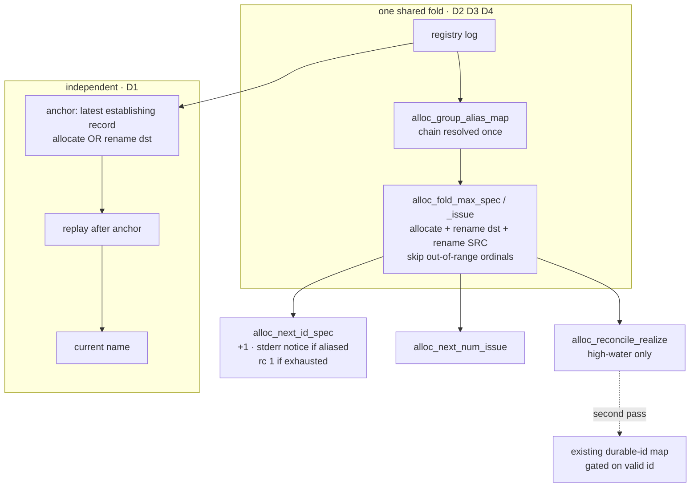

# Rename-path correctness gates — Plan

## Overview

Replace the three independently-maintained high-water folds with one shared,
group-aliased, magnitude-bounded fold that also counts rename sources, and anchor
both resolvers on rename destinations — so D2/D3/D4 become one structural change
rather than six coordinated edits, and D1 becomes a two-line fix.

## Design Decisions

### 1. One shared high-water fold, not three coordinated edits

- **Chosen:** Extract `alloc_fold_max_spec` / `alloc_fold_max_issue` and have
  `alloc_next_id_spec`, `alloc_next_num_issue`, and `alloc_reconcile_realize` all
  call them.
- **Why:** Research found the fold in **three** functions, none counting rename
  sources, and one (reconcile) additionally gated on the durable id. D2 must land
  in all three and D4 reconciles two of them — six edits kept in agreement by
  convention, which is precisely the failure D4 *is*. Sharing the computation
  makes the spec's "allocation and reconcile agree for every log shape" criterion
  structural instead of conventional.
- **Rejected:** Three parallel edits with a comment asking future maintainers to
  keep them in sync — the current state, and the thing that produced this bug.

### 2. Reconcile keeps its own pass for the already-realized map

- **Chosen:** `alloc_reconcile_realize` calls `alloc_fold_max_issue` for the
  high-water and retains a separate pass to build its `existing[durable-id] →
  ordinal` map.
- **Why:** Reconcile needs two different products from the log. A dual-return
  helper would need out-params or a packed stdout format, coupling the fold to
  reconcile's needs. Two O(n) passes over a 134-line log is free, and it keeps the
  fold's contract single-purpose.
- **Rejected:** One helper returning both — couples the shared function to one
  caller's shape, for no measurable gain at this scale.

### 3a. [NEEDS CLARIFICATION] The gap guarantee and a fixed ceiling cannot both hold unconditionally

Routing security Finding 5 (Critical) revealed that its suggested fix does not
work as stated, and that the conflict is between two spec criteria rather than
inside the plan. **This blocks task 6/7 and needs a decision.**

The two criteria:

- *"A vacated ordinal is never reissued, for **every** log shape — including a
  rename source that carries no allocation record of its own. The guarantee does
  not rest on an assumption about how records were emitted."* → the returned id
  must always exceed the folded high-water, which is attacker-controlled.
- *"…can never drive the next id past the largest ordinal the registry's own
  bootstrap will accept."* → the returned id must never exceed a fixed ceiling.

A crafted record carrying an ordinal *at* the ceiling makes these unsatisfiable
simultaneously: the first demands 1000, the second forbids it. Finding 5's
suggestion — "derive exhaustion from corroborated ordinals only" — does not
resolve it, because the *returned value* still has to clear the uncorroborated
high-water the first criterion mandates.

Three ways out, each giving up something:

1. **Count only corroborated ordinals** (those with an `allocate` record
   somewhere). Removes the inflation vector entirely and needs no ceiling change.
   Justification: `platform/007` guarantees an allocation is durably recorded
   *before* the id is returned, so an ordinal with no allocate record was never
   allocated — reissuing it collides with no real work, and the erosion guard
   already covers the lost-record case by hard-failing. **Cost:** contradicts the
   first criterion, and D2's own reproduction (`spec rename dashboard/005
   core/001` alone) stops being a defect — which reverses the developer's earlier
   "fold defensively *and* record the invariant" decision, pushing correctness
   back onto the emitter (#113's inherited constraint 1).
2. **Widen the ceiling** so 4+ digit ordinals are legal in both the allocator and
   the seed. Keeps both criteria literally satisfiable and converts the DoS into
   cosmetic damage (an absurd but usable `dashboard/1000000`), bounded by the
   seed's 15-digit cap. **Cost:** `%03d` formatting, directory-name shape, and any
   consumer assuming three digits all change; inflation is still possible, just no
   longer fatal.
3. **Amend the first criterion** to exempt uncorroborated ordinals explicitly —
   the same substance as 1, but arrived at honestly by narrowing the spec rather
   than by the plan quietly not honoring it.

Recommended: **3** (which is 1 with the spec told the truth). The first
criterion's "every log shape" defends against a state `platform/007`'s durability
guarantee already prevents, and paying for that defense buys a one-record denial
vector. But it does revisit a settled decision, so it is the developer's call.

Until this resolves, Design Decision 3 below describes the *unamended* intent and
should not be implemented as written.

### 3. Magnitude bound reuses the seed's thresholds; exhaustion is a hard failure

- **Chosen:** Two constants, `ALLOC_MAX_SPEC_ORD=999` and
  `ALLOC_MAX_ISSUE_DIGITS=15`, matching the seed's existing guards. The fold
  *skips* an out-of-range ordinal as malformed; `alloc_next_id_spec` *errors* when
  `max+1` would exceed the bound.
- **Why:** The security review showed one crafted record can otherwise inflate a
  group arbitrarily, and that the allocator mints 4-digit spec ordinals the seed
  refuses — an id the registry can never be rebuilt from. Skipping bad inputs
  stops the inflation; erroring on genuine exhaustion is the only way to honor
  "can never drive the next id past what the bootstrap accepts." Reusing the
  seed's own numbers is what makes the two agree by construction.
- **Rejected:** Clamping to the bound instead of erroring — would silently hand
  back an ordinal the group already owns, turning a loud stop into a collision.
- **Rejected:** A new, independent bound — two thresholds drifting apart is the
  same class of bug as D4.

### 4. Group aliasing resolves the chain once into a map

- **Chosen:** `alloc_group_alias_map` resolves each distinct group's chain **lazily,
  once, with memoization** — first lookup walks the chain and caches the result,
  later lookups hit the cache. The fold does hash lookups per record.
- **Why:** Resolving each record's group independently would re-walk the chain per
  record — O(n²) over an input any pusher can grow, which the security review
  flagged as a resource-exhaustion vector rather than a perf smell. Memoized lazy
  resolution bounds total work by the log length regardless of chain shape.
- **Rejected:** Calling a single-group resolver per record — correct but quadratic
  on attacker-influenced input.
- **Rejected:** Building the transitive closure eagerly in one sequential pass —
  the original choice, and it reintroduces the same quadratic: each `A→B` record
  requires re-pointing every entry currently mapping to `A`, an O(map) step per
  record. "One pass" reads as linear and would not have prompted the implementer
  to check (security Finding 8).
- **Cycle safety:** each `group rename` record applies at most once in file order,
  so a crafted `A→B, B→A` pair terminates rather than spinning. Fixtured in task 3
  — a non-terminating walk hangs every allocation and has no error message, so a
  passing test is the only evidence the rule was implemented (security Finding 7).

### 5. An aliased group is refused until the caller acknowledges the redirect

- **Chosen:** `alloc_next_id_spec` refuses (rc 1) when the queried group has been
  renamed away, naming the redirect on stderr. An explicit acknowledgment —
  `--follow-redirect` — proceeds, returning the id under the *current* group. The
  Interface Contract additionally states that the returned group is authoritative
  and may differ from the one requested.
- **Why:** Naming a redirect only informs whoever reads the channel it was named
  on. A program capturing stdout can honor the notice's existence and still
  substitute one group for another unnoticed, so "never silently" held by
  convention. A non-zero exit is not discardable: the naive consumer breaks
  loudly. This also matches how the allocator already handles a surprising answer
  — `seed` refuses a populated kind rather than merging, `reconcile spec` refuses
  rather than half-realizing — so refusal is the house style, not a new principle.
  The friction lands only on callers using a retired name, which is where a speed
  bump belongs.
- **Rejected:** Advisory on stderr alone — the original choice. Adequate for a
  human (and the invocation shape does keep stderr reachable, since
  `ARCHITECTURE.md:503` forbids `!`-injection for calls carrying a `<group>`
  placeholder), but it leaves the machine contract silent, which is the consumer
  that matters once the spec-ID wiring lands.
- **Rejected:** A second stdout line — breaks the verb's parsed contract.
- **Rejected:** Silent redirect — explicitly overruled by the spec.
- **Accepted trade:** refusal converts a crafted `group rename` from a stealth
  namespace redirect into a loud one-record denial, the same shape as the
  exhaustion vector. Taken deliberately: against tampering, a refusal that names
  the redirect *is* the detection, where a silent redirect yields nothing.

### 6. D1 anchors on the later of allocation-or-rename-destination

- **Chosen:** In both resolvers, set the replay anchor in the rename-destination
  branch as well, keeping the later index; the rename-*source* branch still does
  not mark an id known.
- **Why:** A rename destination is an establishing event for that name; a source
  is a vacating one. Traced against all three shipped resolution fixtures plus the
  D1 reproduction — correct in every case, and moving the anchor later only
  shrinks the replay window, so cycle termination is preserved.
- **Rejected:** Also marking a rename source known — moved out of this spec
  entirely; it is dereferenceability, not allocation, and cannot affect which id
  is allocated (spec Out of Scope; issue #113).

### 7. `next-id` acquires documented failure modes

- **Chosen:** Enumerate the verb's failures in the Interface Contract — exhaustion
  (Design Decision 3) and unacknowledged redirect (Design Decision 5) — and mark
  which are terminal versus retryable.
- **Why:** `alloc_next_id_spec` currently always succeeds for a valid group, so
  every consumer may treat it as infallible. This plan gives it two distinct ways
  to refuse, and the spec-ID wiring must tell them apart: exhaustion is terminal,
  an unacknowledged redirect is retryable *with* acknowledgment. Undocumented, a
  consumer collapses both into "allocation broke" and a recoverable case looks
  fatal.
- **Rejected:** One generic error — loses the retryable/terminal distinction the
  consumer needs in order to act.

## Constitution Check

**ARCHITECTURE.md status:** Present — constraints noted below.

| Constraint from ARCHITECTURE.md | Honored? | Notes |
| :--- | :--- | :--- |
| Scripting Layer: Bash + POSIX only, no third-party deps | Yes | grep/sed/awk and bash arithmetic only; no new tool. |
| Scripting Layer: `set -uo pipefail`, `export LC_ALL=C`, `GIT_TERMINAL_PROMPT=0` | Yes | Inherited; no new script file. |
| Inter-script composition is `BASH_SOURCE`-relative | Yes | No new composition; existing `$JIMFILE` chain untouched. |
| Single `is_valid_id` boundary — no fourth validator copy | Yes | Every new token read routes through `alloc_valid_token` / `alloc_valid_specid`. |
| Registry and config parsed as data, never `source`d/`eval`d | Yes | All new reads are `read -r` field splits over log lines. |
| Operational git: plumbing only, fixed refs, `--end-of-options` | Yes | No git call added or changed; this is a pure read-path fix. |
| Untrusted branch content validated before git/ref/path use | Yes | Design Decision 3 adds a magnitude gate on top of the existing boundary; no new value reaches git. |
| Tests live under `tests/`, never loaded by Claude Code | Yes | Fixtures go in `tests/jimalloc.sh`. |
| Reserved `000-blueprint` slot ignored by next-id | Yes | Unchanged; the fold's group filter and bound do not admit ordinal 0 as a high-water. |

## File Manifest

| Component | File Path | Action | Notes |
| :--- | :--- | :--- | :--- |
| ID coordination allocator | `skills/file/scripts/jimalloc.sh` | Update | New fold + alias helpers and bound constants; rewire two next-id functions, reconcile's high-water, and both resolvers' anchor pass; retire the group-aliasing deferral docstring. |
| Allocator tests | `tests/jimalloc.sh` | Update | Fixtures for D1 (spec + issue), D2 + bound + exhaustion, D3 (aliasing, renamed-away, multi-hop, stderr notice), D4 divergence. |

No other file changes. `ARCHITECTURE.md` is refreshed by the `/jim:build`
completion gate, not by a task here.

## Interface Contracts

```bash
# ─── New constants ───────────────────────────────────────────────────────────
ALLOC_MAX_SPEC_ORD=999        # the seed's spec-ordinal guard, single-sourced
ALLOC_MAX_ISSUE_DIGITS=15     # the seed's issue-num length cap, single-sourced

# The seed currently carries these as literals (a bare 999 in
# alloc_seed_derive_specs, a bare 15 in the issue-num path). Both switch to these
# constants: a threshold duplicated in two places is the same drift this spec
# exists to remove, so the fold and the bootstrap must read one value, not two
# that happen to match today.

# ─── New helpers (log on stdin, pure, no git) ────────────────────────────────

# alloc_group_alias_map                       (spec log on stdin)
#   Print one TAB-separated "<old>\t<current>" line per group that has been
#   renamed, with the chain fully followed: dashboard→ui→surface yields both
#   "dashboard<TAB>surface" and "ui<TAB>surface". Resolution is lazy and memoized
#   per distinct group — never an eager closure, which would cost an O(map)
#   re-point per record. Each `group rename` record applies at most once in file
#   order, so a crafted cycle terminates. Both tokens are validated; a malformed
#   record is skipped. Empty output when no group rename exists.

# alloc_fold_max_spec <group>                 (spec log on stdin) → integer
#   Highest ordinal held by <group> under its current OR former names. Folds
#   `spec allocate` ids, `spec rename` destinations, AND `spec rename` sources.
#   Group membership is decided through alloc_group_alias_map. An ordinal above
#   ALLOC_MAX_SPEC_ORD is skipped as malformed. Prints 0 when the group holds
#   none. Never lowers a value; never writes stderr.

# alloc_fold_max_issue                        (issue log on stdin) → integer
#   Highest issue ordinal. Folds `issue allocate` ids, `issue rename`
#   destinations, AND `issue rename` sources. An ordinal whose digit length
#   exceeds ALLOC_MAX_ISSUE_DIGITS is skipped as malformed. Prints 0 when the
#   log holds none.

# ─── Rewired existing functions (public behavior) ────────────────────────────

# alloc_next_id_spec <group> [--follow-redirect]   (spec log on stdin)
#   stdout: "<current-group>/<NNN>" where <current-group> is <group> resolved
#           through the alias map, and NNN = alloc_fold_max_spec + 1.
#
#   THE RETURNED GROUP IS AUTHORITATIVE AND MAY DIFFER FROM <group>. A consumer
#   that assumes the returned prefix equals the one it passed is relying on
#   something this contract does not promise; compare them to detect a redirect
#   without needing any other channel.
#
#   Two documented failure modes, which a consumer must distinguish:
#     rc 1 + "group exhausted"      — max+1 exceeds ALLOC_MAX_SPEC_ORD.
#                                     TERMINAL: acknowledging changes nothing.
#     rc 1 + "group renamed"        — <group> has been renamed away and
#                                     --follow-redirect was not passed. The
#                                     message names the redirect target.
#                                     RETRYABLE: re-invoke with the flag, or ask
#                                     using the current group name.
#   Both write the reason to stderr; neither writes stdout.

# alloc_next_num_issue                        (issue log on stdin)
#   stdout: alloc_fold_max_issue + 1. Unchanged shape.

# alloc_reconcile_realize <pending-id>...     (issue log on stdin)
#   Unchanged stdout contract ("<full-id>\t<ordinal>\t<new|have>"). Its
#   high-water now comes from alloc_fold_max_issue; its existing[] map stays
#   keyed only on a boundary-valid durable id — the two gates remain separate.

# alloc_resolve_spec <queried> / alloc_resolve_issue <queried>
#   Unchanged stdout/rc contract. The anchor is now also set when the queried id
#   matches a rename DESTINATION, taking the later index. A rename SOURCE still
#   does not mark an id known (out of scope — issue #113).
```

## Data Flow



## Task Breakdown

Bug structure: each defect is reproduced (fixture fails) before it is fixed
(fixture passes). Task 11 is the regression gate over the shipped behaviors;
task 12 is the full suite.

Every `**Verify:**` asserts that tests *ran* as well as passed — a filter
matching no case exits 0, so a bare exit-code check would pass vacuously.

1. [ ] Add failing fixtures for D1 reuse-via-rename-in, spec and issue: a name
   renamed away then re-established by renaming a different id onto it must
   resolve to the current holder.
   **Verify:** `bash tests/jimalloc.sh reuse_rename_in | grep -qE 'Ran [1-9][0-9]* tests: [0-9]+ passed, [1-9][0-9]* failed'`

2. [ ] Fix D1: in `alloc_resolve_spec` and `alloc_resolve_issue`, set the replay
   anchor in the rename-destination branch too, keeping the later index. Depends
   on task 1.
   **Verify:** `bash tests/jimalloc.sh resolve | grep -qE 'Ran [1-9][0-9]* tests: [0-9]+ passed, 0 failed'`

3. [ ] Add failing fixtures for D3: next-id after a group rename must count the
   group's ordinals under its former name; a multi-hop chain must resolve fully; a
   group-rename **cycle** must terminate rather than hang; and asking about a
   renamed-away group must be refused with the redirect named, then succeed under
   the current group once `--follow-redirect` is passed.
   **Verify:** `bash tests/jimalloc.sh group_alias | grep -qE 'Ran [1-9][0-9]* tests: [0-9]+ passed, [1-9][0-9]* failed'`

4. [ ] Add `alloc_group_alias_map` per the Interface Contract — one pass,
   transitively resolved, malformed records skipped.
   **Verify:** `bash tests/jimalloc.sh group_alias_map | grep -qE 'Ran [1-9][0-9]* tests: [0-9]+ passed, 0 failed'`

5. [ ] Add failing fixtures for D2 and the magnitude bound: a rename source with
   no allocation of its own must raise the high-water; an out-of-range ordinal
   must be skipped rather than counted; a group at the ceiling must fail rather
   than mint an id the seed refuses.
   **Verify:** `bash tests/jimalloc.sh fold_max | grep -qE 'Ran [1-9][0-9]* tests: [0-9]+ passed, [1-9][0-9]* failed'`

6. [ ] Add `alloc_fold_max_spec` / `alloc_fold_max_issue` and the two bound
   constants per the Interface Contract — counting rename sources, deciding group
   membership through the alias map, skipping out-of-range ordinals — and repoint
   the seed's two literal thresholds at the same constants so one value governs
   both the fold and the bootstrap. Depends on tasks 4, 5.
   **Verify:** `bash tests/jimalloc.sh fold_max | grep -qE 'Ran [1-9][0-9]* tests: [0-9]+ passed, 0 failed' && [ "$(grep -cE '10#\$ord > 999|\$\{#num\} > 15' skills/file/scripts/jimalloc.sh)" = 0 ]`

7. [ ] Rewire `alloc_next_id_spec` onto the new helpers with both documented
   failure modes — alias resolution, the fold, the terminal exhaustion refusal,
   and the retryable unacknowledged-redirect refusal with `--follow-redirect` —
   and `alloc_next_num_issue` onto the fold. Thread `--follow-redirect` through
   `cmd_peek spec` and the `allocate spec` path so the acknowledgment is reachable
   from the CLI. Depends on task 6.
   **Verify:** `for f in next_id follow_redirect; do bash tests/jimalloc.sh $f | grep -qE 'Ran [1-9][0-9]* tests: [0-9]+ passed, 0 failed' || exit 1; done`

8. [ ] Add a failing fixture for D4: with a malformed `issue allocate` record
   present — numeric ordinal, boundary-invalid durable id — the ordinal a normal
   allocation would issue and the one reconcile would realize onto must match.
   **Verify:** `bash tests/jimalloc.sh reconcile_high_water_parity | grep -qE 'Ran [1-9][0-9]* tests: [0-9]+ passed, [1-9][0-9]* failed'`

9. [ ] Fix D4: `alloc_reconcile_realize` takes its high-water from
   `alloc_fold_max_issue`, keeping its `existing[]` map keyed only on a
   boundary-valid durable id — the numeric and boundary gates stay separate.
   Depends on tasks 6, 8.
   **Verify:** `bash tests/jimalloc.sh reconcile | grep -qE 'Ran [1-9][0-9]* tests: [0-9]+ passed, 0 failed'`

10. [ ] Rewrite the `alloc_next_id_spec` docstring: it currently says the fold
   counts "every allocate id and rename destination" and that group-rename
   aliasing "is deferred" — both untrue after tasks 4 and 6. State the current
   behavior, including rename sources, aliasing, and the bound.
   **Verify:** `! grep -qi 'aliasing of the group namespace is deferred' skills/file/scripts/jimalloc.sh && ! grep -q 'every allocate id and rename destination in the group' skills/file/scripts/jimalloc.sh`

11. [ ] Confirm the four shipped resolution behaviors still hold — the
    reuse-via-allocation, reverted-cycle, group-rename, and malformed-skip cases
    must all still exist by name and pass. (Byte-identity of those four case
    bodies is a review concern, not something this command can prove without a
    fixed comparison base; the diff is small enough to read.)
    **Verify:** `for c in reused_name cycle_revert group_rename skips_malformed; do grep -q "^case_jimalloc_resolve_spec_$c()" tests/jimalloc.sh || exit 1; bash tests/jimalloc.sh "resolve_spec_$c" | grep -qE 'Ran [1-9][0-9]* tests: [0-9]+ passed, 0 failed' || exit 1; done`

12. [ ] Full aggregate suite green.
    **Verify:** `bash skills/meta-test/scripts/metatest.sh run | tail -1 | grep -qE 'Ran [1-9][0-9]* tests: [0-9]+ passed, 0 failed'`

## Requirements Coverage Summary

| Spec Acceptance Criterion | Addressed In Task(s) |
| :--- | :--- |
| Rename-destination-established id resolves to its current referent (spec + issue) | 1, 2 |
| Resolution reflects the most recent establishing event | 1, 2 |
| Vacated ordinal never reissued for every log shape, including an unallocated source **[NEEDS CLARIFICATION: conflicts with the ceiling criterion — see Design Decision 3a]** | 5, 6, 7 — blocked |
| Miscounting errs only toward skipping, and only within bounds **[NEEDS CLARIFICATION: same conflict — see Design Decision 3a]** | 5, 6, 7 — blocked |
| Next id accounts for ordinals under current and former group names, multi-hop | 3, 4, 6, 7 |
| Renamed-away group answers for its current name and names the redirect applied | 3, 7 |
| Allocation and reconcile agree on the next ordinal for every log shape | 8, 9 |
| Record grammar unchanged; this fix writes no record | 12 (no git call added; manifest holds) |
| Every shipped resolution / next-id behavior still holds, fixtures unmodified | 11, 12 |
| Regression test covers each of D1–D4 | 1, 3, 5, 8 |
| Registry-read values revalidated through the id/slug boundary before use | 4, 6 (alias tokens), 9 (durable-id gate) |
| Bash + POSIX conventions, parse as data, no third-party deps | 12 (suite includes the hygiene sweep) |

**Two `[NEEDS CLARIFICATION]` items**, both the same conflict: the gap guarantee's
"every log shape" and the ceiling criterion cannot both hold unconditionally
(Design Decision 3a). Tasks 5–7 are blocked on that decision; every other task is
unaffected and can proceed.

## Out of Scope

- **Making a vacated citation dereferenceable.** A rename source still does not
  mark an id known, so a source-only id stays unresolvable. Dereferenceability
  cannot affect allocation and belongs to the rename-emitting follow-on
  (issue #113), which carries both candidate fixes and their measured side
  effects. *Genuinely deferred — a human picks it up there.*
- **Renumbering or compacting a group that legitimately reaches the ceiling.**
  Task 6 makes exhaustion a loud failure rather than an unseedable id; recovering
  a full group is a separate concern with no current demand. *Genuinely
  deferred.*
- **Emitting any rename, split, or group-rename record.** Read-path only.
- **Consolidating the two registry-writing land paths** (issue #122's remaining
  half) — adjacent to Design Decision 1's reasoning, but a different function and
  no correctness gap.
- **The vacated-ordinal floor for a group whose ordinals left no record at all**
  — distinct from D3, which aliases across a rename record. Stays with the
  rename-emitting follow-on.
- **The `ARCHITECTURE.md` refresh.** Handled by the `/jim:build` completion gate
  via `/jim:arch` — pipeline responsibility, not a deferral.

## Open Questions

- [x] ~~Three coordinated fold edits or one shared fold?~~ → One shared fold; D4
  is the evidence that convention-kept agreement fails.
- [x] ~~Where does the redirect advisory go?~~ → stderr; stdout is a parsed
  contract about to acquire consumers.
- [x] ~~What magnitude bound?~~ → The seed's own thresholds, so the allocator and
  the bootstrap agree by construction.
- [x] ~~Clamp or error on exhaustion?~~ → Error; clamping would hand back an
  ordinal the group already owns.
- [ ] **[NEEDS CLARIFICATION]** Which yields — the gap guarantee's "every log
  shape" or the fixed ceiling? They are unsatisfiable together against a crafted
  ordinal at the ceiling (Design Decision 3a). Leaning: narrow the gap criterion to
  corroborated ordinals, since the case it defends is one `platform/007`'s
  durability guarantee already prevents. Blocks tasks 5–7.
