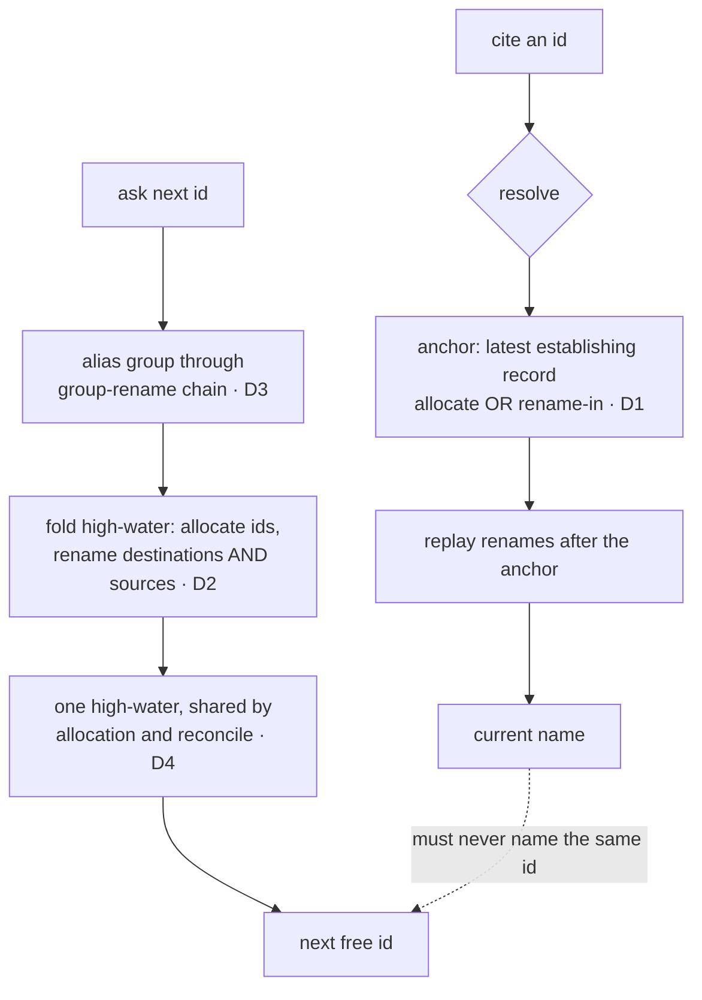

# 011 Rename-path correctness gates

## Overview
Correct four defects in `platform/007`'s frozen resolution and next-id semantics
— a citation that mis-resolves to a stale referent, a vacated ordinal that can be
reclaimed, a renamed group whose ordinals stop counting, and two high-water
computations that disagree — while the registry still contains no rename record
and no migration is owed.

## Defect Profile

Four defects in one report: all four are the same frozen semantics being wrong
for rename records, all four are unreachable until the first rename record is
emitted, and all four must therefore close before that emission. Each was
reproduced by driving the allocator against a crafted registry log.

### D1 — A reused name resolves to its former referent

- **Steps to Reproduce:** resolve a spec id that was renamed away and whose name
  was later re-established by renaming a *different* spec onto it:
  ```
  spec allocate dashboard/001 first …
  spec rename dashboard/001 core/009 …
  spec allocate other/003 second …
  spec rename other/003 dashboard/001 …
  → resolve spec dashboard/001
  ```
- **Actual Behavior:** `core/009` — the referent that *left* the name.
- **Expected Behavior:** `dashboard/001` — the referent that currently holds it.
- **Also affects issues:** the same shape over `issue rename` records returns
  `9` where `7` is correct.
- **Cause:** the forward-replay anchor is set only when the queried id matches an
  `allocate` record, not when it matches a rename *destination*, so replay starts
  before the departed referent's rename and re-applies it.

### D2 — A vacated ordinal can be reclaimed

- **Steps to Reproduce:** ask for the next id in a group whose ordinal was
  vacated by a rename whose source carries no `allocate` record of its own:
  ```
  spec rename dashboard/005 core/001 …
  → next-id dashboard
  ```
- **Actual Behavior:** `dashboard/001` — every ordinal through 005 is offered
  again.
- **Expected Behavior:** an id above the vacated ordinal; a vacated ordinal is
  never reissued.
- **Cause:** the high-water folds in `allocate` ids and rename *destinations*,
  never rename *sources*, so the permanent-gap guarantee silently depends on
  every source having its own prior allocate record.

### D3 — A renamed group's ordinals stop counting, and the registry contradicts itself

- **Steps to Reproduce:**
  ```
  spec allocate dashboard/001 a …
  spec allocate dashboard/002 b …
  group rename dashboard ui …
  → resolve spec dashboard/001    (returns ui/001)
  → next-id ui                    (returns ui/001)
  ```
- **Actual Behavior:** the resolver reports `ui/001` as the current name of an
  existing spec while the allocator offers `ui/001` as the next free id.
- **Expected Behavior:** the two agree — the next id is above every ordinal the
  group holds under its current *or* former names.
- **Cause:** group membership is filtered on the id's literal prefix, so ids
  allocated under a former group name stop counting the moment the group is
  renamed. Resolution *does* apply the group redirect; the high-water does not.

### D4 — Allocation and reconcile disagree on the next ordinal

- **Steps to Reproduce:** with a malformed `issue allocate` record present (a
  numeric ordinal whose durable id fails the id boundary) alongside valid
  records, compare the ordinal a normal allocation would issue against the one
  reconcile would realize a pending provisional onto.
- **Actual Behavior:** the two differ — reconcile can realize onto an ordinal a
  normal allocation already counts as consumed, duplicating it.
- **Expected Behavior:** both compute the same next ordinal for every log shape.
- **Cause:** reconcile counts an ordinal toward its high-water only when the
  record's durable id also passes the boundary; the allocation path counts any
  numeric ordinal.

### Environment

- `platform/007`'s allocator as shipped, with `platform/008` (seed) and
  `platform/009` (provisional/reconcile) landed; reproduced at both the CLI verb
  and the function level against crafted logs in a temp registry.
- **Latent in production.** Both live logs on the coordination branch hold zero
  rename records, so no citation has yet mis-resolved and no ordinal has been
  reclaimed. Every fix here is a pre-emission correction, not a data migration.

## Acceptance Criteria
- [ ] An id whose name is currently established by a rename destination resolves
      to its current referent, not to a referent that previously held that name.
      This holds for both spec ids and issue ordinals.
- [ ] Resolution reflects the most recent event that established a name, so an id
      whose name has changed hands more than once resolves to its latest holder.
- [ ] A vacated ordinal is never reissued, for **every** log shape — including a
      rename source that carries no allocation record of its own. The guarantee
      does not rest on an assumption about how records were emitted.
- [ ] Miscounting errs only toward skipping: a malformed or never-allocated record
      may cause an id to be passed over — a permanent gap — but can never make an
      already-consumed id available again. An ordinal too large to compute with
      reliably is skipped as malformed rather than counted.
- [ ] Every ordinal the allocator can mint is one the registry's own bootstrap
      accepts, so a repository built by the allocator can always be rebuilt into a
      registry from its own tree. The allocator and the bootstrap decide what a
      legal ordinal is from one shared value, not two that happen to agree —
      neither can drift into minting what the other refuses.
- [ ] After a group is renamed, the next id for that group accounts for every
      ordinal the group holds under its current and former names, so the
      allocator never offers an id that resolution reports as already taken.
      This holds across a multi-hop chain of group renames.
- [ ] Asking for the next id of a group that has been renamed away is **refused**,
      naming the redirect, until the caller acknowledges it. The allocator never
      mints into a retired namespace, and never substitutes one group for another
      on the caller's behalf without the caller having said so. On the
      acknowledged path the answer carries the current group, which may differ
      from the group requested — so a consumer that assumes otherwise is relying
      on something the contract does not promise.
- [ ] The next ordinal a normal allocation would issue and the ordinal a
      reconcile pass would realize a pending provisional onto are the same value
      for every log shape, including logs containing malformed records.
- [ ] The registry's record grammar is unchanged and this fix writes no record of
      any kind: it corrects how existing records are read, and emits nothing.
      *(External Constraint — the grammar is frozen upstream; sourced to spec
      `platform/007`.)*
- [ ] Every resolution and next-id behavior `platform/007` shipped and fixtured —
      reuse-via-allocation, a reverted rename cycle, group-rename forward
      resolution, and malformed-record skipping — still holds, with its existing
      fixtures passing unmodified. *(External Constraint — sourced to upstream
      spec `platform/007`, whose shipped semantics this fix corrects without
      reshaping.)*
- [ ] Regression test covers the reported scenario — each of D1 (spec and issue),
      D2, D3 (including a renamed-away group and a multi-hop chain), and D4 has a
      fixture that fails before the fix and passes after.
- [ ] Every value read from the registry and newly consulted by these fixes — a
      rename source's ordinal, a group token from a group-rename record, a
      durable id — is revalidated through the established id/slug boundary before
      it is used as a filesystem path, a git argument, or a ref, and a value that
      fails the boundary is skipped rather than coerced. *(External Constraint —
      the coordination point is writable by anyone who can push it; sourced to
      `platform/007`'s injection-guard AC and the `jimalloc.sh` validation
      precedent.)*
- [ ] The fixes adhere to jim's bash-script conventions (`CLAUDE.md` → Bash
      scripts; `ARCHITECTURE.md` → Scripting Layer): the registry is parsed as
      data — never sourced or evaluated — using Bash and POSIX text tools only,
      with no third-party dependencies. *(External Constraint — sourced to a
      documented project convention.)*

## Data Flow


## Out of Scope
- **Emitting rename, split, or group-rename records.** No consumer is wired here
  and no record is written; `/jim:partition`, `rename`, and `split` continue to
  emit nothing. That is the rename-emitting follow-on's scope (issue #113's
  deliverable), which this fix gates.
- **Any change to the record grammar**, the reachability tiers, the
  compare-and-swap, the erosion guard, or the provisional/reconcile mechanism.
  `platform/007`–`009` behavior is corrected in its read path only, never
  reshaped.
- **A data migration or citation rewrite.** The live logs hold no rename record,
  so nothing already written needs correcting. Normalizing stale in-tree
  citations remains the rename-emitting follow-on's concern.
- **The vacated high-water for a retired or partition-source group whose
  ordinals left no record at all** — jim's own retired `jim` group, whose specs
  were split into four groups before the registry existed. That is a distinct
  problem from D3: D3 aliases a group *across a rename record*, while the retired
  group has no record to alias through. It stays with the rename-emitting
  follow-on (`platform/008` Out of Scope).
- **Consolidating the two registry-writing land paths** (allocation's CAS
  helpers versus the shared batch publish). Structurally adjacent to D4's
  single-high-water concern but a separate refactor with no correctness gap
  (issue #122's remaining half).
- **Spec-side provisional reconcile**, and the decision about whether specs are
  fail-only under `provisional`. Realizing a provisional spec renames a
  directory, so it composes with rename emission and the spec-consumer wiring
  (issues #112, #129), not with this read-path fix.
- **Making a vacated citation dereferenceable.** An id whose only appearance is a
  rename *source* stays unresolvable here: the resolver's known-to-the-registry
  gate does not count a source, and this spec does not change that. Both candidate
  fixes — requiring the emitter to allocate every source, and counting a source as
  known — are dereferenceability concerns that cannot affect allocation (the
  resolver shares no state with the high-water folds), so they belong to the
  rename-emitting follow-on that exists to keep frozen citations resolvable
  (issue #113). D2's fold still makes the permanent gap unconditional regardless.
- **Treating an ordinal or a registry record as an authorization or integrity
  anchor.** `platform/007`'s non-goal carries down: an id is advisory
  provenance. A malformed record that inflates the high-water wastes an ordinal;
  it never grants a capability.

## Research & Architecture Handoff

*Implementation insights surfaced during scoping. These are context for the architect — not requirements, not exclusions. Treat each as a starting point to evaluate, not a directive.*

### Insight 1: One high-water, not two agreeing ones

- **Relates to AC:** *"the next ordinal a normal allocation would issue and the ordinal reconcile would realize onto are the same value for every log shape"* (D4's AC)
- **Surfaced as:** the `platform/009` review's one-line suggestion — count the
  ordinal field toward `max` whenever it is numeric, independent of the durable-id
  validity gate, so reconcile's filter matches the allocation path's.
- **Levelled-up requirement (already in the ACs):** the AC fixes that the two
  values agree for every log shape; it does not fix whether that is achieved by
  editing two functions to match or by having one computation.
- **Deflection reason:** Delegation — the mechanism is an architecture call.
- **Architect note:** D2 also changes the fold (sources now count), so both
  computations move in this spec. Two functions edited to agree is two chances to
  drift again, and this exact divergence is what D4 *is*. A single shared
  high-water both paths call would make the AC structural rather than
  conventional. Note the kinship with issue #122's remaining half (two land
  implementations kept in sync by convention) — same failure mode, different
  function; consolidating here does not oblige consolidating there.
- **Routing hint:** Architect to decide.

### Insight 2: The anchor rule, and why it preserves the shipped fixtures

- **Relates to AC:** *"resolution reflects the most recent establishing record, allocation or rename destination"* (D1's second AC)
- **Surfaced as:** three candidate anchor rules — latest establishing record of
  either kind; last allocation with a rename-in fallback; last rename-in with an
  allocation fallback.
- **Levelled-up requirement (already in the ACs):** the AC fixes the observable
  outcome (most recent establishment wins) rather than the traversal.
- **Deflection reason:** Delegation — traversal shape is the architect's.
- **Architect note:** "latest of either kind" was traced against all three
  shipped resolution fixtures plus the D1 reproduction and produces the correct
  answer in every case; the two fallback-ordered rules each break at least one.
  Worth re-confirming the interaction with cycle-safety: the reverted-rename
  fixture depends on each record applying at most once in file order, and moving
  the anchor later only shrinks the replay window, so termination is preserved —
  but the architect should verify that reasoning rather than inherit it.
- **Routing hint:** Architect to decide / verify against the shipped fixtures.

### Insight 3: Group aliasing needs the redirect chain before the membership filter

- **Relates to AC:** *"the next id accounts for ordinals held under current and former group names, across a multi-hop chain"* (D3's AC)
- **Surfaced as:** the observation that resolution already applies the group
  redirect during replay while the high-water filters on the literal prefix.
- **Levelled-up requirement (already in the ACs):** the AC fixes agreement
  between the resolver and the allocator, not where the aliasing logic lives.
- **Deflection reason:** Delegation — placement and reuse are the architect's.
- **Architect note:** the resolver's replay already walks group-rename records,
  so a shared group-resolution helper may serve both rather than a second
  chain-walk in the high-water. The `jimalloc.sh` docstring covering the
  high-water already records this aliasing as deferred to whichever spec begins
  emitting rename records — this one — so the deferral note should retire with
  the fix.
- **Routing hint:** Architect to decide.

### Insight 4: Proving a latent defect — crafted logs, and the closing window

- **Relates to AC:** *"each of D1–D4 has a fixture that fails before the fix and passes after"* (the regression AC)
- **Surfaced as:** each defect was reproduced by feeding a crafted registry log
  to the allocator, since no consumer emits rename records to reproduce through.
- **Levelled-up requirement (already in the ACs):** the AC fixes that each defect
  is covered by a fixture that discriminates fixed from unfixed, not the fixture
  style.
- **Deflection reason:** Delegation — fixture shape follows existing convention.
- **Architect note:** `tests/jimalloc.sh` already exercises resolution at the CLI
  verb level over a registry directory and the high-water at the function level
  over piped logs; matching each defect to its sibling's existing style keeps the
  file coherent. The window matters for sequencing: these are pre-emission fixes
  only while the live logs hold zero rename records, and the rename-emitting
  follow-on closes that window permanently.
- **Routing hint:** Architect to decide.

## Open Questions
- [x] ~How is the permanent gap guaranteed — count rename sources, or specify the
  invariant and enforce it in the emitter?~ → Both: fold defensively so the
  guarantee holds for any log shape, *and* record the invariant so the
  rename-emitting follow-on does not rely on luck.
- [x] ~Which record anchors replay when an id has several establishing records?~ →
  The latest establishing record of either kind (allocation or rename
  destination).
- [x] ~What does the next id answer for a group renamed away?~ → The current
  group's next id; never mint into a retired namespace.
- [x] ~The answer's group prefix can then differ from the one asked about, on a
  public verb — is that left implicit?~ → No. Redirects must be **visible**: the
  answer names the redirect it applied. Settles both the security review's silent-
  namespace-redirect finding and research's return-contract signal, which are the
  same gap seen from the attacker's side and the caller's side.
- [x] ~Is naming the redirect enough, or must the caller consent to it?~ → Consent.
  Amended after the plan-phase security review: naming a redirect only informs
  whoever reads the channel it was named on, so a program can honor it and still
  substitute one group for another unnoticed. Refusing until acknowledged makes the
  guarantee structural instead of conventional, and matches how the allocator
  already handles a surprising answer elsewhere — `seed` refuses a populated kind,
  `reconcile spec` refuses rather than half-realizing. This does not reverse the
  earlier "answer for the current name" decision; it reaches the same goal (never
  mint into a retired namespace) without the silent substitution. **Accepted
  trade:** refusal turns a crafted `group rename` from a stealth redirect into a
  loud one-record denial — the same shape as the exhaustion vector — on the
  judgment that against tampering, a refusal that names the redirect is itself
  detection, where a silent redirect yields nothing.
- [x] ~Is the conservative-fold direction guarantee enough on its own?~ → No, but
  the fix is not a bound on allocation. Amended twice: first to add a ceiling, then
  — after the plan-phase security review showed a ceiling and the gap guarantee are
  unsatisfiable together — to require instead that the **allocator and the bootstrap
  share one definition of a legal ordinal**. A crafted record can still inflate a
  group; what it can no longer do is mint something the registry cannot be rebuilt
  from, which was the actual concern. Recoverability is the requirement; the ceiling
  was only one way to state it, and the wrong one.
- [x] ~With a ceiling in place, one crafted record at the ceiling denies a group
  allocation forever — which property yields?~ → Neither. The conflict was an
  artifact of bounding the allocator to match an arbitrary bootstrap guard. Aligning
  the guard upward instead dissolves it: no reachable ceiling under normal
  ordinals, so no exhaustion refusal, so no denial — and the registry stays
  rebuildable. Corroborating the fold was considered and rejected: an attacker can
  append a well-formed `allocate` record just as easily as a rename, so
  corroboration separates malformed logs from well-formed ones, never attacker
  records from legitimate ones.
- [x] ~Should the rename-emitting follow-on be required to emit an allocation
  record for every rename source, and/or should this spec's resolver stop
  depending on it?~ → Neither here. Investigation showed both are
  dereferenceability, not allocation: the resolver has one caller and shares no
  state with the high-water folds, so neither choice can change which id gets
  allocated. Both options, and the measured side effects of the resolver-side one,
  moved to issue #113, which owns dereferenceability. This spec keeps only the
  defensive fold — which already makes the permanent gap unconditional.

**Nothing remains open.** Every question raised during scoping is settled above.
