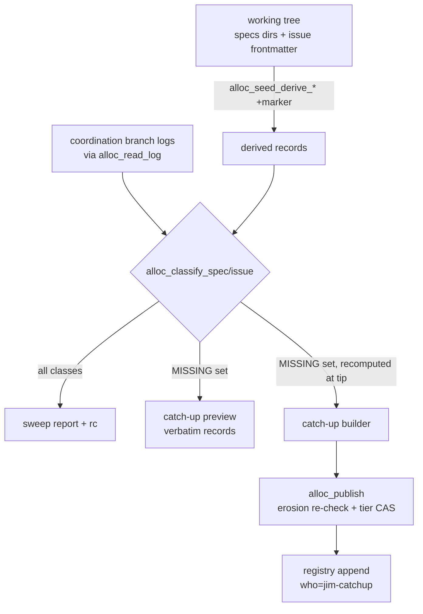

# Registry integrity and drift — Plan

## Overview

Two new allocator verbs — a read-only `sweep` and a preview-then-apply
`catch-up` — built around one shared classification core per kind, so detect,
preview, and repair can never disagree about what is missing; the hardening
riders (tip validation, duplicate refusal, reserved-slot normalization) land
first as independent tasks the new verbs then build on.

## Design Decisions

### 1. Verb names and placement

- **Chosen:** `jimalloc.sh sweep` and `jimalloc.sh catch-up [--apply]`, two
  new dispatch arms beside `seed`/`reconcile`.
- **Why:** the spec's detect/repair fork (Open Questions) settled on two
  verbs; short imperative names match the house verb surface, and neither
  collides with `/jim:verify`'s "registry"/"check" vocabulary.
- **Rejected:** `seed --catch-up` (issue #130's sketch) — overloading seed
  muddies its crisp bootstrap-only contract; a distinct verb shares the same
  builders without sharing the refusal semantics.

### 2. Exit-code family

- **Chosen:** shared family across both verbs — `0` clean/success, `1` hard
  failure (house convention), `2` malformed invocation, `3` the verb's
  content outcome: for `sweep`, drift found; for `catch-up --apply`, partial
  repair (clean records landed, mismatches remain, AC 9). `sweep` adds `4`
  could-not-check (no coordination ref anywhere / unreadable tree). A
  stale-but-present registry is *not* could-not-check — the sweep runs and
  names the staleness (AC 6).
- **Why:** under the verify registry rung (exit 0 → holds, clean non-zero →
  violated, crash → failed), `3` maps drift → `violated` — semantically
  exact. `4` also maps to `violated`, which is wrong-but-loud; the captured
  evidence names the degradation, and loud-wrong beats silent-wrong. Direct
  CI consumers distinguish all four.
- **Rejected:** making could-not-check a self-signal so verify reads
  `failed` — too clever, surprising in traces; wrapper shims in
  `verify_command_*` config — pushes logic into every project's jimconf.

### 3. One classification core per kind

- **Chosen:** pure functions `alloc_classify_spec` / `alloc_classify_issue`
  (log on stdin, derived tree records as input) emitting one TAB-separated
  fact row per finding; the sweep report, the catch-up preview, and the
  catch-up builder all consume these rows and nothing else.
- **Why:** platform/011's lesson — agreement by convention across parallel
  implementations is how D4 happened; one fold made it structural. Same
  shape here: the append set *is* the `missing` class.
- **Rejected:** independent comparison logic per verb — the drift the sweep
  reports and the records catch-up appends could diverge.

### 4. Id-boundary cost (security Finding 4, #142)

- **Chosen:** validate each *unique* token once per run (in-run dedupe over
  the existing `alloc_valid_token` boundary); no new validator copy. If
  build-time measurement blows the budget (sweep over the live registry
  materially slower than a `peek`), escalate to #142 (memoize the boundary)
  rather than hand-rolling a local fix.
- **Why:** the "no fourth copy" boundary doctrine outranks the perf
  advisory; dedupe removes the bulk of repeated group/date tokens cheaply.
- **Rejected:** a byte-identical `is_valid_id` copy under the lockstep
  fixture (grows the SYNC set for a concern #142 already owns); a batch
  `valid-ids` verb on jimfile.sh (surface growth out of scope).

### 5. Report shape, sanitization, and caps (AC 15, security Finding 5)

- **Chosen:** class-prefixed structured lines matching the spec mockup —
  `drift:` / `info:` / `not covered:` / denominators / a `registry @ <tip>
  (refreshed|last-seen)` header — every echoed field passed through the
  id boundary where it must be an id, and through the verify-style
  sanitizer (`tr -d '\t\n\r'` + length cap) everywhere else; per-class
  listing capped at 100 rows with the full count always printed
  (`… and N more` — the CROSS-REF-CAPPED precedent, never a silent drop).
- **Why:** the registry is push-writable; a crafted record must not forge,
  suppress, or flood report lines. No skill layer renders this output, so
  the script owns both machine-greppability and human readability.
- **Rejected:** pure TSV facts + separate renderer — no consumer exists to
  render them; bespoke prose — not greppable.

### 6. Catch-up semantics (the four recorded on #130)

- **Chosen:** records derive exactly as seed derives them, with the
  provenance marker parametrized: catch-up stamps **`jim-catchup`**
  (`jim-seed` stays the bootstrap's marker). Dates mirror seed (issue
  `created:`; today for specs — advisory per platform/007). A `group
  allocate` record is appended only when the group is absent from the log
  *and* the batch carries ≥1 spec record for it (the `alloc_build_spec`
  rule). Mismatch-class drift excludes that identity from the append set,
  is named in preview and apply output, and drives rc 3 (AC 9).
- **Why:** a distinct marker is the only forensic distinguisher from the
  erosion guard's accepted well-formed-append residual (security review);
  the rest keeps catch-up byte-compatible with what seed would have written.
- **Rejected:** stamping specs with inferred issuance dates (nothing in the
  tree records one; #144's hand repair had ledger knowledge a script
  doesn't); halting the whole apply on any mismatch (the spec's settled
  fork — one bad ordinal must not block unrelated repair).

### 7. Duplicate identity = refusal with named claimants (AC 11)

- **Chosen:** during the resolvers' scan, a second `allocate` record
  claiming the same canonical identity (spec id, or issue durable id)
  turns the answer into rc 1 naming both record positions; the realize
  path's already-realized map halts the batch the same way its
  within-batch duplicate already does. The sweep reports the same
  condition from the classifier (`drift: duplicate-id`).
- **Why:** the spec's contract is "report the contradiction rather than
  answer from the last record" — a wrong referent handed out confidently is
  the worst outcome; refusal with evidence is the loud form.
- **Rejected:** warn-on-stderr + still answer — a notice informs only
  whoever reads stderr (the platform/011 redirect lesson); first-wins —
  equally arbitrary, still silent.

### 8. Origin-tip validation locus (AC 12)

- **Chosen:** inside `alloc_origin_tip`, immediately after the awk field
  extraction: non-empty tip must pass `alloc_valid_token` (the
  `jimledger.sh resolve_head` discipline); empty (branch absent) stays
  legal.
- **Why:** both consumers call this one function, so every interpolation
  site is covered by a single gate.
- **Rejected:** per-call-site validation — two consumers today, and the
  next caller forgets.

### 9. Reserved-slot skip normalization (AC 16)

- **Chosen:** in `alloc_seed_derive_specs`, replace the literal
  `[[ "$ord" == "000" ]]` with a digits-guarded numeric test
  (`[[ "$ord" =~ ^[0-9]+$ ]] && (( 10#$ord == 0 ))`), placed so a bare
  `000` directory still skips before the no-slug conflict check.
- **Why:** any zero-valued ordinal is the reserved slot; the digits guard
  must precede `10#` or a non-numeric leading token errors under
  arithmetic.
- **Rejected:** normalizing at the classifier instead — the derivation is
  shared by seed and catch-up, and fixing it there closes #121's remaining
  half at the single source.

### 10. Blueprint invariant and verify wiring (AC 13)

- **Chosen:** invariant `registry-tree-consistency` (criticality high) on
  the platform blueprint with check `registry:id-sweep`; this repo's
  `jimconf.toml` gains `verify_command_id-sweep = "bash
  skills/file/scripts/jimalloc.sh sweep"` — the first live
  `verify_command_*`, so the rung gets its first real exercise here. The
  blueprint row itself is folded at the completion gate through
  `/jim:blueprint` (never a hand edit); the build task stages the row text
  and wires the config.
- **Why:** zero engine change (the spec's settled fork), and the dogfood
  wiring is the proof the mapping in DD 2 actually behaves as designed.
- **Rejected:** naming the check `registry:registry-sweep` — doubles the
  overloaded word the research flagged.

## Constitution Check

**ARCHITECTURE.md status:** Present — constraints noted below.

| Constraint from ARCHITECTURE.md | Honored? | Notes |
| :--- | :--- | :--- |
| Bash-vs-Prompt rule: deterministic logic in scripts | Yes | Both verbs and all riders are pure bash in `jimalloc.sh`; no skill-layer judgment added |
| No third-party deps; bash + POSIX only | Yes | grep/sed/awk/sort only, as today |
| `set -uo pipefail`, `LC_ALL=C`, parse-never-source | Yes | Existing preamble; registry stays parsed data |
| Single id boundary (`jimfile.sh valid-id`), no fourth copy | Yes | DD 4 explicitly rejects a new copy |
| Preview-then-apply for mutations | Yes | `catch-up` previews by default; `--apply` gates the CAS append |
| `BASH_SOURCE`-relative inter-script composition | Yes | No new composition added |
| Group blueprints change only through `/jim:blueprint` | Yes | AC 13 fold rides the completion gate (DD 10) |
| Tests under `tests/`, testlib framework | Yes | All new cases in `tests/jimalloc.sh` |
| `ARCHITECTURE.md` refreshed via `/jim:arch` at the build gate | Yes | Pipeline-handled; not a deferral |

## File Manifest

| Component | File Path | Action | Notes |
| :--- | :--- | :--- | :--- |
| Allocator | `skills/file/scripts/jimalloc.sh` | Update | Tip validation, dup refusal, reserved-slot fix, marker param, classifiers, `sweep`, `catch-up`, usage |
| Allocator tests | `tests/jimalloc.sh` | Update | ~30 new cases incl. mutation-tested guard fixtures |
| Project config | `jimconf.toml` | Update | `verify_command_id-sweep` wiring (dogfood) |
| README | `README.md` | Update | Sweep/catch-up rows in the command table (AC 17) |
| Workflow doc | `WORKFLOW.md` | Update | Registry-integrity row (AC 17) |
| Platform blueprint | `docs/specs/platform/000-blueprint/spec.md` | Update (gate) | `registry-tree-consistency` invariant — written by `/jim:blueprint` at completion, never by hand |

## Interface Contracts

```text
sweep
  stdout: report (class-prefixed lines, sanitized, per-class cap 100 + named remainder)
    sweep: registry @ <tip> (refreshed | last-seen; refresh failed)
    specs:  <n> records vs <m> tree dirs, <g> groups checked
    issues: <n> records vs <m> files checked
    drift:   missing-record | mismatch | duplicate-ordinal | duplicate-id | reserved-slot
    info:    record-without-tree
    not covered: reserved slots (n) · pending provisionals (n) ·
                 retired groups (names) · rename-source-only ids (n)
  rc: 0 clean · 1 hard failure · 2 usage · 3 drift found · 4 could-not-check
  never mutates; refresh is the peek model (best-effort fetch)

catch-up [--apply]
  preview (default): renders each record it would append VERBATIM,
    plus the mismatches it cannot repair; mutates nothing
  --apply: one CAS commit via alloc_publish builder; reports the records
    actually appended (recomputed at tip, may differ from preview)
  rc: 0 success or clean no-op · 1 hard failure · 2 usage · 3 partial repair
  records: derived as seed derives, who = jim-catchup,
    dates = issue created: / today for specs

alloc_classify_spec  <derived-records-file>   (specs log on stdin)
alloc_classify_issue <derived-records-file>   (issues log on stdin)
  → one row per finding:
    CLASS \t kind \t identity \t detail        CLASS ∈ MISSING | MISMATCH |
      DUP-ORD | DUP-ID | RESERVED | INFO-NO-TREE
    plus  CHECKED \t kind \t tree-n \t record-n
  pure, canonicalized both sides (alloc_canon_specid), tokens deduped
  before boundary validation

alloc_seed_derive_specs / _issues: gain trailing optional <marker> arg,
  default "jim-seed" (byte-identical output when omitted)

alloc_origin_tip: non-empty tip must pass alloc_valid_token before return

resolvers: a second allocate record claiming an already-claimed canonical
  identity → rc 1, "duplicate identity … claimed by records <i> and <j>"
```

## Data Flow



## Task Breakdown

1. [x] Validate the origin tip inside `alloc_origin_tip` (AC 12): non-empty
   awk-extracted tip crosses `alloc_valid_token`; add two cases (crafted
   `ls-remote` output via PATH-shimmed `git`, mutation-tested).
   **Verify:** `bash skills/meta-test/scripts/run.sh jimalloc | tail -1`

2. [x] Normalize the reserved-slot skip to digits-guarded numeric zero in
   `alloc_seed_derive_specs` (AC 16); cases for `0-foo`, `00-foo`, and the
   preserved bare-`000` skip.
   **Verify:** `bash skills/meta-test/scripts/run.sh jimalloc | tail -1`

3. [x] Parametrize the derivation provenance marker (trailing optional arg,
   default `jim-seed`); assert existing seed fixtures byte-unchanged.
   **Verify:** `bash skills/meta-test/scripts/run.sh jimalloc | tail -1`

4. [x] Duplicate-identity refusal in `alloc_resolve_spec` and
   `alloc_resolve_issue` (AC 11): rc 1 naming both claiming record
   positions; cases per resolver, mutation-tested.
   **Verify:** `bash skills/meta-test/scripts/run.sh jimalloc | tail -1`

5. [x] Duplicate-claim halts in **both** realize maps (AC 11):
   `alloc_reconcile_realize`'s durable-id map and
   `alloc_reconcile_realize_spec`'s (group, slug, date) map — a second
   record claiming an already-claimed key halts the batch naming both
   claimants, mirroring the within-batch halt; cases seed a duplicate claim
   on each side (security finding 7).
   **Verify:** `bash skills/meta-test/scripts/run.sh jimalloc | tail -1`

6. [x] Classifier cores `alloc_classify_spec` / `alloc_classify_issue` per
   the Interface Contract (AC 1, 2, 4 substrate): every class row + CHECKED
   denominators; sourced-function cases covering each class, canonical
   spelling (unpadded record vs padded dir), and token dedupe.
   **Verify:** `bash skills/meta-test/scripts/run.sh jimalloc | tail -1`

7. [x] `sweep` verb (AC 1–6, 15): peek-model refresh, tip/staleness header,
   report rendering from classifier rows with sanitization and per-class
   caps (DD 5), non-coverage counters (reserved slots, pending
   provisionals, rename sources, and **uncovered groups**: a specs-tree
   group directory with zero derivable rows and zero registry records is
   named uncovered — the retired-group signature; jim's own retired `jim`
   group is the fixture (security finding 6)), rc contract (DD 2). Cases:
   clean, each drift class, offline (`alloc_provisional_repo` pattern),
   crafted-record injection attempt, cap overflow — guard fixtures
   mutation-tested.
   **Verify:** `bash skills/meta-test/scripts/run.sh jimalloc | tail -1`

8. [x] `catch-up` preview (AC 7 preview half, 16): MISSING set rendered as
   verbatim records with `jim-catchup` marker; mismatches listed as
   unrepairable; rc 0.
   **Verify:** `bash skills/meta-test/scripts/run.sh jimalloc | tail -1`

9. [x] `catch-up --apply` (AC 7–10): `alloc_publish` builder appending the
   MISSING set recomputed at tip; reports landed records; rc 3 on partial
   repair; idempotent re-run no-op; cases for fresh gaps, concurrent
   advance between preview and apply, mismatch partial, erosion refusal,
   CAS retry.
   **Verify:** `bash skills/meta-test/scripts/run.sh jimalloc | tail -1`

10. [x] `usage()` + README + WORKFLOW rows (AC 17).
    **Verify:** `grep -c 'catch-up' README.md WORKFLOW.md skills/file/scripts/jimalloc.sh | grep -v ':0'`

11. [x] Wire `verify_command_id-sweep` in `jimconf.toml`; resolve the
    command, inspect it, then run it — two steps, so the executed string is
    visible before execution (security finding 8) — confirming the DD 2
    mapping (0/3 observed); stage the `registry-tree-consistency` invariant
    row text for the completion-gate `/jim:blueprint` fold (AC 13).
    **Verify:** `cmd="$(bash skills/conf/scripts/jimconf.sh get verify_command_id-sweep)" && printf 'resolved: %s\n' "$cmd" && bash -c "$cmd"; rc=$?; test $rc -eq 0 -o $rc -eq 3`

12. [x] Mutation-test audit (AC 14): for each new guard/detection, neuter
    it, assert its fixture fails, restore — recording the pass in the case
    comments (the `tests/specreconcile.sh:799` pattern); full suite green.
    **Verify:** `bash skills/meta-test/scripts/run.sh | tail -1`

## Requirements Coverage Summary

| Spec Acceptance Criterion | Addressed In Task(s) |
| :--- | :--- |
| AC 1 read-only sweep, named drift classes | 6, 7 |
| AC 2 drift vs informational classification | 6, 7 |
| AC 3 named non-coverage incl. staleness | 7 |
| AC 4 coverage denominators | 6, 7 |
| AC 5 three-way exit distinguishability | 7, 11 |
| AC 6 offline sweep runs, names staleness | 7 |
| AC 7 catch-up preview/apply, atomic CAS append, verbatim preview, landed-set report | 8, 9 |
| AC 8 idempotent, append-only | 9 |
| AC 9 partial repair exits non-zero | 9 |
| AC 10 derived data only, distinct marker | 3, 8, 9 |
| AC 11 duplicate detection, three sites | 4, 5 (report side: 6, 7) |
| AC 12 origin tip revalidated | 1 |
| AC 13 blueprint invariant + verify wiring | 11 + completion gate |
| AC 14 discriminating fixtures per class | 12 (and per-task cases) |
| AC 15 emitted-token sanitization | 7, 8 (DD 5) |
| AC 16 zero-ordinal reserved slot | 2 |
| AC 17 operator docs, no new skill | 10 |

## Out of Scope

- Rename-record emission, retired-`jim` backfill (Spec B); batch-CAS
  (Spec D); issue placement (Spec F).
- Automatic mismatch repair — reported only, per the spec.
- #142's general boundary memoization — DD 4 dedupes within-run and
  escalates to #142 if the budget is blown, it does not fix it.
- The `ARCHITECTURE.md` refresh and the blueprint invariant *write* — both
  performed by the `/jim:build` completion gate (`/jim:arch`,
  `/jim:blueprint`); pipeline-handled, not deferrals.

## Open Questions

- [x] ~~Exit-code mapping under verify~~ → DD 2: rc 3 drift maps `violated`
  exactly; rc 4 maps `violated` loud-wrong with evidence naming the
  degradation — accepted.
- [x] ~~Batch validation vs boundary doctrine~~ → DD 4: in-run dedupe, no
  fourth copy, #142 escalation path.

None open — no `[NEEDS CLARIFICATION]` markers.
