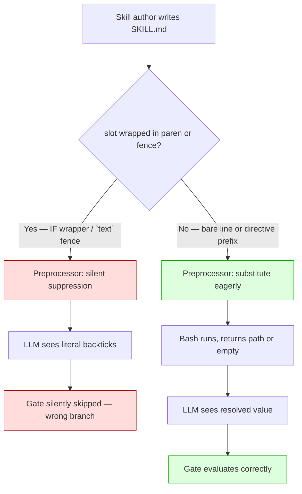
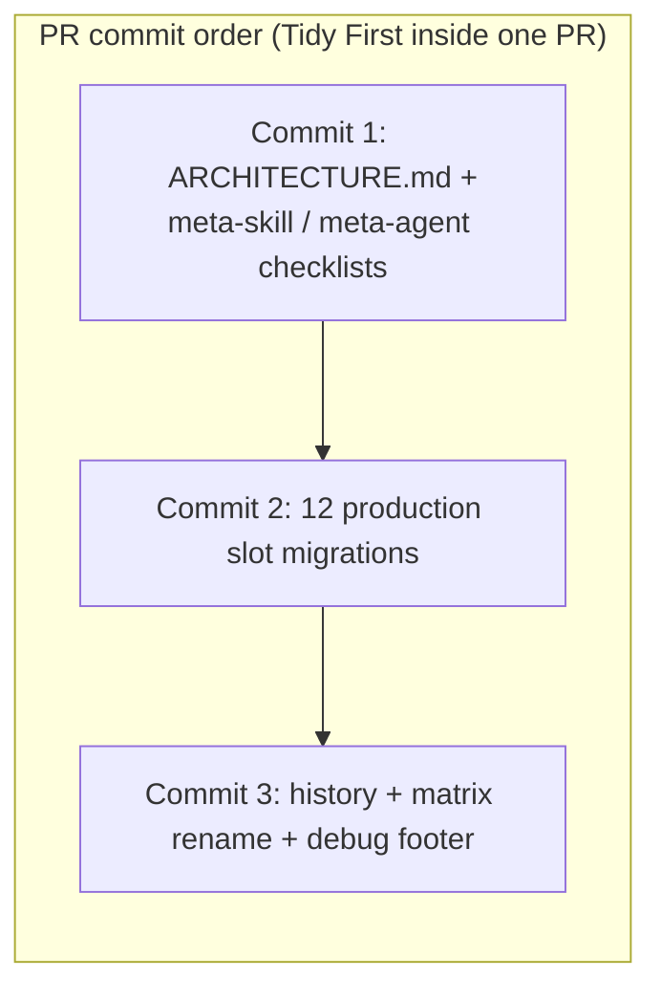

> **2026-05-12 reopen:** Tasks 24–25 added to close two gaps discovered during 013-arch-feedback-loop research: (a) `skills/arch/SKILL.md:43–47` was missed by the original 12-slot `!`-injection-in-parens inventory because its parens hold prose, not a substitution slot — the form itself is still the retired BASIC anti-pattern; (b) the "Historical artifacts" AC's forensic-annotation requirement was silently skipped on three documents. See spec §"Historical-annotation hygiene" and §"Original repro must clear" for the extended ACs.

> **2026-05-13 amendment:** The EXISTS-family directive vocabulary (`READ_IF_EXISTS` / `RUN_IF_EXISTS` / `DO_IF_EXISTS` / `IF X EXISTS THEN`) introduced by Phase 1–4 of this plan is itself superseded by a sentinel form: `SET <name> = !\`bash …\`` + `IF <name> != "NOT_FOUND" THEN … ENDIF`. The resolver (`skills/file/scripts/jimfile.sh cmd_get`) now returns the literal string `NOT_FOUND` when a path-typed key is missing on disk (D2-revised — reverses the path-or-empty semantics from commit `3fd1811`). Empirical `/jim:build` and `/jim:spec` runs on 2026-05-13 exposed an EXISTS-trap semantic-layer leak: directive names containing "EXISTS" primed defensive `test -e` / `test -f` re-checks on already-resolved paths. See `docs/brainstorms/20260513-directive-vocab-exists-trap.md` for the design rationale. **Tasks 1–25 below stayed `[x]` after their original execution** (they did the work as specified at the time); the new Phase 5 tasks 26–34 below re-migrate the same sites to the post-amendment shape. Decisions 2–5 and 9 are superseded; Decisions 1, 6, 7, 8 still apply. The bundled-PR delivery shape stays — the amendment lands as three additional internal commits on the same `refactor/directive-vocab` branch.

# 011 Replace IF-wrap pseudocode with a directive vocabulary — Plan

## Overview

Convention-first refactor: rewrite the `ARCHITECTURE.md` Logic-Flow / Substitution sections and the `meta-skill` / `meta-agent` validation checklists to the new two-family convention — four-directive vocabulary (`READ_IF_EXISTS`, `RUN_IF_EXISTS`, `DO_IF_EXISTS`, `SET`) for common single-action and multi-step gates, plus a lean paren-free `IF X EXISTS THEN … ELSE IF X == "value" THEN … ENDIF` block for genuine branching (markdown indentation as block delimiter, `ENDIF` one word, no `DO:`/`DONE`, implicit fall-through) — then migrate the twelve confirmed production slots, three copy-from history examples, the matrix fixture rename, and the debug-report footer — all in one bundled commit/PR.

## Design Decisions

*Locked answers to the planning-time decisions. Each ties back to a research signal or spec constraint.*

### 1. Convention update lands before slot migrations within the bundled PR

- **Chosen:** Sequence the work so the ARCHITECTURE.md and meta-skill/meta-agent checklist updates land in the first internal commit of the PR; the twelve production-slot rewrites land in subsequent commits inside the same PR. Final commit handles history artifacts + debug-report footer + matrix rename.
- **Why:** Spec's *Delivery shape* AC allows internal Tidy-First splitting inside one bundled PR. Until `meta-skill:104` and `meta-agent:125` are flipped, any concurrent skill authoring would be validated against the *broken* convention (research § Security & Performance, last bullet). Putting convention first inside the PR keeps internal commits coherent without breaking the single-rollout guarantee.
- **Rejected:** Single squash commit — works for the user-visible outcome but loses the structural/behavioral separation Tidy First asks for, and makes the PR harder to review.
- **Rejected:** Slots first then convention — leaves the checklists actively enforcing the broken idiom for the duration of the PR, exactly the regression risk the spec is preventing.

### 2. Single-read-with-fallback-note migrates to `READ_IF_EXISTS` + adjacent prose

- **Chosen:** For the five slots with an ELSE body that is just a prose instruction ("note conversationally", "proceed without it") and *no* file-dependent action — `plan:53`, `vision:27`, `roadmap:27`, `arch:37`, plus the two stacked reads in `research:99,103` — replace the whole IF-WRAP block with a single `READ_IF_EXISTS … — note` line, and lift the ELSE body to a standalone prose sentence underneath (or fold its meaning into the trailing `— note` clause).
- **Why:** `READ_IF_EXISTS` has no ELSE form by design (it's a single-action directive). The semantics the ELSE body carried — "note the absence conversationally" — is not gated on the path: an LLM that sees `READ_IF_EXISTS` followed by "If absent, note this in the Constitution Check section" reads the second sentence unconditionally and behaves identically to the original ELSE. Avoids inventing a `READ_IF_EXISTS … ELSE …` shape that isn't in matrix U-Z.
- **Rejected:** Promoting these five slots to `SET … + IF X EXISTS THEN READ … ELSE … END IF` — works correctly but is heavier than needed for non-data-loss cases and would make the directive vocabulary look like syntax sugar for `SET + IF`, instead of a tiered set of forms (single-action → multi-step → branching).
- **Rejected:** Extending the directive vocabulary with `READ_IF_EXISTS … — note ELSE — note` — would require a new matrix pattern; spec § *Out of Scope* explicitly forbids new directives beyond the four agreed.

### 3. Genuine two-branch gates use `SET <name> = …` + lean paren-free `IF <name> EXISTS THEN … ELSE IF <name> == "value" THEN … ENDIF`

- **Chosen:** For `vision:35`, `roadmap:41`, `build:73`, and `build:106` — the four slots where THEN and ELSE both encode real, file-existence-dependent behavior — use the `SET` directive to bind the path to a name, then a paren-free `IF <name> EXISTS THEN … ELSE IF <name> == "value" THEN … ENDIF` block (matrix W + paren-free IF). The `build:73` and `:106` gates use a numbered-list body indented directly under `IF pre_commit EXISTS THEN` (markdown indentation is the block delimiter — no `THEN DO:` / `DONE` markers).
- **Why:** Matrix W (`SET name = !\`…\``) is ✅; the `IF <name> EXISTS THEN` (no parens around `<name>`) form has no `!`-injection slot at all — it's pure pseudocode the LLM evaluates against the bound name. Matrix AA ✅ (2026-05-12 rerun) confirms a numbered body indented under `THEN` substitutes; matrix BB ✅ confirms the `ELSE IF X == "value" THEN` chained form substitutes. The lean form is the canonical answer for data-loss cases and for `require_*` halt-branch gates.
- **Rejected:** Keep the heavier interim form (`DO:` / `DONE` block markers, two-word `END IF`, explicit `Otherwise, skip silently` fall-through prose) that landed in tasks 1–4 — superseded by the lean form once matrix AA, BB ✅ confirmed the leaner shape is safe.
- **Rejected:** Keep the `IF (!\`…\`)` form for ELSE-carrying multi-step blocks until matrix proves a `DO_IF_EXISTS … ELSE …` extension — the four data-loss cases would stay broken indefinitely; spec § *Acceptance Criteria* requires them migrated in this PR.

### 4. `build/SKILL.md:73` and `:106` fences — stylistic, not structural (reframed 2026-05-12)

- **Chosen:** Drop the surrounding ` ```text … ``` ` fences around both `build/SKILL.md` slots. Replace the (formerly-fenced) block (lines 72–80 and 105–113) with bare-line `SET` directives + lean paren-free `IF … EXISTS THEN … ELSE IF … == "true" THEN … ENDIF` body.
- **Why (reframed):** The original Decision 4 mandated fence removal on the premise that fences "independently suppress `!`-injection on top of the paren rejection." **That premise is disproven.** The 2026-05-12 matrix rerun returned **N ✅** (fences do NOT suppress) and **O ✅** (indented code blocks do NOT suppress) — only inline backticks (matrix P ❌) literal-quote a slot. So the original `IF (!\`bash …\`)` slots at `build:73,106` were **singly broken** (paren-wrap only), not doubly broken. Removing the paren-wrap by migrating to the lean form is sufficient to make both slots substitute correctly; the fences themselves are stylistic. The user was asked explicitly during the lean-form refinement (2026-05-12 session) whether to keep or drop the fences and chose **drop** for visual consistency with the surrounding skill body. Either form would be correct — this is recorded as a stylistic call, not a correctness fix.
- **Rejected (under original framing):** Keep the fence and switch the inner content to `DO_IF_EXISTS` — moot under N ✅, but had it been retained, the substitution would still work.
- **Rejected (under original framing):** Replace `text` fence with a non-suppressing language tag — moot under N ✅; all fences substitute regardless of tag.

### 5. `research/SKILL.md:99,103` stay indented under their numbered step

- **Chosen:** Keep the two `READ_IF_EXISTS` directives at 3-space indent under step 1 of `### 6. Phase 2 — Alignment Validation`. Matrix Z verified this exact shape substitutes successfully.
- **Why:** Resolves spec § *Open Questions* item 1. Preserves the visual nesting (the two reads are sub-actions of step 1, conceptually). Un-indenting would visually collapse them with steps 2–4, which is misleading.
- **Rejected:** Un-indent to top level — semantically valid (both forms work per matrix), but visually misrepresents the relationship to step 1.

### 6. The matrix fixture lives in a project-local directory (not top-level `skills/`) — SUPERSEDED by spec 014

> **Superseded by spec 014.** The 011 decision below preserved as historical record. Spec 014 reverses Decision 6 — the matrix is promoted to the top-level `skills/meta-matrix/` family (dispatcher + four category sub-skills) so jim users can invoke `/jim:meta-matrix` in their own projects. Path strings in this Decision block have been amended in place by spec 014 to drop the old project-local locations; the conceptual reasoning is preserved verbatim.

- **Chosen at 011 time:** The rename is a project-local move under `.claude/`: `subtest` → `meta-matrix`. The fixture does *not* graduate to a plugin skill under `skills/`.
- **Why (at 011 time):** It is a manual regression probe, not a product feature. Plugin skills under `skills/` are part of jim's public surface; the matrix is a developer diagnostic and lived alongside other repo-local tooling under `.claude/`. The 011 spec consistently used a project-local path; this decision just made that explicit. (Reversed by spec 014 — the matrix is now a product feature for jim users debugging their own Claude Code installs.)
- **Rejected at 011 time (now adopted by spec 014):** Move to `skills/meta-matrix/` — would imply it ships to users of the jim plugin. (Spec 014 chose exactly this; the "no `name:`-shaped trigger purpose for end users" reasoning no longer holds — the dispatcher exists for chain-all and category selection.)

### 7. ARCHITECTURE.md gets one new Substitution-Conventions rule, not a new section

- **Chosen:** Add a sixth bullet ("Wrapper sensitivity") to the existing Substitution Conventions rules list (under the table at `ARCHITECTURE.md:336–342`). Add a one-line mention of the matrix fixture (at 011-lock-in time under `.claude/`, relocated to `skills/meta-matrix/` by spec 014) as the manual regression fixture inside that same rule. The Logic-Flow Conventions section (lines 279–324) gets a wholesale rewrite — table swap + idiom anti-pattern callout — but stays as one section.
- **Why:** Minimum surface-area change consistent with the spec's *Convention codification* ACs. A separate "Wrapper sensitivity" section would orphan a small rule; folding it as rule #6 reuses the existing pattern (numbered behavioral rules under the sigil table).
- **Rejected:** Add a new "Preprocessor Quirks" section — would create a new top-level concept; the rule is properly part of Substitution Conventions because the sigil it affects is `!`.

### 8. Each migration is its own task, not batched by file

- **Chosen:** Tasks are atomic per slot (or per closely-paired stacked-pair, where two slots share the same surrounding paragraph and the migration is a single edit) — not "migrate skills/spec/SKILL.md" as one task with two sub-edits.
- **Why:** DoD § 10 — "Each task changes one thing and verifies one thing." Per-slot grep-Verify commands give the coder a precise pass/fail for each AC line. Two-slot tasks remain where the slots are stacked on consecutive lines with shared context (`spec:33,37`, `brainstorm:30,34`, `research:99,103`) — splitting those further produces redundant edits.
- **Rejected:** One task per file — would conceal individual AC failures behind a coarse Verify and make a single typo in slot N invisible until the file-level grep happens to hit it.

### 9. `arch/SKILL.md:43–47` (added 2026-05-12) — `SET arch_doc` + lean `IF arch_doc EXISTS THEN … ELSE … ENDIF`, not a `target` name

- **Chosen:** Bind the architecture path with `SET arch_doc = !\`bash …get architecture\`` directly inside step 3 (not a global hoist into step 1). Use `IF arch_doc EXISTS THEN … ELSE … ENDIF`. Preserve the `$ARGUMENTS=directory` nuance from step 1 as a parenthetical inside the THEN body ("When `$ARGUMENTS` is a directory, the target is `{$ARGUMENTS}/<filename portion of arch_doc>`; the differential-update treatment still applies if a file exists at the target.").
- **Why:** Symmetric with `vision_doc` (`vision/SKILL.md:35`), `roadmap_doc` (`roadmap/SKILL.md:41`), and the spec-013 `arch_doc` binding in the build-skill arch-feedback step — one canonical name for the resolved architecture path across the codebase. Local SET keeps step 3 self-contained; step 1 retains its current shape (a bare substitution serving the argument-routing prose), which avoids cascading edits and a wider blast radius. The `$ARGUMENTS=directory` case stays as prose because the actual write-target derivation involves conditional logic the directive vocabulary doesn't try to express.
- **Rejected:** `SET target = …` — would diverge from the rest of the codebase's `<doc>_doc` naming and obscure that the bound value *is* the configured architecture path.
- **Rejected:** Hoist `SET arch_doc` into step 1 — would force step 1's argument-routing table prose to switch from "the resolved architecture path" to "`arch_doc`", adding scope without clearer semantics. The substitution at line 31 stays as-is.
- **Rejected:** Leave the BASIC form because no `!`-injection lives in the parens (substitution-safe) — addressed in spec §"Historical-annotation hygiene" rationale: the post-011 directive table does not include `IF (X) EXISTS THEN ... END IF` in any form, prose-paren or slot-paren. Using it anywhere new is outside the convention.

## Constitution Check

**ARCHITECTURE.md status:** Present — constraints noted below.

| Constraint from ARCHITECTURE.md | Honored? | Notes |
| :--- | :--- | :--- |
| Logic-Flow Conventions (current text: locked `IF (X) EXISTS THEN` idiom) | Updated, not violated | This plan **changes** the constraint. Task 1 rewrites the section before any production slot migration. After task 1 lands, the directive vocabulary is the locked idiom; subsequent tasks honor the new version. |
| Substitution Conventions — script integrity ("every `!`bash …` block must resolve") | Yes | Every migrated slot uses the same `bash ${CLAUDE_PLUGIN_ROOT}/skills/file/scripts/jimfile.sh …` call paths the broken IF-WRAPs already cited — no new scripts, no new paths. |
| Substitution Conventions — eager vs. deferred timing | Yes | All migrated slots resolve at slash-command load against config (`jimconf.toml`) and `$ARGUMENTS`. None depend on user-supplied runtime values. |
| Plugin Conventions — Scripting Layer (no `set -e`, BASH_SOURCE composition, no third-party deps) | N/A | This plan touches no bash scripts (spec § *Out of Scope*). |
| Progressive Disclosure (SKILL.md ≤ 500 lines, agent body ≤ 800 tokens) | Yes | Net effect is line-neutral or slightly shorter for every migrated SKILL.md (directive form is ~3 lines shorter per slot than IF-WRAP form). |
| Tidy First — one logical commit/PR per change | Yes | Internal commits inside one PR follow structural-then-behavioral order (Decision 1). |

## File Manifest

| Component | File Path | Action | Notes |
| :--- | :--- | :--- | :--- |
| Architecture — Substitution Conventions | `ARCHITECTURE.md` (lines 326–343) | Update | Add 6th bullet: "Wrapper sensitivity — `!`-injection slots must not appear inside `(...)` on the same line; the preprocessor silently leaves the literal text in place." Reference the matrix fixture (at 011 time under `.claude/`; relocated to `skills/meta-matrix/` by spec 014) as the manual regression fixture; cite `docs/debug/20260512-skill-bash-substitution-wrappers.md`. |
| Architecture — Logic-Flow Conventions | `ARCHITECTURE.md` (lines 279–324) | Update | Replace BASIC keyword table with directive table (`READ_IF_EXISTS`, `RUN_IF_EXISTS`, `DO_IF_EXISTS`, `SET`, paren-free `IF … EXISTS THEN … ELSE … END IF`). Add explicit anti-pattern callout for retired `IF (X) EXISTS THEN`. Cite debug doc. |
| Meta-skill checklist | `skills/meta-skill/SKILL.md` (line 104) | Update | Flip from "use the BASIC IF idiom" to "no `!`-injection slot inside `(...)`; every slot is bare-line, preceded by an allowed directive prefix, or the right-hand side of a `SET` assignment." |
| Meta-agent checklist | `skills/meta-agent/SKILL.md` (line 125) | Update | Mirror the meta-skill change. |
| Plan skill | `skills/plan/SKILL.md` (line 53) | Update | `READ_IF_EXISTS` + standalone prose fallback (Decision 2). |
| Spec skill | `skills/spec/SKILL.md` (lines 33,37) | Update | Two `READ_IF_EXISTS` lines. |
| Brainstorm skill | `skills/brainstorm/SKILL.md` (lines 30,34) | Update | Two `READ_IF_EXISTS` lines. |
| Vision skill — Read context | `skills/vision/SKILL.md` (line 27) | Update | `READ_IF_EXISTS` + prose note (Decision 2). |
| Vision skill — Differential update gate | `skills/vision/SKILL.md` (line 35) | Update | `SET vision_doc = …` + lean paren-free `IF vision_doc EXISTS THEN … ELSE … ENDIF` (Decision 3). |
| Roadmap skill — Read context | `skills/roadmap/SKILL.md` (line 27) | Update | `READ_IF_EXISTS` + prose note (Decision 2). |
| Roadmap skill — Differential update gate | `skills/roadmap/SKILL.md` (line 41) | Update | `SET roadmap_doc = …` + lean paren-free `IF roadmap_doc EXISTS THEN … ELSE … ENDIF` (Decision 3). |
| Arch skill — vision-doc read (step 2) | `skills/arch/SKILL.md` (line 37) | Update | `READ_IF_EXISTS` + prose note (Decision 2). |
| Arch skill — ARCHITECTURE.md existence gate (step 3) | `skills/arch/SKILL.md` (lines 41–47) | Update *(added 2026-05-12)* | `SET arch_doc = !\`bash …get architecture\`` + lean paren-free `IF arch_doc EXISTS THEN … ELSE … ENDIF`. Substitution-safe paren-wrap of prose; missed by the original 12-slot inventory. See Decision 9. |
| Build skill — pre-commit gate | `skills/build/SKILL.md` (lines 72–80) | Update | Drop fenced `text` wrapper (stylistic — matrix N ✅; user chose drop per Decision 4 reframe). `SET pre_commit = …` + `SET require_pre_commit = …` + lean paren-free `IF pre_commit EXISTS THEN … ELSE IF require_pre_commit == "true" THEN … ENDIF` (Decisions 3, 4). |
| Build skill — pre-completion gate | `skills/build/SKILL.md` (lines 105–113) | Update | Same shape as pre-commit gate with `pre_completion` / `require_pre_completion` keys (Decisions 3, 4). |
| Research skill — Alignment Validation reads | `skills/research/SKILL.md` (lines 99,103) | Update | Two `READ_IF_EXISTS` lines at current 3-space indent (Decision 5). |
| Matrix fixture — directory | project-local rename under `.claude/`: `subtest` → `meta-matrix` (later promoted to top-level `skills/meta-matrix/` family by spec 014) | Move | `git mv` the directory at 011 time; sentinel rows A–Z preserved verbatim inside SKILL.md. |
| Matrix fixture — frontmatter | the moved SKILL.md (project-local at 011 time; now `skills/meta-matrix/SKILL.md` family per spec 014) | Update | `name: meta-matrix`. Replace `description:` with the spec's "manual regression probe for the substitution convention" framing. |
| Build-hooks plan history | `docs/specs/sdlc/007-build-hooks/plan.md` (line 110) | Update | Rewrite the gate template block (inside fenced `text`) to `DO_IF_EXISTS` directive syntax. Forensic phrase ("originally we used the BASIC IF") not present here — this is a copy-from example. |
| File-resolver brainstorm — single-action example | `docs/brainstorms/20260505-file-resolver-conventions-audit.md` (line 86) | Update | Rewrite the fenced example to `READ_IF_EXISTS`. |
| File-resolver brainstorm — multi-step example | `docs/brainstorms/20260505-file-resolver-conventions-audit.md` (line 94) | Update | Rewrite the fenced example to `DO_IF_EXISTS`. |
| Debug report | `docs/debug/20260512-skill-bash-substitution-wrappers.md` (append after line 432) | Update | Append closing footer: "Resolved by spec 011 — see `ARCHITECTURE.md` → Substitution Conventions and `ARCHITECTURE.md` → Logic-Flow Conventions." Body preserved verbatim. |
| This plan — Verification Log | `docs/specs/sdlc/008-directive-vocabulary/plan.md` (this file, new section at bottom) | Update | Coder appends dated matrix-rerun results table at task-21 time. |

No new files. No deletions other than the `subtest/` directory leaf (replaced by `meta-matrix/`).

## Interface Contracts

*The four-directive vocabulary and the supporting `SET` + paren-free `IF` block form. Every production migration produces lines that match one of these shapes exactly.*

### Directive shapes

```text
# Single-action read gate (matrix U ✅):
READ_IF_EXISTS !`bash ${CLAUDE_PLUGIN_ROOT}/...` — <natural-language note about what to do with the file>.

# Single-action run gate (matrix V ✅) — for forward symmetry; no current production use:
RUN_IF_EXISTS !`bash ${CLAUDE_PLUGIN_ROOT}/...` — <natural-language note>.

# Multi-step run gate, no ELSE (matrix X ✅):
DO_IF_EXISTS !`bash ${CLAUDE_PLUGIN_ROOT}/...`:
  1. <Step one.>
  2. <Step two.>

# Bind a path to a name (matrix W ✅):
SET <name> = !`bash ${CLAUDE_PLUGIN_ROOT}/...`

# Branch on a bound name (paren-free; pure pseudocode, no !-injection — lean form):
IF <name> EXISTS THEN
  <Single-line action or multi-line block — indentation under THEN is the block body>
ELSE IF <name> == "value" THEN
  <Branch on a string-literal comparison; RHS is never !-injection>
ELSE
  <Optional fall-through; omit to make fall-through implicit (no branch fires = nothing happens)>
ENDIF

# Multi-step body form — numbered list indented directly under THEN, no DO:/DONE markers:
IF <name> EXISTS THEN
  1. <Step one.>
  2. <Step two.>
ELSE IF <name> == "true" THEN
  <Halt branch or alternative action.>
ENDIF
```

### Composition rules (locked invariants for every migrated slot)

1. The `!`-injection slot is *always* at the rightmost token of its line, optionally followed by a `:` (DO_IF_EXISTS) or by `— <prose>` (READ_IF_EXISTS / RUN_IF_EXISTS).
2. No `!`-injection appears inside `(...)` — anywhere, ever. This is rule #6 of Substitution Conventions after task 1.
3. No `!`-injection appears inside fenced code blocks (` ``` `, indented 4-space) — matrix N ❌.
4. No `!`-injection appears inside inline-code backticks — matrix P ❌.
5. `SET` is the only way to *reference* a slot value twice in subsequent lines. Two `SET` lines may stack consecutively (e.g., `SET pre_commit = …` then `SET require_pre_commit = …`).
6. `IF <name> EXISTS THEN` references a previously-bound `SET <name>`. The chain uses `ELSE IF <name> == "value" THEN` for string-literal value comparisons; `ENDIF` (one word) terminates the chain; markdown indentation under each keyword is the block body. No `IF <slot> EXISTS THEN` form exists — always go through `SET`.
7. Indented directives (3-space indent under a numbered step) substitute correctly (matrix Z ✅) and may be used to preserve visual list nesting.

### Anti-patterns (validation failure after task 3 + task 4)

- `IF (!\`bash …\`) EXISTS THEN` — the retired BASIC IF wrapper. Documented as anti-pattern in ARCHITECTURE.md after task 2.
- `DO:` / `DONE` block markers, two-word `END IF`, explicit `Otherwise, skip silently` fall-through prose, and `When X resolves to "true"` comparisons — all artifacts of the heavier interim form that landed in tasks 1–4 of this plan. Superseded by the lean form (`ENDIF` one word, indentation as block delimiter, `ELSE IF X == "value" THEN` chained branches, implicit fall-through). See Decision 4 reframe for the matrix N ✅ ramification.
- Slots inside `(...)` — silent suppression. (Slots inside fenced code blocks or 4-space indented blocks are *not* a problem — matrix N ✅, O ✅. Only inline backticks suppress — matrix P ❌.)
- Invented directives (`WHEN`, `ASSERT_EXISTS`, `STOP_IF_MISSING`, `WRITE_TO`, etc.) — spec § *Out of Scope* explicitly forbids.

## Data Flow



The pre/post-migration difference: before this plan, the production slots are on the red path (B → C → E → F). After migration, every slot is on the green path (B → D → G → H → I).



## Task Breakdown

*Refactor type — no Red phase. Each behavioral task ends with a grep-based Verify that confirms the IF-WRAP literal is gone from the file. The final task runs the existing test suite to confirm no regression.*

### Phase 1 — Convention update (structural; lands first inside the PR)

1. [x] Rewrite `ARCHITECTURE.md` → Substitution Conventions (lines 326–343) to add the new rule #6 ("Wrapper sensitivity — `!`-injection slots must not appear inside `(...)`; the preprocessor silently leaves literal text in place"). Inside that rule, reference the matrix fixture (at 011 time under `.claude/`; relocated to `skills/meta-matrix/` by spec 014) as the manual regression fixture, with the instruction "quit and relaunch Claude Code from the repo root so the matrix skill is discovered at session start." Add a citation to `docs/debug/20260512-skill-bash-substitution-wrappers.md` as the source defect record.
   **Verify:** `grep -F 'Wrapper sensitivity' ARCHITECTURE.md && grep -F 'skills/meta-matrix/' ARCHITECTURE.md && grep -F '20260512-skill-bash-substitution-wrappers' ARCHITECTURE.md` (Verify command updated by spec 014 to grep for the relocated top-level path.)

2. [x] Rewrite `ARCHITECTURE.md` → Logic-Flow Conventions (lines 279–324) — replace the `IF (X) EXISTS THEN` keyword table with the directive table (Interface Contracts § *Directive shapes*). Replace the two inline/multi-step examples with directive-form examples (`READ_IF_EXISTS … — note` and `SET name = … ` + paren-free `IF name EXISTS THEN DO: … ELSE … END IF`). Add an "Anti-pattern" subsection that explicitly calls out the retired `IF (X) EXISTS THEN` shape with a one-paragraph explanation of why it silently fails. Add the same debug-doc citation as task 1.
   **Verify:** `` grep -F 'READ_IF_EXISTS' ARCHITECTURE.md && grep -F 'DO_IF_EXISTS' ARCHITECTURE.md && grep -F 'Anti-pattern' ARCHITECTURE.md && ! grep -nE '^IF \(!`' ARCHITECTURE.md ``

3. [x] Flip the validation checklist at `skills/meta-skill/SKILL.md:104`. New wording: "In-prompt existence/absence gates around `!`-injected paths use one of the directive forms from `ARCHITECTURE.md` → Plugin Conventions → Logic-Flow Conventions (`READ_IF_EXISTS`, `RUN_IF_EXISTS`, `DO_IF_EXISTS`, `SET` + paren-free `IF X EXISTS THEN … ELSE … END IF`). No `!`-injection slot inside `(...)`; every slot is bare-line, preceded by an allowed directive prefix, or the right-hand side of a `SET` assignment. The retired `IF (X) EXISTS THEN` BASIC idiom is an anti-pattern — silent suppression."
   **Verify:** `` grep -F 'READ_IF_EXISTS' skills/meta-skill/SKILL.md && grep -F 'right-hand side of a `SET`' skills/meta-skill/SKILL.md && ! grep -F 'BASIC-style idiom' skills/meta-skill/SKILL.md ``

4. [x] Mirror the meta-skill checklist update at `skills/meta-agent/SKILL.md:125`. Identical wording to task 3, adapted for "agent body" context (the meta-agent file uses "Logic-Flow Idiom (when the agent body uses path gates)" as the surrounding header — keep that header, replace just the bullet body).
   **Verify:** `grep -F 'READ_IF_EXISTS' skills/meta-agent/SKILL.md && ! grep -F 'BASIC-style idiom' skills/meta-agent/SKILL.md`

### Phase 2 — Production slot migrations (behavioral; same PR, second commit)

*After phase 1 lands, the checklists enforce the new vocabulary. Tasks 5–15 migrate the twelve confirmed broken slots. Each task ends with `! grep -F 'IF (!`bash' <file>` confirming no IF-WRAP literal remains in the file, plus a positive grep for the new directive. Existing tests are unaffected and pass continuously through this phase — `bash skills/meta-test/scripts/run.sh` runs at the end of Phase 3 as the global gate.*

5. [x] Migrate `skills/plan/SKILL.md:53–57`. Replace the IF-WRAP block with `READ_IF_EXISTS !\`bash ${CLAUDE_PLUGIN_ROOT}/skills/file/scripts/jimfile.sh get architecture\` — treat every architectural invariant as a locked constraint. No design decision may violate these without explicit user approval.` On the line below, add: "If absent, note this in the Constitution Check section of the plan. Proceed without constraints." (Decision 2)
   **Verify:** `` ! grep -F 'IF (!`bash' skills/plan/SKILL.md && grep -F 'READ_IF_EXISTS' skills/plan/SKILL.md ``

6. [x] Migrate the stacked pair at `skills/spec/SKILL.md:33` and `:37`. Replace both IF-WRAP blocks with two consecutive `READ_IF_EXISTS` lines (one for vision, one for architecture), each at bare-line indent. Preserve surrounding prose at lines 31 and 41.
   **Verify:** `` ! grep -F 'IF (!`bash' skills/spec/SKILL.md && [ "$(grep -c '^READ_IF_EXISTS' skills/spec/SKILL.md)" = "2" ] ``

7. [x] Migrate the stacked pair at `skills/brainstorm/SKILL.md:30` and `:34`. Same shape as task 6 — two consecutive `READ_IF_EXISTS` lines.
   **Verify:** `` ! grep -F 'IF (!`bash' skills/brainstorm/SKILL.md && [ "$(grep -c '^READ_IF_EXISTS' skills/brainstorm/SKILL.md)" = "2" ] ``

8. [x] Migrate `skills/vision/SKILL.md:27–31` (Read context). Replace IF-WRAP with `READ_IF_EXISTS !\`bash ${CLAUDE_PLUGIN_ROOT}/skills/file/scripts/jimfile.sh get architecture\` — locked constraint. Don't contradict technical decisions already made.` Below: "If absent, note conversationally: 'No architecture doc yet — you might want to create one after this.' Do not block." (Decision 2)
   **Verify:** `` ! grep -nE '^IF \(!`bash.*architecture' skills/vision/SKILL.md && grep -F 'READ_IF_EXISTS' skills/vision/SKILL.md ``

9. [x] Migrate `skills/vision/SKILL.md:33–39` (differential-update gate). Replace IF-WRAP with `SET vision_doc = !\`bash ${CLAUDE_PLUGIN_ROOT}/skills/file/scripts/jimfile.sh get vision\`` then lean paren-free `IF vision_doc EXISTS THEN … ELSE … ENDIF` block carrying the existing THEN/ELSE bodies verbatim (markdown indentation as block delimiter, `ENDIF` one word, no `DO:`/`DONE`). (Decision 3)
   **Verify:** `` ! grep -nE '^IF \(!`bash.*vision' skills/vision/SKILL.md && grep -F 'SET vision_doc' skills/vision/SKILL.md && grep -F 'IF vision_doc EXISTS THEN' skills/vision/SKILL.md && grep -F 'ENDIF' skills/vision/SKILL.md ``

10. [x] Migrate `skills/roadmap/SKILL.md:25–31` (Read context). Same shape as task 8 — `READ_IF_EXISTS` against `get architecture`, with the existing ELSE-body lifted to standalone prose.
    **Verify:** `` grep -F 'READ_IF_EXISTS' skills/roadmap/SKILL.md && ! grep -nE '^IF \(!`bash.*architecture' skills/roadmap/SKILL.md ``

11. [x] Migrate `skills/roadmap/SKILL.md:39–45` (differential-update gate). `SET roadmap_doc = …` + lean paren-free `IF roadmap_doc EXISTS THEN … ELSE … ENDIF`, mirroring task 9. (Decision 3)
    **Verify:** `` ! grep -nE '^IF \(!`bash.*roadmap' skills/roadmap/SKILL.md && grep -F 'SET roadmap_doc' skills/roadmap/SKILL.md && grep -F 'IF roadmap_doc EXISTS THEN' skills/roadmap/SKILL.md && grep -F 'ENDIF' skills/roadmap/SKILL.md ``

12. [x] Migrate `skills/arch/SKILL.md:35–41` (Read vision doc). `READ_IF_EXISTS !\`bash …get vision\` — locked constraint. Don't re-litigate strategic decisions.` Lift the existing ELSE body ("Proceed without it.") to a standalone prose sentence underneath, or fold its meaning into the trailing `— note` clause. (Decision 2)
    **Verify:** `` ! grep -F 'IF (!`bash' skills/arch/SKILL.md && grep -F 'READ_IF_EXISTS' skills/arch/SKILL.md ``

13. [x] Migrate `skills/build/SKILL.md:72–80` (pre-commit gate). Drop the surrounding ` ```text … ``` ` fence (stylistic per Decision 4 reframe — matrix N ✅; user chose drop). Replace with two `SET` directives followed by a lean paren-free `IF pre_commit EXISTS THEN … ELSE IF require_pre_commit == "true" THEN … ENDIF` block. THEN body: numbered list indented under `THEN` — "1. Run the script via Bash and show the full output. 2. STOP and wait for human guidance if the exit code is non-zero." ELSE IF body: 'STOP with: "Required pre-commit script not found at pre_commit."' No `DO:`/`DONE`, no two-word `END IF`, no `Otherwise, skip silently` prose (implicit fall-through). (Decisions 3, 4)
    **Verify:** `` ! grep -F 'IF (!`bash' skills/build/SKILL.md && grep -F 'SET pre_commit' skills/build/SKILL.md && grep -F 'IF pre_commit EXISTS THEN' skills/build/SKILL.md && grep -F 'ELSE IF require_pre_commit ==' skills/build/SKILL.md && grep -F 'ENDIF' skills/build/SKILL.md ``

14. [x] Migrate `skills/build/SKILL.md:105–113` (pre-completion gate). Same shape as task 13 — drop the `text` fence (stylistic), `SET pre_completion = …` + `SET require_pre_completion = …` + lean paren-free `IF pre_completion EXISTS THEN … ELSE IF require_pre_completion == "true" THEN … ENDIF`. (Decisions 3, 4)
    **Verify:** `` grep -nE '^   SET pre_completion = ' skills/build/SKILL.md && grep -F 'IF pre_completion EXISTS THEN' skills/build/SKILL.md && grep -F 'ELSE IF require_pre_completion ==' skills/build/SKILL.md ``

15. [x] Migrate the indented stacked pair at `skills/research/SKILL.md:99` and `:103`. Replace both IF-WRAP blocks with two `READ_IF_EXISTS` lines at the same 3-space indent under numbered step 1 of `### 6. Phase 2 — Alignment Validation`. Preserve the numbered step prose at line 97 and the continuation at line 106. (Decision 5)
    **Verify:** `` ! grep -F 'IF (!`bash' skills/research/SKILL.md && [ "$(grep -cE '^   READ_IF_EXISTS' skills/research/SKILL.md)" = "2" ] ``

### Phase 3 — History migrations, matrix rename, debug footer, final gate (same PR, third commit)

16. [x] Rename the project-local fixture under `.claude/`: `subtest` → `meta-matrix` (later relocated to top-level `skills/meta-matrix/` family by spec 014). Use `git mv` to preserve history. Update `name:` frontmatter from `subtest` to `meta-matrix` inside the moved `SKILL.md`. Rewrite `description:` to the spec's "manual regression probe for the substitution convention — quit and relaunch Claude Code so this skill is discovered at session start" framing. Sentinel rows A–Z stay verbatim.
    **Verify:** Historic 011-era Verify command grepped the project-local path; spec 014 relocated the fixture, so the post-014 equivalent is: `[ -f skills/meta-matrix/SKILL.md ] && grep -F 'name: meta-matrix' skills/meta-matrix/SKILL.md` (sentinel-row counts now distribute across the four category sub-skills).

17. [x] Rewrite the gate template example at `docs/specs/sdlc/007-build-hooks/plan.md:110`. Replace the IF-WRAP block (inside the existing fenced `text` block under `### skills/build/SKILL.md — gate block template`) with the `SET <slot>` + paren-free `IF <name> EXISTS THEN DO: … ELSE … END IF` shape (matching the production migration in task 13). Keep the fenced block — this is documentation prose, not LLM-loaded content; the fence is for visual rendering, not preprocessor input.
    **Verify:** `` ! grep -F 'IF (!`bash' docs/specs/sdlc/007-build-hooks/plan.md && grep -F 'SET pre_commit' docs/specs/sdlc/007-build-hooks/plan.md ``

18. [x] Rewrite the single-action example at `docs/brainstorms/20260505-file-resolver-conventions-audit.md:86`. Replace the IF-WRAP example (inside its fenced code block) with the corresponding `READ_IF_EXISTS … — note` line.
    **Verify:** `grep -F 'READ_IF_EXISTS' docs/brainstorms/20260505-file-resolver-conventions-audit.md`

19. [x] Rewrite the multi-step example at `docs/brainstorms/20260505-file-resolver-conventions-audit.md:94`. Replace the IF-WRAP `THEN DO:` block with the corresponding `DO_IF_EXISTS …:` + numbered list shape.
    **Verify:** `` ! grep -F 'IF (!`bash' docs/brainstorms/20260505-file-resolver-conventions-audit.md && grep -F 'DO_IF_EXISTS' docs/brainstorms/20260505-file-resolver-conventions-audit.md ``

20. [x] Append the resolution footer to `docs/debug/20260512-skill-bash-substitution-wrappers.md`. Insert after the current last line (432) a blank line followed by: "---\n\n**Resolved by spec 011** — see `ARCHITECTURE.md` → Substitution Conventions and `ARCHITECTURE.md` → Logic-Flow Conventions." Body above line 432 is preserved verbatim.
    **Verify:** `grep -F 'Resolved by spec 011' docs/debug/20260512-skill-bash-substitution-wrappers.md`

21. [x] Manual matrix rerun + Verification Log entry. Quit and relaunch Claude Code from the repo root. Invoke `/meta-matrix` so the renamed skill is loaded. Scan the rendered body for sentinels `SUBST_U_…` through `SUBST_Z_…`. For each row, record `✅` (sentinel visible) or `❌` (literal `` !`echo SUBST_*` `` visible). Write the dated results back into this plan as a new bottom section `## Verification Log` — a 6-row table with columns `Pattern | Sentinel | Result | Date`. The coder MUST quit-and-relaunch; in-session re-invocation does not re-fire `!`-injection.
    **Verify:** `grep -E '## Verification Log' docs/specs/sdlc/008-directive-vocabulary/plan.md && grep -E 'SUBST_U.*2026-' docs/specs/sdlc/008-directive-vocabulary/plan.md && grep -E 'SUBST_Z.*2026-' docs/specs/sdlc/008-directive-vocabulary/plan.md`

22. [x] Repro spot-check for each migrated production skill. For each of the eight migrated skill files plus the two validation surfaces, run `grep -n 'IF (!`bash' <file>` and confirm zero matches. This is the post-migration global proof that the IF-WRAP literal has been fully retired from production surfaces.
    **Verify:** `` for f in skills/plan/SKILL.md skills/spec/SKILL.md skills/brainstorm/SKILL.md skills/vision/SKILL.md skills/roadmap/SKILL.md skills/arch/SKILL.md skills/build/SKILL.md skills/research/SKILL.md skills/meta-skill/SKILL.md skills/meta-agent/SKILL.md; do grep -l 'IF (!`bash' "$f" && echo "FAIL: $f still has IF-WRAP" && exit 1; done; echo "all clear" ``

23. [x] Existing tests pass without modification — refactor type's mandatory gate. Run the meta-test runner and confirm exit zero across `jimconf.sh`, `jimfile.sh`, `metatest.sh`.
    **Verify:** `bash skills/meta-test/scripts/run.sh`

### Phase 4 — Reopen extension (added 2026-05-12)

*Tasks 24–25 close gaps discovered during 013-arch-feedback-loop research. Same one-PR bundle conceptually; if this lands as a follow-up commit on top of the original 011 PR, that's acceptable — the spec's "no partial rollout" guarantee applies to user-visible behavior, and both tasks below are within the spec 011 convention they're closing.*

24. [x] Migrate `skills/arch/SKILL.md:41–47` (Step 3 — ARCHITECTURE.md existence gate). Replace the BASIC `IF (the target path from §1) EXISTS THEN ... ELSE ... END IF` block with `SET arch_doc = !\`bash ${CLAUDE_PLUGIN_ROOT}/skills/file/scripts/jimfile.sh get architecture\`` followed by a lean paren-free `IF arch_doc EXISTS THEN … ELSE … ENDIF` block. Preserve the existing THEN/ELSE bodies verbatim. Append the `$ARGUMENTS=directory` parenthetical to the THEN body so the original step-1 target-derivation prose is honored. (Decision 9)
    **Verify:** `` ! grep -nE 'IF \(|END IF' skills/arch/SKILL.md && grep -F 'SET arch_doc' skills/arch/SKILL.md && grep -F 'IF arch_doc EXISTS THEN' skills/arch/SKILL.md && grep -F 'ENDIF' skills/arch/SKILL.md ``

25. [x] Historical-artifact annotation pass. Add a one-line "Superseded by spec 011 — see `ARCHITECTURE.md` → Logic-Flow Conventions" annotation to each of:
    - `docs/brainstorms/20260505-file-resolver-conventions-audit.md` — near the D1 decision body (around line 43) and/or above the "Gate convention" keyword table (around line 67). One annotation is sufficient if it covers both regions visually.
    - `docs/brainstorms/20260505-bash-scripts-in-meta.md` — near the references to the BASIC dialect (around lines 76 and 189). One annotation is sufficient if placed near the first reference.
    - `docs/specs/sdlc/001-meta/spec.md` — adjacent to line 123 (or its containing bullet). The annotation closes the spec 011 "Historical artifacts" AC for forensic descriptions.
    
    Bodies are preserved verbatim. No rewriting; the annotation is the entire change per file.
    **Verify:** `` grep -l 'Superseded by spec 011' docs/brainstorms/20260505-file-resolver-conventions-audit.md docs/brainstorms/20260505-bash-scripts-in-meta.md docs/specs/sdlc/001-meta/spec.md ``

## Requirements Coverage Summary

| Spec Acceptance Criterion | Addressed In Task(s) |
| :--- | :--- |
| `skills/plan/SKILL.md:53` → `READ_IF_EXISTS` | Task 5 |
| `skills/spec/SKILL.md:33,37` → `READ_IF_EXISTS` (two slots) | Task 6 |
| `skills/brainstorm/SKILL.md:30,34` → `READ_IF_EXISTS` (two slots) | Task 7 |
| `skills/vision/SKILL.md:27` → `READ_IF_EXISTS`; `:35` → `SET vision_doc` + paren-free IF | Tasks 8, 9 |
| `skills/roadmap/SKILL.md:27` → `READ_IF_EXISTS`; `:41` → `SET roadmap_doc` + paren-free IF | Tasks 10, 11 |
| `skills/arch/SKILL.md:37` → `READ_IF_EXISTS` | Task 12 |
| `skills/arch/SKILL.md:43–47` → `SET arch_doc` + lean paren-free IF | Task 24 *(added 2026-05-12)* |
| `skills/build/SKILL.md:73,106` → `DO_IF_EXISTS` (preserve numbered-list step number) | Tasks 13, 14 (uses `SET` + paren-free `IF … THEN DO:` per Decision 3; outer numbered-step context preserved) |
| `skills/research/SKILL.md:99,103` → `READ_IF_EXISTS` (indented per matrix Z) | Task 15 |
| ARCHITECTURE.md → Substitution Conventions adds "wrapper sensitivity" rule | Task 1 |
| ARCHITECTURE.md → Logic-Flow Conventions replaces BASIC table with directive table; retired idiom called out as anti-pattern | Task 2 |
| Both ARCHITECTURE.md sections cite the debug doc | Tasks 1, 2 |
| `meta-skill/SKILL.md:104` flipped to directive-vocabulary rule | Task 3 |
| `meta-agent/SKILL.md:125` mirrors meta-skill flip | Task 4 |
| Project-local fixture under `.claude/` renamed from `subtest` to `meta-matrix` at 011 time; later relocated to top-level `skills/meta-matrix/` family by spec 014; frontmatter updated; A–Z preserved verbatim | Task 16 |
| ARCHITECTURE.md references meta-matrix as the manual regression fixture | Task 1 |
| Matrix patterns U–Z return ✅; dated results recorded in plan | Task 21 |
| `docs/specs/sdlc/007-build-hooks/plan.md:110` rewritten to directive vocabulary | Task 17 |
| `docs/brainstorms/20260505-file-resolver-conventions-audit.md:86,94` rewritten | Tasks 18, 19 |
| `docs/debug/20260512-skill-bash-substitution-wrappers.md` gets "Resolved by spec 011" footer; body preserved | Task 20 |
| `/jim:plan docs/specs/jim/<any approved spec>/spec.md` loads with slot 53 substituted (no `IF (!`bash …`)` literal) | Tasks 5 + 22 (grep-based post-migration global check) |
| Equivalent spot-check for `/jim:spec`, `/jim:research`, `/jim:vision`, `/jim:roadmap`, `/jim:brainstorm`, `/jim:arch`, `/jim:build` | Tasks 6–15 + Task 22 (per-file grep proves no literal remains; one-line grep against loaded transcript is satisfied by Task 22's exit-zero loop) |
| Existing tests pass without modification (`bash skills/meta-test/scripts/run.sh`) | Task 23 |
| One bundled commit/PR (no partial rollout) | Delivery shape — internal commits sequenced per Decision 1; PR remains the one rollout unit |
| `skills/arch/SKILL.md` has no remaining BASIC `IF (X) EXISTS THEN ... END IF` (paren-free check) | Task 24 *(added 2026-05-12)* |
| `docs/brainstorms/20260505-file-resolver-conventions-audit.md` carries "Superseded by spec 011" annotation | Task 25 *(added 2026-05-12)* |
| `docs/brainstorms/20260505-bash-scripts-in-meta.md` carries "Superseded by spec 011" annotation | Task 25 *(added 2026-05-12)* |
| `docs/specs/sdlc/001-meta/spec.md` line 123 carries "Superseded by spec 011" annotation | Task 25 *(added 2026-05-12)* |

Every spec AC has at least one task. No `[NEEDS CLARIFICATION]` markers — all open questions from research were resolved in the Design Decisions section.

## Out of Scope

- **No automated `/jim:meta-lint` or pre-commit grep enforcer.** Spec § *Out of Scope* explicitly rejects this; the four enforcement surfaces (ARCHITECTURE.md, meta-skill/meta-agent checklists, clean history, manual matrix rerun) cover the risk.
- **No new directives beyond `READ_IF_EXISTS`, `RUN_IF_EXISTS`, `DO_IF_EXISTS`, `SET`, and paren-free `IF X EXISTS THEN … ELSE … END IF`.** No `WHEN`, `ASSERT_EXISTS`, `STOP_IF_MISSING`, `WRITE_TO`.
- **No bash script changes under `skills/*/scripts/`.** Scripts are inert with respect to `!`-injection — only the `!`-injection slots inside SKILL.md change.
- **No status-field clerical fixes on 001–005 plans.** Out of scope per spec; tracked separately.
- **No body edits to `docs/debug/**/*.md` other than the appended footer in task 20.** Forensic records preserved verbatim.
- **No migration of inline-code documentation references** (e.g., `` `IF (X) EXISTS THEN` `` cited as the *retired* anti-pattern in ARCHITECTURE.md task 2 output). Inline-code is matrix P ❌ — they are intentional literals, not slots.
- **No reformat of `ARCHITECTURE.md` sections other than Substitution Conventions and Logic-Flow Conventions.** Other sections retain current text.
- **No preprocessor-behavior changes.** This plan is convention-only; Anthropic's preprocessor is unchanged.

## Open Questions

*All Open Questions from the spec and research were resolved during Design Decisions. None remain.*

- [x] ~~`research/SKILL.md:99,103` indented or un-indented?~~ → Resolved in Decision 5: stay indented (3-space, under numbered step 1; matrix Z ✅).
- [x] ~~Matrix N (`build/SKILL.md` fenced slots) — double-broken?~~ → **No.** Matrix N ✅ confirmed in the 2026-05-12 rerun. Slots were singly broken (paren-wrap only); the `IF (...)` wrapper was the only defect. Fences do NOT suppress `!`-injection. The fences are stylistic — the user chose to drop them during the lean-form refinement session (Decision 4 reframe). The migration uses the lean `SET` + paren-free `IF … THEN … ELSE IF … == "true" THEN … ENDIF` body.
- [x] ~~Single-read-with-prose-fallback-note canonical form?~~ → Resolved in Decision 2: `READ_IF_EXISTS … — note` followed by standalone prose sentence for the absence case.

## Verification Log

Post-migration manual matrix rerun. Claude Code was quit and relaunched from the repo root so the meta-matrix skill is discovered at session start (at 011 time under `.claude/`; spec 014 later relocated it to `skills/meta-matrix/`); `/meta-matrix` was invoked and the loaded body inspected for sentinels.

| Pattern | Sentinel | Result | Date |
| :--- | :--- | :--- | :--- |
| U — `READ_IF_EXISTS <slot> — note` | SUBST_U_NOTE | ✅ | 2026-05-12 |
| V — `RUN_IF_EXISTS <slot> — note` | SUBST_V_NOTE | ✅ | 2026-05-12 |
| W — `SET name = <slot>` | SUBST_W_BIND | ✅ | 2026-05-12 |
| X — `DO_IF_EXISTS <slot>:` + numbered list | SUBST_X_DO | ✅ | 2026-05-12 |
| Y — `1. READ_IF_EXISTS <slot>` (numbered) | SUBST_Y_NUM | ✅ | 2026-05-12 |
| Z — Indented `READ_IF_EXISTS <slot>` | SUBST_Z_IND | ✅ | 2026-05-12 |

All six directive shapes (U–Z) substitute. Companion rows AA (`SET` + lean `IF`/`ENDIF`) and BB (`IF … ELSE IF X == "value" THEN … ENDIF`) also passed ✅ on the same rerun, confirming the lean paren-free `IF` block form is safe alongside the four-directive vocabulary.

The 2026-05-12 rerun also surfaced two findings affecting the convention documentation, both reconciled in tasks 1–2:

- **Matrix N ✅ (fenced code blocks do NOT suppress `!`-injection).** Contradicts the original "expected ❌" annotation on row N. The real suppressor is inline backticks (matrix P ❌), not fences (N ✅) or 4-space indented blocks (O ✅) or parens-around-non-slot (T ✅). The `build/SKILL.md:73,106` slots were singly broken (paren-wrap only); the surrounding `text` fences were stylistic, not structural. Decision 4 was reframed accordingly.
- **Matrix T ✅ (parens around a non-slot expression do NOT suppress).** Confirms the rule is "no `!`-injection slot inside `(...)` on the same line as the slot itself", not "no `(...)` anywhere on lines that gate `!`-injection". The ARCHITECTURE.md rule-#6 wording reflects this scoping.

### 2026-05-13 rerun (post-amendment, sentinel form)

Pending — the GG/HH rows added in Phase 5 Task 30 are exercised after a quit-and-relaunch:

| Pattern | Sentinel | Expected | Result | Date |
| :--- | :--- | :--- | :--- | :--- |
| GG — `SET x = NOT_FOUND` + `IF x != "NOT_FOUND"` (negative) | SUBST_GG_ELSE_OK visible; SUBST_GG_THEN_FIRED suppressed | ELSE branch fires | _pending rerun_ | _TBD_ |
| HH — `SET x = /tmp/sentinel` + `IF x != "NOT_FOUND"` (positive) | SUBST_HH_THEN_OK visible; SUBST_HH_ELSE_FIRED suppressed | THEN branch fires | _pending rerun_ | _TBD_ |

## Phase 5 — 2026-05-13 amendment tasks (sentinel-based gate convention)

*Refactor type — same atomicity rules. Tasks 26–28 land in one structural Commit (conventions), Tasks 29–31 in one atomic behavioral Commit (resolver + 16 sites + tests), Tasks 32–34 in one structural Commit (docs/amendments/matrix/agent prose). Final gate: manual matrix rerun.*

### Commit 1 — Structural (conventions land first)

26. [x] Rewrite `ARCHITECTURE.md` → Logic-Flow Conventions (lines 282–353). Table swaps to `SET <name> = !\`bash …\`` / `IF <name> != "NOT_FOUND" THEN` / `ELSE IF <name> == "value" THEN` / `ELSE` / `ENDIF`. Worked examples rewrite to the new shape; pre-commit example STOP message rephrased to "configured path absent". Anti-pattern section becomes two-tier (Tier 1 BASIC paren-wrap; Tier 2 EXISTS-family). Cite `docs/brainstorms/20260513-directive-vocab-exists-trap.md`.
    **Verify:** `grep -F 'SET ' ARCHITECTURE.md && grep -F '!= "NOT_FOUND"' ARCHITECTURE.md && grep -F '20260513-directive-vocab-exists-trap' ARCHITECTURE.md && ! grep -nE '^IF .* EXISTS THEN' ARCHITECTURE.md`

27. [x] Update `skills/file/SKILL.md` prose (lines 23–24 examples, 45–48 Convention, 54 directive-vocab pointer). Flip "else empty string" → "else literal `NOT_FOUND`"; pointer language switches to the sentinel form.
    **Verify:** `grep -F 'NOT_FOUND' skills/file/SKILL.md && ! grep -F 'else empty string' skills/file/SKILL.md`

28. [x] Flip `skills/meta-skill/SKILL.md:104` and `skills/meta-agent/SKILL.md:125` to the sentinel form; flag EXISTS-family as Tier 2 anti-pattern alongside the existing Tier 1 BASIC callout.
    **Verify:** `grep -F '!= "NOT_FOUND"' skills/meta-skill/SKILL.md && grep -F '!= "NOT_FOUND"' skills/meta-agent/SKILL.md && grep -F 'EXISTS-trap' skills/meta-skill/SKILL.md`

### Commit 2 — Behavioral (atomic: resolver + 16 sites)

29. [x] **RGR**: `skills/file/scripts/jimfile.sh cmd_get` returns the literal string `NOT_FOUND` when `[[ -n "$resolved" && -e "$resolved" ]]` is false.
    - **Red**: scaffold `case_jimfile_get_returns_not_found_when_file_missing` asserting `NOT_FOUND`; run → fail.
    - **Green**: add `else printf '%s\n' "NOT_FOUND"` branch in `cmd_get`; header docblock and `usage()` prose updated.
    - **Refactor**: rename 6 existing `_empty_when_missing` cases → `_not_found_when_missing`; flip their assertions; renaming also disambiguates the new default-config case from the explicit-override case (`_returns_not_found_with_explicit_override`). Audit confirmed zero bash callers consume `get`'s output with `-n`/`-z` patterns under `skills/*/scripts/`.
    **Verify:** `bash skills/meta-test/scripts/run.sh` exits 0 (84/84 pass).

30. [x] Migrate 10 single-line `READ_IF_EXISTS` sites to three-line `SET + IF != "NOT_FOUND" THEN … ENDIF` blocks. Sites: `spec:33,35`, `plan:53`, `research:99,101` (preserve 3-space indent under numbered step 1), `brainstorm:30,32`, `arch:37`, `vision:27`, `roadmap:27`. "If absent, …" prose lifted to standalone sentence below `ENDIF` where present.
    **Verify:** `! grep -rn '^READ_IF_EXISTS\|^   READ_IF_EXISTS\|RUN_IF_EXISTS\|DO_IF_EXISTS' skills/` returns zero matches.

31. [x] Migrate 6 block sites `IF X EXISTS THEN` → `IF X != "NOT_FOUND" THEN`. Sites: `arch:48` (arch_doc), `vision:38` (vision_doc), `roadmap:44` (roadmap_doc), `build:76` (pre_commit), `build:109` (pre_completion), `build:119` (arch_doc post-build refresh). `ELSE IF require_* == "true" THEN` mirror branches unchanged. STOP messages at `build:80` and `build:113` rephrased so "configured path absent" doesn't read as the literal string `NOT_FOUND` being a path.
    **Verify:** `! grep -rnE 'IF [a-z_]+ EXISTS THEN' skills/` returns zero matches.

### Commit 3 — Structural (docs / amendments / fixture / agent prose)

32. [x] Amend spec 011 (this spec + this plan): add 2026-05-13 amendment block at top; rewrite AC slot-by-slot mapping and Convention codification to the sentinel form; reframe Original-repro AC to grep for the EXISTS-family in addition to the BASIC shape; add the resolver-layer AC. Plan amendment appends Phase 5 (this section) and a placeholder Verification Log row for GG/HH. Frontmatter status stays `approved` / `in-progress`.
    **Verify:** `grep -F '2026-05-13' docs/specs/sdlc/008-directive-vocabulary/spec.md docs/specs/sdlc/008-directive-vocabulary/plan.md`

33. [x] Amend specs 008 and 009: 008 likely no-op (D7(c) wording is fine — confirmed; no path-or-empty references found outside the unrelated `path` verb). 009 `spec.md:65` flips "else empty string" → "else literal `NOT_FOUND`"; D8 reference flagged as no-longer-load-bearing. 009 `plan.md:61` gets a one-line trailing annotation. Annotate historical artifacts: 20260505 file-resolver-conventions-audit (D1, D2, D8, gate-table), 20260505 bash-scripts-in-meta (extend), 001-meta:123 (extend), 20260512 debug doc (extend footer).
    **Verify:** `grep -F 'NOT_FOUND' docs/specs/platform/003-jimfile/spec.md && grep -l '2026-05-13' docs/brainstorms/20260505-file-resolver-conventions-audit.md docs/specs/sdlc/001-meta/spec.md docs/debug/20260512-skill-bash-substitution-wrappers.md`

34. [x] Add meta-matrix probe rows GG (negative: SET=NOT_FOUND → ELSE fires) and HH (positive: SET=path → THEN fires) to the meta-matrix SKILL.md (at 011 time the project-local fixture under `.claude/`; relocated by spec 014 to `skills/meta-matrix-conditional-evaluation/SKILL.md`). Mark CC–FF as historical / no-longer-load-bearing. Verify agent prose (`agents/coder.md:82` — defensible as-is; quick scan of pm/architect/researcher/meta — no EXISTS-family or empty-resolver references found; no edits needed).
    **Verify:** Historic 011-era Verify grepped the project-local path; post-014 equivalent: `grep -F 'SUBST_GG' skills/meta-matrix-conditional-evaluation/SKILL.md && grep -F 'SUBST_HH' skills/meta-matrix-conditional-evaluation/SKILL.md && ! grep -rnE 'READ_IF_EXISTS|RUN_IF_EXISTS|DO_IF_EXISTS|IF [a-z_]+ EXISTS THEN' agents/`

### Final gate — Manual matrix rerun (user-driven; requires quit-and-relaunch)

35. [ ] Quit Claude Code, relaunch from the repo root, invoke `/meta-matrix`. Verify GG/HH sentinels read correctly (see expected rows above). Append dated results to the 2026-05-13 rerun Verification Log table. If either fails, halt the merge — the sentinel form is not safe under the substitution layer.

## Superseded Design Decisions (from original Phase 1–4)

The following original Design Decisions are superseded by the 2026-05-13 amendment. They retain forensic value (they describe the state at the time the original work landed) but no longer drive the codebase:

- **Decision 2** (READ_IF_EXISTS + standalone prose fallback): superseded — every gate is now `SET + IF != "NOT_FOUND" THEN … ENDIF`; absence prose still goes below the ENDIF as a standalone sentence (mechanism unchanged, surrounding directive shape different).
- **Decision 3** (`SET + IF X EXISTS THEN` for two-branch gates): superseded — predicate is now `IF X != "NOT_FOUND" THEN`.
- **Decision 4** (build:73,106 fence handling): unaffected — fences were already dropped; this decision stays.
- **Decision 5** (research:99,103 indent): unaffected — 3-space indent stays; the directive shape inside the indented block is just different now.
- **Decision 9** (arch:43–47 SET + lean IF + arch_doc name): superseded for the predicate (`IF arch_doc EXISTS` → `IF arch_doc != "NOT_FOUND"`); naming convention (`arch_doc`) and binding location (inside step 3, not hoisted) stay.

Decisions 1 (Tidy-First convention-first ordering inside the bundled PR), 6 (matrix lives in a project-local fixture — SUPERSEDED by spec 014 which relocated it to `skills/meta-matrix/`), 7 (ARCHITECTURE.md rule placement), and 8 (atomic-per-slot tasks) still apply.
