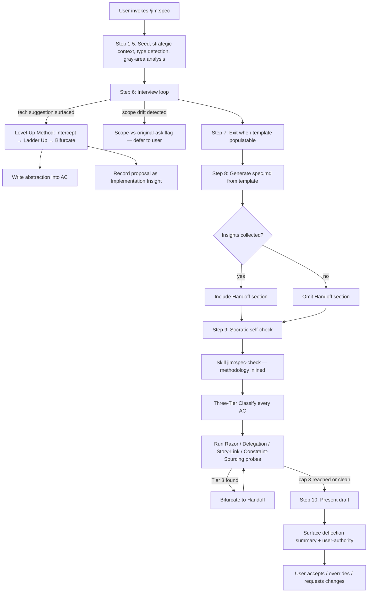
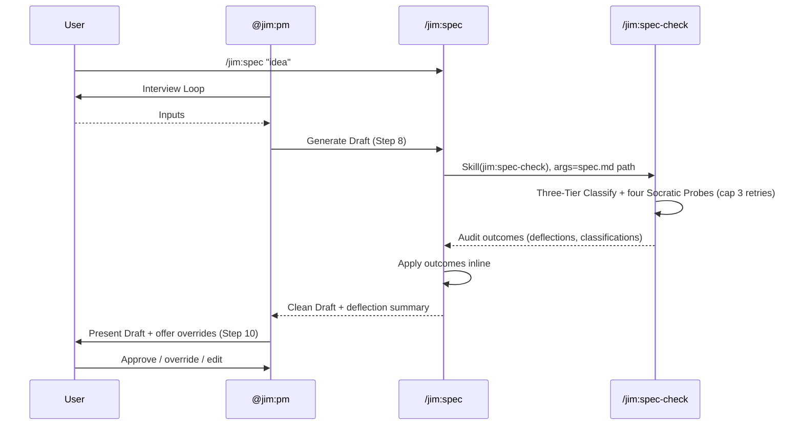

# 015 Harden /jim:spec Against Implementation Creep — Plan

## Overview

Four files updated, one skill created. `agents/pm.md` gains an Engineering Standards section and a `spec-check` skill binding. `skills/spec/references/spec-types.md` gets a 7th anti-pattern (Over-specification). `skills/spec/assets/spec-template.md` gets a `## Research & Architecture Handoff` section. `skills/spec/SKILL.md` rewires Steps 6/8/9/10 plus its Validation Checklist. A new `skills/spec-check/SKILL.md` carries the Socratic DoD methodology inline in its body (per DD#9, no separate `references/spec-dod.md`).

The validation flow runs end-to-end. During interview, the PM intercepts technical suggestions via the Level-Up Method and routes them to the Handoff section. At Step 9, `/jim:spec` invokes `Skill(jim:spec-check)` against the just-written spec.md; the spec-check skill classifies every AC into one of three tiers (Functional Requirement / External Constraint / Implementation Detail), runs four Socratic Probes (Razor / Delegation / Story-Link / Constraint-Sourcing) with type-aware calibration so refactor specs keep their load-bearing technical ACs, and applies bounded retry (cap 3). At Step 10, the PM surfaces the deflection summary conversationally and offers user override on every classification.

Out of scope: no shared `references/spec-principles.md` file (principles live where they act, augmenting existing Step 6 and Step 10 prose); no test harness for prompt content (validation by checklist via meta-skill / meta-agent); no consumer-side integration (the architect reads the Handoff as plain markdown until a follow-on spec ships).

## Design Decisions

### 1. Validation logic location (Handoff Insight 1)

- **Chosen:** Option C — Hybrid. Create a standalone `/jim:spec-check` skill at `skills/spec-check/` that owns the Socratic DoD methodology; `/jim:spec` Step 9 invokes it via `Skill(jim:spec-check)`, passing the just-written spec.md path as the Skill tool's `args`. Same logic, two entry points.
- **Why:**
  - **User preference signal.** User raised `/jim:spec-check` explicitly during spec review (Handoff Insight 1, recorded in spec).
  - **Auto-invocation preserves AC4's contract** ("before the PM presents a draft") — the auto-gate fires from `/jim:spec` Step 9, so the user never sees an unvalidated draft.
  - **Separation of concerns.** Creation (`/jim:spec`) and validation (`/jim:spec-check`) are distinct responsibilities; the standalone path enables auditing hand-edited or historical specs without re-running the full interview.
  - **Matches the canonical skill-to-skill pattern** validated by spec 014 (`Skill(jim:<name>)` namespaced token; `$ARGUMENTS` does not auto-forward; child body runs inline in main thread) and exemplified by `/jim:build` step 5.2 invoking `Skill(jim:arch)`. DD#8's type-aware logic also argues for a self-contained validation surface that reads `type:` independently.
- **Rejected:** Option A (inline at Step 9) — couples lifecycle phases unnecessarily; no standalone audit path; under-weights the user's explicit preference signal. Option B (dedicated skill only, no auto-invocation from `/jim:spec`) — loses the auto-gate, breaking AC4.

### 2. Instruction Shadowing resolution for AC8/AC9 (Handoff Insight 3)

- **Chosen:** Option A — Augment Step 6's anti-pattern technique with explicit scope-vs-original-ask flagging (AC9); augment Step 10's approval prompt with explicit user-authority over classifications/deflections (AC8).
- **Why:** Step 6 already houses scope-creep flagging ("This is getting broad — should we split off the search piece?"); AC9 sharpens the existing technique by anchoring it to the user's original ask. Step 10 already houses user-authority (the approval flow); AC8 codifies that the user can override classifications and revert deflections in the same conversational frame. No new file = no third location = no Instruction Shadowing. Each principle lives where it acts.
- **Rejected:** Option B (extract `references/spec-principles.md`) — creates a third location for principles that already partially live in pm.md and SKILL.md, with higher Shadowing risk than Option A. Option C (accept duplication) — explicitly violates the Instruction Shadowing anti-pattern documented in ARCHITECTURE.md → Anti-Patterns.

### 3. Allowed Source list widening (Handoff Insight 2)

- **Chosen:** Widen category 3 from "Architecture Decision (`ARCHITECTURE.md` entry)" to "Architecture Decision or Documented Project Convention," covering `ARCHITECTURE.md`, `CONVENTIONS.md`, style guides, and `HOWTO_*` docs. Include a Good/Bad example pair in `spec-dod.md` distinguishing *"output adheres to convention X"* (constraint, passes DoD) from *"refactor module Y to comply"* (implementation procedure, routes to Handoff).
- **Why:** Per research Tier-1 finding (Volere's "constraint with cited source") and Handoff Insight 2's user test case, project-level convention docs serve the same epistemic role as `ARCHITECTURE.md` entries. The narrower wording would reject legitimate convention-sourced constraints; widening preserves the Volere principle while keeping the closed-list discipline.
- **Rejected:** Keep the narrow ARCHITECTURE.md-only wording — rejects legitimate constraints sourced to project conventions, contradicts the spirit of the Volere principle.

### 4. Spec-kit grounding (Handoff Insight 4)

- **Chosen:** Ground `spec-dod.md` and `spec-types.md` in spec-kit with attribution — three verbatim quotes plus one structural reference: (a) Razor wording quoted verbatim in the Razor Probe section, (b) success-criteria gates ("Measurable / Technology-agnostic / User-focused / Verifiable") quoted verbatim as the per-AC checklist header, (c) bad-example list ("API response time is under 200ms" etc.) quoted verbatim in the Over-specification anti-pattern entry, and (d) cite Spec Kit's Specification Quality Checklist headings ("Content Quality / Requirement Completeness / Feature Readiness") in `spec-dod.md` as structural prior art for the DoD's overall organization — non-verbatim, citation only.
- **Why:** Spec-kit is the closest direct peer to `/jim:spec` (research Tier-1 finding); verbatim wording grounds the artifact text in an externally-validated source rather than training-paraphrase. AC1 and AC11 reference user-observable / technology-agnostic behavior; using the source wording reduces drift risk. The checklist headings also serve as structural prior art for the DoD's section layout — citing the source organization (not just the source wording) further reduces drift risk and makes the DoD auditable against future Spec Kit updates.
- **Rejected:** Paraphrase from training — drifts from the validated source; harder to audit against future spec-kit updates.

### 5. DoD iteration model (spec Open Question #4)

- **Chosen:** Bounded retry, cap of 3 iterations, matching spec-kit's `checklists/requirements.md` precedent.
- **Why:** Single-pass (per brainstorm Step 9 draft) cannot self-resolve cascading deflections — moving an AC to Handoff may reveal a downstream orphan AC that needs its own pass. Spec-kit's 3-iteration cap is the only externally-validated precedent in research; matches the Tier-1 source rather than inventing a new threshold. After 3 passes, residual issues surface conversationally at Step 10 per AC7.
- **Rejected:** Single-pass inline correction — cannot handle cascading deflections. Unbounded retry — risks infinite loops if the spec is structurally underspecified.

### 6. Story-Link Probe placement (spec Open Question #1)

- **Chosen:** Run within the same Socratic DoD pass at Step 9, alongside Razor, Delegation, and Constraint-Sourcing probes.
- **Why:** Spec's default is "same pass for design cohesion"; running orphan-AC detection earlier (e.g., interview exit) would split the validation surface and create two failure-reporting channels. Bounded-retry semantics handle the cascade where deflecting an AC orphans another.
- **Rejected:** Pre-DoD structural check at interview exit — splits validation into two surfaces with different reporting flows; harder for the user to reason about a single audit trail.

### 7. Engineering Standards section placement in `agents/pm.md`

- **Chosen:** New section between Core Principles and Process, titled `## Engineering Standards`.
- **Why:** Brainstorm explicitly locked this. Frames the prompt prefix as a professional commitment to the architect (Handoff posture), not a restriction on the PM's tools (Constraints framing) or a generic principle (Core Principles overflow). Keeps the agent body under the 800-token ceiling (current ~250 tokens + ~180 token addition ≈ 430 tokens).
- **Rejected:** Append to Core Principles — dilutes that section's tight focus. Append to Constraints — frames the standard as a prohibition; the brainstorm rejects this framing.

### 8. Type-aware Over-specification probe (Handoff Insight 5)

- **Chosen:** The Razor probe consults the spec's `type:` frontmatter. For `type: feature` or `type: bug`, the existing rejection criteria apply (no function signatures / file paths / tech names unless cited as External Constraint). For `type: refactor`, the Razor probe's technology-agnostic test is replaced by a *Rationale-Traceability* test: ACs naming technical artifacts pass when they trace to a `Refactor Rationale → Desired State` entry and describe desired-state shape; ACs describing migration procedure route to Handoff. ACs naming technical artifacts without a Rationale anchor are flagged regardless of type. Bounded-retry semantics (cap 3, per DD#5) are unchanged.
- **Why:** Refactor specs (exemplified by spec 011 directive-vocabulary) legitimately use technical detail — exact file paths, line numbers, code shapes — as the load-bearing acceptance criteria, traceable to the Refactor Rationale section. A type-agnostic Razor would flag these as anti-pattern and gut the refactor spec. Type-branching at the Razor stage (rather than at the Three-Tier Classifier) keeps the classifier shape uniform across types; only the rejection criteria mutate. Bootstrap and infra-wiring specs are *not* a new type — they are underspecified `feature` specs the PM lifts via the existing Recursive Drill-Down technique and the orphan-AC check (AC6).
- **Rejected:** Type-agnostic Razor — chokes on legitimate refactor specs like 011. A new `bootstrap` / `infra` spec type — YAGNI; existing PM behaviors already handle these cases. A new External Constraint source category ("Bootstrap Deliverable") — YAGNI; "Architecture Decision or Documented Project Convention" (DD#3) plus the refactor relaxation cover the cases.

### 9. Inline `spec-dod.md` into `skills/spec-check/SKILL.md`

- **Chosen:** Inline the Socratic DoD methodology (Three-Tier Classifier, four probes, Allowed Source list, success-criteria gates, bounded retry, Status Assignment, type-aware Razor calibration) directly into the body of `skills/spec-check/SKILL.md`. No separate `references/spec-dod.md` file.
- **Why:** Plugin-relative reference reads currently surface a permission prompt every invocation in the user's environment; inlining removes the friction permanently. `spec-check` is the only consumer of the DoD methodology — `/jim:spec` invokes `Skill(jim:spec-check)` per DD#1 and never reads the DoD directly — so the standalone-reference benefit that justifies `research-dod.md` does not apply here. Combined size (~50–60 line body shape + ~100–150 line methodology + ~15 line frontmatter ≈ 165–225 lines) stays well under the Progressive Disclosure 500-line ceiling.
- **Rejected:** Separate file at `skills/spec-check/references/spec-dod.md` (Plan 1's original choice — re-introduces the permission prompt). Separate file at `skills/spec/references/spec-dod.md` (would additionally violate DD#1's Hybrid model, since the validator would have to read across skill boundaries).
- **Cost flagged:** Diverges from the established `skills/{name}/references/{name}-dod.md` pattern. `research-dod.md` and `plan-dod.md` may want the same fix later if the same prompt friction surfaces there — but that is a separate decision, not part of 015.

## Constitution Check

**ARCHITECTURE.md status:** Present — constraints noted below.

| Constraint from ARCHITECTURE.md | Honored? | Notes |
| :--- | :--- | :--- |
| `skills/spec/SKILL.md` stays under 500 lines (Progressive Disclosure) | Yes | Current 205 lines; Step 9 collapse to a thin invocation is ~5 lines net, Step 6/8/10 augments ~20 lines. Total ~230 lines, well under 500. |
| `skills/spec-check/SKILL.md` stays under 500 lines (Progressive Disclosure) | Yes | New skill body inlines the DoD methodology per DD#9 — body shape ~50–60 lines + methodology ~100–150 lines + frontmatter ~15 lines ≈ 165–225 lines. Comfortable headroom under 500. |
| Agent body ≤ 800 tokens (Progressive Disclosure) | Yes | Current `agents/pm.md` body ~250 tokens; Engineering Standards section adds ~180 tokens, `skills:` array adds ~5 tokens. Total ~435 tokens. |
| DoD methodology inlined into spec-check SKILL.md (deviation from `skills/{name}/references/{name}-dod.md` pattern, justified per DD#9) | Yes | Permission-prompt friction on plugin-relative reference reads + single-consumer methodology + size headroom justifies the deviation. `research-dod.md` and `plan-dod.md` retain the convention; only `spec-check` deviates. |
| Anti-pattern entries in `spec-types.md` follow fixed shape: numbered heading, **What it looks like**, **Example**, **Remedy** | Yes | Over-specification entry #7 mirrors the existing six-pattern shape. |
| SKILL.md step-9 rewrites stay in prose, not sentinel-directive syntax (Logic-Flow Conventions) | Yes | Step 9 is procedural (`Skill(jim:spec-check)` invocation); no path-existence gates introduced. The `SET name = !\`…\` / IF name != "NOT_FOUND" THEN` vocabulary stays out of Step 9. |
| Skill-to-skill invocation uses namespaced `Skill(jim:<name>)` permission token + Skill tool in body (Plugin Conventions → Skill Invocation, ARCHITECTURE.md L238–242) | Yes | `skills/spec/SKILL.md` `allowed-tools` adds `Skill(jim:spec-check)`; Step 9 body uses the Skill tool with `jim:spec-check`. Bare `Skill` is avoided (least-privilege). |
| `$ARGUMENTS` does not auto-forward across skill-to-skill invocation (spec 014 S3 probe; ARCHITECTURE.md L242) | Yes | `/jim:spec` Step 9 explicitly passes the target spec.md path as the Skill tool's `args` parameter; `/jim:spec-check`'s body resolves `$ARGUMENTS` from that. |
| Validation by checklist, not bash test (Development & Testing) | Yes | No test harness added; new skill, agent edits, and spec SKILL.md changes validated via `/jim:meta-skill` and `/jim:meta-agent` checklists per the explicit Out of Scope item. |
| Instruction Shadowing avoided (Anti-Patterns) | Yes | DD#2 keeps each principle in one location; Step 6 owns scope-flagging (AC9), Step 10 owns user-authority (AC8), pm.md owns Engineering Standards. `spec-dod.md` is methodology, not duplicated rules. |
| Differential update — read first, summarize, Edit (Glossary) | Yes | Every modified file is read first; only `spec-check/SKILL.md` and `spec-check/references/spec-dod.md` are created from scratch. |
| No writes to sensitive paths (`.git/`, `~/.ssh/`, `node_modules/`, `.venv/`, `.env*`) | Yes | All writes target `agents/`, `skills/spec/`, `skills/spec-check/`, or `docs/specs/sdlc/012-*/` — none sensitive. |

## File Manifest

| Component | File Path | Action | Notes |
| :--- | :--- | :--- | :--- |
| Spec-check skill | `skills/spec-check/SKILL.md` | Create | New skill bound to `@jim:pm`. Frontmatter: `name: spec-check`, `agent: pm`, `argument-hint: "<spec.md path>"`, `allowed-tools` covering Read + Edit on the target spec. Body inlines the DoD methodology per DD#9 — Three-Tier Classifier, four Socratic Probes (Razor / Delegation / Story-Link / Constraint-Sourcing) with type calibration per DD#8, Allowed Source list (closed, with widened Architecture Decision category per DD#3), success-criteria gates (verbatim spec-kit per DD#4), Bounded Retry (cap 3) per DD#5, Status Assignment. Procedure section above the methodology section: read target spec, classify every AC, run probes, Bifurcate Tier-3 findings to Handoff via Edit, return structured audit outcomes for the caller to apply. |
| Spec template | `skills/spec/assets/spec-template.md` | Update | Insert `## Research & Architecture Handoff` between `## Out of Scope` (L68) and `## Open Questions` (L73), with per-Insight sub-template. Section is conditionally rendered: present when Insights exist, removed when none. |
| Spec types reference | `skills/spec/references/spec-types.md` | Update | Append 7th anti-pattern "Over-specification" after "Wrong Type" (currently ends L110), matching the existing six-pattern shape. Include spec-kit verbatim bad-example list per DD#4 and the *Calibration by spec type* subsection per DD#8 (refactor Good/Bad pair: split-into-modules shape vs. `git mv`-then-sed procedure). |
| PM agent | `agents/pm.md` | Update | Two changes: (1) insert `## Engineering Standards` section between Core Principles (ends L60) and Process (starts L62), codifying the field-tested prompt prefix as a professional commitment per AC10; (2) append `spec-check` to the `skills:` array at L38 (currently `[spec, vision, roadmap, brainstorm]` → `[spec, spec-check, vision, roadmap, brainstorm]`). |
| Spec skill | `skills/spec/SKILL.md` | Update | Five targeted changes: (1) `allowed-tools` frontmatter gains `Skill(jim:spec-check)` clause (namespaced form, least-privilege); (2) Step 6 augmented with the Level-Up Method technique and Scope-vs-original-ask flagging (DD#2); (3) Step 8 ensures Handoff is included when Insights collected during the interview; (4) Step 9 rewritten as a thin `Skill(jim:spec-check)` invocation that passes the just-written spec.md path as `args`, then applies the returned audit outcomes inline under DD#5 bounded retry (cap 3); (5) Step 10 augmented with the deflection-summary surfacing (AC7) and user-authority note (AC8). Validation Checklist gains four new bullets (Over-specification anti-pattern check, Handoff presence when Insights exist, all-ACs tier-classified, External Constraints cite Allowed Source). |

No deletions. No file moves. One new skill (`skills/spec-check/`) and one new agent binding (`spec-check` in `agents/pm.md` `skills:` array).

## Interface Contracts

### Frontmatter shape — `skills/spec-check/SKILL.md`

```yaml
---
name: spec-check
description: >
  Audit a draft spec.md against the Socratic Definition of Done — classify
  every AC into one of three tiers, run the four Socratic Probes (Razor,
  Delegation, Story-Link, Constraint-Sourcing), and return structured audit
  outcomes the caller can apply. Use when the user invokes /jim:spec-check
  against a spec.md path, or when /jim:spec invokes the audit at Step 9 via
  Skill(jim:spec-check). Do not use for spec creation (/jim:spec), planning
  (/jim:plan), or implementation (/jim:build).
agent: pm
argument-hint: "<path to spec.md>"
allowed-tools: Read, Edit
---
```

`allowed-tools` is narrow: `Read` for the target spec and the DoD reference, `Edit` so the skill can deflect Tier-3 ACs to the Handoff section inline. The skill does **not** declare `Skill(...)` clauses — it is a leaf, not a caller.

### Body shape — `skills/spec-check/SKILL.md`

```markdown
# /jim:spec-check

Audit a draft spec against the Socratic Definition of Done.

## Argument Routing

Use `$ARGUMENTS` to determine the target spec path. Empty → ask the user. Path ending in `spec.md` → use as target. Directory → look for `spec.md` inside.

## Process

### 1. Read the target spec and its frontmatter

Read `$ARGUMENTS`. Capture `type:` (feature, bug, refactor), `title`, `id`, `group`.

### 2. Reference the inlined DoD methodology

The DoD methodology is inlined into this SKILL.md per DD#9 (no separate reference file). Internalize the Three-Tier Classifier, the four Socratic Probes, the Allowed Source list, the success-criteria gates, and the type-aware Razor calibration from the **Definition of Done methodology** section below.

### 3. Classify every AC

For each acceptance criterion in the target spec, assign Tier 1 / Tier 2 / Tier 3 per the classifier. Note the rationale (which probe drove the call).

### 4. Run the four Socratic Probes

Per the **Definition of Done methodology** section below:
- Razor Probe — apply the spec-kit Razor with DD#8 type calibration (refactor specs use Rationale-Traceability against `Refactor Rationale → Desired State`).
- Delegation Probe — would an expert architect reasonably disagree with this AC?
- Story-Link Probe — every AC traces to a User Story (mandatory ACs exempt).
- Constraint-Sourcing Probe — every External Constraint cites an Allowed Source.

### 5. Bifurcate Tier-3 findings

For each Tier-3 AC: level up to the underlying user need; move the technical proposal to the spec's `## Research & Architecture Handoff` section as a new Implementation Insight with deflection reason. Use Edit; preserve the rest of the spec.

### 6. Verify User Story Connextra form

Each User Story names a specific role, an observable action, and a real benefit. Flag non-Connextra stories conversationally.

### 7. Return structured audit outcomes

Emit a deflection summary the caller can surface to the user:
- Items moved to Handoff (each with probe + reason).
- Items kept as External Constraints (each with cited source).
- Orphan ACs flagged but kept (mandatory ACs exempt).
- Connextra-failing stories flagged.

Caller is responsible for bounded retry (cap 3 per DD#5) and final presentation.

## Validation Checklist

Before returning, verify:
- [ ] Every AC has been classified into exactly one tier.
- [ ] Every Tier-3 finding has been Bifurcated (Handoff entry added, AC reframed).
- [ ] Every External Constraint cites a source from the Allowed Source list.
- [ ] Connextra check has run on every User Story.
- [ ] Type-calibration was applied per the target spec's `type:` frontmatter.
```

### Inlined DoD methodology — body section of `skills/spec-check/SKILL.md`

Per DD#9, the DoD methodology lives in the latter half of `skills/spec-check/SKILL.md` rather than at a separate `references/spec-dod.md` path. The procedure section (body shape above) calls into this methodology section via inline reference. Section content as it appears in SKILL.md:

```markdown
## Definition of Done methodology

Inlined per DD#9 — single-consumer methodology, avoids per-invocation permission prompts on plugin-relative reference reads. Every draft spec passes this audit before presentation; residual issues after the bounded-retry cap surface conversationally per AC7.

### The Three-Tier Classifier

| Tier | Name                  | Test                                                                                                  | Disposition                                  |
| :--- | :-------------------- | :---------------------------------------------------------------------------------------------------- | :------------------------------------------- |
| 1    | Functional Requirement | Passes The Razor — user-observable, implementation-independent. Traces to a User Story.              | Stay in spec ACs.                            |
| 2    | External Constraint    | Fails The Razor but cites a source from the Allowed Source list.                                     | Stay in spec ACs with source attribution.    |
| 3    | Implementation Detail  | Fails The Razor and has no sourced category, OR is a decision the architect could reasonably disagree with. | Move to `## Research & Architecture Handoff`. |

### The Razor (Technology-Agnostic Test)

> *Verbatim from GitHub spec-kit `templates/commands/specify.md`:*
> "Focus on WHAT users need and WHY. Avoid HOW to implement (no tech stack, APIs, code structure)."

Operationalized as a category-level swap test: *if the underlying technology were replaced entirely (CLI ↔ Voice UI, Bash ↔ Rust), would this requirement still be mandatory?*

- YES + source cited → Tier 2 (External Constraint).
- YES + no source → Tier 3 in disguise → Handoff.
- NO → Tier 3 (Implementation Detail) → Handoff.

**Type calibration.** For `type: refactor` specs, the Razor's technology-agnostic swap test is replaced by a *Rationale-Traceability* test: does the AC trace to a `Refactor Rationale → Desired State` entry, and is it desired-state shape (passes) rather than migration procedure (routes to Handoff)? ACs naming technical artifacts without a Rationale anchor are flagged regardless of type. See spec 011 (directive-vocabulary refactor) as the exemplar of a refactor spec whose load-bearing ACs the Razor must accept. For `type: feature` and `type: bug`, the swap test above applies unchanged.

### The Four Socratic Probes

#### 1. The Razor Probe
{prompt and pass/fail rubric}

#### 2. The Delegation Probe
{prompt and pass/fail rubric}

#### 3. The Story-Link Probe
{prompt and pass/fail rubric}

#### 4. The Constraint-Sourcing Probe
{prompt and Allowed Source list cross-check}

### Allowed Source Categories

1. **External API / Protocol** — name the API.
2. **Regulation / Compliance** — name the regulation.
3. **Architecture Decision or Documented Project Convention** — cite `ARCHITECTURE.md` section, `CONVENTIONS.md`, style guide, or `HOWTO_*` doc. {Good/Bad example pair per DD#3.}
4. **Upstream Spec** — link to the approved spec.
5. **Interoperability / Wire-format** — point to the format spec.
6. **Hardware / Environment** — name the platform constraint.

### Success-Criteria Gates

> *Verbatim from GitHub spec-kit:* "Measurable / Technology-agnostic / User-focused / Verifiable."

Every AC must pass all four gates.

### Bounded-Retry Mechanism

Run the four probes against every AC. If a probe fails, apply Bifurcate (level up the AC, move the detail to Handoff) or correct inline. Re-run the probes. Cap at 3 iterations; residual failures surface at SKILL.md Step 10 per AC7.

### Status Assignment

| Status | Meaning |
| :--- | :--- |
| `clean` | All probes pass; no residual issues. |
| `residual` | Cap reached with N issues outstanding; surfaced conversationally. |
```

### Handoff section shape — `skills/spec/assets/spec-template.md`

Insert between `## Out of Scope` and `## Open Questions`:

```markdown
## Research & Architecture Handoff
<!-- Optional — include only when Implementation Insights were surfaced during interview. Remove this section entirely otherwise. -->

*Implementation insights surfaced during scoping. These are context for the architect — not requirements, not exclusions. Treat each as a starting point to evaluate, not a directive.*

### Insight {N}: {short title}

- **Relates to AC:** *"{paraphrased AC text}"* (AC #{N})
- **Surfaced as:** {what the user or PM originally proposed}
- **Levelled-up requirement (already in the ACs):** {how the user need was extracted}
- **Deflection reason:** {Razor / Delegation / Story-Link / Constraint-Sourcing}
- **Architect note:** {open consideration, alternatives worth weighing, risks}
- **Routing hint:** {Architect to decide | Researcher to investigate | Candidate constraint pending sourcing}
```

### Engineering Standards section shape — `agents/pm.md`

Insert between `## Core Principles` and `## Process`:

```markdown
## Engineering Standards

A professional commitment you make to the architect — you scope; they design.

- **PM responsibilities:** user stories (Connextra form), acceptance criteria (technology-agnostic), problem statements, UI mockups, scope boundaries.
- **Architect responsibilities:** implementation choices, file structure, library selection, function signatures, API shapes, schemas.
- **Handling technical suggestions:** when the user surfaces a function signature, library, file path, or technology preference, do not embed it in an AC. Use the Level-Up Method — acknowledge, ladder up to the underlying user need, write the abstraction into the AC, and record the technical proposal as an Implementation Insight in the Research & Architecture Handoff section.
- **Scope is the user's call.** Raise scope drift conversationally; defer the decision to the user.
- **The user is the final authority** on classifications, deflections, and source attributions. Your audit calls are recommendations.
```

### Step 9 shape — `skills/spec/SKILL.md` (full rewrite)

```markdown
### 9. Socratic self-check

Before presenting, invoke `/jim:spec-check` against the just-written spec.md to run the Socratic audit.

1. Invoke via the Skill tool: `Skill(jim:spec-check)` passing the resolved spec path as `args`. The called skill body runs inline in the main thread (per ARCHITECTURE.md → Skill Invocation); `$ARGUMENTS` does not auto-forward, so the path must be passed explicitly.
2. The audit returns structured outcomes — items deflected to Handoff (with probe + reason), External Constraints retained (with cited source), orphan ACs flagged, Connextra-failing stories flagged.
3. Bounded retry (cap 3 per DD#5): if the audit reports unresolved issues, re-run the relevant Bifurcate or source-attribution step and re-invoke `/jim:spec-check`. After 3 passes, residual issues surface conversationally at Step 10.
4. Existing in-line checks remain: 6 anti-patterns from `references/spec-types.md` (now 7 with Over-specification), locked-constraint compatibility with VISION.md / ARCHITECTURE.md, type-section completeness.

Do not narrate the audit. Apply corrections inline. Surface only the final deflection summary at Step 10.
```

The `allowed-tools` frontmatter of `skills/spec/SKILL.md` extends to:

```yaml
allowed-tools: Bash(bash ${CLAUDE_PLUGIN_ROOT}/skills/file/scripts/jimfile.sh *) Skill(jim:spec-check)
```

Namespaced form per ARCHITECTURE.md → Permission Conventions (L386–400); the space between clauses is load-bearing.

### Step 6 augmentation — `skills/spec/SKILL.md`

Two additions to the existing techniques list:

```markdown
**Technique: The Level-Up Method.** When the user surfaces a technical suggestion (function shape, library, file path, technology preference), do not embed it in an AC:
1. **Intercept** — acknowledge the suggestion.
2. **Ladder Up** — ask "What does this technology enable?" until you reach a functional requirement.
3. **Bifurcate** — write the abstraction into the AC; record the technical proposal as an Implementation Insight in the Research & Architecture Handoff section with the deflection reason.

**Technique: Scope-vs-original-ask flagging.** If a candidate AC, User Story, or Implementation Insight appears to extend beyond the user's original ask, raise it conversationally and defer the decision to the user. Scope is the user's call, not yours. (Extends the existing anti-pattern flagging technique.)
```

### Step 10 augmentation — `skills/spec/SKILL.md`

Insert before "Ask: Want to change anything...":

```markdown
Surface the audit outcomes conversationally — only the deflections and why, not the full interrogation:

> "During validation, I moved N items to the Research & Architecture Handoff:
> - 'X' — failed {probe} ({reason})
> - 'Y' — failed {probe} ({reason})
> Source-attributed: 'Z' — kept as External Constraint, sourced to {source}."

Note that these are your recommendations — the user has final authority over classifications, deflections, and source attributions. Offer to revert any deflection or override any classification.
```

### Over-specification anti-pattern shape — `skills/spec/references/spec-types.md`

Append as anti-pattern #7 after Wrong Type (currently ends L110):

```markdown
### 7. Over-specification

**What it looks like:** An AC names a function signature, file path, library, technology, or protocol as a required outcome. The technology-agnostic test fails — swapping the implementation (CLI ↔ Voice UI, Bash ↔ Rust) would invalidate the AC even though the underlying user need would be unchanged.

**Example (verbatim from GitHub spec-kit `templates/commands/specify.md`, applies to `feature` and `bug` specs):**
- "API response time is under 200ms" — reframe: *"Users see results instantly."*
- "Database can handle 1000 TPS" — reframe to user-observable load behavior.
- "React components render efficiently" — reframe to user-observable interaction quality.
- "Redis cache hit rate above 80%" — reframe to user-observable latency or staleness behavior.

**Calibration by spec type:** For `type: refactor` specs, the probe asks "does this AC trace to a `Refactor Rationale → Desired State` entry, and does it describe desired-state shape rather than migration procedure?" rather than the technology-agnostic test above. Paired example —
- **Good (desired-state shape, passes):** *"`auth.rs` is split into `auth/token.rs` and `auth/session.rs`."*
- **Bad (migration procedure, routes to Handoff):** *"Use `git mv` to move `auth.rs` then sed-rewrite the imports."*

The first names what the codebase looks like after the refactor; the second prescribes how to get there. Procedure routes to Handoff regardless of spec type.

**Remedy:** For `feature` / `bug` specs, apply the Level-Up Method — ladder the technical statement up to the user need it enables, write the abstraction into the AC, and route the technical proposal to the Research & Architecture Handoff section. For `refactor` specs, confirm the AC traces to a Refactor Rationale entry; if it describes procedure, move the procedural detail to Handoff and keep only the desired-state shape in the AC.
```

## Data Flow



### Skill-to-skill handoff

The flowchart above shows the user-facing flow with branching decisions. The sequence diagram below complements it by showing the message-passing between `/jim:spec` Step 9 and `/jim:spec-check` (per DD#1's Hybrid model and DD#9's inlined DoD).



## Task Breakdown

Grouped by phase for narrative clarity; dependencies noted inline. Each task is atomic — one file changed (or one section within a file changed), one verification.

### Phase 1 — Persona & Anti-patterns

Independent foundational changes. No dependencies between Phase 1 tasks; each can be done in any order.

1. [x] **Append the Over-specification anti-pattern (#7) to `skills/spec/references/spec-types.md`** after the existing Wrong Type entry. Use the shape defined in Interface Contracts; quote the spec-kit bad-example list verbatim per DD#4. Include a *Calibration by spec type* subsection per DD#8 with the paired Good/Bad refactor example (Good: *"`auth.rs` is split into `auth/token.rs` and `auth/session.rs`"*; Bad: *"use `git mv` to move `auth.rs` then sed-rewrite the imports"*).
   **Verify:** `grep -q "### 7. Over-specification" skills/spec/references/spec-types.md && grep -q "API response time is under 200ms" skills/spec/references/spec-types.md && grep -q "Users see results instantly" skills/spec/references/spec-types.md && grep -q -E "Calibration by spec type" skills/spec/references/spec-types.md && grep -q "auth/token.rs" skills/spec/references/spec-types.md`

2. [x] **Insert the Research & Architecture Handoff section into `skills/spec/assets/spec-template.md`** between `## Out of Scope` and `## Open Questions`. Include the optional-section comment marker, the section-level italic note, and the per-Insight sub-template.
   **Verify:** `grep -q "## Research & Architecture Handoff" skills/spec/assets/spec-template.md && grep -q "Levelled-up requirement" skills/spec/assets/spec-template.md && grep -q "Routing hint" skills/spec/assets/spec-template.md && awk '/## Out of Scope/{found=1} found && /## Research & Architecture Handoff/{ok=1} found && /## Open Questions/{exit (ok?0:1)}' skills/spec/assets/spec-template.md`

3. [x] **Update `agents/pm.md`** with two coordinated changes: (a) append `spec-check` to the `skills:` array at L38 (currently `[spec, vision, roadmap, brainstorm]`); (b) insert `## Engineering Standards` section between Core Principles and Process per the Interface Contracts shape, covering PM/architect responsibility split (AC10), Level-Up posture (AC2), scope-vs-original-ask deference (AC9), and user-authority over classifications (AC8).
   **Verify:** `grep -q "## Engineering Standards" agents/pm.md && grep -q "Level-Up Method" agents/pm.md && grep -E "^skills: \[.*spec-check.*\]$" agents/pm.md && awk '/## Core Principles/{cp=1} cp && /## Engineering Standards/{es=1} es && /## Process/{exit (es?0:1)}' agents/pm.md`

### Phase 2 — Spec-check Skill

4. [x] **Create `skills/spec-check/SKILL.md` with inlined DoD methodology** (per DD#9 — no separate `references/spec-dod.md`). Frontmatter: `name: spec-check`, `agent: pm`, `argument-hint: "<path to spec.md>"`, narrow `allowed-tools: Read, Edit`. Body has two halves: (a) **Procedure section** — argument routing (path or directory), read target spec, classify every AC, run the four Socratic Probes with type calibration per DD#8, Bifurcate Tier-3 findings to Handoff via Edit, verify Connextra form, return structured audit outcomes for the caller to apply; (b) **Definition of Done methodology section** — Three-Tier Classifier, the Razor with verbatim spec-kit quotes per DD#4 and type calibration per DD#8 (for `type: refactor`, the technology-agnostic swap test is replaced by a Rationale-Traceability test against `Refactor Rationale → Desired State`; spec 011 is the cited exemplar), four Socratic Probes (Razor / Delegation / Story-Link / Constraint-Sourcing), Allowed Source list (with widened Architecture Decision category per DD#3 + Good/Bad example pair), success-criteria gates (verbatim spec-kit), Bounded Retry (cap 3) per DD#5, Status Assignment. Include a one-paragraph citation to Spec Kit's Specification Quality Checklist headings (*"Content Quality / Requirement Completeness / Feature Readiness"*) as structural prior art for the methodology's organization — non-verbatim, attribution only.
   **Verify:** `test -f skills/spec-check/SKILL.md && ! test -e skills/spec-check/references/spec-dod.md && grep -q "^name: spec-check$" skills/spec-check/SKILL.md && grep -q "^agent: pm$" skills/spec-check/SKILL.md && grep -q "argument-hint" skills/spec-check/SKILL.md && grep -q "Three-Tier Classifier" skills/spec-check/SKILL.md && grep -q "Razor Probe" skills/spec-check/SKILL.md && grep -q "Story-Link Probe" skills/spec-check/SKILL.md && grep -q "Constraint-Sourcing" skills/spec-check/SKILL.md && grep -q "Documented Project Convention" skills/spec-check/SKILL.md && grep -q -E "Refactor Rationale|Rationale-Traceability" skills/spec-check/SKILL.md && grep -q -E "Content Quality|Requirement Completeness|Feature Readiness" skills/spec-check/SKILL.md`

### Phase 3 — Wiring & Hardening

5. [x] **Augment `skills/spec/SKILL.md` Step 6** with the Level-Up Method technique and the Scope-vs-original-ask flagging technique. Add as new bullets to the existing techniques list — do not duplicate existing language; the new techniques layer onto the existing anti-pattern flagging and recursive drill-down. Depends on Task 2 (Handoff section exists in template).
   **Verify:** `grep -q "Level-Up Method" skills/spec/SKILL.md && grep -q "Scope-vs-original-ask" skills/spec/SKILL.md && grep -q "Bifurcate" skills/spec/SKILL.md`

6. [x] **Update `skills/spec/SKILL.md` Step 8 (Generate spec.md)** to include the Handoff section when Implementation Insights were collected during the interview, and to strip it when none were collected. The conditional rendering mirrors the existing type-conditional comment markers (`<!-- feature only -->` etc.). Depends on Task 2.
   **Verify:** `awk '/### 8. Generate spec.md/,/### 9./' skills/spec/SKILL.md | grep -q "Research & Architecture Handoff"`

7. [x] **Rewrite `skills/spec/SKILL.md` Step 9 (Silent self-check → Socratic self-check) as a `Skill(jim:spec-check)` invocation**, per the Interface Contracts Step 9 shape. The rewritten step uses the Skill tool to invoke `jim:spec-check` with the just-written spec.md path as `args`; applies the returned audit outcomes inline; runs bounded retry (cap 3 per DD#5); surfaces residuals at Step 10. Existing in-line checks (6 anti-patterns now 7 with Over-specification, locked-constraint compatibility, type-section completeness) remain. Also extend the SKILL.md `allowed-tools` frontmatter to add `Skill(jim:spec-check)` (namespaced, least-privilege; space-separated from the existing `Bash(...)` clause). Depends on Tasks 1, 4.
   **Verify:** `awk '/### 9. /,/### 10./' skills/spec/SKILL.md | grep -q "Skill(jim:spec-check)" && awk '/### 9. /,/### 10./' skills/spec/SKILL.md | grep -q -E "(cap 3|bounded retry|3 iterations)" && grep -E "^allowed-tools:.*Skill\(jim:spec-check\)" skills/spec/SKILL.md`

8. [x] **Augment `skills/spec/SKILL.md` Step 10 (Present and stop)** with the deflection-summary conversational surfacing (AC7) and the user-authority note (AC8). Insert before the existing "Want to change anything..." prompt; preserve the existing approval flow. Depends on Task 7.
   **Verify:** `awk '/### 10. /,/### 11./' skills/spec/SKILL.md | grep -q "moved" && awk '/### 10. /,/### 11./' skills/spec/SKILL.md | grep -q "final authority"`

9. [x] **Extend `skills/spec/SKILL.md` Validation Checklist** with three new bullets: Handoff-section-present-when-Insights-exist, all-ACs-three-tier-classified, External-Constraints-cite-Allowed-Source. Add to the existing Anti-patterns checklist a 7th bullet for Over-specification.
   **Verify:** `awk '/## Validation Checklist/,0' skills/spec/SKILL.md | grep -q "Over-specification" && awk '/## Validation Checklist/,0' skills/spec/SKILL.md | grep -q "Handoff" && awk '/## Validation Checklist/,0' skills/spec/SKILL.md | grep -q -i "three.tier"`

10. [x] **Manual checklist validation** — run the validation gates that govern jim agent/skill content. There is no executable test harness for prompt content (per ARCHITECTURE.md → Development & Testing); validation is by checklist against `skills/meta-skill/` and `skills/meta-agent/` references. Re-read the spec's 11 ACs and confirm each is honored by the produced artifacts. Drive a live round-trip per the spec's verification path: invoke `/jim:spec` on a throwaway idea that elicits a technical suggestion; confirm Level-Up at Step 6, `Skill(jim:spec-check)` invocation at Step 9, deflection-summary at Step 10, Handoff section in the produced spec, override-revert capability for the user. Then drive the standalone path: `/jim:spec-check docs/specs/sdlc/008-directive-vocabulary/spec.md` and confirm the Rationale-Traceability test accepts spec 011's line-numbered technical ACs.
    **Verify:** `bash -c 'for f in agents/pm.md skills/spec/SKILL.md skills/spec/assets/spec-template.md skills/spec/references/spec-types.md skills/spec-check/SKILL.md; do test -f "$f" || { echo MISSING $f; exit 1; }; done && ! test -e skills/spec-check/references/spec-dod.md && for f in skills/spec/SKILL.md skills/spec-check/SKILL.md; do wc -l "$f" | awk -v f="$f" "{ if (\$1 > 500) { print f \" exceeds 500 lines: \" \$1; exit 1 } else print f \" \" \$1 \" lines (under 500 limit)\" }"; done'`

## Requirements Coverage Summary

| Spec Acceptance Criterion | Addressed In Task(s) |
| :--- | :--- |
| AC1: Draft ACs describe user-observable behavior; no function signatures / libraries / file paths / tech names as required outcomes unless (a) cited as External Constraints with a sourced category, or (b) the spec is `type: refactor` and the technical artifact traces to the `Refactor Rationale` section | Tasks 4, 1, 7 (spec-check inlined DoD with type-aware Razor per DD#8 + Over-specification anti-pattern with refactor Good/Bad pair + Step 9 invocation of spec-check) |
| AC2: PM acknowledges technical suggestions, levels them up, records technical proposal as Implementation Insight | Tasks 3, 5 (Engineering Standards Level-Up posture in pm.md + Step 6 Level-Up Method technique) |
| AC3: Draft specs include `## Research & Architecture Handoff` section whenever Implementation Insights exist; each Insight traces to a specific AC and is labelled with deflection reason | Tasks 4, 2, 6 (spec-check DoD deflection-reason vocabulary + template section + Step 8 conditional rendering) |
| AC4: Before presentation, every AC is classified as Functional / External Constraint / Implementation Detail; Implementation Details moved to Handoff | Tasks 4, 7 (spec-check inlined Three-Tier Classifier + Step 9 invocation with Bifurcate; auto-invocation preserves AC4's "before the PM presents a draft" contract) |
| AC5: External Constraints cite a source from the closed list; un-sourced constraints reclassify to Handoff | Tasks 4, 7 (spec-check inlined Allowed Source list with widened Architecture Decision category + Constraint-Sourcing probe + Step 9 invocation) |
| AC6: User Stories name role / observable action / real benefit (Connextra); orphan ACs flagged | Tasks 4, 7 (spec-check inlined Story-Link Probe + Connextra check in procedure section + Step 9 invocation) |
| AC7: After presenting, PM surfaces conversationally which items were deflected and why — alongside in-spec audit trail | Tasks 2, 8 (template per-Insight audit trail + Step 10 deflection-summary surfacing) |
| AC8: Classifications / deflections / source-attributions are recommendations; user has final authority to accept, override, or revert | Tasks 3, 8 (Engineering Standards user-authority statement in pm.md + Step 10 user-authority note + revert offer) |
| AC9: PM raises scope drift conversationally; defers decision to user | Tasks 3, 5 (Engineering Standards scope-deference + Step 6 Scope-vs-original-ask flagging technique) |
| AC10: PM agent instructions establish explicit PM/architect responsibility split without operator re-asserting per invocation | Task 3 (Engineering Standards section in pm.md codifies the field-tested prompt prefix; `spec-check` added to `skills:` array so pm has the validation skill preloaded) |
| AC11: Specs continue passing the existing 6 anti-patterns and additionally pass an Over-specification check whose calibration is spec-type-aware (technology-agnostic test for `feature` / `bug`; Rationale-Traceability test for `refactor`) | Tasks 4, 1, 9 (spec-check inlined type-aware Razor per DD#8 + Over-specification anti-pattern #7 with Calibration-by-type subsection + Validation Checklist bullet) |
| Handoff Insight 5: Per-type calibration of the Over-specification probe | Tasks 4, 1 (spec-check inlined type-aware Razor per DD#8 + Over-specification anti-pattern Calibration-by-type subsection) |

Every AC traces to at least one task. No `[NEEDS CLARIFICATION]` markers on ACs.

`[NEEDS CLARIFICATION]` flags carried as plan-level Open Questions (not on ACs) — see Open Questions below.

## Out of Scope

Carried verbatim from the spec — these are deferred to follow-on specs or explicitly excluded:

- Retrofitting historical specs (`docs/specs/sdlc/001-014`) to the new template — they remain as-is.
- Consumer-side integration (no changes to `/jim:plan`, `@jim:architect`, or any other consumer of the new Handoff section).
- No changes to `/jim:research`, `/jim:build`, `/jim:debug`, `/jim:vision`, `/jim:roadmap`, `/jim:arch`, `@jim:researcher`, `@jim:coder`.
- Hard blocking of `/jim:spec` on validation failure — silent self-check with inline correction continues.
- Spec-type-specific Handoff logic for Defect Profile / Refactor Rationale.
- A test-runner harness for prompt content.
- Importing IEEE 830, ISO 29148, Volere, or Wiegers primary-source text into the repo.

Plan-introduced exclusions:
- A shared `references/spec-principles.md` file is not created (DD#2). Principles live in their acting steps and in pm.md.
- The Cucumber/Gherkin imperative-vs-declarative wording is included in the inlined DoD methodology section of `skills/spec-check/SKILL.md` (per DD#9) with a `[NEEDS CLARIFICATION]` marker (see Open Question #1) rather than being deferred; the concept is grounded in BDD community usage even without a fresh primary-source URL.

## Open Questions

- [ ] **OQ1 — Cucumber/Gherkin primary source for imperative-vs-declarative.** The brainstorm cited a Cucumber documentation URL that covered step organization, not the imperative/declarative distinction (research notes the wrong-page issue). The concept is grounded in BDD community practice; the inlined DoD methodology section of `skills/spec-check/SKILL.md` includes it with a `[NEEDS CLARIFICATION]` marker. Architect or implementer should locate a current primary-source URL (Cucumber Gherkin Reference, or BDD-anti-patterns guide) and update the citation during `/jim:build`. Source verification before locking the DoD wording is recommended but not blocking.
- [ ] **OQ2 — Tier-2 standard wording verification.** The inlined DoD methodology section of `skills/spec-check/SKILL.md` will reference IEEE 830, ISO 29148, Volere, and Wiegers via training-paraphrased wording (primary sources paywalled). Spec explicitly puts primary-source importing Out of Scope, but the implementer or architect should cross-check the training-paraphrase wording against primary sources before locking — particularly the ISO 29148 "implementation-independent requirements" phrasing.
- [x] ~~Story-Link Probe placement (spec OQ #1)~~ → DD#6: same DoD pass at Step 9.
- [x] ~~DoD iteration model (spec OQ #4)~~ → DD#5: bounded retry, cap 3, per spec-kit.
- [x] ~~Validation logic location (Handoff Insight 1)~~ → DD#1: Hybrid — standalone `/jim:spec-check` skill, `/jim:spec` Step 9 invokes via `Skill(jim:spec-check)`.
- [x] ~~Instruction Shadowing resolution (Handoff Insight 3)~~ → DD#2: augment Step 6 and Step 10.
- [x] ~~Allowed Source widening (Handoff Insight 2)~~ → DD#3: widen Architecture Decision to include Documented Project Convention.
- [x] ~~Verbatim spec-kit grounding (Handoff Insight 4)~~ → DD#4: quote three passages verbatim.
- [x] ~~DoD location: separate reference file vs inline~~ → DD#9: inline into `skills/spec-check/SKILL.md` body to avoid per-invocation permission prompts on plugin-relative reference reads. Diverges from the `references/{name}-dod.md` pattern; documented as a deliberate cost.
