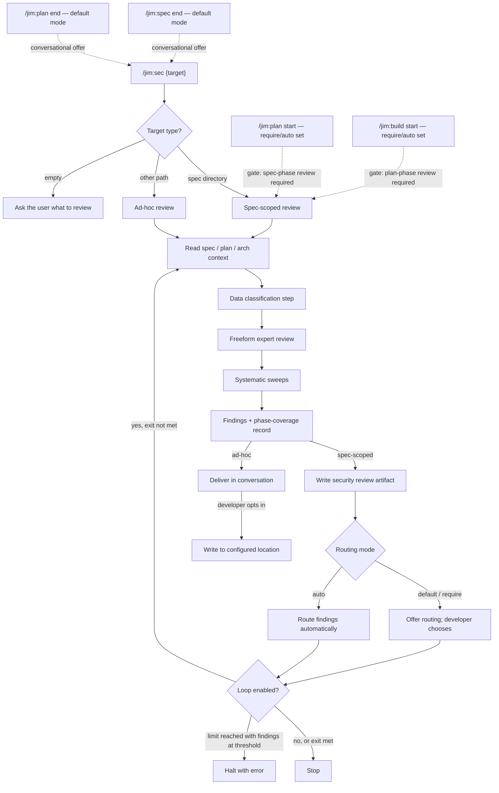

# 016 Security Agent and Skill

## Overview

Add a `@jim:security` agent and `/jim:sec` skill that performs design-time security analysis of specs, plans, and arbitrary project files, producing actionable findings before code is written — with optional workflow gates that block progress to the next phase until the appropriate phase-level security review is on file.

## Problem Statement

Security gaps in specs and plans are commonly discovered late — during implementation or code review — when they are expensive to fix. Developers using jim's SDLC workflow have no structured way to surface threat-model issues, missing security requirements, or flawed mitigations between the spec/plan phases and the build phase. Worse, when security analysis is voluntary, time pressure tends to push it out of the loop — so developers who want their workflow to enforce security discipline (rather than depend on per-task discretion) have no built-in mechanism to require it. Beyond the structured workflow, developers also want to perform ad-hoc security analysis of existing code, configs, or design docs at any time — but doing so without a defined process produces inconsistent coverage.

## User Stories

- As a developer using `/jim:spec`, I am offered the option of a security review at the end of spec creation so that I can surface requirements gaps before planning begins.
- As a developer using `/jim:plan`, I am offered the option of a security review at the end of plan creation so that I can surface design-level flaws before implementation begins.
- As a developer reviewing a draft spec or plan, I can see security findings categorized by severity (Critical / Notable / Advisory) with concrete suggestions and a recommended route (spec or plan) so that I can decide what to act on and where.
- As a developer, I can run `/jim:sec` against a spec directory at any time so that I can refresh the security review after spec or plan changes.
- As a developer, I can run `/jim:sec` against a file or directory outside a spec context so that I get a security analysis of arbitrary project material when I need it.
- As a developer using `/jim:sec` ad-hoc, I can opt into writing findings to a configurable location so that I can preserve and revisit them after the conversation ends.
- As a developer, I can re-run `/jim:sec` against a target with an existing security review so that updates layer onto prior findings rather than overwriting them.
- As a developer opening a security review, I can see a one-line summary of how many findings exist at each severity so that I can size the work and risk before diving in.
- As a developer or architect reading a security review, I can see which specific part of the source artifact each finding relates to so that I know where to make changes.
- As a developer, I can see which categories of sensitive data the analysis identified in the target so that I understand which threats are relevant to my feature's data handling.
- As a developer re-running `/jim:sec` against a target with an existing security review, I can see a conversational summary of what changed since the last run — new findings, resolved findings, and unchanged findings — so that I can focus on the delta rather than re-reading the whole review.
- As a developer reviewing a security report on a spec directory containing both a spec and a plan, I can see findings that surface inconsistencies between the spec's stated requirements and the plan's design choices so that artifact-misalignment risks are caught before implementation.
- As a developer reading the conversational summary of any security review (default offer, required gate, or automated gate), I can see Critical-severity findings highlighted prominently so that I am not surprised by serious findings.
- As a developer who has opted into writing ad-hoc findings to a file, I can read that file using the same finding structure I would see in a spec-scoped security review so that downstream readers and tools do not need separate handling for the two modes.
- As a developer, I can see in the security review artifact which artifact-phases (spec, plan, or both) have been reviewed so that downstream phase gates can determine programmatically whether the appropriate phase-level analysis is on file.
- As a developer who has opted into requiring security review, I cannot proceed from spec to planning without a security review covering the spec on file, so that my chosen security discipline is enforced by the workflow rather than left to discretion.
- As a developer who has opted into requiring security review, I cannot proceed from plan to build without a security review covering the plan on file, so that design-level analysis is not skipped under time pressure.
- As a developer who has opted into automated security review, findings are routed to spec or plan without per-finding prompts, so that the gated workflow runs without my intervention on routing decisions.
- As a developer who has opted into looped security review, the workflow repeats the review-and-routing cycle until findings at the configured severity threshold are clear (or the iteration limit is reached), so that all blocking findings are addressed before the next phase begins.
- As a developer, when the loop iteration limit is reached with findings still at the configured severity, the workflow halts with a clear error message naming the unresolved findings, so that I know which findings need manual attention before I can proceed.

## Acceptance Criteria

- [ ] Running `/jim:sec` against a spec directory produces a security review artifact alongside the spec's other artifacts, with findings ordered by severity.
- [ ] The security review artifact opens with a one-line summary showing the count of findings at each severity level so that the review can be triaged at a glance.
- [ ] Each finding includes a severity classification (Critical / Notable / Advisory), a description of the issue, a concrete suggestion, and a recommended route to either the spec or the plan.
- [ ] Each finding cites the specific acceptance criterion, user story, or section of the reviewed artifact that motivated it, where applicable, so that findings remain traceable back to a source requirement.
- [ ] The review applies a lens appropriate to the artifacts present: a requirements-gap lens when only a spec is available, a design-flaw lens when a plan is also available, and both lenses when both artifacts exist.
- [ ] When both a spec and a plan are reviewed together, the analysis surfaces findings that identify inconsistencies between the spec's stated requirements and the plan's design — for example, a controlled access boundary asserted by the spec that the plan's design does not preserve — so that artifact misalignment is recognized explicitly rather than collapsed into a routine requirements-gap or design-flaw finding.
- [ ] When a spec directory contains only one of spec or plan, the skill performs the available review and surfaces the missing artifact rather than failing.
- [ ] The analysis includes an explicit data classification step that catalogs the categories of sensitive data the target handles (such as PII, credentials, session data, internal-only, public) and that classification is visible in the review output and informs which threat categories are surfaced as relevant.
- [ ] The analysis combines an open-ended expert review with one or more systematic completeness sweeps drawn from a known set of threat-modeling frameworks; the framework set applied is appropriate to the target's data classification and artifact type, and frameworks (or individual categories within a framework) that are clearly not relevant are explicitly marked rather than silently omitted.
- [ ] The analysis is grounded in the project's existing architectural context when available, so that findings do not contradict or duplicate already-documented trust boundaries, data flows, or security patterns.
- [ ] Re-running `/jim:sec` against a target that already has a security review preserves untouched sections and surfaces a summary of changes rather than overwriting the prior review wholesale.
- [ ] On a re-run against a target with an existing review, the skill presents a conversational delta — new findings, resolved findings, and unchanged findings — so that the developer can scope attention to what has changed without re-reading the entire review.
- [ ] The security review artifact records which artifact-phases (spec, plan, or both) were covered in the most recent review, in a form that downstream phase gates can inspect programmatically.
- [ ] In default mode (neither require-security-review nor auto-security-review is set), `/jim:spec` and `/jim:plan` offer a security review conversationally at the end of their flows; the developer chooses whether to run it, and findings are advisory — the workflow does not hard-block on them.
- [ ] When the require-security-review option is set, the workflow blocks the start of the next phase until the appropriate phase-level security review is on file: `/jim:plan` blocks until the spec has been reviewed; `/jim:build` blocks until the plan has been reviewed. The gate produces the missing review (typically by invoking `/jim:sec`) and routes findings with the developer in the loop for routing decisions.
- [ ] When the auto-security-review option is set, the same phase gates apply as under require-security-review, and findings are routed to spec or plan automatically without per-finding prompts; the developer is not interrupted with routing decisions during the gate cycle.
- [ ] When the loop option is set, the gated security review repeats the review-and-routing cycle. The loop exits when no findings remain at or above the configured loop-severity threshold; if the configured iteration limit is reached with findings still at or above the threshold, the workflow halts with an error message that names the unresolved findings and identifies them as the reason the gate cannot be satisfied.
- [ ] Any conversational summary of a security review — default offer, required gate, or automated gate — highlights the count of Critical-severity findings prominently so that the developer is not surprised by serious findings.
- [ ] `/jim:sec` is invocable at any time, independent of the structured spec→plan→build workflow.
- [ ] Running `/jim:sec` against a path that does not contain a spec produces an ad-hoc analysis with findings delivered in conversation by default and no file written.
- [ ] In ad-hoc mode, the developer can opt into writing findings to a configurable location; when the developer does not opt in, no file is written.
- [ ] When ad-hoc mode writes findings to a file, the output uses the same finding structure, severity vocabulary, sweep coverage shape, and routing field shape as a spec-scoped security review artifact; only the frontmatter field that identifies the review target differs.
- [ ] At the end of a spec-scoped review, findings are routed to the spec or the plan — by the developer's explicit choice in default and require modes, and automatically without prompts in auto mode.
- [ ] The skill stops after producing findings and completing routing — it never auto-modifies any artifact outside of the routing mechanism described above.

## Data Flow

## Out of Scope

- Runtime security scanning or SAST — `/jim:sec` is design-time only.
- Post-build security review — that responsibility belongs to the planned `/jim:review` skill, which may consult `@jim:security` as a lens once it exists.
- Backlog routing — `/jim:backlog` does not exist on the current main branch and is sequenced after this port in the porting roadmap. Backlog as a third route option is deferred to the `/jim:backlog` port, which will natively understand security review findings; this spec produces findings with Spec / Plan routes only.
- Compliance-framework or certification checklists (SOC2, HIPAA, ISO 27001, etc.).
- Time-based loop exit conditions — only the severity threshold and iteration-count knobs are supported; no wall-clock or duration limits.
- Per-finding loop control — the loop is global; individual findings cannot be excluded from triggering re-runs.
- Modifications to skills outside `/jim:spec`, `/jim:plan`, and `/jim:build` (no changes to `/jim:research`, `/jim:debug`, `/jim:vision`, `/jim:roadmap`, `/jim:arch`, or any meta-skill).
- Automatic re-invocation of `/jim:sec` from post-build flows other than the planned `/jim:review`.
- Retrofitting historical specs (`docs/specs/sdlc/001-015`) with `security.md` artifacts.

## Research & Architecture Handoff

*Implementation insights surfaced during scoping. These are context for the architect — not requirements, not exclusions. Treat each as a starting point to evaluate, not a directive.*

### Insight 1: Phase-coverage indicator format

- **Relates to AC:** *"The security review artifact records which artifact-phases (spec, plan, or both) were covered in the most recent review, in a form that downstream phase gates can inspect programmatically."*
- **Surfaced as:** During scoping the developer pointed out that `/jim:build`'s gate cannot rely on file presence alone (security.md may exist from the spec-phase review but lack plan-phase analysis). The artifact must carry a structured signal of what was covered.
- **Levelled-up requirement (already in the AC):** The artifact carries a programmatically-inspectable record of which artifact-phases were reviewed.
- **Deflection reason:** Razor — the specific encoding (frontmatter array, body section, both) is implementation.
- **Architect note:** Three viable options:
  - **A — Frontmatter array, e.g. `reviewed_phases: [spec, plan]`.** Cleanest for programmatic gate checks (`/jim:plan` and `/jim:build` parse the frontmatter to decide whether to gate). Matches the flat-TOML / YAML-array conventions in `jimconf.toml.example` and existing spec frontmatter.
  - **B — Body-section coverage table.** Human-readable; harder to parse deterministically from bash.
  - **C — Both.** Frontmatter array for the gate; body coverage section for human readability. Highest UX; minor duplication.
- **Routing hint:** Architect to decide. Option C is recommended (gate determinism + human readability), but Option A alone is sufficient.

### Insight 2: Lens-selection mechanism

- **Relates to AC:** *"The review applies a lens appropriate to the artifacts present..."*
- **Surfaced as:** Fork PR #5 inferred the lens by detecting artifact presence inside the skill itself. With workflow integration via `Skill(jim:sec)` from `/jim:plan` and `/jim:build` gates, the caller could pass the intended lens explicitly.
- **Levelled-up requirement (already in the AC):** The right lens is applied; the developer never has to pick one manually. The mechanism is not pinned.
- **Deflection reason:** Razor — mechanism is implementation.
- **Architect note:** Three viable options:
  - **A — Auto-detect via artifact presence.** Skill globs for `spec.md` / `plan.md` and selects lens by presence. Fork PR #5 design; simplest.
  - **B — Caller-passed mode argument.** `/jim:plan`'s gate invokes `Skill(jim:sec)` with `args` declaring spec-phase; `/jim:build`'s gate declares plan-phase. Manual and ad-hoc invocations fall back to auto-detect.
  - **C — Hybrid.** Auto-detect by default; honor an explicit override when the caller passes one. Maximum flexibility, slightly more surface to test.
- **Routing hint:** Architect to decide.

### Insight 3: Severity-to-route mapping for Advisory findings

- **Relates to AC:** *"Each finding includes... a recommended route to either the spec or the plan."*
- **Surfaced as:** Fork PR #5 had three routes (Spec / Plan / Backlog), with Advisory findings typically routed to Backlog. Backlog is deferred from this spec (Out of Scope).
- **Levelled-up requirement (already in the AC):** Every finding has a route; the route options are Spec or Plan.
- **Deflection reason:** Razor — the question of *what* to do with Advisory findings in the absence of a backlog route is implementation.
- **Architect note:** Three viable options:
  - **A — Advisory findings route to Spec or Plan like the others.** Advisory hardening lands in the same destination as Notable findings, just at lower priority.
  - **B — Advisory findings have no formal route.** The route field is Spec or Plan for Critical / Notable; Advisory findings present without a route. Less consistent but cleaner once backlog ships and reclaims Advisory.
  - **C — Reserved `route: backlog` field with no current consumer.** Advisory findings carry the route value even though no backlog skill exists; humans (or the eventual `/jim:backlog` port) act on the field. Has the smell of forward-compat scaffolding called out in the porting roadmap; weigh against simplicity.
- **Routing hint:** Architect to decide. Option A is simplest for the initial port.

### Insight 4: Skill-to-skill invocation pattern at the gates

- **Relates to AC:** the two phase-gate ACs (`/jim:plan` blocks until spec-phase review on file; `/jim:build` blocks until plan-phase review on file).
- **Surfaced as:** Spec 013 (arch feedback) and spec 015 (spec-check) established the `Skill(jim:<name>)` permission token + Skill-tool invocation pattern, including the constraint that `$ARGUMENTS` does not auto-forward to a child skill (spec 014 S3 probe).
- **Levelled-up requirement (already in the ACs):** Gate behavior is transparent to the developer; the call mechanics are not visible at the user level.
- **Deflection reason:** Delegation — call-site design and permission tokens are architectural plumbing.
- **Architect note:** `/jim:plan` and `/jim:build` will each need `Skill(jim:sec)` in `allowed-tools` and explicit `args` passing (spec directory path) for the gate-driven invocation. The pattern is documented in `ARCHITECTURE.md` → Plugin Conventions → Skill-to-Skill Invocation. The default-mode conversational-offer branch at end of `/jim:spec` and `/jim:plan` is plain prose with no Skill-tool call — keep that branch off the permission surface unless `/jim:spec`'s end-of-flow offer should also auto-invoke (it should not, to avoid double-prompting when `require_security` is set and the gate at `/jim:plan` will run the review anyway).
- **Routing hint:** Architect to encode the call sites and the `allowed-tools` deltas in the plan. Three skills receive frontmatter edits: `/jim:spec` (end-of-flow offer in default mode), `/jim:plan` (gate at start + end-of-flow offer in default mode), `/jim:build` (gate at start).

### Insight 5: Ad-hoc output path configuration key

- **Relates to AC:** *"In ad-hoc mode, the developer can opt into writing findings to a configurable location..."*
- **Surfaced as:** Developer asked for an opt-in file output for ad-hoc mode at a configurable location. Comparable to how `pre_commit_path`, `debug_path`, and `brainstorms_path` are exposed.
- **Levelled-up requirement (already in the AC):** A location is configurable; an opt-in mechanism gates the file write.
- **Deflection reason:** Razor — key name and default value are implementation.
- **Architect note:** Options to weigh:
  - **A — `security_adhoc_path`** mirroring `debug_path` / `brainstorms_path` shape. Default could be `docs/security/{YYYYMMDD}-{slug}.md`-style following the debug-doc pattern.
  - **B — `security_path` (single key)** that also doubles as the spec-scoped security review's directory hint if needed later.
  - **C — Two-stage knob.** A boolean opt-in flag plus the path key. Cleaner separation between "should I write?" and "where?", at the cost of a second config knob.
- **Routing hint:** Architect to encode in `jimconf.toml.example` and `jimfile.sh path`/`jimconf.sh resolve` per the established conventions.

### Insight 6: STRIDE selectivity criteria

- **Relates to AC:** *"...with categories that are clearly not relevant explicitly marked rather than silently omitted."*
- **Surfaced as:** Fork PR #5 phrased this as "calibrate depth to spec complexity" without explicit criteria. The AC pins the user-observable behavior (explicit marking) but not the LLM-side heuristic.
- **Levelled-up requirement (already in the AC):** Sweep categories not in scope are visibly marked.
- **Deflection reason:** Razor — the heuristic for deciding "relevant vs not" is LLM-judgment implementation detail.
- **Architect note:** Options:
  - **A — Leave to LLM judgment** with prose guidance ("mark N/A when the category clearly doesn't apply, e.g., Repudiation for a purely internal refactor"). Fork PR #5 approach.
  - **B — Codify rules** in `references/security-dod.md` (e.g., "If the artifact has no external trust boundaries, Spoofing is N/A").
- **Routing hint:** Architect to decide.

### Insight 7: Sourced lens framing for spec vs plan

- **Relates to AC:** *"...a requirements-gap lens when only a spec is available, a design-flaw lens when a plan is also available..."*
- **Surfaced as:** The dual-lens framing originated in the fork brainstorm (`fork/sec-skill:docs/brainstorms/20260411-sec-skill.md`) and was documented in the fork PR #5 spec / plan / skill body. Spec-phase = "what's missing from the requirements?"; plan-phase = "how does the design handle it?".
- **Levelled-up requirement (already in the AC):** The behavior is captured; the prose framing is not.
- **Deflection reason:** Delegation — skill-body prose and asset wording belong in the plan.
- **Architect note:** The fork's `skills/sec/SKILL.md`, `assets/security-template.md`, and `references/security-dod.md` are usable as design-intent references for the lens prose, the finding structure, and the DoD checklist. They predate the current architecture so the wording will need adapting (sentinel-form directive vocabulary, `${CLAUDE_PLUGIN_ROOT}` substitution, `allowed-tools` declarations), but the conceptual content carries over directly.
- **Routing hint:** Architect to fetch from `fork/sec-skill` remote during plan/build and adapt.

### Insight 8: Threat-modeling framework set — baseline and complements

- **Relates to AC:** *"The analysis combines an open-ended expert review with one or more systematic completeness sweeps..."*
- **Surfaced as:** Fork PR #5's brainstorm (`fork/sec-skill:docs/brainstorms/20260411-sec-skill.md` → "Security framework approaches considered") evaluated five frameworks and selected hybrid freeform + STRIDE. During this spec's scoping the developer asked which other sweep targets exist; LINDDUN (privacy threats) and the CIA Triad / Parkerian Hexad (property-based completeness) surfaced as the strongest complements, with OWASP Top 10, DREAD, Attack Trees, and MITRE ATT&CK reviewed and explicitly ruled out as either duplicative, runtime-flavored, or weakness-catalogue-flavored rather than design-time-systematic.
- **Levelled-up requirement (already in the AC):** One or more systematic sweeps appropriate to the target's data classification and artifact type, with explicit N/A marking for irrelevant frameworks or categories.
- **Deflection reason:** Razor — the specific framework set and selection rules are architectural plumbing; multiple combinations could satisfy the user-observable behavior.
- **Architect note:** Recommended adoption:
  - **STRIDE as baseline sweep** — runs against every target. Six categories: **Spoofing**, **Tampering**, **Repudiation**, **Information Disclosure**, **Denial of Service**, **Elevation of Privilege**. Sourced from the fork brainstorm's framework comparison and not a decision to relitigate.
  - **LINDDUN as conditional sweep** — activates when the data-classification step (per the data-classification AC) identifies PII or personal data. Seven categories: **Linking**, **Identifying**, **Non-repudiation**, **Detecting**, **Data Disclosure**, **Unawareness & Unintervenability**, **Non-compliance** (using current linddun.org naming). Closes STRIDE's known privacy gap (STRIDE collapses privacy threats into "Information Disclosure"). KU Leuven origin; established design-time methodology.
  - **CIA Triad (or Parkerian Hexad) as an opt-in closing-pass** — property-based "did the action-taxonomy sweeps miss anything?" double-check. Cheap to run; orthogonal axis (properties to verify rather than attacks to enumerate). Architect to decide whether to ship at v1 or hold for follow-on.
  - **Explicitly out of scope** (rationale captured during scoping): OWASP Top 10 (coverage overlap with STRIDE; web-focused), DREAD (deprecated scoring framework; the existing Critical/Notable/Advisory severity model already serves), Attack Trees (focused-deep-dive tool, not systematic-completeness sweep), MITRE ATT&CK (adversary-runtime focus), CWE Top 25 (weakness catalogue, surfaces during implementation rather than design-time), PASTA / OCTAVE / TRIKE / VAST / NIST CSF (heavyweight enterprise methodologies, mis-fit for jim's per-spec lens), and compliance frameworks (HIPAA / SOC2 / GDPR — different product).
  - Capture the adopted framework registry in `ARCHITECTURE.md` so future ACs can cite framework choice as an Architecture Decision rather than re-deflecting it.
- **Routing hint:** Architect to encode the framework registry, selection rules, and per-framework category enumeration in the skill body and asset templates. Adoption is design-intent guidance, not a decision to reopen.

### Insight 9: Framework-selection mechanism — config vs. skill prose

- **Relates to AC:** *"...the framework set applied is appropriate to the target's data classification and artifact type..."*
- **Surfaced as:** During scoping the developer raised whether the framework set should be exposed via `jimconf.toml`. The spec deliberately does not pin a selection mechanism.
- **Levelled-up requirement (in the AC):** The right framework set is selected per target; user-observable behavior is unchanged regardless of where the selection logic lives.
- **Deflection reason:** Razor — selection mechanism is implementation; multiple options preserve the AC.
- **Architect note:** Three viable mechanisms:
  - **A — Skill-prose selection (recommended at v1).** The skill body encodes the rules: STRIDE always; LINDDUN when data classification identifies PII; CIA on request. No config surface. Matches current jim convention — `jimconf.toml` is reserved for paths and behavioral gates, never for steering LLM analytical depth. Lowest cost; least premature commitment.
  - **B — Value-key config (`security_frameworks`).** A comma-separated value-typed config key (e.g., `security_frameworks = "stride,linddun,cia"`) gating which framework registry entries activate. Per spec 011's class boundary, value-typed keys route through `jimconf.sh get` directly (not via `jimfile.sh get`). Adds project-level governance; requires default value, parsing logic, unknown-token validation, and an interaction model with the artifact-driven selection (does config override or filter?). Forward-compat scaffolding for a problem not yet observed.
  - **C — Per-framework boolean flags (`auto_security_linddun`, `auto_security_cia`, etc.).** Each opt-in framework gets its own `auto_*` boolean flag. Matches the existing `auto_arch_feedback` pattern but scales poorly as the framework registry grows; each new framework needs a new key and a new dispatch hook.
- **Routing hint:** Architect to decide. Recommend Option A at v1; revisit if/when users request per-project framework tuning during plan or post-build feedback. If Option B or C is selected later, the AC remains unchanged — only the implementation moves.

### Insight 10: Auto-routing mechanism in `auto_security` mode

- **Relates to AC:** *"When the auto-security-review option is set... findings are routed to spec or plan automatically without per-finding prompts..."*
- **Surfaced as:** The spec commits to auto-routing behavior in `auto_security` mode but does not pin *how* the routing is realized — whether the skill writes new ACs directly into the spec, appends recommendations to a routing journal, fires an Edit per finding, etc.
- **Levelled-up requirement (in the AC):** Findings reach their destination (spec or plan) without per-finding developer prompts.
- **Deflection reason:** Razor — multiple realizations preserve the user-observable behavior.
- **Architect note:** Three viable approaches:
  - **A — Direct Edit per finding** to insert a new AC into the spec or a new task / decision into the plan at the appropriate section. Cleanest semantics; highest blast radius (Edits to potentially-locked human-authored artifacts).
  - **B — Routing journal** in `security.md` (a structured section listing each finding's intended route) with the spec / plan author responsible for applying the deltas later. Lower blast radius; defers actual route into a human-action queue, which arguably violates the "automatically" promise.
  - **C — Hybrid.** Direct Edit for Critical / Notable findings; routing-journal entry for Advisory. Balances safety and the "automatic" promise.
- **Routing hint:** Architect to decide. The plan should explicitly state which approach is implemented at v1; the others remain as deferred extension points.

### Insight 11: Loop default behavior when only one of severity-threshold or iteration-limit is set

- **Relates to AC:** *"When the loop option is set... loop exits when no findings remain at or above the configured loop-severity threshold; if the configured iteration limit is reached..."*
- **Surfaced as:** The spec commits to the loop's behavior when both severity-threshold and iteration-limit are set, but leaves the partial-configuration cases unpinned. What happens if the developer enables looping but only sets the threshold (no limit) — does the loop run forever? Or only sets the limit (no threshold) — does it loop until the limit regardless of findings?
- **Levelled-up requirement (in the AC):** The loop has well-defined exit conditions; the developer is not surprised by an infinite or under-specified loop.
- **Deflection reason:** Razor — defaults are implementation; multiple sensible defaults exist.
- **Architect note:** Options to weigh:
  - **A — Conservative defaults.** When `_loop` is set without `_loop_sev`, default severity to "Critical" (loop until no Critical findings remain). When `_loop` is set without `_loop_limit`, default limit to a sensible cap (e.g., 5 iterations) to avoid runaway loops. Documented in the resolver and surfaced via `/jim:conf list`.
  - **B — Require both knobs.** When `_loop` is set, both `_loop_sev` and `_loop_limit` must also be set or the gate halts at the start of the loop with an error. Most explicit; highest config-write burden.
  - **C — Liberal defaults.** When `_loop` is set without `_loop_sev`, the loop has no severity exit (only the limit). When set without `_loop_limit`, no iteration cap. Risks runaway loops.
- **Routing hint:** Architect to decide. Option A is recommended (safe defaults, low config burden).

## Open Questions

- [ ] **Halt-error UX.** The spec requires the workflow to halt with a "clear error message" when the loop limit is reached with unresolved findings, but does not pin the message format, what artifacts the developer sees, or how recovery is signposted. Architect to define the error surface during plan.
- [ ] **Architecture document update.** The new agent and skill will need entries in `ARCHITECTURE.md` (under Core Components → Agents and Skills, and possibly a new sub-section on the design-time security review and the workflow gates). Spec 013 closed the post-build arch-feedback loop, so `/jim:build` will pick this up — but the architect should confirm during plan that the arch refresh covers `@jim:security`, `/jim:sec`, the new config keys, and the gate behavior adequately.
- [ ] **Framework-selection config exposure.** Whether per-project framework selection should be exposed via `jimconf.toml`. The current spec is framework-plural at the AC level but does not pin the selection mechanism — defaulting to skill-prose selection per Insight 9 Option A; architect to confirm at plan, or surface a config knob if usage signals warrant it.
- [ ] **Interaction between `require_security` and `auto_security` when both set.** The spec describes the two flags as alternative routing modes around the same gate behavior; explicit precedence when both are set to `"true"` is not defined. Architect to pick a precedence rule (recommended: `auto_security` takes precedence as the more aggressive setting) and document it in `jimconf.toml.example`.
