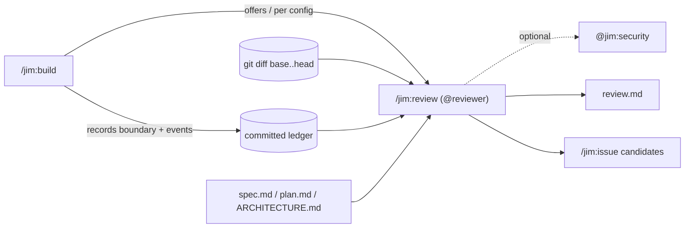

# 026 Post-build review phase

## Overview
Add a `/jim:review` phase that runs after `/jim:build` to verify the code that
landed matches its spec, plan, and architecture, flag security regressions in
the real diff, and record how the build measured up as a per-spec `review.md`.

## Problem Statement
Jim's SDLC runs spec → research → sec → plan → sec → build, but nothing reviews
the *actual diff* once code lands. There is no check that the build did what was
scoped, no validation of design-time security analysis against what was really
built, and no record of how the build measured up. Drift from the spec/plan and
process strain (security findings forcing re-plans, interrupted or repeated
builds) go uncaptured — so rework is discovered late and the institutional
memory the archive is meant to provide has a hole exactly where it matters most:
the gap between what was planned and what was shipped.

## User Stories
- As a developer, after a build I can have the work reviewed against its spec,
  plan, and architecture so that I catch drift before it compounds.
- As a developer who runs several specs on one feature branch, I can review a
  single spec's build in isolation so that the report reflects only that spec's
  work.
- As a developer, I can see security regressions in the actual diff so that the
  design-time analysis is validated against what was really built.
- As a developer, I can see how the build went — its commits, how long phases
  took, whether it was interrupted or re-run, and how far it deviated from the
  plan — so that deviations become a feedback loop to improve my process.
- As a developer, I can capture review findings as issues so that follow-on work
  is not lost.
- As a developer, I get each review recorded as a per-spec artifact with a
  structured summary so that the archive captures how the build measured up and
  the data can be analyzed across specs later.

## Acceptance Criteria
- [ ] After `/jim:build` completes, the developer is offered a review by
      default; configuration can instead require the review or run it
      automatically, consistent with jim's existing gate knobs.
- [ ] When the review is configured as required, the build cannot reach
      completion until the review has run to completion: the completion gate
      is held, and an interrupted, errored, or declined required review leaves
      the build incomplete rather than proceeding. The review's findings remain
      advisory — it is the uncompleted phase that blocks, never the findings.
- [ ] The review compares the build's changes against the spec's acceptance
      criteria, the plan's tasks, and the architecture document, and reports
      where the implementation diverges from each.
- [ ] The review reports security regressions present in the build's changes,
      optionally drawing on a deeper security analysis.
- [ ] The review correctly scopes "what this build changed" even when multiple
      specs share a single feature branch.
- [ ] The build records its work boundary and key process events for the spec
      durably, such that the review can reconstruct them afterward — including
      across an interrupted build and a re-run.
- [ ] The review reports build metrics: code metrics (commit counts and types,
      files and lines changed) and the available process metrics (phase
      durations, interruptions, re-runs, plan deviations).
- [ ] When expected instrumentation data is absent, the review degrades
      gracefully — it reports what it can and names the gaps rather than failing.
- [ ] Review findings can be captured as issues via the end-of-phase candidate
      batch, with the reviewer assigning each finding's priority by judgment.
- [ ] The review produces a per-spec `review.md` alongside `spec.md` / `plan.md`
      / `research.md`, containing both a machine-readable summary and a
      human-readable narrative of findings and deviations.
- [ ] The review reports the build's overall alignment with its spec and plan as
      a single at-a-glance verdict.
- [ ] The reviewer treats ingested commit, diff, and ledger content as untrusted
      input — it is parsed as data, never executed, and embedded directive-style
      text cannot steer the alignment verdict or the issue-filing decisions.
- [ ] The review and the ledger record references, counts, and locations rather
      than raw sensitive content; sensitive values surfaced from the diff are
      scrubbed or minimized before `review.md` or the ledger is persisted.

## Data Flow

## Out of Scope
- Instrumenting phases other than build (e.g. capturing that a security finding
  triggered a spec/plan amendment, or research duration) — deferred to a later
  rollout step. The reviewer degrades gracefully on phases not yet instrumented.
- A project-level cross-spec metrics aggregator. `review.md` is mineable by
  construction, but building the aggregator/dashboard is future work.
- `Spec:` commit-trailer-based diff scoping. The `Spec:`/`Issue:` trailer is a
  user-level `~/.claude/CLAUDE.md` convention, not part of jim, so it cannot be
  the portable scoping mechanism. Optional trailer-aware scoping is future work.
- Token-usage metrics — there is no bash-reachable token meter a skill can read;
  not portably achievable without harness support.
- Blocking the commit / hard pass-fail gating on the *findings*. The review's
  findings are advisory: a report, not a veto, and they never auto-reject the
  build. (`require_review` is a separate axis — it holds the build's completion
  gate until the review phase has *run to completion*; it gates that the phase
  ran, never whether the findings pass.)
- Fixing the drift. The reviewer reports; it does not modify code (mirrors how
  `/jim:debug` diagnoses without fixing).
- Runtime/dynamic security scanning of deployed code and compliance audits.
- Tamper-evidence for the ledger. It is an honesty aid for a trusted developer
  (jim's trust model: all input comes from the trusted human), not a
  tamper-evident audit control — signing or cryptographic integrity is out of
  proportion to the threat model.

## Research & Architecture Handoff

*Implementation insights surfaced during the brainstorm that produced this spec
(`docs/brainstorms/20260619-jim-review-phase.md`). These are context for the
architect — not requirements, not exclusions. Treat each as a starting point to
evaluate. The brainstorm carries the full rationale.*

### Insight 1: The pipeline ledger (boundary + process events)

- **Relates to AC:** *"the build records its work boundary and key process events
  … durably"* and *"the review reports … process metrics."*
- **Surfaced as:** instrument `/jim:build` to write a **committed, append-only
  event log** (a per-spec "flight recorder") — the developer's chosen mechanism.
- **Levelled-up requirement (already in the ACs):** a durable, version-controlled
  record of the build boundary + events that survives interruption and re-run;
  metrics the reviewer can report.
- **Deflection reason:** Delegation — format/storage is the architect's call.
- **Architect note:** An append-only log captures the hard cases for free:
  interruption = a `started` with no matching `finished`; re-run = repeated
  `started`/`finished` pairs; durations = timestamp deltas; causality (future
  phases) = a `reason=` field. Storage options weighed in the brainstorm: a
  **committed sidecar record in the spec dir** (chosen direction), vs. git tag,
  vs. git note. Persistence decision: **committed**, accept the append-during-run
  commit choreography. Owner: build (the only phase that knows when a spec's work
  starts). Note the tension with build's "no next-phase auto-invocation" rule —
  recording breadcrumbs does not invoke review, so it is compatible.
- **Routing hint:** Architect to decide.

### Insight 2: Diff scoping via a recorded baseline, not branch topology

- **Relates to AC:** *"correctly scopes what this build changed even when
  multiple specs share a single feature branch."*
- **Surfaced as:** record the baseline SHA at build start and review `base..head`.
- **Levelled-up requirement (already in the ACs):** correct per-spec diff
  scoping on a shared branch.
- **Deflection reason:** Delegation.
- **Architect note:** `git diff main...HEAD` is ambiguous with multiple specs per
  branch. The baseline SHA (recorded by build, stored in the ledger/record)
  resolves it. Must NOT rely on `Spec:` trailers (see Out of Scope). Optional
  range-override argument worth considering. **Security (sec Finding 4):**
  validate the SHA/range shape before interpolating into `git diff` (mirror
  `jimfile.sh`'s `is_valid_id` discipline) and pass values positionally behind a
  `--` end-of-options guard.
- **Routing hint:** Architect to decide.

### Insight 3: `review.md` mineable by construction

- **Relates to AC:** *"a machine-readable summary and a human-readable
  narrative."*
- **Surfaced as:** jim's standard dual structure — flat, stable frontmatter keys
  (e.g. `base_sha`, `commits_test`, `plan_deviations`, `build_interruptions`,
  `alignment`) plus a prose body.
- **Levelled-up requirement (already in the ACs):** per-spec now, aggregate-ready
  later with no new storage (a future `grep` sweep over `review.md` frontmatter).
- **Deflection reason:** Delegation — exact key set is the architect's.
- **Architect note:** Mirrors `security.md`'s frontmatter+body pattern. Keep keys
  flat and stable so a later aggregator needs no new format.
- **Routing hint:** Architect to decide.

### Insight 4: Metric tiers by achievability

- **Relates to AC:** *"the review reports build metrics."*
- **Surfaced as:** Tier 1 git-derived (commit counts/types, diffstat, test-vs-
  prod line ratio, rework signal); Tier 2 artifact-existence (phase coverage,
  task fidelity); Tier 3 build-recorded (wall-clock, best-effort test counts);
  Tier 4 tokens (not portably achievable — Out of Scope).
- **Deflection reason:** Delegation.
- **Architect note:** Review derives Tier 1+2 itself; build records only the
  minimal Tier 3 baseline. Commit-type ratio and test-vs-prod ratio are
  TDD-discipline signals, strongly on-brand.
- **Routing hint:** Architect to decide.

### Insight 5: Skill / agent / scripting shape

- **Relates to AC:** the offer/config-knob AC and the report-generation ACs.
- **Surfaced as:** `/jim:review` skill, `@reviewer` agent, optional delegation to
  `@jim:security` for the regression analysis; a shared `jimledger.sh` append
  helper (bash + POSIX, grep/sed-parseable) for build to write and review to
  read; config knobs `require_review` / `auto_review` modeled on
  `require_security` / `auto_security`, with offer-by-default behavior.
- **Deflection reason:** Delegation / Premature-Tech — names components and a
  script, which are the architect's to design.
- **Architect note:** Reuse the established gate-knob and Skill-to-skill
  invocation patterns (`/jim:build` → `/jim:arch`, security gates). New
  `jimconf.toml` keys follow the bare-name `require_`/`auto_` conventions. The
  reviewer's independence from the coder is the point — keep it a separate agent.
  **Security (sec Finding 6):** keep `@reviewer`'s `tools:` minimal (read; write
  `review.md`; the issue batch; optional `@jim:security` delegation), and ensure
  the `auto_review` path cannot be steered by injected content into out-of-scope
  writes or command execution.
- **Routing hint:** Architect to decide.

## Open Questions
- [x] ~~`require_review` semantics: what does "required" enforce, and where, given
      there is no commit gate at the end of build?~~ Resolved: `require_review`
      holds `/jim:build`'s completion gate — the plan cannot be marked `complete`
      until `/jim:review` has run to completion (a `review.md` exists). Findings
      stay advisory; it is the uncompleted phase that blocks.
- [ ] Re-running `/jim:review` on the same spec: overwrite `review.md`, or append
      a new review record? (Affects aggregation.)
- [ ] Exact alignment-verdict vocabulary (e.g. `aligned` / `minor-drift` /
      `major-drift`) and how the reviewer assigns it.
- [ ] Ledger lifecycle when only build is instrumented: does the record begin at
      build start (build-first), with spec-creation-start deferred alongside the
      rest of pipeline instrumentation?
