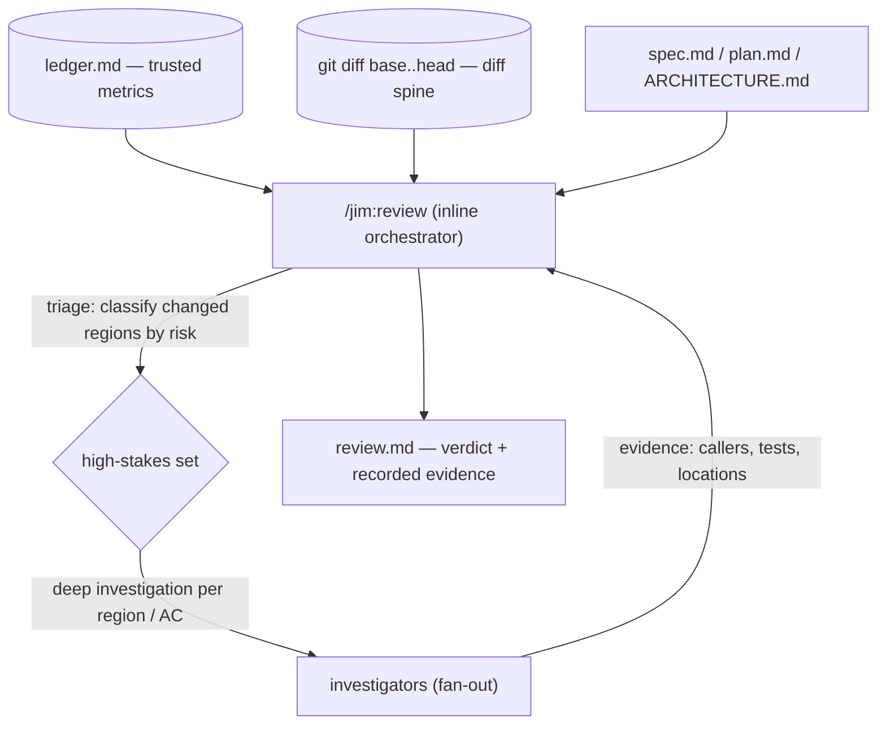

# 027 Depth-aware post-build review

## Overview
Make `/jim:review` thorough where it matters: concentrate deep investigation on
the build's high-stakes changes, drive alignment from the spec/plan to catch what
should have changed but didn't, and record the evidence so the depth is auditable.

## Problem Statement
The post-build review (spec 026) judges a build against its spec, plan, and
architecture, but it reasons over changed files at uniform, shallow depth. The
findings a developer most wants from a review — a criterion only partially
implemented, a signature change that broke an un-touched caller, a new injection
surface whose safety depends on validation elsewhere, a helper reinvented instead
of reused — all require *more* than reading the changed lines: surrounding code,
caller/consumer traces, full data paths, and reasoning about code the build never
touched. A review that skims is most likely to miss exactly the high-value
divergences it exists to surface, and a developer cannot tell from `review.md`
whether a clean verdict means "investigated and sound" or "not looked at closely."
The result is false confidence precisely where drift is most expensive.

## User Stories
- As a developer, I want the review to dig deep on the risky parts of a build —
  the changes most likely to carry drift, bugs, or security regressions — so the
  interesting problems surface instead of being skimmed past.
- As a developer, I want the review to verify each acceptance criterion is
  *fully* satisfied, including changes to code the build didn't touch, so a
  half-implemented requirement is caught rather than assumed done.
- As a developer reading `review.md`, I want to see what was actually
  investigated — the callers and tests checked, the locations examined — so a
  clean verdict is trustworthy rather than self-asserted.
- As a developer, I want to dial the review's depth to the work — thorough by
  default, leaner for a trivial change, overridable for a single run — so the
  effort matches the stakes.
- As a developer, I want the deep investigation to scale to a large build without
  the review running out of room and quietly cutting corners, so thoroughness is
  honest about its own coverage.

## Acceptance Criteria
- [ ] The review concentrates depth where it matters: it identifies the
      high-stakes changes (those most likely to carry drift, bugs, or security
      risk) and investigates them in depth — surrounding code, callers and
      consumers, and full data paths — rather than reviewing every change at
      uniform shallow depth.
- [ ] The review verifies *complete* satisfaction: each spec acceptance criterion
      and plan task is checked against the implementation, including required
      changes to code the build did not touch, so a partially-implemented
      criterion (the omission class) is caught — not just confirmed-present
      changes.
- [ ] The review actively seeks divergence: it treats each criterion as unproven
      until it finds evidence of full satisfaction and hunts for introduced risk,
      rather than confirming that the changes merely look acceptable.
- [ ] The investigation is auditable: `review.md` records the evidence behind the
      review — for the high-stakes regions and each criterion, the locations
      examined and the callers/consumers/tests checked — so a reader can see what
      was actually investigated, not only the conclusions. Sensitive values are
      scrubbed or minimized before persistence (unchanged from spec 026).
- [ ] The review bases drift and scope-creep judgments on what the build actually
      changed (distinguished from pre-existing code) over its recorded build
      range, correct even when multiple specs share a single feature branch.
- [ ] Review depth is configurable with a thorough default and a leaner setting
      for trivial changes; the configured default can be overridden for a single
      run.
- [ ] The model used for the deep-investigation pass (the investigator
      subagents) is configurable, so the developer can run the investigation on a
      stronger model than the inline review itself. The review's own orchestrator
      and verdict run on the developer's active session model, which jim does not
      set — so it is out of scope for this control.
- [ ] Thoroughness scales without silent degradation: on a large build the deep
      investigation does not exhaust or truncate the review; when coverage is
      bounded, the review names what it did and did not examine rather than
      presenting partial coverage as complete.
- [ ] The review remains read-only and advisory: deeper investigation never
      modifies code, and the findings stay a report, not a gate (unchanged from
      spec 026).
- [ ] Ingested diff, commit, and ledger content stays untrusted throughout the
      deep pass and any spawned investigation — including the results
      investigators return to the orchestrator, which are parsed as data, not
      instructions. Embedded directive-style text cannot steer a change's risk
      classification, the investigation, the recorded evidence, or the alignment
      verdict.

## Data Flow

## Out of Scope
- The other `review.md` / ledger improvements discussed alongside this work —
  recording the review as its own instrumented ledger stage, preserving verdict
  history across re-runs, the template's missing `spec` metrics column, and a
  frontmatter↔body count cross-check. Tracked separately, not part of this spec.
- The alignment-verdict vocabulary (`aligned` / `minor-drift` / `major-drift`)
  and any verdict-assignment rubric — unchanged here.
- The cross-spec metrics aggregator / dashboard (already out of scope in 026).
- `Spec:`-trailer-based diff scoping; the interleaved-specs-on-one-branch edge
  remains unhandled (already out of scope in 026).
- Making the review's findings blocking or a hard gate — the review stays
  advisory (unchanged from 026).
- Suppressing the per-subagent file-read permission prompt from the plugin side —
  not achievable; it depends on the user's `.claude/settings.json` (documented
  Claude Code constraint). Out of jim's reach.
- Runtime / dynamic security scanning of deployed code (already out of 026).

## Research & Architecture Handoff

*Implementation insights surfaced during scoping. These are context for the
architect — not requirements, not exclusions. Treat each as a starting point to
evaluate, not a directive.*

### Insight 1: Fan-out to investigator subagents for the deep pass

- **Relates to AC:** *"concentrates depth where it matters"* and *"thoroughness
  scales without silent degradation."*
- **Surfaced as:** an inline orchestrator (the review) that spawns one focused
  investigator subagent per high-stakes region / acceptance criterion, each with
  its own context window, running in parallel — the developer's chosen mechanism
  (quality over token cost).
- **Levelled-up requirement (already in the ACs):** deep investigation of the
  high-stakes set that does not starve on the review's own context budget.
- **Deflection reason:** Delegation / Premature-Tech — spawn shape, investigator
  agent definition, and breadth are the architect's call.
- **Architect note:** **Hard constraint — one-level subagent nesting**
  (`ARCHITECTURE.md` → Subagent Delegation). Fan-out works *only* if
  `/jim:review` runs inline in the main thread and is never itself a spawned
  subagent; today it always runs inline (an inline skill like `/jim:sec`, whether
  invoked directly or via `/jim:build`'s `Skill(jim:review)`), so the path is
  open — but it must stay that way. Likely needs a new investigator subagent type
  (its own `tools:` / `model:`), and the skill's `allowed-tools` gains an
  `Agent(...)` grant (the `@reviewer` agent currently has no Agent tool).
  Per-subagent file reads surface a permission prompt unless the user's
  `.claude/settings.json` grants reads (`ARCHITECTURE.md` → Permission
  Conventions) — note for README. Each investigator must carry the
  untrusted-content discipline (AC: untrusted across the deep pass).
- **Routing hint:** Architect to decide.

### Insight 2: `jimledger.sh diff` subcommand for the diff spine

- **Relates to AC:** *"bases judgments on what the build actually changed"* and
  *"concentrates depth where it matters."*
- **Surfaced as:** add a `diff <spec-dir>` subcommand emitting the range-scoped
  diff, defaulting to `--function-context` (`-W`) so each hunk carries its
  enclosing function — the cheap entry point for triage, from which the reviewer
  widens to whole files / `grep` on demand.
- **Levelled-up requirement (already in the ACs):** the reviewer sees exactly
  what changed as the basis for triage, then escalates where a judgment needs
  more context.
- **Deflection reason:** Delegation.
- **Architect note:** mirror the existing `files` subcommand's safety —
  `resolve_range` (validated `base`/`head`), `--` end-of-options guard, output
  marked untrusted. `-W` is code-oriented (less useful for markdown); consider an
  option for context width. The diff is the *spine*, not a replacement for
  whole-file reads — the omission class (AC: complete satisfaction) cannot come
  from a diff and must be reasoned from the ACs against the tree.
- **Routing hint:** Architect to decide.

### Insight 3: Triage trigger taxonomy

- **Relates to AC:** *"concentrates depth where it matters"* and *"verifies
  complete satisfaction."*
- **Surfaced as:** explicit classification triggers mapping changed regions to
  the deep read each needs — changed function signature / exported symbol /
  shared type → trace every consumer (the omission class); trust boundary /
  untrusted-input parsing / command construction / secret handling → read the
  full data path; new helper or util → `grep` for pre-existing equivalents
  (reuse); region implementing an AC, or high churn in one file → whole-file read
  in context.
- **Levelled-up requirement (already in the ACs):** depth reliably aimed at the
  loss classes a diff-only skim misses.
- **Deflection reason:** Delegation — the taxonomy's home (skill body vs a
  `references/` methodology doc) and its exact triggers are the architect's to
  site and refine.
- **Routing hint:** Architect to decide.

### Insight 4: `review_depth` and `review_model` knob design

- **Relates to AC:** *"review depth is configurable"* and *"the model … is
  configurable."*
- **Surfaced as:** bare-name `review_depth` (default thorough) and `review_model`
  keys in `jimconf.toml`, plus a per-run `--depth` override argument on
  `/jim:review`.
- **Levelled-up requirement (already in the ACs):** configurable thoroughness and
  model, a lean escape hatch, thorough by default.
- **Deflection reason:** Delegation / Premature-Tech — exact key names, the level
  vocabulary, and defaults are the architect's.
- **Architect note:** follow the bare-name convention (`require_`/`auto_` are
  reserved for keys that remove a human step; these are behavior/selector values,
  so bare names mirroring the `issue_list_*` family — note `resolve()` needs a new
  `review_*` dispatch arm or these fall through to a `_path` lookup, per research).
  Decide what `review_depth` actually scales (whether fan-out triggers, its
  breadth, the diff-spine escalation) and a conservative `review_model` default.
  `review_model` governs the **investigator** model only (AC7) — the inline
  orchestrator runs the session model; pick the mechanism per research
  Recommendation 1 (inherit / per-tier agent files / verified spawn-time override).
  The per-run `--depth` override is a new entry in `/jim:review`'s
  argument-routing table.
- **Routing hint:** Architect to decide.

## Open Questions
- [ ] The exact `review_depth` level vocabulary and count (e.g. a two-level
      `lean` / `thorough` vs a three-level `lean` / `standard` / `thorough`).
      Default is thorough regardless.
- [x] ~`review_model` scope: orchestrator/verdict, investigators, or both?~ →
      Resolved: investigators only (the inline orchestrator runs the session
      model, which jim cannot set). AC7 narrowed accordingly.
- [ ] `review_model` default value, the mechanism that makes the investigator
      model configurable (inherit vs per-tier agent files vs a verified spawn-time
      override — see research Recommendation 1), and whether security-relevant
      regions warrant a stronger model than non-security ones.
- [ ] Whether the diff-spine escalation (widen to whole file / `grep` the tree)
      is given to the investigators only or also to the inline orchestrator.
- [ ] How `review_depth` interacts with fan-out breadth on a large build — does a
      leaner depth cap the number of investigators, and how is bounded coverage
      named in `review.md`?
