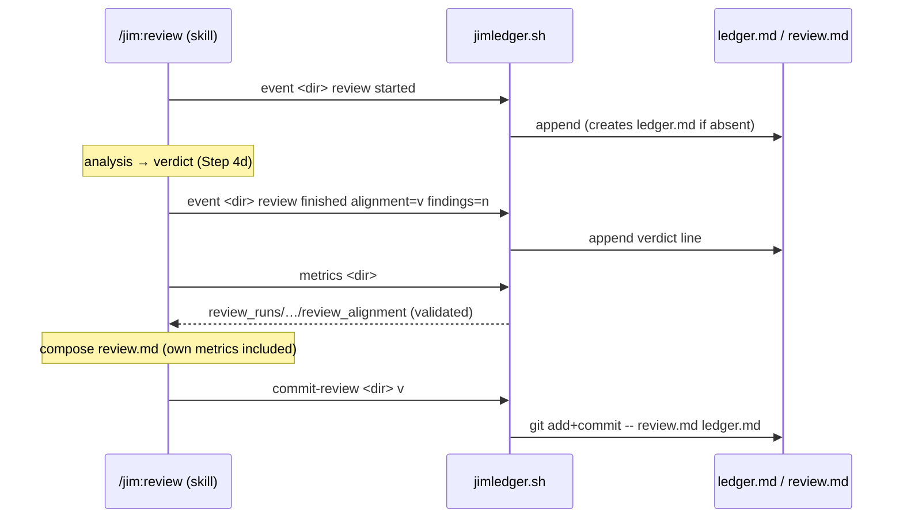

# Instrument /jim:review as a ledger stage and preserve verdict history — Plan

## Overview

Extend `jimledger.sh` with the `review` stage, a validated verdict in its
`metrics` output, and a least-privilege `commit-review` subcommand; then wire
`/jim:review` to emit its boundaries, read its own metrics after the verdict,
and commit `review.md` + `ledger.md`. All four touched files are existing.

## Design Decisions

### 1. Verdict lives in the ledger line; metrics namespaces and validates it

- **Chosen:** The `review finished` ledger line carries `alignment=<v> findings=<n>`.
  `cmd_metrics` extracts the latest via `ledger_kv … last` (the existing
  `head_sha` pattern) and emits **literal** keys `review_alignment` /
  `review_findings`, validating `alignment` against the enum
  (`aligned`/`minor-drift`/`major-drift`) and `findings` against `^[0-9]+$`.
  Invalid/absent → key omitted.
- **Why:** Keeps the no-key-injection property (output keys are code literals,
  never read from ledger text — sec Finding 7) while bounding what a tampered
  ledger can surface to a well-formed value (AC #4, AC #9).
- **Rejected:** Emitting the raw value unvalidated — lets a tampered ledger
  surface arbitrary text as a "verdict." Emitting empty on invalid — omission is
  cleaner and matches the existing "absent key = not instrumented" convention.

### 2. Emit `review finished` before composing `review.md`; re-read metrics for the file

- **Chosen:** Order is: `review started` (after the spec-dir precondition) →
  reviewer's analysis → verdict at Step 4d → emit `review finished
  alignment=… findings=…` → **re-read `jimledger.sh metrics`** → compose
  `review.md` → `commit-review`.
- **Why:** For `review.md` to report its *own* `review_*` metrics (AC #7), this
  run's `finished` must already be in the ledger when the metrics feeding the
  file are read. The current Step 2 metrics read happens before the verdict
  exists (research Recommendation 1).
- **Rejected:** Computing review's own triplet inline in the skill — duplicates
  `phase_event_metrics` logic in a prompt. Keeping a single Step 2 read — would
  report this run's metrics as one-short / mid-interruption.

### 3. Commit via a `jimledger.sh commit-review` subcommand, not a git grant

- **Chosen:** Add `commit-review <spec-dir> [verdict]` that runs `git -C <dir>
  add -- review.md ledger.md` then `git -C <dir> commit -m <msg> -- review.md
  ledger.md` (path-limited `--only` semantics, `--` guard, never `git add -A`).
  `/jim:review` invokes it through its existing
  `Bash(bash ${CLAUDE_SKILL_DIR}/scripts/jimledger.sh *)` permission.
- **Why:** AC #10 — least privilege. The review surface reasons over untrusted
  diff/commit/ledger content; encapsulating the commit in one audited fixed-path
  function is a far smaller blast radius than granting it broad `Bash(git *)`.
  No `allowed-tools` change is needed (research confirmed).
- **Rejected:** Broad `Bash(git *)` on the review skill — excessive on the most
  exposed surface. A separate commit script — more new surface than one
  subcommand on the script review already calls.

### 4. Commit unconditionally; trusted-origin commit message

- **Chosen:** The commit runs every completed review (no config knob). The
  message is `chore(review): record review (<verdict>)` only when `<verdict>` is
  in the enum, else `chore(review): record review` — no untrusted text
  interpolated. A failed commit is reported and leaves `review.md` intact.
- **Why:** Review is terminal with no approval gesture (spec Problem Statement);
  unconditional matches build's auto-committed ledger. Message hygiene + graceful
  failure address sec Finding 3.
- **Rejected:** A gating flag — adds config surface for a behavior the developer
  asked to be automatic (spec Open Question 3). Interpolating findings text into
  the message — untrusted (sec 026 Finding 2).

### 5. Re-run duration keeps the existing first-start→last-finish semantics

- **Chosen:** No special-casing; `review_duration_seconds` spans the first
  `review started` to the last `review finished`, like every other stage.
- **Why:** Consistency across the metrics channel; per-run duration is a
  low-value refinement (spec Open Question 2).
- **Rejected:** Per-run duration for review only — divergent semantics for one
  stage, not worth the complexity now.

### 6. Decouple per-stage metrics from the build range (enables AC #6 + AC #7 together)

- **Chosen:** Restructure `cmd_metrics` so the ledger-only metrics
  (`phase_event_metrics` + the verdict extraction) emit whenever `ledger.md`
  exists, while the git-derived block (base/head SHA, commit counts, diffstat)
  stays gated on a resolvable build range. With a ledger but no build baseline,
  `metrics` now emits the stage/verdict metrics and exits 0 instead of returning
  2 with no output.
- **Why:** AC #7 ("review.md reports its own metrics") must hold in the AC #6
  case (a build that was never ledger-instrumented, so there is no `build
  started base_sha`). The per-stage event counts never needed the build range —
  the coupling was incidental.
- **Rejected:** Leaving the coupling — review's own metrics would silently vanish
  from `review.md` exactly in the un-instrumented case AC #6 names. (Trade-off:
  this changes `cmd_metrics`' no-baseline exit from 2→0; the only consumer is
  `/jim:review`, edited here, and any existing no-baseline test is reconciled in
  Task 1.)

## Constitution Check

**ARCHITECTURE.md status:** Present — constraints noted below.

| Constraint from ARCHITECTURE.md | Honored? | Notes |
| :--- | :--- | :--- |
| Ledger metrics is a content-free, fixed-allowlist channel; "a tampered ledger cannot inject spurious metric keys" (sec Finding 7) | Yes (reframed) | Output keys stay code literals; the verdict is a trusted-origin value, shape-validated on extraction (DD #1). Documented invariant text refreshed by `/jim:arch` at the build gate. |
| `jimledger.sh` "never commits" (script comment `:19-22`) | No (deliberate) | Overturned for AC #8/#10, confined to one audited fixed-path `commit-review` function. User-approved via the spec ACs + folded sec findings. `/jim:arch` refresh pipeline-owned. |
| "Non-build stages don't commit; the developer commits their events" | No (deliberate) | Review becomes a documented exception — terminal stage with no approval gesture. `/jim:arch` refresh pipeline-owned. |
| Bash conventions: `set -uo pipefail`, `LC_ALL=C`, POSIX-only/no third-party deps, `BASH_SOURCE`-relative composition | Yes | New code follows them; `commit-review` uses only `git` (already used read-only) + bash builtins. |
| SHAs/paths validated; `--` end-of-options guard before git use | Yes | `commit-review` uses literal filenames with `--`; no interpolated, attacker-influenceable args. |

## File Manifest

| Component | File Path | Action | Notes |
| :--- | :--- | :--- | :--- |
| Ledger script | `skills/review/scripts/jimledger.sh` | Update | `review` in `LEDGER_STAGES`; decouple per-stage metrics from the build range (DD #6); verdict extraction+validation in `cmd_metrics`; `cmd_commit_review` + `main()` case; refresh the `:19-22` "never commits" comment. |
| Ledger tests | `tests/jimledger.sh` | Update | New cases: review-stage metrics without a baseline, verdict surfacing, tampered-verdict bounding, `commit-review` (scoping + message + graceful failure). |
| Review template | `skills/review/assets/review-template.md` | Update | Add `review` (and the missing `spec`) to the Stage durations / Interruptions rows + `review` to Stage runs; add `review_*` frontmatter fields. Absorbs issue #16. |
| Review skill | `skills/review/SKILL.md` | Update | Emit `review started`/`review finished …`; re-read metrics after `finished`; invoke `commit-review`; graceful-failure note. `allowed-tools` unchanged. |

## Interface Contracts

```text
# jimledger.sh metrics <spec-dir>
#   git-derived block (base_sha, head_sha, commits*, files/ins/del) — ONLY when a
#     build range resolves (build started base_sha present).
#   ledger-only block — emitted whenever ledger.md exists (DD #6):
review_runs=<int>                  # phase_event_metrics (review in LEDGER_STAGES)
review_interruptions=<int>
review_duration_seconds=<int>      # when both bounds exist
review_alignment=<aligned|minor-drift|major-drift>   # latest; OMITTED if not in enum
review_findings=<int>              # latest; OMITTED if not ^[0-9]+$
#   exit 0 when ledger.md exists (even with no build baseline); 2 only on bad args / missing dir.

# jimledger.sh commit-review <spec-dir> [verdict]
#   git -C <dir> add -- review.md ledger.md
#   git -C <dir> commit -m "<msg>" -- review.md ledger.md      # --only semantics; no -A
#   msg = "chore(review): record review (<verdict>)" iff verdict in enum, else
#         "chore(review): record review"
#   exit 0 on success; non-zero (caller degrades, review.md left intact) on any git failure

# /jim:review emit points (skill prompt)
event <dir> review started                                    # after spec-dir precondition (Step 1)
event <dir> review finished alignment=<verdict> findings=<n>  # after verdict (Step 4d), before composing review.md
# then: re-read `metrics <dir>` → compose review.md → commit-review <dir> <verdict>
```

## Data Flow



## Task Breakdown

*Script tasks (1–5) are TDD: the named test case is written failing, then made
green. `bash tests/jimledger.sh` is the per-task gate. All test fixtures use
`mktemp`/`git_fixture` temp dirs — never production paths.*

1. [x] Add `review` to `LEDGER_STAGES` and decouple the ledger-only metrics from
   the build range in `cmd_metrics` (DD #6): `phase_event_metrics` runs whenever
   `ledger.md` exists; the git-derived block stays gated on a resolvable range;
   no-baseline exits 0. Add `case_jimledger_metrics_review_no_baseline` (review
   started+finished, no `build started` → `review_runs=1`, exit 0). Reconcile any
   existing no-baseline test that asserts rc=2.
   **Verify:** `bash tests/jimledger.sh`

2. [x] Surface + validate the verdict in `cmd_metrics` (DD #1): emit literal
   `review_alignment` (gated on the enum) and `review_findings` (gated on
   `^[0-9]+$`) from `ledger_kv … last`. Add `case_jimledger_metrics_review_verdict`
   (`alignment=aligned;findings=2` → both emitted) and
   `case_jimledger_metrics_review_verdict_tampered` (`alignment=pwned;findings=x`
   → neither emitted).
   **Verify:** `bash tests/jimledger.sh`

3. [x] Add `cmd_commit_review` + the `main()` `commit-review` case (DD #3/#4), and
   refresh the `:19-22` "never commits" comment to name the single fixed-path
   commit site. Add `case_jimledger_commit_review` (via `git_fixture`: write
   `review.md`, `ledger.md`, and an unrelated tracked change; `commit-review <dir>
   aligned` → exit 0; new commit contains `review.md` + `ledger.md` but not the
   unrelated change; message `chore(review): record review (aligned)`),
   `case_jimledger_commit_review_tampered_verdict` (garbage verdict → generic
   message), and `case_jimledger_commit_review_non_repo` (non-git dir → non-zero,
   clean exit).
   **Verify:** `bash tests/jimledger.sh`

4. [x] Update `skills/review/assets/review-template.md`: Stage runs →
   `(spec·research·plan·sec·build·review)`; Stage durations and Interruptions →
   `(spec·research·plan·sec·build·review)` (adds the missing `spec` and `review`);
   add `review_runs`/`review_interruptions`/`review_duration_seconds` to
   frontmatter. (Absorbs #16.)
   **Verify:** `grep -q 'Stage durations (spec·research·plan·sec·build·review)' skills/review/assets/review-template.md && grep -q 'Interruptions (spec·research·plan·sec·build·review)' skills/review/assets/review-template.md`

5. [x] Update `skills/review/SKILL.md`: emit `review started` after the Step 1
   precondition; emit `review finished alignment=<verdict> findings=<n>` after
   Step 4d; re-read `metrics` after `finished` to feed `review.md`'s own metrics;
   invoke `commit-review <dir> <verdict>` after writing `review.md`, reporting a
   failed commit and leaving `review.md` intact; note `review.md` remains the
   authoritative verdict (the ledger trajectory is advisory).
   **Verify:** `grep -q 'review started' skills/review/SKILL.md && grep -q 'review finished' skills/review/SKILL.md && grep -q 'commit-review' skills/review/SKILL.md`

6. [x] Run the full deterministic suite.
   **Verify:** `bash skills/meta-test/scripts/run.sh jimledger`

## Requirements Coverage Summary

| Spec Acceptance Criterion | Addressed In Task(s) |
| :--- | :--- |
| AC1 — `review` is an instrumented ledger stage | 1, 5 |
| AC2 — completion event carries verdict + findings | 5 |
| AC3 — trajectory recoverable; review.md latest snapshot; re-run overwrites + appends | 1, 2, 5 |
| AC4 — metrics expose process metrics + latest verdict under a fixed key set | 1, 2 |
| AC5 — interrupted review visible as an interruption | 1, 5 |
| AC6 — un-instrumented build: review still records, degrades gracefully, self-measurable | 1, 5 |
| AC7 — review.md reports review's own metrics | 1, 4, 5 |
| AC8 — atomic commit of review.md + ledger.md | 3, 5 |
| AC9 — verdict value validated; review.md authoritative | 2, 5 |
| AC10 — least-privilege commit (audited entry point, no broad git grant) | 3, 5 |

## Out of Scope

- **`ARCHITECTURE.md` ledger-convention refresh** — *not deferred; pipeline-owned.*
  The two invariant changes (content-free → fixed-key; review commits) are
  refreshed by `/jim:arch`, which the `/jim:build` completion gate runs. Not a
  human follow-on.
- **Aggregation / mining of the verdict trajectory** — spec Out of Scope ("emit
  now, mine later"); no consumer built here.
- **`#17` frontmatter-body count consistency check** — separate validation-checklist
  concern, not this spec.
- **Per-run review duration** — deferred (DD #5); existing semantics kept.

## Open Questions

- [x] ~~Verdict metric key names~~ → `review_alignment` / `review_findings` (DD #1).
- [x] ~~Re-run duration semantics~~ → keep first-start→last-finish (DD #5).
- [x] ~~Commit gating~~ → unconditional, trusted-origin message (DD #4).
- [ ] None outstanding.
