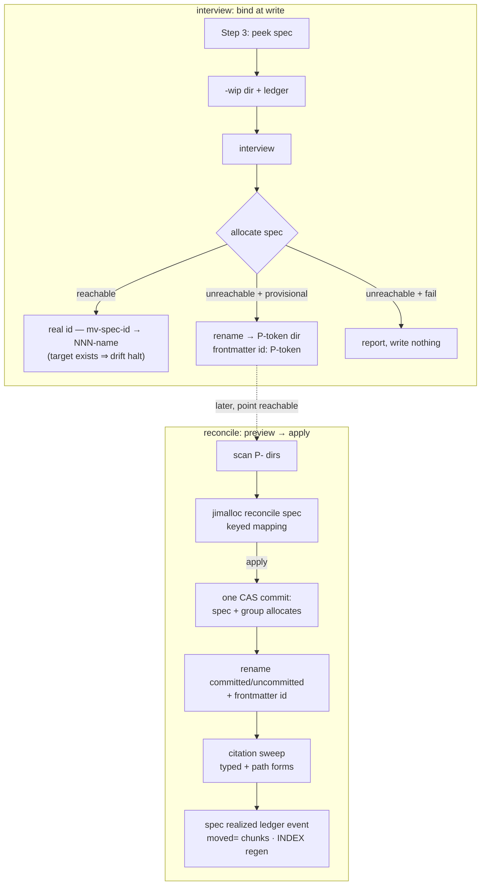

# Coordinated spec identity — Plan

## Overview

Wire `/jim:spec` onto the allocator with late binding (peek-advisory at
interview open, `allocate spec` at spec-write), and ship spec-side provisional
realization as a preview-then-apply consumer script over a new pure
`reconcile spec` allocator verb — the registry half riding the existing
erosion-guarded batch publish, the tree half a same-parent rename plus an
exact-token citation sweep, with the mapping durably recorded as a specs-root
ledger redirect.

## Design Decisions

### 1. Realization keys on (group, slug, issuance-date), stamped into the record

- **Chosen:** `alloc_reconcile_realize_spec` does keyed find-or-allocate over
  `spec allocate` records using the triple (group, slug, date), where the
  realize path stamps the record's informational `<date>` field from the
  provisional token's embedded issuance date (the seed's issue-`created`
  precedent) rather than the realization day — so a re-run after a crash
  between publish and rename finds its own record and converges.
- **Why:** specs have no registry-side durable identity field and the record
  grammar is frozen; the triple is the strongest key the existing grammar can
  express, and it makes AC 7's idempotent/resumable guarantee hold across the
  publish-then-rename crash window.
- **Rejected:** tree-state-only idempotency (pending dirs disappear when
  renamed) — a crash after publish but before rename re-allocates on re-run,
  violating "never double-allocates". Extending the record grammar — frozen
  upstream (`platform/007`), and redirect-record emission is Spec B's charter.
- **Accepted residual:** a *different* spec allocated online with the same
  group, identical title-slug, and same date as an offline provisional would
  false-match ("have"). The same shape is reachable deliberately by anyone
  with coordination-branch push access appending a crafted matching record
  (security Finding 7), and corroboration cannot separate the two —
  `platform/011` established an attacker appends a well-formed allocate
  record as easily as anything else — so the control is visibility. Mirrors
  `issue/010`'s accepted residual (detected, not prevented): the realizer's
  preview surfaces the have/new state column so an unexpected "have" is loud
  before apply, and the apply's rename halts when the target directory
  already exists (the spec's drift AC), so a collapse cannot land silently.
  Fixtured.

### 2. The provisional directory basename is the provisional ordinal token

- **Chosen:** an offline-bound spec lives at `<specs>/<group>/P-<date>-<slug>/`
  — the allocator-returned ordinal token is the whole basename; realization
  derives the final `NNN-<slug>` name from it. The spec.md frontmatter carries
  `id: "P-<date>-<slug>"` until realization rewrites it.
- **Why:** the token is already unique, grammar-reserved (`P-` cannot be
  confused with `NNN`), and self-describing; composing `<token>-<name>` would
  duplicate the slug inside the basename.
- **Rejected:** keeping the `<peek>-wip` name until realization — the peeked
  ordinal is advisory and may be taken by the time the point is reachable,
  and the tree would show a numbered dir the registry never allocated
  (exactly the drift the spec exists to end).

### 3. Late binding in the interview: peek names the placeholder, allocate binds at write

- **Chosen:** Step 3 calls `peek spec <group>` (advisory; offline it degrades
  to last-seen state) and names `<peek>-wip`; Step 8 calls
  `allocate spec <group> "<title>"` and then renames the placeholder to the
  bound identity — `<real>-<name>` (shift absorbed by the new cross-id rename
  verb, DD 4), or `P-<token>` on the provisional branch, with a `-2`/`-3`
  slug-suffix loop against the local tree mirroring `new.sh`'s provisional
  disambiguation. On the fail branch nothing is written and the wip dir stays
  disposable.
- **Why:** an abandoned interview must burn nothing (AC 4), and a mid-flow
  network failure after the interview leaves the draft recoverable and the
  allocation retryable (`platform/007` G7).
- **Rejected:** allocate at interview open — every abandoned interview burns
  a CAS'd ordinal and an unreachable point fails the interview at its first
  step. Allocate at approval — the identity would float through spec-check
  and presentation, and every captured path would be provisional-of-advisory.

### 4. Rename primitives: one new jimfile verb + a widened jimledger gate

- **Chosen:** `jimfile.sh mv-spec-id <group> <old-basename> <new-id> <name>`
  — a plain-`mv`, clobber-refusing, boundary-validated rename for the
  uncommitted case, accepting `NNN-*` or `P-<token>` sources and a digits
  target (up to the allocator's 15-digit legality). For a *committed*
  provisional dir, realization uses `jimledger.sh rename-tracked` (the
  history-continuous same-parent `git mv`), whose source-basename gate widens
  to also accept the reserved `P-<token>` form; every other guard (sibling
  parent, tracked source, absent target, literal pathspecs) is unchanged.
- **Why:** realization is always a same-parent rename, so the
  sibling-constrained primitive is the exact fit; the plain-mv twin keeps the
  single path/id boundary for the uncommitted case (AC 8) instead of raw `mv`
  in a skill body.
- **Rejected:** widening `mv-spec` in place — its single `<id>` drives both
  source glob and target, and overloading it obscures the same-id contract
  its callers rely on. `move-spec-dir` — cross-parent power the flow never
  needs. Raw `mv` from the skill — bypasses validation and containment.

### 5. The citation sweep is the realizer's own, with the shipped write envelope

- **Chosen:** the consumer script sweeps the four content roots the partition
  flows sweep (specs, issues, brainstorms, debug — `git ls-files`, `*.md`),
  rewriting the provisional identity by exact whole-token match in two forms:
  the typed id (`<group>/P-<token>`) and the dir path
  (`docs/specs/<group>/P-<token>`), plus the realized spec's own frontmatter
  `id:`. It adopts the shipped mutating-verb envelope: every target validated
  and worktree-contained before any edit, the realize mapping is the
  whitelist, output is location-only (`REWROTE file line kind`), and issue
  `INDEX.md` is regenerated once when any issue file changed.
- **Why:** security Finding 3 requires the envelope; research showed the two
  shipped normalizers split exactly on the property that matters — a spec's
  *path is* a citation (`origin:` fields), so the sweep must include
  path-shaped sites (`jimpartition.sh rewrite-refs` precedent), which
  `migrate.sh` deliberately excludes.
- **Rejected:** reusing `rewrite-refs` itself — its remap grammar gates both
  sides to slug/3-digit ids, so `P-` sources cannot ride it without loosening
  a blueprint-territory trust boundary for an sdlc consumer.

### 6. The durable mapping is a specs-root ledger event in the `moved=` grammar

- **Chosen:** after a successful apply, the realizer appends one
  `spec realized` event to the specs-root ledger with the mapping as
  `moved=<group>/P-<token>:<group>/<NNN>` elements, chunked ≤256 bytes at
  element boundaries (the partition convention), every value re-validated at
  the id boundary before append. It is not added to `LEDGER_STAGES` (metrics
  measures stages; realization is not one), and `vacated-max` provably
  ignores it (its awk gate filters `partition finished` + `op=split|merge`).
- **Why:** AC 9 wants the mapping durable, uniform with the existing redirect
  precedent, and liftable by Spec B without re-derivation; the event verb
  accepts any phase token so this costs no jimledger change; security
  Finding 6 requires write-side validation because `append_line` gates
  nothing.
- **Rejected:** per-spec-dir ledger only — the record must be findable
  centrally by the lift without walking every dir; the per-dir ledger already
  rides the rename anyway. Reusing the `partition` phase token — false
  provenance for a non-partition operation.

### 7. The refusal double-line is fixed at the source

- **Chosen:** `alloc_cas_append` distinguishes "builder failed" (rc ≠ 0 —
  the builder already wrote its specific reason to stderr; emit nothing more)
  from "builder returned malformed output" (keep the generic line). The
  consumer still matches refusal messages anywhere in stderr, not the last
  line.
- **Why:** `platform/011` review Finding 6 — the Interface Contract asks
  consumers to classify by message, and the trailing generic line misleads
  any consumer that reads the last line; fixing at the source serves every
  future consumer.
- **Rejected:** consumer-only match-anywhere — leaves the misleading channel
  in place for the next consumer.

### 8. The new grant is verb-scoped

- **Chosen:** `skills/spec/SKILL.md` `allowed-tools` gains three verb-level
  prefixes — `jimalloc.sh peek spec`, `jimalloc.sh allocate spec`, and the
  realizer script — never a whole-CLI `jimalloc.sh *` grant.
- **Why:** security Finding 4: a whole-script grant hands the interview
  `seed --apply` and the issue verbs; prefix-matched permission tokens
  support verb-level scoping, and the tightest-verb discipline is the
  established preference.
- **Rejected:** `jimalloc.sh *` — capability sprawl with no consumer.

### 9. The realizer is `/jim:spec reconcile`, owned by the spec skill

- **Chosen:** a new `skills/spec/scripts/reconcile.sh` (the spec skill's
  first script), mirroring the issue realizer's control skeleton
  (scan-pending → mapping → `--apply` gate → per-item apply → report), and a
  `reconcile` row in `/jim:spec`'s argument routing that drives it
  preview-first.
- **Why:** spec directories are sdlc territory; the issue realizer lives with
  the issue skill for the same reason, and the two consumers stay
  independently testable. The allocator keeps only the pure/registry halves.
- **Rejected:** extending `/jim:issue reconcile` to both kinds — crosses
  group ownership and couples two consumers' release cadence. An
  allocator-only realizer — the tree half (renames, sweep, ledger) is
  consumer work by the same division `issue/010` used.

## Constitution Check

**ARCHITECTURE.md status:** Present — constraints noted below.

| Constraint from ARCHITECTURE.md | Honored? | Notes |
| :--- | :--- | :--- |
| Scripting Layer: bash + POSIX only, no third-party deps | Yes | awk/grep/sed and git plumbing only; no new tool. |
| `set -uo pipefail`, `export LC_ALL=C` in every script | Yes | The new realizer script carries the standard preamble. |
| Inter-script composition is `BASH_SOURCE`-relative | Yes | `reconcile.sh` resolves jimfile/jimconf/jimalloc/jimledger the way the issue realizer does. |
| Single `is_valid_id` boundary — no new validator copy | Yes | All new tokens route through `jimfile.sh valid-id` / existing alloc helpers; the `P-` form is checked as prefix + valid-id token. |
| Registry, config, ledger parsed as data, never `source`d | Yes | All new reads are field splits; the realize event kv is composed from pre-validated tokens. |
| Operational git: plumbing / literal pathspecs / `--end-of-options` | Yes | Registry writes ride `alloc_publish` unchanged; the committed-case rename rides `rename-tracked`'s existing literal-pathspec `git mv`. |
| Untrusted branch content validated before git/ref/path use | Yes | Tree-derived `P-` tokens validated before the allocator, any path, or the ledger kv (spec AC 13). |
| Tests under `tests/`, meta-test scaffold conventions | Yes | New `tests/specreconcile.sh` scaffolded via `/jim:meta-test`; existing files extended in place. |
| Reserved `000-blueprint` slot untouched by next-id / seed | Yes | Unchanged; the new seed skip adds the reserved `P-` class beside it. |
| Skill `allowed-tools` exactness (no bare wildcards) | Yes | New grants are verb-scoped path-exact prefixes (DD 8). |

## File Manifest

| Component | File Path | Action | Notes |
| :--- | :--- | :--- | :--- |
| Allocator | `skills/file/scripts/jimalloc.sh` | Update | Builder-failure stderr fix; seed skips `P-` dirs; `alloc_reconcile_realize_spec`; `reconcile spec [--apply]` verb + publish builder (group-allocate record when the group is unclaimed). |
| File/path CLI | `skills/file/scripts/jimfile.sh` | Update | New `mv-spec-id` verb (cross-id / provisional-source spec-dir rename, plain mv). |
| Ledger CLI | `skills/ledger/scripts/jimledger.sh` | Update | `rename-tracked` source-basename gate widens to the reserved `P-<token>` form. |
| Spec realizer | `skills/spec/scripts/reconcile.sh` | Create | Scan pending `P-` dirs → allocator mapping → apply: rename (committed/uncommitted), frontmatter `id:` rewrite, citation sweep, `spec realized` ledger event, one INDEX regen. |
| Spec skill | `skills/spec/SKILL.md` | Update | Step 3 peek + redirect consent; Step 8 allocate/classify/rename + provisional branch + drift halt; `reconcile` arg-routing row; verb-scoped grants. |
| Allocator tests | `tests/jimalloc.sh` | Update | Stderr-fix case; seed-skip case; spec realize fixture set (mapping, keyed idempotency, parity, dup-halt, crafted-pending, group-allocate); reconcile-spec apply/preview/offline cases. |
| File CLI tests | `tests/jimfile.sh` | Update | `mv-spec-id` guard + rename cases. |
| Ledger tests | `tests/jimledger.sh` | Update | `rename-tracked` `P-` source cases (accept reserved form, other guards unchanged). |
| Realizer tests | `tests/specreconcile.sh` | Create | Scaffolded via meta-test; scan/preview/apply/sweep/ledger/idempotency cases. |

## Interface Contracts

```bash
# ─── jimalloc.sh (new / changed) ─────────────────────────────────────────────

# alloc_reconcile_realize_spec <pending-id>...   (specs log on stdin)
#   Pure. Each pending id is "<group>/P-<date>-<slug>" (boundary-validated;
#   within-batch duplicates halt, rc 1). Keyed find-or-allocate on
#   (group, slug, date): a `spec allocate <group>/<NNN> <slug> <date>` record
#   matching all three maps to "have"; otherwise a fresh ordinal from the
#   shared fold (alloc_fold_max_spec — group-aliased, source-counting),
#   incremented per new realization in pending order. Prints
#   "<pending-id>\t<group>/<NNN>\t<new|have>". The realized record's date
#   field is stamped from the token's embedded date, making the key stable
#   across re-runs.

# reconcile spec [--apply]     (pending set on stdin, one id per line)
#   Replaces the current rc-2 refusal. Empty set → clean no-op (stderr note).
#   Unreachable origin → "still offline" no-op, rc 0. Preview prints the
#   mapping (fields 1-2). --apply lands all new records — spec allocate plus
#   a group allocate for any group with no valid group-allocate record —
#   through alloc_publish (one commit, one CAS, erosion re-check, baseline
#   arm) and prints the mapping. Idempotent and resumable via the DD-1 key.

# alloc_cas_append: on builder rc != 0, return 1 WITHOUT the generic
#   "allocator failed to compute a record" line (the builder already wrote
#   its specific reason); the generic line remains only for a builder that
#   returns malformed output (rc 0 with < 2 lines).

# alloc_seed_derive_specs: a dir whose basename is the reserved provisional
#   form (P-<valid-id token>) is skipped like the 000 slot — no record, no
#   conflict.

# ─── jimfile.sh (new verb) ───────────────────────────────────────────────────

# mv-spec-id <group> <old-basename> <new-id> <name>
#   Rename <specs>/<group>/<old-basename>/ → <specs>/<group>/<new-id>-<name>/.
#   Guards: group is_valid_id; <old-basename> is exactly "NNN", "NNN-*", or
#   the reserved "P-<token>" form (token passes is_valid_id); <new-id> is
#   3-15 digits (padded floor, allocator legality ceiling — never an
#   unpadded dir name); <name> is_valid_slug; source exists, target must not
#   (clobber refusal); same-parent only; plain mv --; prints the target.
#   rc 2 usage · rc 1 guard failure. The uncommitted-case twin of
#   jimledger's rename-tracked.

# ─── jimledger.sh (widened gate) ─────────────────────────────────────────────

# rename-tracked <old-path> <new-path>
#   Source basename gate now accepts NNN-slug | NNN-wip | P-<token> (reserved
#   provisional form). Every other guard unchanged: same parent, tracked
#   source, absent target, worktree-contained, --literal-pathspecs git mv.

# ─── skills/spec/scripts/reconcile.sh (new consumer) ─────────────────────────

# bash reconcile.sh [-c <path>] [<specs-dir>] [--apply]
#   Scan: every <specs-dir>/<group>/P-*/ dir whose basename passes the
#   reserved-form check and whose spec.md frontmatter id: matches it; a
#   mismatch or invalid token warns and skips (never fatal). Pending ids are
#   "<group>/<basename>".
#   Preview (default): print the allocator mapping verbatim INCLUDING the
#   have/new state column — unlike the issue-side preview, which drops it; an
#   unexpected "have" is the residual/tamper tell (security Finding 7).
#   Mutate nothing.
#   Apply: jimalloc reconcile spec --apply, then per realized pending id:
#     1. rename: tracked source → jimledger rename-tracked; untracked →
#        jimfile mv-spec-id. Target exists → halt loudly naming drift
#        (nothing further applied for that id; rc 1 at exit).
#     2. rewrite the spec's frontmatter id: to the real ordinal.
#     3. citation sweep (DD 5): exact whole-token, typed + dir-path forms,
#        four roots, guards-before-any-edit, REWROTE location-only output.
#     4. one INDEX.md regen iff any issue file changed.
#     5. one `spec realized` specs-root ledger event, moved= chunks ≤256B,
#        every element boundary-validated before append.
#   Idempotent: realized dirs no longer scan as pending; a crashed apply
#   re-run converges through the allocator's keyed mapping.

# ─── skills/spec/SKILL.md (flow contract) ────────────────────────────────────

# Step 3: peek spec <group> → advisory id names <peek>-wip. Redirect refusal
#   → present the redirect, ask; on consent re-run with --follow-redirect and
#   continue under the returned (authoritative) group. Exhaustion → terminal,
#   stop. Refusal messages matched anywhere in stderr.
# Step 8: allocate spec <group> "<title>" [--follow-redirect if consented]:
#   real id → mv-spec-id <peek>-wip → <id>-<name>; drift halt if target dir
#   exists. Provisional → rename to P-<token> (slug -2/-3 suffix loop against
#   the local tree, then token re-derived), frontmatter id: "P-<token>".
#   Fail-mode → report and stop, writing nothing; name the <peek>-wip
#   placeholder as disposable (delete now, or keep and retry later), so the
#   "no spec file written" observable is unambiguous.
# Arg routing: literal "reconcile" → run the realizer (preview, then offer
#   --apply).
# allowed-tools adds (space-delimited, verb-scoped):
#   Bash(bash ${CLAUDE_PLUGIN_ROOT}/skills/file/scripts/jimalloc.sh peek spec *)
#   Bash(bash ${CLAUDE_PLUGIN_ROOT}/skills/file/scripts/jimalloc.sh allocate spec *)
#   Bash(bash ${CLAUDE_PLUGIN_ROOT}/skills/spec/scripts/reconcile.sh *)

# ─── Ledger record (consumed later by the Spec-B lift) ───────────────────────
# <epoch>\t<iso>\tspec\trealized\tmoved=<g>/P-<tok>:<g>/<NNN>[,...][;moved=...]
```

## Data Flow



## Task Breakdown

1. [x] `jimalloc.sh` — builder-failure stderr fix (DD 7): failing builder in
   `alloc_cas_append` no longer appends the generic line; add
   `case_jimalloc_allocate_refusal_single_stderr_reason` asserting exactly
   one error line for a renamed-away group on `allocate spec`.
   **Verify:** `bash skills/meta-test/scripts/run.sh jimalloc | grep -E 'refusal_single_stderr|Ran [1-9]'`

2. [x] `jimalloc.sh` — seed treats the reserved `P-` form as a skip (spec
   AC 11): `alloc_seed_derive_specs` skips `P-<token>` basenames; cases
   assert no record, no conflict, siblings still seed.
   **Verify:** `bash skills/meta-test/scripts/run.sh jimalloc | grep -E 'seed_skips_provisional|Ran [1-9]'`

3. [x] `jimalloc.sh` — `alloc_reconcile_realize_spec` (DD 1) with the
   fixture set mirroring the issue side: mapping shape, keyed "have"
   idempotency (incl. crash-window re-run), issuance-date stamping,
   within-batch duplicate halt, crafted-pending rejection, high-water parity
   with `alloc_next_id_spec`, group-aliased fold reuse.
   **Verify:** `bash skills/meta-test/scripts/run.sh jimalloc | grep -E 'realize_spec|Ran [1-9]'`

4. [x] `jimalloc.sh` — `reconcile spec [--apply]` verb + publish builder
   (replacing the rc-2 refusal): preview/apply parity, one-commit batch,
   group-allocate record for an unclaimed group, still-offline no-op,
   resume-no-double-allocate. Cases mirror the issue reconcile set.
   **Verify:** `bash skills/meta-test/scripts/run.sh jimalloc | grep -E 'reconcile_spec|Ran [1-9]'`

5. [x] `jimfile.sh` — `mv-spec-id` verb (DD 4) with guard cases: accepts
   `NNN-*` and `P-<token>` sources, digit-width target, clobber refusal,
   invalid-token rejection, prints target, plain-mv semantics.
   **Verify:** `bash skills/meta-test/scripts/run.sh jimfile | grep -E 'mv_spec_id|Ran [1-9]'`

6. [x] `jimledger.sh` — widen `rename-tracked`'s source-basename gate to the
   reserved `P-<token>` form; cases: committed `P-` dir renames with history,
   non-reserved arbitrary basenames still refused, target/parent guards
   unchanged.
   **Verify:** `bash skills/meta-test/scripts/run.sh jimledger | grep -E 'rename_tracked_provisional|Ran [1-9]'`

7. [x] Scaffold `tests/specreconcile.sh` via the meta-test scaffolder for
   `skills/spec/scripts/reconcile.sh`; add the scan/preview cases first
   (pending detection, invalid-token skip-with-warning, id-mismatch warning,
   empty-scan no-op, preview mutates nothing). Script lands with scan +
   preview only.
   **Verify:** `bash skills/meta-test/scripts/run.sh specreconcile | grep -E 'Ran [1-9]'`

8. [x] `reconcile.sh` — apply: rename via `rename-tracked` (tracked) /
   `mv-spec-id` (untracked), frontmatter `id:` rewrite, drift halt when the
   target dir exists. Cases: committed + uncommitted realize, halt-on-drift,
   crashed-apply re-run converges. Depends on tasks 3–6.
   **Verify:** `bash skills/meta-test/scripts/run.sh specreconcile | grep -E 'apply|Ran [1-9]'`

9. [x] `reconcile.sh` — citation sweep (DD 5): typed + dir-path whole-token
   rewrite across the four roots, containment guards before any edit,
   location-only REWROTE output, prefix-overlap negative case
   (`P-<token>x` untouched), fenced-code left alone, one INDEX regen iff an
   issue file changed.
   **Verify:** `bash skills/meta-test/scripts/run.sh specreconcile | grep -E 'sweep|Ran [1-9]'`

10. [x] `reconcile.sh` — the `spec realized` specs-root ledger event (DD 6):
    moved= element grammar, ≤256-byte chunking, boundary validation before
    append; cases assert the event shape and that `vacated-max` output is
    unchanged by it.
    **Verify:** `bash skills/meta-test/scripts/run.sh specreconcile jimledger | grep -E 'realized_event|vacated|Ran [1-9]'`

11. [x] `skills/spec/SKILL.md` — Step 3 rewire: peek-advisory placeholder,
    redirect consent flow, terminal-exhaustion stop; Step 8 rewire: allocate
    at write, classify anywhere-in-stderr, `mv-spec-id` rename, provisional
    branch with suffix loop, drift halt, fail-mode stop.
    **Verify:** `grep -c 'peek spec\|allocate spec\|mv-spec-id' skills/spec/SKILL.md && ! grep -n 'jimfile.sh next-id <group>' skills/spec/SKILL.md`

12. [x] `skills/spec/SKILL.md` — `reconcile` argument-routing row driving the
    realizer preview-first, and the three verb-scoped `allowed-tools` grants
    (DD 8) — no whole-CLI grant anywhere.
    **Verify:** `grep -c 'reconcile' skills/spec/SKILL.md && grep -n 'jimalloc.sh peek spec\|jimalloc.sh allocate spec\|spec/scripts/reconcile.sh' skills/spec/SKILL.md && ! grep -n 'jimalloc.sh \*' skills/spec/SKILL.md`

13. [x] Full-suite regression: every pre-existing fixture passes unmodified
    (spec AC 15); confirm the four platform/011 resolution fixtures and the
    issue reconcile set are untouched by diffing the test file names
    exercised.
    **Verify:** `bash skills/meta-test/scripts/run.sh | tail -3`

## Requirements Coverage Summary

| Spec Acceptance Criterion | Addressed In Task(s) |
| :--- | :--- |
| 1 — identity through the allocator, reserved before write, nothing on failure | 11 |
| 2 — concurrent same-group allocations never collide | 4 (CAS batch cases), 11 (existing allocator guarantee consumed) |
| 3 — guarantee tier follows reachability | 4 (origin/local-tier cases; existing tier machinery consumed), 11 |
| 4 — advisory preview, bind at write, abandoned interview burns nothing | 11 (peek/allocate flow), 5 (shift-absorbing rename) |
| 5 — provisional completes offline, downstream stages run, never enters registry/high-water | 11 (provisional branch), 2 (seed skip), 3 (fold untouched by `P-`) |
| 6 — fail-mode bounded retries, hard fail, no file | 11, 1 (single clear reason) |
| 7 — visible preview-then-apply realization, idempotent, resumable, no collapse | 3, 4, 7, 8 |
| 8 — realization on committed and uncommitted dirs | 5, 6, 8 |
| 9 — durable ledger redirect, liftable, no registry rename record emitted | 10 (and 4 emits allocate records only) |
| 10 — redirect refused until acknowledged, authoritative group surfaced, exhaustion terminal | 1, 11 |
| 11 — bootstrap/integrity treat pending `P-` dirs as reserved | 2 |
| 12 — `/jim:spec` never tree-derives; legacy verb stays for partition only | 11, 12 |
| 13 — registry/config/tree tokens revalidated before path/git/frontmatter use | 3, 4, 5, 6, 8, 9, 10 (boundary checks in every new surface) |
| 14 — local identity collision halts loudly, writes nothing | 8, 11 |
| 15 — shipped behaviors hold, existing fixtures unmodified | 13 |

## Out of Scope

- **The registry lift of realization redirects** — issue
  `143/20260730-lift-realization-redirects-into-the-registry`, Spec B's
  scoping (grammar decision, corroboration, charset-gated read).
- **Partition's allocation wiring and retiring the legacy `next-id` verb** —
  Spec B; the verb keeps its one caller until then.
- **Registry drift detection/repair and the one-time alignment** of records
  missing for tree-scan-era specs (`platform/011`, `sdlc/017`) — the
  alignment is a build-time dev step (hand-append or re-seed) noted in the
  build, not a shipped verb; the standing machinery is Spec E (#116/#130).
- **Committing the `provisional` config flip (#129)** — a project-config
  action outside this plan.
- **`ARCHITECTURE.md` refresh** — performed by the `/jim:build` completion
  gate via `/jim:arch`; not a deferral.
- **`WORKFLOW.md` / `README.md` user-doc updates** — checked at review per
  the post-ship docs habit; not build tasks.

## Open Questions

- [x] ~~What keys spec realization's idempotency with a frozen grammar?~~ →
  (group, slug, issuance-date) stamped into the record's date field; accepted
  residual named in DD 1 with a loud-halt backstop.
- [x] ~~Provisional directory naming?~~ → The ordinal token itself (DD 2).
- [x] ~~One realizer for both kinds?~~ → No — per-consumer realizers, shared
  allocator core (DD 9).
- [x] ~~Reuse `rewrite-refs` for the sweep?~~ → No — remap grammar excludes
  `P-` sources and it is another group's trust boundary (DD 5).

**Nothing remains open.**
