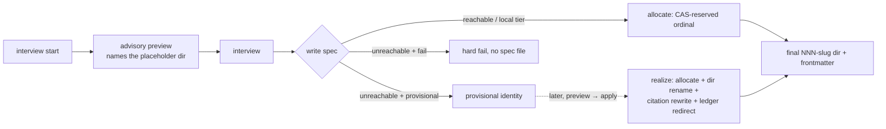

# 017 Coordinated spec identity

## Overview
Route `/jim:spec`'s identity assignment — the `group/NNN` frozen into directory
paths and commit trailers — through the coordination allocator, with an
offline-first provisional identity that realizes into a real ordinal on
reconnect, so separate clones never mint the same spec id and spec scoping
never breaks offline.

## Problem Statement
A spec's ordinal is the identity jim bakes into directory paths, commit
trailers, and cross-references — the most expensive id in the project to
unwind — yet it is assigned by listing the group on the current branch. Two
clones compute the same "next" id and nobody learns until the branches meet.
The coordination allocator that prevents this exists and is proven
(`platform/007`–`011`, with the issue consumer shipped as `issue/010`), but
nothing consumes it for specs, and the failure is now live, not theoretical:
the registry's newest `platform` record is `platform/010` while `platform/011`
exists on disk, so the allocator currently offers an id the project already
owns. Wiring the consumer alone is not enough: in the sandbox posture jim
needs (`provisional` unreachable-mode, #129), `allocate spec` today mints a
provisional identity that nothing can ever realize (#135) — so spec creation
must gain the realization half of the loop in the same change, or offline
scoping stays broken either way.

## User Stories
- As a developer scoping specs on a team sharing a repo, I receive a
  `group/NNN` that is mine alone across every clone and branch, so that a spec
  id frozen into paths and trailers never needs unwinding.
- As a developer scoping a spec from a sandbox or offline session with no
  coordination credentials, I still complete the interview with a usable
  provisional identity, so that going offline never blocks or breaks jim.
- As a developer whose offline session ended, I realize pending provisional
  specs into real ordinals through a visible, previewed step, so that nothing
  is hand-edited and no rewrite happens behind my back.
- As a developer at interview start, I see an advisory preview of the next id
  that reserves nothing, so that an abandoned interview burns no ordinal.
- As a developer asking for a spec in a group that was renamed away, I am told
  about the redirect and asked, so that one group is never silently
  substituted for another on my behalf.
- As a solo developer on a repo with no remote, spec creation still
  coordinates across my clone's sessions and worktrees, so that single-user
  work needs no setup and no network.

## Acceptance Criteria
- [ ] Spec identity assignment resolves through the coordination allocator,
      not a tree scan: the ordinal is durably reserved at the coordination
      point before the spec file is written, and where reservation fails and
      provisional issuance does not apply, no spec identity is assigned and no
      spec file is written.
- [ ] Two specs created concurrently in the same group on separate clones or
      branches never receive the same ordinal.
- [ ] The guarantee tier follows reachability: with a reachable remote, spec
      creation coordinates across every clone and user of the repo; with no
      remote at all, it still coordinates across the local clone's sessions
      and worktrees. Neither tier requires per-machine setup beyond the
      checked-in configuration.
- [ ] Any id shown before the spec is written is an advisory preview: it
      reserves nothing, and a preview that has shifted by binding time never
      survives into the written artifact — the bound identity is the one
      carried by the directory name, the frontmatter, and every captured path.
      An interview abandoned before binding consumes no ordinal.
- [ ] Under the `provisional` unreachable-mode with the coordination point
      unreachable, spec creation completes with a structurally-distinct
      provisional identity that can never be mistaken for or collide with a
      real ordinal, and the downstream stages (research, plan, sec, build) run
      against it unchanged. No real ordinal is consumed, and the provisional
      identity never enters the registry or the next-id computation.
- [ ] Under the default `fail` unreachable-mode with the coordination point
      unreachable, spec creation performs bounded retries and hard-fails with
      a clear message rather than minting an uncoordinated or duplicate id.
- [ ] A visible, preview-then-apply realization step converts every pending
      provisional spec into a real coordinated ordinal: the spec directory
      takes its final ordinal-slug name, in-tree citations of the provisional
      identity at structured reference sites are rewritten by exact-token
      match, and realization is idempotent and resumable — a re-run converges,
      never double-allocates, and never silently collapses two distinct specs
      onto one ordinal: a collision is halted locally when the target
      directory exists, and the residual same-identity case (two specs
      sharing group, slug, and date) is surfaced — visibly in the realization
      preview, and as a directory conflict when the branches meet — rather
      than merged.
- [ ] Realization succeeds whether the provisional spec directory is committed
      (the move preserves git history continuity) or still uncommitted (a
      plain rename) — the developer is not required to change when they
      commit.
- [ ] Every realization durably records its provisional→real mapping as a
      ledger redirect — the same durable-record pattern the partition
      operations use — so a citation frozen while provisional stays traceable
      and the rename-emitting follow-on can lift the mapping into registry
      redirect records without re-deriving anything. This spec emits no
      registry rename or redirect record of any kind. *(External Constraint —
      the record grammar is frozen upstream and redirect emission is the
      rename-emitting follow-on's charter; sourced to spec `platform/007` and
      the follow-on's issue, #113.)*
- [ ] Asking for a new spec in a group that has been renamed away is refused
      with the redirect named, and proceeds only on explicit developer
      acknowledgment; on the acknowledged path the assigned identity carries
      the current group — which may differ from the one requested — and the
      flow surfaces the substitution rather than applying it silently. A
      terminal refusal (ordinal exhaustion) is presented as terminal, never
      retried as recoverable. *(External Constraint — the two distinguishable
      refusal modes and the authoritative returned group are the allocator's
      shipped contract; sourced to spec `platform/011`.)*
- [ ] The registry bootstrap and any registry-integrity check treat a pending
      provisional spec directory as reserved: it is skipped, never reported as
      a conflict, and never derives a registry record.
- [ ] `/jim:spec` no longer derives a spec ordinal from the tree anywhere in
      its flow. The tree-scan verb remains only for its one remaining caller
      (the partition operations) until the rename-emitting follow-on retires
      it; its group-name/kind collision (#123) is thereby moot for spec
      creation and is not fixed.
- [ ] Every value read from the registry, from configuration, or from the
      tree and used by this flow — an ordinal, group token, slug, or
      provisional identity, including one derived from a directory name or
      from frontmatter — is revalidated through the established id/slug
      boundary before it is used as a filesystem path, a git argument, or
      written into frontmatter. *(External Constraint — the coordination
      point is writable by anyone who can push it, and tree content by
      anyone who can commit to a branch; sourced to `platform/007`'s
      injection-guard AC and the `jimalloc.sh` / `reconcile.sh` validation
      precedent.)*
- [ ] A local identity collision — the allocator returning or realizing an
      ordinal whose directory already exists in the tree — halts loudly,
      names the registry-vs-tree drift, and writes nothing: no silent
      suffixing (a spec ordinal is path identity, unlike a provisional issue
      filename) and no overwrite. Repairing the drift belongs to the
      drift-repair follow-on, never to a local workaround.
- [ ] The allocator's shipped behaviors hold unchanged: issue-side allocation
      and reconcile, the spec-side read path (resolve, peek, the shared
      fold), and the reserved `000-blueprint` slot's exclusion all keep their
      existing fixtures passing unmodified. *(External Constraint — sourced to
      upstream specs `platform/007`–`011` and `issue/010`, whose shipped
      semantics this consumer must not reshape.)*

## Data Flow

## Out of Scope
- **Emitting registry rename or redirect records**, including the
  provisional-source redirect and any record-grammar extension it needs —
  that is the rename-emitting follow-on's charter (issue #113). This spec
  records the realization mapping durably so that follow-on can lift it
  without re-deriving anything.
- **The partition operations' allocation wiring** and the convergence of the
  two next-id surfaces (same follow-on), and the batch-CAS candidate-batch
  rework (#127).
- **Registry drift detection and repair** (#116, #130, #136). Aligning the
  currently-drifted registry — records missing for specs created via the tree
  scan since seeding, including `platform/011` and this spec itself — is a
  one-time alignment step during the build, not a shipped verb.
- **Fixing #123 inside the tree-scan verb.** The group-name/kind collision
  dies with the verb it lives in.
- **Committing jim's own `provisional` config flip (#129).** This spec is
  what makes that posture safe — both identity kinds realize once it ships —
  but selecting and committing the unreachable-mode is a project-config
  action outside the feature's acceptance gate; #129 closes whenever the
  developer commits the flip.
- **Commit-choreography formalization.** Realization handles committed and
  uncommitted spec directories alike; a defined per-stage commit point is a
  separate, later effort if wanted.
- **Rewriting git history.** A trailer citing a provisional identity stays as
  written; mechanical dereferenceability arrives registry-side later, from
  the recorded mapping.
- **Opaque reservation for sensitive work.** Coordinated spec creation
  publishes the title-derived slug and filer identity to the coordination
  point at reservation time — before the branch merges — mirroring the
  disclosure surface `platform/007` and `issue/010` acknowledged. Binding an
  opaque token at reservation is a follow-on, not built here.
- **Treating an ordinal or a registry record as an authorization or integrity
  anchor.** The `platform/007` non-goal carries down: an id is advisory
  provenance, never a basis for an auth or integrity decision.

## Research & Architecture Handoff

*Implementation insights surfaced during scoping. These are context for the architect — not requirements, not exclusions. Treat each as a starting point to evaluate, not a directive.*

### Insight 1: Binding mechanics — preview at open, allocate at write

- **Relates to AC:** *"any id shown before the spec is written is an advisory preview … an abandoned interview consumes no ordinal"* (AC 4)
- **Surfaced as:** the interview's binding-time fork — bind at ledger-open (today's shape) vs bind at spec-write with a peek-backed preview.
- **Levelled-up requirement (already in the ACs):** the AC fixes the observables — advisory previews never bind, the bound identity is what the artifact carries — not the call sites.
- **Deflection reason:** Delegation — flow placement is the architect's.
- **Architect note:** today's Step 3 calls `next-id` and names `<id>-wip`; the natural shape is `peek` → `<peek>-wip` → `allocate` at Step 8 → rename to `<real>-<slug>`. The existing `mv-spec` absorbs same-id renames only; an ordinal shift at binding needs the cross-id case (extend `mv-spec` or rename directly). Ledger events already live inside the dir and travel with it. `platform/007`'s G7 favors allocate-late: a failure after the interview leaves the draft recoverable and the allocation retryable.
- **Routing hint:** Architect to decide.

### Insight 2: Realization mechanism — the keyed find-or-allocate analog

- **Relates to AC:** *"realization is idempotent and resumable … never collapses two distinct specs onto one ordinal"* (AC 7)
- **Surfaced as:** the issue-side precedent — `alloc_reconcile_realize` keys idempotency on the durable full-id and lands all new records through one erosion-guarded batch publish (`alloc_publish`, one CAS).
- **Levelled-up requirement (already in the ACs):** the AC fixes idempotency, resumability, and no-collapse; the keying and landing mechanism are open.
- **Deflection reason:** Delegation — verify against the built mechanism.
- **Architect note:** a spec has no registry-side durable identity apart from `group/NNN`; the provisional token (date-slug) plus group is the natural idempotency key, but slug uniqueness within a group is not enforced anywhere today — verify what keys safely. Realization should ride the same shared batch publish (no second, weaker registry-writing path — the `platform/008` durability AC's precedent). Also verify the provisional-token collision case: two offline clones, same day, same natural slug (the `issue/010` Insight 3 analog).
- **Routing hint:** Architect to decide / verify against built mechanism.

### Insight 3: Refusal classification at the consumer

- **Relates to AC:** *"the redirect refusal proceeds only on acknowledgment; exhaustion is presented as terminal"* (AC 10)
- **Surfaced as:** `platform/011` review Finding 6 — the allocate-path refusal emits its specific reason followed by a generic retry-loop line, so a consumer classifying by the last stderr line misreads a retryable refusal as generic failure.
- **Levelled-up requirement (already in the ACs):** the AC fixes that the two refusals are treated differently; how the consumer distinguishes them is open.
- **Deflection reason:** Delegation.
- **Architect note:** either match the specific message anywhere in stderr, or suppress the generic line at the source when a specific reason was already reported — fixing at the source serves every future consumer and closes the finding.
- **Routing hint:** Architect to decide.

### Insight 4: Realization surface and trigger

- **Relates to AC:** *"a visible, preview-then-apply realization step"* (AC 7) and the committed/uncommitted split (AC 8)
- **Surfaced as:** the issue-side precedent — an explicit, skill-owned realizer script (`reconcile.sh`) behind a preview-then-apply gate.
- **Levelled-up requirement (already in the ACs):** the AC fixes visibility, preview-then-apply, and both-worlds behavior; which surface owns the verb is open.
- **Deflection reason:** Delegation.
- **Architect note:** spec directories are sdlc territory while the issue realizer lives with the issue skill — weigh a sibling spec-side realizer against one reconcile surface covering both kinds. For the committed case the move primitives exist (`move-spec-dir` is specs-subtree-scoped; a same-group rename may fit `rename-tracked`'s sibling constraint); for citation rewriting, the exact-token structured-site discipline has two shipped precedents (`migrate.sh`'s relations/wikilink rewrite, `jimpartition.sh rewrite-refs`' remap-as-whitelist).
- **Routing hint:** Architect to decide.

### Insight 5: The ledger redirect record's shape

- **Relates to AC:** *"every realization durably records its provisional→real mapping as a ledger redirect"* (AC 9)
- **Surfaced as:** the developer's partition analogy — split/merge finished events carry `moved=<old>:<new>` chunks on the specs-root ledger, the durable old→new bridge `vacated-max` already consumes.
- **Levelled-up requirement (already in the ACs):** the AC fixes durability and liftability; the event grammar is open.
- **Deflection reason:** Delegation.
- **Architect note:** a realization event reusing the `moved=` element grammar would be uniform with the existing consumer and trivially liftable by the rename-emitting follow-on. Note `vacated-max` deliberately reads only split/merge events — a realize event should feed no vacated floor (a provisional never entered any high-water), so reusing the grammar must not accidentally widen that filter.
- **Routing hint:** Architect to decide.

## Open Questions
- [x] ~What is the end-state posture for spec creation when the coordination
  point is unreachable?~ → Provisional + realization, the full loop in this
  spec: jim does not break offline, and shipping issuance without realization
  would recreate #135's trap as a permanent state.
- [x] ~When does the identity bind?~ → At spec-write. Anything shown earlier
  is an advisory preview; an abandoned interview burns nothing.
- [x] ~Are commit trailers frozen while provisional acceptable?~ → History is
  never rewritten, but every realization records a durable ledger redirect —
  the partition precedent — so the rename-emitting follow-on can make those
  citations registry-dereferenceable retroactively.
- [x] ~Any commit-choreography change?~ → None required: realization handles
  committed and uncommitted spec directories. A formalized per-stage commit
  point is a separate, later effort.
- [x] ~What happens to the legacy tree-scan path?~ → Stranded: `/jim:spec`
  cuts over fully; the verb survives only for the partition caller until the
  rename-emitting follow-on retires it; #123 becomes moot and is not fixed.
- [x] ~Does jim's sandbox run provisional mode (#129)?~ → This spec makes the
  posture safe (both identity kinds realize) but does not commit the flip —
  selecting the unreachable-mode is a project-config action outside the
  feature's acceptance gate. #129 stays open until the developer commits it.
