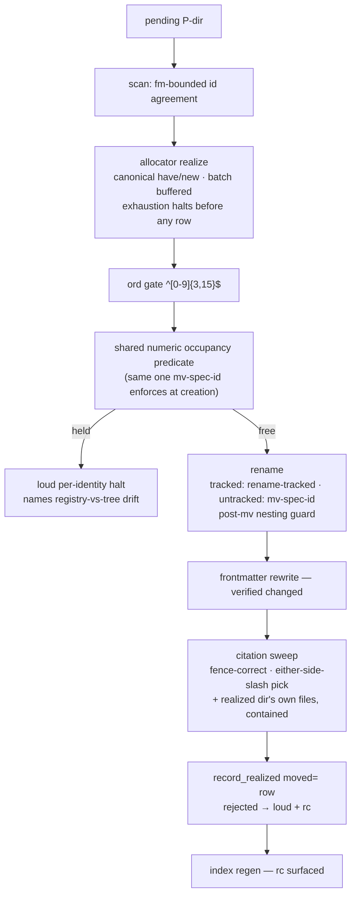

# Finish coordinated spec identity — Plan

## Overview

Close every seam `sdlc/017`'s review recorded by making the missing checks
structural: one numeric ordinal-occupancy predicate enforced inside the rename
primitives themselves, one canonical ordinal identity at every allocator
comparison site, and region-bounded scan/verified-rewrite in both realizers —
each fix landing with the fixture that would have caught it.

## Design Decisions

### 1. The occupancy predicate lives in `jimfile.sh` and is enforced inside the rename primitives

- **Chosen:** a `spec_ordinal_holder <specs_dir> <group> <ordinal> [<exclude_basename>]`
  function in `jimfile.sh` — numeric equality under `10#`, skipping any
  sibling whose leading token is non-numeric or wider than 15 digits (they
  are never counted as holders and never error the run — security review
  Finding 3) — exposed as the verb `spec-ordinal-holder` and enforced inside
  `cmd_mv_spec_id`'s numeric form and `cmd_mv_spec`. `reconcile.sh` replaces
  its local `ordinal_holder` with the verb.
- **Why:** #150 and #156 are one missing check on two paths. Embedding it in
  the primitives makes the creation-side halt *structural* — no skill-body
  step, no new `allowed-tools` grant, nothing for prompt drift to skip — and
  one implementation stops a third path from being missed later.
- **Rejected:** a predicate private to `reconcile.sh` plus a mirrored gate in
  `mv-spec-id` — two copies held in agreement by convention is the defect
  shape `platform/011` D4 already taught. An explicit SKILL.md pre-check step
  — discipline where capability is available.
- **Note:** the exclude argument is load-bearing: `018-wip → 018-name` and
  `cmd_mv_spec`'s same-id renames must not collide with their own source.

### 2. One canonical ordinal identity at every comparison site

- **Chosen:** an `alloc_canon_specid` helper (`<group>/<ord>` with the ordinal
  `%03d`-padded; widths above 3 preserved) applied at `alloc_resolve_spec`'s
  anchor and replay comparisons (`jimalloc.sh:215,218,230` — literal `==`
  today), at the realize `have` branch's storage and emission
  (`:659,:665,:698`), and to resolve's printed result. The fold already
  compares numerically (`:389-390`); tree occupancy goes numeric via DD 1.
- **Why:** security review Finding 1 (folded into AC 4): a crafted unpadded
  record must not split a resumed realization from its own prior record, and
  fold/resolve/readback must agree on what an ordinal *is*.
- **Rejected:** normalizing only emitted output — leaves resolve replay
  literal. Rewriting log records into canonical form — the registry is
  append-only and frozen; and per this spec's no-migration posture, no
  transitional rewriting is added.

### 3. The shared fold takes a pre-resolved group

- **Chosen:** delete the fold's argument self-resolution (`jimalloc.sh:371`);
  the docstring states the argument must be the caller-resolved *current*
  group name. Record-side membership resolution (`:386-388`) is internal to
  the fold and stays. The two raw-group test callers
  (`tests/jimalloc.sh:396,415`) resolve before calling.
- **Why:** both production callers already resolve (`:469-472`, `:686`) —
  this is the smallest change, and the defect is two layers each believing
  the other did not resolve, so the contract must live in exactly one place.
- **Rejected:** callers pass raw and the fold owns resolution — both
  production callers need `current` anyway (output, group-mismatch halt), so
  they would build the alias map twice or restructure.

### 4. `cmd_path` grows a provisional arity; the numeric arm gets validated

- **Chosen:** `path spec|plan|research <group> <P-token>` (two args — the
  token is the whole directory basename, gated by `is_prov_basename`; group
  by `is_valid_slug`). The three-arg numeric form gains gates: group and name
  `is_valid_slug`, id `^[0-9]{3,15}$` — mirroring the `blueprint` (`:803`)
  and `issue` (`:814`) arms. `skills/{spec,plan,research}/SKILL.md` branch on
  the id shape; `plan-template.md`'s back-reference is filled from the spec's
  *actual* directory (the planner read the spec at a real path — never
  re-composed from `{id}-{name}`).
- **Why:** pre-decided fork (spec Handoff Insight 2); mirrors `mv-spec-id`'s
  three-arg precedent; there is currently no correct way to call the helper
  on the provisional branch.
- **Rejected:** "provisional paths are read, never composed" — five call
  sites each remembering an undocumented rule, one of which fires unattended.

### 5. Region-bounded scan and verified rewrite, in both realizers

- **Chosen:** `field_value` in both `reconcile.sh` scripts requires a leading
  frontmatter block (first line exactly `---`) and scans only inside it;
  `rewrite_id`/`rewrite_num` report whether the field actually changed, and
  an unchanged rewrite fails that identity loudly. A CRLF `---\r` is not a
  frontmatter open → the file is not pending (fail-safe, no rename).
- **Why:** #158 and #133 are the same mistake twice; detection and rewrite
  must cover one region *by construction*, and a silent no-op rewrite is the
  wrong failure mode regardless.
- **Rejected:** widening the rewrite to match the scan's whole-file reach —
  that widens the write surface to body text.

### 6. Realize computes the whole batch before emitting anything

- **Chosen:** pass 2 accumulates rows into an array; emission happens only
  after the loop completes, so the exhaustion halt (rc 1) prints nothing —
  matching the documented contract and `alloc_next_id_spec`'s ordering.
- **Why:** #157; the preview path pipes realize to stdout, so partial rows
  are developer-visible output that looks like a plan and is not one.
- **Rejected:** amending the docstring to permit partial emission — it makes
  every future consumer carry the caveat instead of fixing one function.

### 7. Portable nesting guard instead of `mv -T`

- **Chosen:** keep the `-e` pre-check in both `cmd_mv_spec_id` and
  `cmd_mv_spec`; after the `mv`, detect the nesting artifact (the source
  basename now existing *inside* the target), restore the source to its
  original path — safe, since the nested entry was created by this same
  `mv` — and then fail loudly naming the race.
- **Why:** `-T` is GNU-only; the scripting layer is bash + POSIX tools by
  documented convention (`CLAUDE.md` → Bash scripts, `ARCHITECTURE.md` →
  Scripting Layer). Restore-then-fail preserves AC 12's refusal observable —
  an unchanged tree plus a loud error — without the GNU dependency
  (security review Finding 4).
- **Rejected:** `mv -T` (issue #151's literal suggestion) — BSD/macOS `mv`
  has no `-T`; it would be the layer's first GNU-coreutils dependency.

### 8. Absolute specs-dir spellings canonicalize at the guard

- **Chosen:** at `--apply`, canonicalize the configured specs dir and the
  worktree top (`realpath`), require containment, and derive the
  worktree-relative form used by everything downstream — tracked and
  untracked branches see one spelling.
- **Why:** #151 item 2 — one configured spelling must not produce two
  behaviors in one run.
- **Rejected:** refusing absolute config outright — developer-owned config
  paths are honored elsewhere; normalizing preserves that contract.

### 9. The untracked self-citation sweep is directory-scoped and contained

- **Chosen:** after realizing an uncommitted directory, enumerate that
  directory's own `*.md` files directly (a walk of that directory only —
  never a whole-tree untracked scan), require each target to
  realpath-resolve under the worktree top before any edit (the
  `rewrite-identity` containment precedent), and merge them into the sweep
  set. Tracked enumeration via `git ls-files` is unchanged.
- **Why:** #151 item 4 plus security review Finding 2 — this is the flow's
  first write path not enumerated from tracked content, so it carries an
  explicit containment bound.
- **Rejected:** warn-only (untracked provisional specs are a supported flow —
  it should work, not warn); sweeping all untracked files (unbounded).

### 10. Fence tracker ported from `index.sh`; the replacement pick keys on either-side slash

- **Chosen:** adopt `index.sh`'s tracker semantics (`fence_char`/`fence_len`,
  close only on a ≥-length run of the same character, `:216-250`) inside
  `sweep_citations`; pick the PATHED replacement whenever a `/` immediately
  precedes **or** follows the matched token, TYPED otherwise. Behavioral
  fixtures assert the semantics on the live corpus shapes (4-backtick outer
  fence, `~~~` inside backticks, unclosed fence, first-segment path
  citation).
- **Why:** #160; two correct trackers already exist — the third
  implementation was weaker than both; the trailing-slash case is the
  dead-link generator.
- **Rejected:** a shared awk library (new pattern, larger than the defect);
  byte-identity `SYNC` across the three trackers (they embed in structurally
  different awk programs — behavioral fixtures pin the semantics instead).

### 11. A rejected durable-record row is loud

- **Chosen:** `record_realized` warns on stderr naming the row and sets the
  run's failure status instead of `continue`-ing silently; batch semantics
  (other identities land) are unchanged. Near-unreachable once DD 1/DD 2
  land — kept anyway because a silent drop is the wrong failure mode.
- **Why:** AC 5; security regression 2's exact mechanism.
- **Rejected:** halting the whole batch — other identities' ordinals are
  already durable; per-identity failure matches the realizer's semantics.

### 12. Blueprint folds go through the blueprint surface, then the engine measures

- **Chosen:** fold the `sdlc` declaration via
  `/jim:blueprint --from-review docs/specs/sdlc/017-coordinated-spec-identity`
  (the review that generated this remediation is 017's), and the `jim` copy
  via its own targeted `/jim:blueprint` update pass; converge both rows on
  one restatement — *minted by the coordination allocator, either a 3-digit
  zero-padded ordinal unique within its group or a reserved provisional
  token pending realization* — then run `/jim:verify sdlc` and
  `/jim:verify jim` and record both outcomes.
- **Why:** AC 13's external constraint (surface-only writes); the two rows
  differ textually today (`sdlc`'s still names `next-id`), so convergence is
  deliberate, not incidental.
- **Rejected:** hand edits (forbidden by the groups' own invariants);
  deferring the `jim` copy to some later review (outside any review's scope —
  it would simply never fold).

## Constitution Check

**ARCHITECTURE.md status:** Present — constraints noted below.

| Constraint from ARCHITECTURE.md | Honored? | Notes |
| :--- | :--- | :--- |
| Scripting layer is bash + POSIX, no third-party deps | Yes | DD 7 rejects `mv -T` (GNU-only) for a portable guard |
| `set -uo pipefail; export LC_ALL=C` preambles | Yes | All edits stay inside existing preambled scripts |
| Single `is_valid_id` boundary — no new validator copies | Yes | New gates compose `is_valid_slug`/`is_valid_id`/`is_prov_basename`; the canon helper normalizes, it does not re-validate |
| Inter-script composition via `BASH_SOURCE`-relative paths | Yes | `reconcile.sh` already composes `jimfile.sh` this way; the verb call reuses it |
| Never `source`/execute config or registry content | Yes | All new logic is parse-and-gate; crafted records degrade per-identity |
| Blueprints and `ARCHITECTURE.md` change only via their skills | Yes | DD 12; the build-gate `/jim:arch` refresh handles `ARCHITECTURE.md` |
| `allowed-tools` stay verb-scoped; no broad grants | Yes | Zero grant changes: the creation halt is inside `mv-spec-id`, and `reconcile.sh` calls `jimfile.sh` internally |
| SKILL.md under 500 lines | Yes | `skills/spec/SKILL.md` edits reconcile existing prose; no new sections |
| No spec/issue IDs in code comments | Yes | Comments state behavior only |

## File Manifest

| Component | File Path | Action | Notes |
| :--- | :--- | :--- | :--- |
| Path/id CLI | `skills/file/scripts/jimfile.sh` | Update | `spec_ordinal_holder` + verb; `cmd_path` validation + provisional arity; nesting guard in both mv commands |
| Allocator | `skills/file/scripts/jimalloc.sh` | Update | `alloc_canon_specid`; resolve comparisons; `have` normalization; buffered realize emit; fold contract |
| Spec realizer | `skills/spec/scripts/reconcile.sh` | Update | ord gate; predicate via verb; bounded scan + verified rewrite; fence tracker; pick rule; untracked sweep + containment; absolute-dir canon; loud record; regen rc |
| Issue realizer | `skills/issue/scripts/reconcile.sh` | Update | bounded scan; verified rewrite; regen rc |
| Spec skill | `skills/spec/SKILL.md` | Update | four contradictions; `fail`-mode refusal row; provisional path call |
| Plan skill | `skills/plan/SKILL.md` | Update | provisional path branch |
| Research skill | `skills/research/SKILL.md` | Update | provisional path branch |
| Plan template | `skills/plan/assets/plan-template.md` | Update | back-reference from the spec's actual directory |
| Spec template | `skills/spec/assets/spec-template.md` | Update | `id:` and H1 admit the provisional form |
| Workflow doc | `WORKFLOW.md` | Update | id assignment, provisional identity, reconcile surface |
| Readme | `README.md` | Update | numeric-id framing; `id_coordination_*` config rows; reconcile surface |
| sdlc blueprint | `docs/specs/sdlc/000-blueprint/spec.md` | Update (via `/jim:blueprint`) | `spec-id-sequencing` restatement |
| jim blueprint | `docs/specs/jim/000-blueprint/spec.md` | Update (via `/jim:blueprint`) | same restatement, converged |
| jimfile tests | `tests/jimfile.sh` | Update | predicate, `cmd_path`, nesting-guard fixtures |
| jimalloc tests | `tests/jimalloc.sh` | Update | canon/resolve, fold contract, exhaustion ×2, reused-name, unpadded-resume |
| Realizer tests | `tests/specreconcile.sh` | Update | padding halt, bare-`NNN`, scan/rewrite, fence corpus, pick, untracked sweep, absolute dir, batch/staging/residual cases |
| Issue tests | `tests/issues.sh` | Update | issue-side scan bounding, rewrite verify, regen rc |

## Interface Contracts

```bash
# jimfile.sh
spec_ordinal_holder <specs_dir> <group> <ordinal> [<exclude_basename>]
  # stdout: holding sibling basename · rc 0 held / 1 free / 2 invalid input
  # numeric equality (10#); non-numeric or >15-digit sibling tokens skipped
  # verb form: spec-ordinal-holder <group> <ordinal> [--exclude <basename>]
cmd_path spec|plan|research <group> <id> <name>
  # group,name: is_valid_slug · id: ^[0-9]{3,15}$
cmd_path spec|plan|research <group> <P-token>
  # token: is_prov_basename — the whole directory basename
cmd_mv_spec_id / cmd_mv_spec
  # refuse when spec_ordinal_holder reports the target ordinal held
  # (source excluded); post-mv nesting artifact → loud failure

# jimalloc.sh
alloc_canon_specid <group>/<ord>        # → <group>/<%03d ord>; rc 1 malformed
alloc_fold_max_spec <group>             # CONTRACT: caller passes the resolved
                                        # current group name; never re-resolves
alloc_reconcile_realize_spec            # rc 1 emits nothing; have rows canonical

# reconcile.sh (spec + issue)
field_value                             # leading-frontmatter-bounded, both scripts
rewrite_id / rewrite_num                # rc reflects changed-field; unchanged → loud
record_realized                         # rejected row: stderr warning + failure rc
```

## Data Flow



## Task Breakdown

1. [ ] **Reproduce.** Script the #150 exemplar in a temp sandbox: crafted
   `spec allocate sdlc/18 alpha 20260728` record, pending
   `sdlc/P-20260728-alpha`, tree holding `018-alpha`; confirm today's
   behavior (exit 0, two directories on one ordinal, no ledger row).
   **Verify:** `bash /tmp/claude-1000/-home-jrko-src-jim/ceecdf82-1f3d-445f-9755-1343526d6909/scratchpad/repro-150.sh; test $? -eq 0`

2. [ ] Add `spec_ordinal_holder` + the `spec-ordinal-holder` verb to
   `jimfile.sh` with fixtures: padding variant held, bare-`NNN` occupant
   held, exclude-source, malformed/over-wide siblings skipped.
   **Verify:** `bash skills/meta-test/scripts/run.sh jimfile`

3. [ ] Enforce the predicate inside `cmd_mv_spec_id` (numeric form) and
   `cmd_mv_spec`; fixture the creation halt (`001-bar` in tree, target
   `001-foo` refused) and the wip self-exclusion. Depends on task 2.
   **Verify:** `bash skills/meta-test/scripts/run.sh jimfile`

4. [ ] `reconcile.sh`: gate `ord` with `^[0-9]{3,15}$` before its first use
   and replace the local `ordinal_holder` with the `spec-ordinal-holder`
   verb; fixtures: padding-variant record halts, bare-`NNN` occupant halts.
   Depends on task 2.
   **Verify:** `bash skills/meta-test/scripts/run.sh specreconcile`

5. [ ] Make `record_realized` rejections loud — stderr warning naming the
   row, failure status set, batch semantics unchanged; fixture: rejected
   row warns + non-zero exit.
   **Verify:** `bash skills/meta-test/scripts/run.sh specreconcile`

6. [ ] `jimalloc.sh`: add `alloc_canon_specid`; canonicalize the `have`
   branch and resolve's anchor/replay comparisons; fixtures: resume against
   an unpadded record converges, `resolve spec sdlc/018` finds a `sdlc/18`
   record (and vice versa).
   **Verify:** `bash skills/meta-test/scripts/run.sh jimalloc`

7. [ ] Fold contract: remove the argument self-resolution, document the
   pre-resolved contract, update the two raw test callers; fixtures: the
   reused-group-name log (`side→core`, `core→legacy`) against **both**
   `next-id` and realize.
   **Verify:** `bash skills/meta-test/scripts/run.sh jimalloc`

8. [ ] Buffer realize emission behind the exhaustion check; fixtures:
   exhaustion in `next-id` and in realize — no partial rows, rc 1.
   **Verify:** `bash skills/meta-test/scripts/run.sh jimalloc`

9. [ ] `cmd_path`: validate the numeric arm, add the provisional arity;
   fixtures: provisional form resolves the whole-token basename, malformed
   id/name/token refused.
   **Verify:** `bash skills/meta-test/scripts/run.sh jimfile`

10. [ ] Update the composing call sites: `skills/spec/SKILL.md:231` branch,
    `skills/plan/SKILL.md:120` branch, `skills/research/SKILL.md:38` branch,
    `plan-template.md` back-reference, `spec-template.md` `id:` + H1.
    Depends on task 9.
    **Verify:** `! grep -rn '{id}-{name}' skills/plan/assets/ && grep -q 'P-' skills/spec/assets/spec-template.md`

11. [ ] Bound `field_value` to the leading frontmatter block and verify the
    rewrite changed the field, in **both** realizers; fixtures: body-`id:`
    file not pending, CRLF `---\r` not pending, mirror case not rewritten,
    forced no-op rewrite fails loudly; issue-side spurious-pending case.
    **Verify:** `bash skills/meta-test/scripts/run.sh specreconcile && bash skills/meta-test/scripts/run.sh issues`

12. [ ] Surface the index-regen exit status in both realizers; fixtures: a
    failing regen fails the run with the status named.
    **Verify:** `bash skills/meta-test/scripts/run.sh specreconcile && bash skills/meta-test/scripts/run.sh issues`

13. [ ] Port the fence tracker and fix the replacement pick; fixtures:
    4-backtick outer fence untouched, `~~~` inside backticks untouched,
    unclosed fence does not skip the tail, first-segment path citation keeps
    its slug, corpus-shape file survives byte-identical.
    **Verify:** `bash skills/meta-test/scripts/run.sh specreconcile`

14. [ ] Post-mv nesting guard in `cmd_mv_spec_id` and `cmd_mv_spec` —
    detect, restore the source, then fail; fixture: end state unchanged and
    exit non-zero when the race fires.
    **Verify:** `bash skills/meta-test/scripts/run.sh jimfile`

15. [ ] Canonicalize an absolute specs-dir spelling at the `--apply` guard;
    fixture: the absolute spelling behaves identically on tracked and
    untracked branches.
    **Verify:** `bash skills/meta-test/scripts/run.sh specreconcile`

16. [ ] Untracked self-citation sweep — directory-scoped enumeration,
    realpath containment before any edit; fixtures: an uncommitted spec's
    own citations are swept, a symlink escape is refused.
    **Verify:** `bash skills/meta-test/scripts/run.sh specreconcile`

17. [ ] Close the remaining #145 fixtures: mixed-batch partial failure,
    partially-staged directory routing, group-rename halt (realized group ≠
    issued group), `allocate spec --follow-redirect` end to end, and the
    genuine two-spec residual case (two distinct specs sharing group, slug,
    and date surfaced, not merged).
    **Verify:** `bash skills/meta-test/scripts/run.sh`

18. [ ] Reconcile `skills/spec/SKILL.md`: drop the `:86` tree-derivation cue,
    align Step 13 with the placeholder flow, admit the provisional form in
    the `:395` checklist item, add the `fail`-mode refusal row carrying the
    actual message (`coordination remote '<r>' is unreachable`) with retry
    guidance.
    **Verify:** `! grep -q "assign the next id when you open the ledger" skills/spec/SKILL.md && grep -q "is unreachable" skills/spec/SKILL.md`

19. [ ] Docs pass: `WORKFLOW.md` (id assignment via the allocator,
    provisional identity, the reconcile surface) and `README.md` (next-id
    framing, the `id_coordination_*` config keys, the reconcile surface).
    **Verify:** `grep -q provisional WORKFLOW.md && grep -q id_coordination README.md`

20. [ ] Fold `spec-id-sequencing` via
    `/jim:blueprint --from-review docs/specs/sdlc/017-coordinated-spec-identity`
    (sdlc) and a targeted `/jim:blueprint` pass (jim), converging both rows;
    then run `/jim:verify sdlc` and `/jim:verify jim` and record the
    invariant scoring `holds`. Operator-surface task — runs in the main
    session, not the coder subagent.
    **Verify:** `bash skills/verify/scripts/jimverify.sh parse docs/specs/sdlc/000-blueprint/spec.md | grep spec-id-sequencing | grep -qi provisional && bash skills/verify/scripts/jimverify.sh parse docs/specs/jim/000-blueprint/spec.md | grep spec-id-sequencing | grep -qi provisional`

21. [ ] **Regression.** Full suite green; enumerate every modified
    pre-existing fixture with the corrected defect it encoded; record the
    017-AC → fixture evidence map in the build notes.
    **Verify:** `bash skills/meta-test/scripts/run.sh`

## Requirements Coverage Summary

| Spec Acceptance Criterion | Addressed In Task(s) |
| :--- | :--- |
| AC 1 — 017's fifteen ACs hold, fixture-evidenced | 21 (evidence map; all tasks feed it) |
| AC 2 — realized ordinal revalidated, halts loudly | 4 |
| AC 3 — numeric occupancy, both halves | 2, 3, 4 |
| AC 4 — canonical ordinals; one identity at every comparison site | 6 |
| AC 5 — rejected `moved=` row is loud | 5 |
| AC 6 — reused-group-name log: no already-held ordinal, no duplicate record | 7 |
| AC 7 — exhaustion halts before emitting, both paths | 8 |
| AC 8 — provisional paths resolve at every composing site | 9, 10 |
| AC 9 — scan/rewrite one region, rewrite verified, both realizers | 11 |
| AC 10 — regen status surfaced, both realizers | 12 |
| AC 11 — fence semantics + first-segment slug preserved | 13 |
| AC 12 — no silent wrong move / split behavior / stale self-citations | 14, 15, 16 |
| AC 13 — invariant restated in both blueprints; verify scores holding | 20 |
| AC 14 — WORKFLOW / README / templates / SKILL.md describe the shipped world | 10, 18, 19 |
| AC 15 — the nine named fixture gaps closed | 4, 8, 15, 17 |
| AC 16 — regression test covers the reported scenario | 1, 4, 21 |
| AC 17 — suite passes; fixture modifications named | 21 |

## Out of Scope

- Registry rename/redirect record emission and lifting `moved=` mappings into
  the registry — Spec B (#143, #113).
- Provisional identities under a moving group (`move-spec-dir`'s `P-` gate,
  partition interactions) — Spec B (#152, #154).
- Registry drift detection/repair and the retired `jim` group's records —
  Spec E (#116, #130, #136).
- The hardening-build leaves: #123, #153, #155.
- Migration or compatibility shims of any kind — no external users; behavior
  corrections land outright (spec posture).
- The `ARCHITECTURE.md` refresh — handled by the `/jim:build` completion
  gate via `/jim:arch`; not a deferral, not a task.

## Open Questions

- [x] ~~`mv -T` as issue #151 suggests?~~ → Rejected for portability; DD 7's
  post-mv nesting guard instead.
- [x] ~~Where does the occupancy predicate live?~~ → `jimfile.sh`, enforced
  inside the rename primitives (DD 1); pre-decided fork honored.
- [x] ~~Fold contract direction?~~ → Pre-resolved argument (DD 3), per the
  research finding that both production callers already resolve.

None open — no `[NEEDS CLARIFICATION]` markers.
